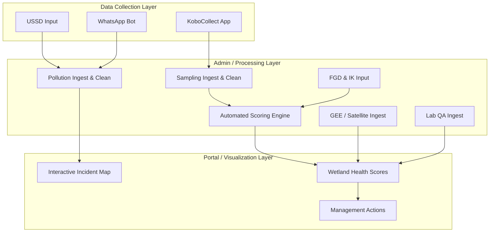
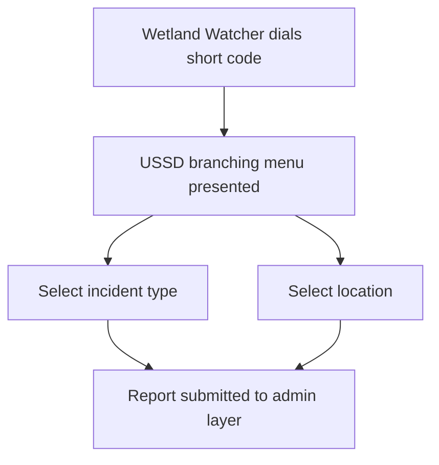
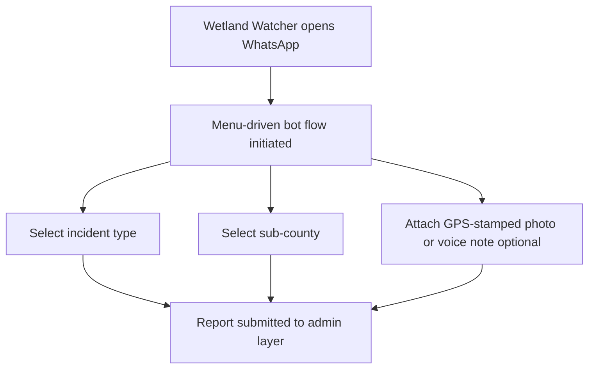
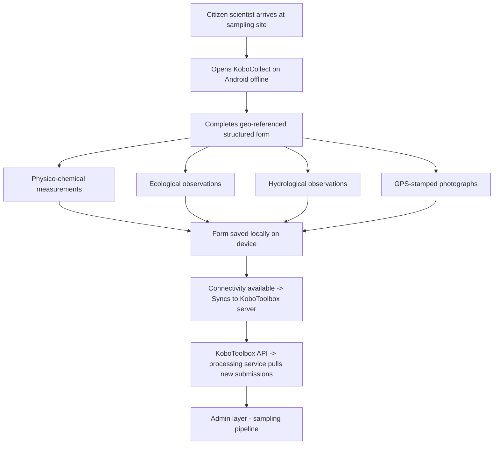
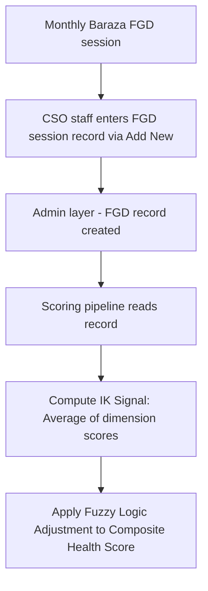
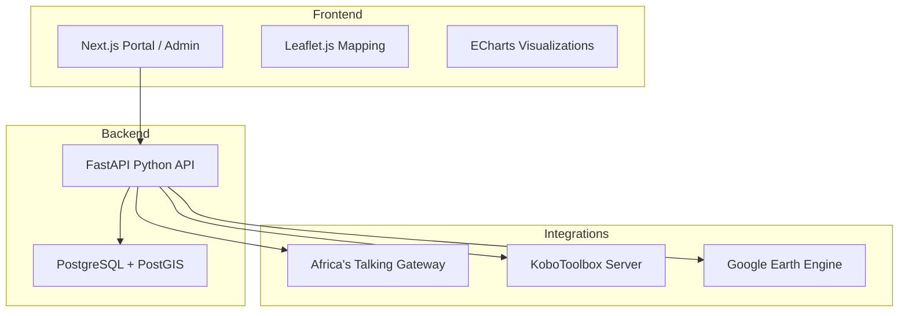

# Solution Design: Citizen-Led Data Generation & Management Platform — Wetland Monitoring (Phase 1)

**Version:** 0.2 — Draft | **Date:** 2026-05-28 | **Authors:** Joy Ghosh | **Status:** Draft

---

## Table of Contents

- [Scope of this Document](#scope-of-this-document)
- [1. Background & Context](#1-background--context)
  - [1.1 Platform Success Indicators](#11-platform-success-indicators)
- [2. Problem Statement](#2-problem-statement)
- [3. Solution Overview](#3-solution-overview)
  - [3.1 Constraints & Hardware Requirements](#31-constraints--hardware-requirements)
- [4. Architecture Design](#4-architecture-design)
  - [4.1 System Layers](#41-system-layers)
  - [4.2 Pollution Episode Reporting (Kenya)](#42-pollution-episode-reporting-kenya)
  - [4.3 Monthly Structured Water Quality Sampling](#43-monthly-structured-water-quality-sampling)
  - [4.4 Admin Interface](#44-admin-interface)
  - [4.5 Wetland Data Portal](#45-wetland-data-portal)
    - [4.5.1 Accessibility & Compliance](#451-accessibility--compliance)
    - [4.5.2 Performance](#452-performance)
    - [4.5.3 Search and Filter](#453-search-and-filter)
    - [4.5.4 Public API Strategy](#454-public-api-strategy)
  - [4.6 Technology Stack](#46-technology-stack)
  - [4.7 External Data Integration](#47-external-data-integration)
    - [4.7.1 Data Licensing and Downstream-Use Matrix](#471-data-licensing-and-downstream-use-matrix)
    - [4.7.2 Integration Resilience and Reconciliation](#472-integration-resilience-and-reconciliation)
  - [4.8 Non-Functional Requirements](#48-non-functional-requirements)
- [5. Data Model](#5-data-model)
  - [5.1 Parameters Collected](#51-parameters-collected)
  - [5.2 Conceptual Data Model](#52-conceptual-data-model)
  - [5.3 Logical and Physical Data Models](#53-logical-and-physical-data-models)
  - [5.4 Site Identifiers](#54-site-identifiers)
  - [5.5 Wetland Health Scores](#55-wetland-health-scores)
  - [5.6 Fuzzy Logic Adjustment](#56-fuzzy-logic-adjustment)
  - [5.7 Traffic Light Classification](#57-traffic-light-classification)
  - [5.8 Management Actions](#58-management-actions)
- [6. Integration Design](#6-integration-design)
- [7. Security, Privacy & Data Governance](#7-security-privacy--data-governance)
  - [7.1 Citizen Data Privacy](#71-citizen-data-privacy)
  - [7.2 Data Classification](#72-data-classification)
  - [7.3 Access Control Model](#73-access-control-model)
  - [7.4 Data Ownership & Sovereignty](#74-data-ownership--sovereignty)
  - [7.5 Infrastructure Security](#75-infrastructure-security)
  - [7.6 Security Controls](#76-security-controls)
  - [7.7 Incident Handling](#77-incident-handling)
  - [7.8 Data Protection](#78-data-protection)
- [8. Deployment Architecture](#8-deployment-architecture)
  - [8.1 Docker Services](#81-docker-services)
  - [8.2 Hosting](#82-hosting)
    - [8.2.1 Workload Model (Pilot Year 1)](#821-workload-model-pilot-year-1)
    - [8.2.2 Sizing Rationale](#822-sizing-rationale)
    - [8.2.3 Storage](#823-storage)
    - [8.2.4 Resilience and Scaling](#824-resilience-and-scaling)
  - [8.3 Backup & Recovery](#83-backup--recovery)
  - [8.4 Monitoring & Alerting](#84-monitoring--alerting)
- [9. Testing & Validation Strategy](#9-testing--validation-strategy)
  - [9.1 Technical Testing](#91-technical-testing)
  - [9.2 Field Validation](#92-field-validation)
- [10. Project Timeline](#10-project-timeline)
- [11. Forms](#11-forms)

---

## Scope of this document

This document describes a citizen-led data generation and management platform built under the NBD assignment "Technical Support to Implement Citizen-Led Data Generation and Management Activities". Phase 1 deploys the platform with wetland monitoring as its first thematic use case, at two transboundary pilot sites (Mara and Sio-Siteko).

The platform is designed so that adding a new thematic domain in later phases is a development task, not a re-architecture. The reusable parts are the ingest channels (USSD, WhatsApp, KoboCollect), the admin moderation workflow, the portal shell, the identity and access model, and the external-data ingestion pattern. The domain-specific parts (the form, the scoring rule, the per-domain external sources) are added by a developer through a new form definition, new scoring code, and configuration.

---

## 1. Background & Context

This document describes the solution design for the data platform built under the assignment “Technical Support to Implement Citizen-Led Data Generation and Management Activities”, commissioned by the Nile Basin Discourse (NBD).

NBD brings together civil society organisations, academic institutions, cultural/religious institutions and government bodies across the Nile Basin to promote equitable, sustainable management of shared water resources. Citizens living around basin ecosystems observe ecological change daily, but that knowledge has no formal channel into management systems.

Phase 1 focus covers wetland monitoring at two pilot sites:
- **Mara Basin** — Kenya and Tanzania
- **Sio-Siteko Basin** — Kenya and Uganda

Wetlands are the first domain. Adding a new domain means adding a form, a scoring rule set, optional new external datasets, and role assignments. The system will not need architecture-level changes.

This document describes the technical backbone of that system. The platform collects data submitted by community members from the selected sites, processes and validates it, and presents results to partners and decision-makers through a public-facing portal.

This document covers what the platform can control and measure. Programme-level outcomes — whether authorities act on alerts, whether management plans are adopted, whether partner organisations change behaviour — depend on stakeholder engagement, training, and governance processes that sit outside the platform. Those indicators are tracked by NBD through the programme results matrix and are not in scope here.

### 1.1 Platform success indicators

The platform is considered successful if it reliably delivers:
1. Pollution reports ingested and published to the portal per basin per month.
2. Sampling submissions received per active site per month.
3. Wetland health classes (A–E) published per site per month.
4. Portal uptime and public API availability within the targets defined below.
5. Portal data accessible to the public without a login.

---

## 2. Problem Statement

Wetland managers and government authorities in the Nile Basin have limited access to reliable, regular data on the health of transboundary wetlands. Formal monitoring is infrequent, expensive, and conducted by specialists who are rarely present on the ground.

- **The Mara Wetlands** form a large papyrus-dominated floodplain of roughly 400–500 km² whose extent varies seasonally. The wetland spans Butiama, Rorya, Tarime, and Serengeti districts and supports an estimated 56,000 people who rely primarily on rain-fed agriculture and small-scale fishing. It has lost more than 100 km² to land conversion over the past decade. The drivers are upstream deforestation in the Mau Highlands, sedimentation, nutrient loading from intensive cultivation, and pollution from small-scale mining. Climate projections show ≈ 1.8 °C of warming and 10–12% more rainfall by 2050, raising both flood and drought risk for ~56,000 wetland-dependent residents.
- **The Sio-Siteko Wetland Landscape** — ~415 km² straddling Kenya and Uganda — is an Important Bird Area with over 520 bird species. It is degrading from unsustainable land use, charcoal-driven vegetation clearing, encroachment, sand harvesting, invasive species (*Mimosa pudica*, *Lantana camara*, *Pontederia crassipes*), and weak transboundary coordination.

Reconnaissance field visits under this assignment confirmed those pressures. They also documented that most observed pollution incidents are reported only verbally to local leaders, with no formal record reaching the relevant authority inside an actionable window.

Communities alongside the Mara and Sio-Siteko wetlands observe changes daily: unusual water colour, reduced fish catch, encroachment by farms, shifting flood patterns, invasive species, and animal loss among others. This knowledge has no formal channel into decision-making systems; hence, this platform creates that channel.

### Current State vs. Proposed State

| Dimension | Current State | Proposed State |
| :--- | :--- | :--- |
| **Pollution reporting cadence** | Ad hoc; verbal to local leaders; rarely reaches authority in an actionable window. | Same-day digital report via USSD or WhatsApp; visible on public portal. |
| **Wetland health assessment** | Specialist field surveys, annual or rarer; results held in PDF. | Monthly citizen sampling at fixed sites; quarterly academic shadow-validation; results published as live scores. |
| **Data accessibility for decisions** | Held by individual agencies, format varies, often unavailable. | Public portal with health scores, trends, pollution-incident map, and downloadable PDF reports. |
| **Indigenous knowledge** | Captured informally at Monthly Barazas; not aggregated. | Captured through a structured FGD form; aggregated into the IK signal that adjusts the composite health score. |

The design must respect three real-world constraints:
1. **Connectivity:** Many sampling sites have no mobile data coverage. The USSD channel requires only GSM voice coverage. KoboCollect stores data offline and syncs when connectivity is available.
2. **Device access:** Not all community members have smartphones. The pollution reporting workflow must be accessible from a basic feature phone.
3. **Digital literacy:** Citizen reporters and citizen scientists are not technical users. Every interaction must be guided, menu-driven, and completable without reading instructions.

---

## 3. Solution Overview

Akvo will build a mobile-first, citizen-centric data platform. It enables community-driven data collection, administration, and visualisation through familiar and accessible tools. The platform is a Minimum Viable Product (MVP) — a foundational system supporting the two pilot basins. It can be extended if NBD decides to add new basins, wetlands, or data layers during scale-up.

The platform has three layers: data collection, administration, and visualisation. Two purpose-built workflows feed into a single public-facing wetland data portal.

### Guiding Principles

- **Open source first:** All custom components are built under open-source licences. KoboToolbox and all backend components are fully open source. Google Earth Engine, used for satellite data processing, has a generous free tier and a long-standing commitment to support non-commercial use.
- **Low-connectivity resilience:** USSD runs on the GSM voice network only. KoboCollect captures data offline and syncs on reconnect.
- **Community data ownership:** Data collected by citizens belongs to the communities and partner organisations. The platform is designed to facilitate handover to NBD without vendor lock-in.
- **Interoperability:** Every monitoring site has a persistent, structured identifier (e.g., `NBD-MARA-001`). This identifier is embedded in the KoboCollect form, every admin layer record, every GEE pipeline output, every lab QA record, every FGD session record, and every portal API response. Any external dataset can join to platform data using this key alone — no custom field mapping is needed. Spatial layers are published as GeoJSON via documented API endpoints.

### Scope

- Pollution episode reporting via USSD and WhatsApp (Kenya)
- Monthly structured water quality sampling via KoboToolbox (Tanzania — Mara wetlands; Kenya and Uganda — Sio-Siteko)
- Admin layer for data cleaning and approval
- Wetland data portal with pollution incident map, health scores, and management actions
- Sentinel 1 & 2 / CHIRPS Earth Observation data integration via Google Earth Engine
- Laboratory QA data ingestion
- FGD session data capture for indigenous knowledge

### 3.1 Constraints & Hardware Requirements

#### User-side Devices and Roles

| Role | Device & OS Minimum | Connectivity | Location |
| :--- | :--- | :--- | :--- |
| **Citizen reporter — USSD (Kenya)** | Any GSM handset | GSM voice only; no data required | No device GPS. User picks sub-county from a menu; platform geo-codes it server-side. |
| **Citizen reporter — WhatsApp (Kenya)** | Smartphone; Android 7.0+ / iOS 12+ | Intermittent mobile data | User picks sub-county from a menu; platform geo-codes it server-side. |
| **Citizen scientist (TZ, UG, KE)** | Android 7.0+; KoboCollect v2024.x; ≥ 2GB free storage | Intermittent data; offline-capable | Device GPS; form requires ≤ 20 m accuracy. |
| **CSO staff / Academic partner** | Laptop, tablet, or smartphone; any current browser (last 2 major versions) | Medium-to-low bandwidth | N/A |
| **NBD / NDF / officials / public** | Any browser-capable device (last 2 major versions) | Reliable internet | N/A |

- KoboCollect stores survey data on the device when there is no connectivity. It syncs automatically to the KoboToolbox server when the device reconnects.
- Citizen scientists and wetland watchers are trained through a Train-the-Trainers (ToT) model. The platform must be fully usable from the first day of deployment by users who received training second-hand, without requiring IT support.
- Handheld multi-parameter probes, used by citizen scientists to measure pH, temperature, and dissolved oxygen, are provided by the project. These are separate hardware items. The data they produce is entered through the KoboCollect form.

#### Hosting Infrastructure

- **Hosting model:** Cloud-based, Dockerised
- **Production server:** 8 GB RAM, 4-core CPU, 30 GB storage
- **Media attachments:** Photos and documents are stored in cloud object storage, separate from the VM.

---

## 4. Architecture Design

### 4.1 System Layers

The platform has three layers. The two data collection workflows maintain separate pipelines through the admin layer, then converge at the output stage.

1. **Data Collection Layer:** The citizen-facing interfaces. Wetland watchers submit pollution episodes via USSD or WhatsApp Business bot. Citizen scientists submit monthly structured sampling data via KoboCollect.
2. **Admin / Processing Layer:** The internal layer where staff clean and approve submissions. The pollution and sampling pipelines remain separate. Scoring is automated from approved data. External data (Sentinel 1 & 2, CHIRPS, lab QA results) and FGD session records are also ingested here.
3. **Wetland Data Portal Layer:** The public-facing output. The two pipelines converge in a single portal showing pollution incidents on an interactive map, wetland health scores, management actions, and satellite overlays. All views are accessible on mobile and can be exported as PDFs.



### 4.2 Pollution Episode Reporting (Kenya)

**Actors:** Wetland watchers — community members who report pollution events as they occur.  
**Incident types reported:** Unusual water colour, smell, fish or other animal kills, changes in water levels.

Two parallel channels serve the same reporting flow:

#### Channel A — USSD (Feature Phone Users)



The flow runs entirely over the GSM voice network. No mobile data, smartphone, or app installation required.

#### Channel B — WhatsApp Business Bot (Smartphone Users)



WhatsApp users can attach photos and voice notes alongside their submission. Both channels use Africa’s Talking as the telco gateway and feed into the same admin-layer pipeline.

#### Admin Layer — Pollution Pipeline

1. **Ingest:** Report received from USSD or WhatsApp webhook; written to the admin layer.
2. **Clean:** Staff review for completeness; remove obviously erroneous entries.
3. **Approve:** Submission approved for publication to the wetland data portal.
4. **Traffic light classification:** Approved records contribute to basin health status (Green / Yellow / Red).

---

### 4.3 Monthly Structured Water Quality Sampling

**Actors:** Citizen scientists — trained community volunteers who visit designated sampling sites once per month.  
**Collection tool:** KoboToolbox, accessed via the KoboCollect Android app.

All numeric fields in the KoboCollect form have min-max constraints configured at the form level. This catches obvious probe entry errors before the form is saved. Out-of-range entries prompt the citizen scientist to re-enter the value before the form can be submitted.

#### Data Collection Flow



#### Admin Layer — Sampling Pipeline

Follows the same steps as the pollution pipeline: Ingest → Clean → Approve. After approval, the scoring engine computes parameter group scores and the composite score automatically.

#### Shadow Sampling and Lab QA Integration

Every quarter, academic partners (Makerere University / University of Nairobi) conduct shadow sampling at the same sites as citizen scientists. They collect independent samples and test for all citizen scientist parameters, plus Biochemical Oxygen Demand, Orthophosphate, Nitrate, and Mercury.

Shadow sampling results are compared against citizen scientist submissions to validate measurements and flag systematic discrepancies for retraining. Lab QA results are ingested as a separate record type in the admin layer, linked to the site identifier and sampling period.

---

### 4.4 Admin Interface

The admin interface is the internal processing layer. It is a web application accessible to authorised staff only.

#### Roles

Two roles are defined. Admin is a strict superset of Reviewer.

- **Reviewer:** Review and approve or reject pollution reports, sampling records, lab QA reports, and FGD session records.
- **Admin:** All Reviewer permissions plus: invite users and assign roles; create and manage monitoring sites; delete records.

#### Sidebar Navigation

Both roles see **Data** as the primary workspace item. Admins additionally see **User management** and **Site management** under a Management section. Reviewer accounts see these items but they are locked.

#### Data Screen

The Data screen is the central working view. All submitted records appear in a single filterable list. Three selectors narrow the list:
- **Form:** Pollution report · Sampling data · Lab QA report · FGD session
- **Status:** Pending approval · Approved
- **Basin:** Mara Basin · Sio-Siteko

The record count updates live as selectors change. A "Clear" control resets all three selectors. Each row represents one submission. A Form chip (colour-coded by type) and a Basin / Site chip identify the record at a glance. Clicking a row expands it inline to show the full submission detail. The row collapses on a second click.

#### Actions available in the expanded view:

| Status | Reviewer Actions | Admin Additional Actions |
| :--- | :--- | :--- |
| **Pending approval** | Approve · Reject · Edit | Delete |
| **Approved** | View | Edit · Delete |

For sampling data records, the expanded view shows the automated score and health class (A–E). These values are read-only — they are computed from submitted measurements.

#### Add New

A blue **+ Add New** button sits right-aligned in the filter bar. Clicking it opens a modal to select a form type and basin, then launches the corresponding webform. Four form types are available:
1. **Pollution report:** Basin-level; no specific site required.
2. **Sampling data:** The modal additionally prompts for the specific monitoring site.
3. **Lab QA report:** Entry point for academic partners entering lab results. Links to the relevant sampling record and site.
4. **FGD session:** Entry point for CSO staff entering structured indigenous knowledge data from Monthly Baraza sessions.

The FGD form captures:
- Date of Baraza
- Basin and associated sampling site
- Number of FGD participants
- Structured responses per dimension (dropdown):
  - *Fish abundance change:* Same or increased / Slightly declined / Moderately declined / Severely declined
  - *Water clarity change:* Same or clearer / Somewhat worse / Much worse
  - *Vegetation cover change:* Same or more / Partially lost / Severely lost
  - *Pollution events reported:* None / Occasional / Frequent
- Open notes (stored but not scored)
- Facilitator name

FGD records link to a basin and sampling period. The scoring pipeline reads the most recent FGD record for each site and period to compute the indigenous knowledge signal used in the fuzzy logic adjustment.



Data added via Add New webforms is moved directly to "Approved" status.

#### User Management (Admin only)

Displays all platform users as cards showing name, email, organisation, and assigned role. Admins can invite new users by email and assign Admin or Reviewer roles. Users cannot self-register.

Authentication is handled via SSO using common identity providers (Google, Microsoft). No passwords are managed directly by the platform.

#### Site Management (Admin only)

Lists all registered monitoring sites in a table with columns for Site ID, name, country, basin, and coordinates. Admins can add new sites, edit site metadata, or disable a site (which hides it from the Add New form but retains its historical records). Site identifiers follow the format `NBD-MARA-001`.

Each site record supports attached documents (PDF, JPG, PNG; max 10 MB per file). Documents are stored in cloud object storage, linked to the site by Site ID. Attachments are visible to Admins and Reviewers in the expanded site view. They are not publicly visible on the portal.

Examples of attached documents: wetland management plans, baseline assessment reports, field notes, boundary maps.

---

### 4.5 Wetland Data Portal

The portal gives the NBD Secretariat, NDFs, county and district officials, CSOs, academic partners, and communities access to collected data, derived health scores, and management actions.

#### Key Features
- **Pollution incident map:** Geospatial display of reported pollution episodes by basin.
- **Wetland health scores:** Historical and current health status per site, per time period.
- **Trend visualisation:** Interactive charts plotting scores over time.
- **Satellite data overlays:** Vegetation indices, water surface extent, and land use change maps.
- **Mobile-friendly layout:** Fully responsive design, exportable as PDF for offline use.

#### Access Tiers
- **Public view:** Health scores, maps, site-level details, and trend data. No login required.
- **Partner view:** Restricted data layers. SSO or email/password login. No self-registration.

Data is refreshed on a weekly cycle.

#### Tech Stack
- **Frontend:** Next.js, Leaflet.js (maps), ECharts (charts)
- **Backend:** FastAPI (Python), PostgreSQL + PostGIS

#### 4.5.1 Accessibility & Compliance

The portal targets **WCAG 2.1 Level AA** conformance.
- All map content has a parallel text or table view.
- Colour contrast is ≥ 4.5:1 for body text and ≥ 3:1 for status chips. Traffic-light status is always paired with a text label, never colour-only.
- All interactive controls are keyboard-operable, and focus outlines are preserved.
- Semantic HTML headings are structured in correct document order.

#### 4.5.2 Performance

Text content loads within 2 seconds on a 3G connection. API responses return within 800 ms. A pollution report submitted via USSD/WhatsApp is visible in the admin interface within 30 seconds. A KoboCollect submission is visible within 15 minutes of device reconnection.

#### 4.5.3 Search and Filter

Users can filter the portal view by:
- Basin (Mara, Sio-Siteko)
- Site (e.g., `NBD-MARA-001`)
- Date range (Preset or custom)
- Health class (A, B, C, D, E)
- Pollution incident type (water colour change, smell, fish/animal kill, water-level change)
- Free-text search (site name and description)

Filter state is serialised into the URL query string for link sharing and bookmarking.

#### 4.5.4 Public API Strategy

The FastAPI backend auto-generates an OpenAPI specification. A read-only subset of endpoints is exposed publicly under a stable contract:
- `GET /api/v1/sites` — List all sites with metadata and current health class.
- `GET /api/v1/sites/{site_id}` — Site detail including geometry.
- `GET /api/v1/sites/{site_id}/scores` — Historical health scores and status.
- `GET /api/v1/sites/{site_id}/external/{source}` — GEE satellite data joined to the site.
- `GET /api/v1/incidents` — Aggregated pollution incidents (anonymised, no PII).

**API Policies:**
- **Documentation:** OpenAPI specification and interactive docs are available at `/api/docs`.
- **Versioning:** Prefixed `/api/v1/`. The v1 contract is frozen at launch; breaking changes will release under `/api/v2/` with 12 months of backward support.
- **Rate limiting:** 60 requests / minute / IP on public endpoints.

---

### 4.6 Technology Stack

The components selected reflect team experience in citizen-data platforms and the constraints of the region: intermittent connectivity, feature-phone users, and low digital literacy.



- **Backend API — FastAPI (Python):** Python matches the geospatial libraries (GeoAlchemy2, Shapely, rasterio) and Google Earth Engine APIs. FastAPI is lightweight, async-first, and auto-generates OpenAPI docs.
- **Frontend (Portal + Admin) — Next.js:** Provides server-side rendering for quick load times on low-bandwidth networks, strong SEO, and shared components across portal and admin views. Self-hosted inside Docker containers.
- **Database — PostgreSQL + PostGIS:** The standard for geospatial relational databases. Fits the structured monitoring metadata and coordinate structures.
- **Satellite Processing — Google Earth Engine (GEE):** Utilizes GEE's pre-computed Sentinel and CHIRPS catalogues. Computed index values are written directly to PostgreSQL, shielding historical datasets from any platform deprecation.
- **USSD & WhatsApp Gateway — Africa's Talking:** The leading gateway provider in East Africa. Connects telco networks directly to the FastAPI backend via webhooks.
- **Data Collection — KoboToolbox:** Uses the public cloud endpoint (`kf.kobotoolbox.org`) under the free tier. Bypasses the need to host and maintain a custom forms server during the pilot.
- **Visualisation — ECharts & Leaflet.js:** Lightweight, open-source javascript charting and mapping tools suitable for mobile rendering.
- **Infrastructure — Docker:** Services are containerised using Docker Compose, providing clean deployments and environment portability.

---

### 4.7 External Data Integration

The platform augments citizen science data with satellite-derived indexes and climate statistics:
1. **Sentinel 1 & 2 (Earth Observation):** Vegetation indices (NDVI), water surface extent, and land use changes.
2. **CHIRPS:** Precipitation and climate data.
3. **Lab QA Results:** Nutrients, BOD, mercury, and orthophosphate validation datasets.

#### 4.7.1 Data Licensing and Downstream-Use Matrix

| Source | Licence | Permits Commercial / Monetised Re-use? | Attribution Required? | Implication for NBD if Monetising Portal Data |
| :--- | :--- | :--- | :--- | :--- |
| **Sentinel 1 & 2** (Copernicus) | Free, full and open | Yes — explicitly | Yes — attribute Copernicus / ESA | None — safe for commercial derivative products. |
| **CHIRPS** (UCSB CHC) | Public domain | Yes | Citation recommended | None. |
| **Google Earth Engine** (Compute) | Non-commercial tier free; commercial requires license | No under the free tier | N/A | Binding constraint. NBD must upgrade to the GEE Commercial tier or migrate satellite processing. |

#### 4.7.2 Integration Resilience and Reconciliation

- **Africa's Talking USSD & WhatsApp:** Webhooks use at-least-once delivery with idempotency keys. Retries with exponential backoff are managed by AT.
- **KoboCollect → KoboToolbox:** App retries syncs on-device until successful. The backend runs a pull worker every 60 minutes using a watermark cursor. Errors are directed to a dead-letter table for admin review.
- **GEE Batch Integration:** Scheduled monthly. Runs Sentinel and CHIRPS batch extractions, writing derived rows into PostgreSQL. Restarts up to 3 times on failure.
- **Outage Policy:** The portal continues serving the last-known-good cached state with an "as of" timestamp. No external integration outage will take the portal down.

---

### 4.8 Non-Functional Requirements

- **Availability:** Target is 99% per month (excluding maintenance windows).
- **Performance:** Pages load within 2 seconds on a 3G network. Public API endpoints return cached responses in < 800 ms.
- **Concurrent Users:** Sized for up to 200 simultaneous portal visitors and up to 10 admin reviewers.
- **Recovery Metrics:** Recovery Point Objective (RPO) is 24 hours. Recovery Time Objective (RTO) is 4 hours from backups.
- **Localisation:** Interface is in English for the MVP. USSD menus support translation; Swahili and Luganda are scheduled post-pilot.

---

## 5. Data Model

### 5.1 Parameters Collected

| Category | Parameters | Collected By |
| :--- | :--- | :--- |
| **Physico-chemical** | pH, Temperature, Dissolved Oxygen | Citizen scientists (handheld multi-parameter probes) |
| **Ecological** | Fish Catch Per Unit Effort (CPUE) | Citizen scientists |
| **Hydrological / Catchment** | Water levels/flow, Flooding extent | Citizen scientists + Wetland watchers |
| **Pollution Episodes** | Water colour change, smell, fish/animal kills, water level changes | Wetland watchers (USSD/WhatsApp) |
| **Lab Validation** | Biochemical Oxygen Demand (BOD), Orthophosphate, Nitrate, Mercury, Heavy metals | Academic partners (shadow sampling) |
| **Indigenous Knowledge** | Community observations across fish abundance, water clarity, and vegetation cover | CSO staff (via admin FGD session form at Monthly Barazas) |

### 5.2 Conceptual Data Model

The platform organises data across three levels of geographic hierarchy: **Basin, Wetland, and Site**.

```
Basin (Mara / Sio-Siteko)
  └── Pollution Reports (Basin/Sub-county level)
  └── CHIRPS Rainfall (Basin-catchment level)
  
  Wetland
    └── FGD Session Records (Community/Wetland level)
    └── Sentinel Satellite Indices (Wetland-polygon level)
    
    Site (e.g., NBD-MARA-001)
      └── Sampling Records (Point level)
      └── Lab QA Validation (Point level)
      └── Health Scores (Point level)
      └── Management Actions (Point level)
```

The main entities are:
- `PollutionReport` — Basin-level watcher submissions.
- `SamplingRecord` — Site-level monthly citizen scientist logs.
- `LabQAResult` — Site-level academic validation results.
- `FGDRecord` — Wetland-level indigenous knowledge from Barazas.
- `ExternalDataPoint` — Automated GEE spatial readings.
- `HealthScore` — Derived score computed from sampling and adjusted by FGD records.
- `ManagementAction` — Action text linked to site health status.

---

### 5.3 Logical and Physical Data Models

Detailed database tables, attributes, and DDL scripts are maintained inside the GitHub repository alongside the code to preserve schema versioning. The technical details are documented in the Low-Level Design (LLD).

### 5.4 Site Identifiers

Every monitoring site has a persistent identifier formatted as `NBD-<BASIN>-<NNN>` (e.g., `NBD-MARA-001`). This ID serves as the primary foreign key linking sampling data, laboratory tests, satellite indices, and FGD records across all backend tables and public APIs.

---

### 5.5 Wetland Health Scores

Scores are calculated at the parameter level, aggregated into group means, and combined into a single composite score between `0.0` and `1.0` per site.

#### Health Classes (Upper Bound Inclusive)

| Class | Label | Score Range | Description |
| :--- | :--- | :--- | :--- |
| **A** | Very Good / Natural | 0.8 – 1.0 | Unmodified or natural; very high ecological integrity |
| **B** | Good / Slightly modified | 0.6 – 0.8 | Largely natural with few modifications; small loss of natural habitat |
| **C** | Moderate / Moderately modified | 0.4 – 0.6 | Moderate change in ecosystem processes and loss of natural habitats |
| **D** | Poor / Largely modified | 0.2 – 0.4 | Large change in ecosystem processes; serious loss of natural habitat and biota |
| **E** | Very Poor / Critically modified | 0.0 – 0.2 | Critical modifications; ecosystem processes completely altered |

#### Parameter Groups and Scoring
- **Physico-chemical:** Water temperature, pH, and Dissolved Oxygen (WQI calculation).
- **Catchment and Hydrological:** Runoff patterns and percentage of wetland converted.
- **Ecological:** Percentage of invasive macrophytes and Catch Per Unit Effort (CPUE).

---

### 5.6 Fuzzy Logic Adjustment

The composite score alone might miss long-term trends observed by communities. Indigenous knowledge (IK) from FGD sessions is used to apply a soft fuzzy logic adjustment to the site health score.

#### Step 1: Encode the FGD responses into an IK Signal (0.0 to 1.0)
- *Fish abundance:* Moderately declined &rarr; `0.6`
- *Water clarity:* Much worse &rarr; `1.0`
- *Vegetation cover:* Partially lost &rarr; `0.4`
- **IK Signal Average** = `0.67`

#### Step 2: Fuzzify inputs into Low, Medium, and High sets.
A composite score of `0.638` maps to **Medium**. An IK Signal of `0.67` maps to **Moderate**.

#### Step 3: Apply Rules Matrix

| Composite Score | IK Signal | Output Fuzzy Set |
| :--- | :--- | :--- |
| High | None | High |
| High | Moderate | Medium |
| High | Strong | Medium |
| Medium | None | Medium |
| **Medium** | **Moderate** | **Low** *(Fires)* |
| Medium | Strong | Low |
| Low | Any | Low |

#### Step 4: Defuzzify
Applying the centroid method on the fired rule, the composite score of `0.638` is adjusted downward to `0.55` (Health Class **C / Moderate**), shifting the status color to **Yellow** and triggering community response plans.

---

### 5.7 Traffic Light Classification

| Status | Score Threshold |
| :--- | :--- |
| **Green** | > 0.6 |
| **Yellow** | 0.4 - 0.6 |
| **Red** | 0.0 - 0.4 |

---

### 5.8 Management Actions

Actions are shown on the portal beside a site's traffic light status:

- **Green:** No immediate actions needed; proceed with monthly monitoring cadence.
- **Yellow:**
  - *Establish Silt Traps & Grass Strips:* Catch sediment and runoff from crop boundaries.
  - *Constructed Wetlands:* Setup domestic greywater filters around housing zones.
  - *Livelihood Transitions:* Guide farmers to apiculture (beekeeping) or sustainable harvesting.
  - *Riparian Re-vegetation:* Target plantings of indigenous species.
- **Red:**
  - *Report Discharge:* Log effluent discharge with local Ministry units.
  - *Interceptor STPs:* Direct untreated sewage to treatment plants.
  - *Buffer Enactment:* Stop encroachment using buffer regulations under EMCA.
  - *Mesh Controls:* Direct fishermen to larger gillnet sizes to protect fish stocks.

---

## 6. Integration Design

| Integration | Direction | Protocol | Data Format | Frequency | Failure Handling | Cost | Notes |
| :--- | :--- | :--- | :--- | :--- | :--- | :--- | :--- |
| **Africa's Talking USSD** | Inbound | HTTP webhook | URL-encoded form | Event-driven | AT retry with backoff; idempotency key checks; admin alerts | ~$60/month | 0–1, session 200 |
| **WhatsApp Gateway** | In/Out | HTTP webhook | JSON | Event-driven | Message drop after 24h per Meta policy; admin alerts | TBD | Menu-driven flow |
| **KoboToolbox API** | Outbound | REST pull | JSON | Every 60 mins | Staging table pulls; schema validation checks; admin email | $0 | Public cloud endpoint |
| **Sentinel 1 & 2 via GEE** | Inbound | GEE export | GeoTIFF / GeoJSON | Monthly | 3 retries with 1h backoff; admin logs | $0 | GEE free tier |
| **CHIRPS via GEE** | Inbound | GEE export | GeoJSON | Monthly | Same as Sentinel | $0 | GEE free tier |
| **Lab QA Results** | Inbound | Webform | Form values | Quarterly | Web UI validation; validation queues | $0 | Submitted by academic partners |
| **Cloud Object Storage** | In/Out | S3 API | Binary | Per upload | Multipart upload; cross-region replication | ~$20/month | Private bucket; signed URLs |
| **SSO** | Inbound | OIDC | JWT | Per login | Password fallback for guest partner accounts | $0 | Google / Microsoft |
| **Backup** | Outbound | Cloud snapshot | Native | Daily | 30 days retention; quarterly restore tests | ~$50/month | RTO/RPO target |
| **Portal Data Feed** | Internal | REST API | JSON | On-demand | HTTP error states; edge caching (1 hour) | N/A | FastAPI backend |

---

## 7. Security, Privacy & Data Governance

### 7.1 Citizen Data Privacy

All personally identifiable information (PII) is removed before datasets are published to the portal. Access to raw phone numbers is locked to administrative roles.

### 7.2 Data Classification

- **Public Tier:** Aggregated basin health scores, incident maps, and historical trends. Open to all users.
- **Private Tier:** Watcher and scientist phone numbers, audit logs, and individual report links. Restricted to Admins.

### 7.3 Access Control Model

| Role | Permissions |
| :--- | :--- |
| **Wetland Watcher** | Submit own pollution reports via USSD / WhatsApp. |
| **Citizen Scientist** | Submit water quality logs via KoboCollect. |
| **Akvo / NBD Admin** | Full read, write, edit, and system user management. |
| **Public User** | Read-only access to public portal views. |

No self-registration is allowed; admin accounts are explicitly provisioned.

### 7.4 Data Ownership & Sovereignty

- **Ownership:** NBD and the participating communities own all collected raw and processed data.
- **Processor:** Akvo operates the system on behalf of NBD and has no rights to reuse, share, or analyze the data for other purposes.

### 7.5 Infrastructure Security
- Secrets are stored in GCP Secret Manager (not in git).
- Encryption at rest is enabled for all PostgreSQL database volumes.
- HTTPS/TLS is enforced for all external endpoints.

### 7.6 Security Controls

Public requests are filtered through GCP load balancers with standard rate limits (60 requests/minute/IP) to prevent DDoS. Private media files (photos, maps) use short-lived signed URLs (15-minute TTL) to prevent unauthenticated hotlinking.

### 7.7 Incident Handling

- **Outages:** GCP Monitoring triggers alert emails to the Akvo operations team. NBD is notified if service downtime exceeds 24 hours.
- **Data Breaches:** In case of PII exposure, Akvo will notify NBD immediately. NBD will report the incident to national supervisory authorities within 72 hours.

### 7.8 Data Protection

The platform respects national data protection legislation across the three pilot countries:
- Kenya Data Protection Act 2019
- Uganda Data Protection and Privacy Act 2019
- Tanzania Personal Data Protection Act 2022

Consent notices are shown at the start of USSD/WhatsApp workflows, and citizen scientists provide written consent during training workshops.

Data will be hosted in GCP's `europe-west1` (Belgium) region, which satisfies local cross-border transfer requirements (EU adequacy).

---

## 8. Deployment Architecture

### 8.1 Docker Services

Each backend service, frontend application, database, and scheduled worker is containerised to ensure environment parity between staging and production instances.

### 8.2 Hosting

Hosting is based on virtual machines (8 GB RAM, 4-core CPU, 30 GB storage) with media files decoupled to object storage buckets.

#### 8.2.1 Workload Model (Pilot Year 1)

| Driver | Value | Source |
| :--- | :--- | :--- |
| **Active sampling sites** | 8 (4 Mara, 4 Sio-Siteko) | Inception Report |
| **Active citizen scientists** | ~20 | Inception Report |
| **Active citizen reporters** | ~50 | Inception Report |
| **Sampling submissions / month** | ~32 (8 sites × ~4 visits) | Monthly sampling schedule |
| **Sampling submission size** | ~400 KB (form + 4 compressed photos) | KoboCollect limits |
| **Pollution reports / month** | ~100–300 | Estimated baseline |
| **Portal monthly visitors** | ~500–2,000 | Estimated baseline |

#### 8.2.2 Sizing Rationale

The active Docker containers consume ~2.5 GB RAM and 2 vCPUs at idle. The 8 GB VM specification leaves adequate head-room for scheduled Earth Engine pipeline syncs and portal traffic surges.

#### 8.2.3 Storage

At estimated year-one submission frequencies, total media storage will be approximately 1 GB. Satellite rasters are saved in optimized resolutions to prevent storage bloat. Daily database backups are pushed directly to cloud storage buckets.

#### 8.2.4 Resilience and Scaling

- Containers restart automatically on crash.
- Database snapshots run daily and are retained for 30 days.
- In the event of VM failures, the platform can be provisioned and restored in a new VM within 4 hours (RTO).

---

## 8.3 Backup & Recovery

- Daily automated backups of PostgreSQL databases.
- Backups are stored offsite in cloud storage with 30-day retention policies.

## 8.4 Monitoring & Alerting

- GCP dashboard monitors CPU, memory, and disk utilization.
- Healthcheck endpoints monitor Africa's Talking integrations, KoboToolbox syncs, and portal uptime.
- Alerts are dispatched to the Akvo team via email on resource spikes or service outages.

---

## 9. Testing & Validation Strategy

### 9.1 Technical Testing

- **Unit tests:** Focus on core business logic, including scoring equations, WQI formulas, and fuzzy logic centroid defuzzification.
- **Integration tests:** Focus on USSD menu branches, WhatsApp webhook parsing, KoboToolbox API pulls, and GEE raster processing.
- **E2E tests:** Cover the complete reporting and sampling journeys.

### 9.2 Field Validation

- Field pilots with volunteers will be conducted to isolate UX and network edge cases before launching.
- Train-the-Trainers workshops will validate platform ease of use and document edge cases.

---

## 10. Project Timeline

| Milestone | Target Date |
| :--- | :--- |
| **Design signoff** | 2nd June 2026 |
| **Platform development** | 25 May – 26 June 2026 |
| **Training workshops** | End of June 2026 |
| **Data collection launch** | Early July 2026 |

---

## 11. Forms

### Data Source 1: Citizen Reporting

#### USSD menu structure:
```
Dial *XXX# to report water issues:
1. Water suddenly dark/murkier
2. Water is smelling bad
3. Many dead fishes/animals in river
4. Water level is too high
5. Water level is too low
```

#### WhatsApp additions:
- Take at least 2 photos of the observation.
- Attach optional voice note or text comments.

### Data Source 2: Citizen Scientist (KoboCollect)
- **Site details:** Sampling ID, Photo, GPS reading (accuracy &le; 20m)
- **Water quality:** pH (2-10), Temperature (5-50°C), Dissolved Oxygen (0.5-35 mg/L)
- **Catchment:** Crop types, plant species
- **Ecological:** Macrophyte coverage percentage, CPUE calculations:
  - *Target species:* Primary species caught
  - *Total catch:* Quantity caught
  - *Effort:* Active fishing hours
- **Hydrological:** Water level state (High / Medium / Low)

---

### General Comments
1. Ensure the USSD platform allows selection of all relevant countries for citizen reporters.
2. Monitor other erosion indicators or environmental degradation patterns noted in terms of reference (TOR).
3. Include a comprehensive glossary/acronym list at implementation launch.
