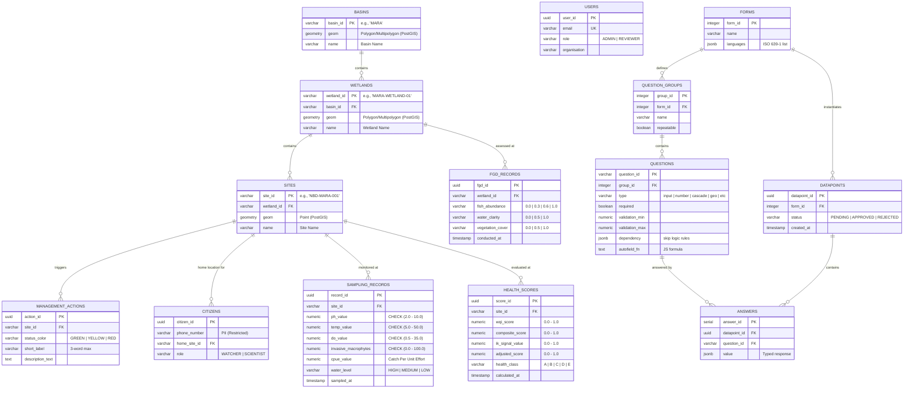

# Database Schema: NBD Citizen-Led Wetland Monitoring Platform

This document defines the relational database schema and architecture for the Nile Basin Discourse (NBD) Citizen-Led Data Generation and Management Platform.

---

## 1. System Overview & Architectural Philosophy

The platform serves as a formal channel for community-observed ecological data, bridging the gap between daily citizen observations and formal transboundary management systems. It targets the Mara Basin (Kenya/Tanzania) and Sio-Siteko Basin (Kenya/Uganda) in its Phase 1 deployment.

The database is built on **PostgreSQL 15+** with the **PostGIS 3.x** extension. The tables are partitioned into four functional layers:

* **Layer A (Spatial & Domain Reference)**: Manages the three-tier geographic hierarchy (Basins, Wetlands, Sites) and action recommendations.
* **Layer B (Identity, Access & Privacy)**: Governs users (SSO-linked) and watcher/scientist registrations (PII restricted).
* **Layer C (Dynamic Form Engine)**: Implements a relational representation of the `akvo-react-form` JSON schema.
* **Layer D (Ingestion, Triage & Outputs)**: Stores type-safe monitoring records, FGD data, and calculated health scores.

---

## 2. Entity-Relationship Diagram



---

## 3. Physical Schema Definition

### Layer A: Spatial & Domain Reference Models

#### `basins`
Stores the high-level hydrological basins acting as primary administrative and geospatial containers.

| Column | Data Type | Constraints | Description |
| :--- | :--- | :--- | :--- |
| `basin_id` | `VARCHAR(50)` | `PRIMARY KEY` | Unique basin slug/code (e.g., `'MARA'`, `'SIO-SITEKO'`). |
| `name` | `VARCHAR(100)` | `NOT NULL` | Full name of the basin. |
| `geom` | `geometry(MultiPolygon, 4326)` | `NOT NULL` | Spatial boundary of the basin. |

```sql
CREATE TABLE basins (
    basin_id VARCHAR(50) PRIMARY KEY,
    name VARCHAR(100) NOT NULL,
    geom geometry(MultiPolygon, 4326) NOT NULL
);
CREATE INDEX idx_basins_geom ON basins USING GIST (geom);
```

#### `wetlands`
Stores polygon-based boundary layers for wetlands mapped within a basin.

| Column | Data Type | Constraints | Description |
| :--- | :--- | :--- | :--- |
| `wetland_id` | `VARCHAR(50)` | `PRIMARY KEY` | Unique wetland code. |
| `basin_id` | `VARCHAR(50)` | `REFERENCES basins(basin_id)` | Parent basin identifier. |
| `name` | `VARCHAR(150)` | `NOT NULL` | Wetland name (e.g., `'Mara Floodplain'`). |
| `geom` | `geometry(Polygon, 4326)` | `NOT NULL` | Spatial boundary polygon. |

```sql
CREATE TABLE wetlands (
    wetland_id VARCHAR(50) PRIMARY KEY,
    basin_id VARCHAR(50) NOT NULL REFERENCES basins(basin_id) ON DELETE CASCADE,
    name VARCHAR(150) NOT NULL,
    geom geometry(Polygon, 4326) NOT NULL
);
CREATE INDEX idx_wetlands_geom ON wetlands USING GIST (geom);
CREATE INDEX idx_wetlands_basin_id ON wetlands(basin_id);
```

#### `sites`
Stores fixed sampling point locations where citizen scientists gather physical, chemical, or biological metrics.

| Column | Data Type | Constraints | Description |
| :--- | :--- | :--- | :--- |
| `site_id` | `VARCHAR(50)` | `PRIMARY KEY` | Persistent structured identifier (e.g., `'NBD-MARA-001'`). |
| `wetland_id` | `VARCHAR(50)` | `REFERENCES wetlands(wetland_id)` | Parent wetland container. |
| `name` | `VARCHAR(150)` | `NOT NULL` | Description of the point location. |
| `geom` | `geometry(Point, 4326)` | `NOT NULL` | Latitude/Longitude coordinates of the point. |

```sql
CREATE TABLE sites (
    site_id VARCHAR(50) PRIMARY KEY,
    wetland_id VARCHAR(50) NOT NULL REFERENCES wetlands(wetland_id) ON DELETE CASCADE,
    name VARCHAR(150) NOT NULL,
    geom geometry(Point, 4326) NOT NULL
);
CREATE INDEX idx_sites_geom ON sites USING GIST (geom);
CREATE INDEX idx_sites_wetland_id ON sites(wetland_id);
```

#### `management_actions`
Editorial recommendations displayed on the public portal based on a site's health level.

| Column | Data Type | Constraints | Description |
| :--- | :--- | :--- | :--- |
| `action_id` | `UUID` | `PRIMARY KEY`, `DEFAULT gen_random_uuid()` | Unique primary key. |
| `site_id` | `VARCHAR(50)` | `REFERENCES sites(site_id)` | Associated monitoring site. |
| `status_color` | `VARCHAR(10)` | `CHECK (status_color IN ('GREEN', 'YELLOW', 'RED'))` | Health status context triggering the action. |
| `short_label` | `VARCHAR(50)` | `NOT NULL` | 3-word primary display label (e.g., `'Establish Silt Traps'`). |
| `description_text` | `TEXT` | `NOT NULL` | Detailed instructional text. |

```sql
CREATE TABLE management_actions (
    action_id UUID PRIMARY KEY DEFAULT gen_random_uuid(),
    site_id VARCHAR(50) NOT NULL REFERENCES sites(site_id) ON DELETE CASCADE,
    status_color VARCHAR(10) NOT NULL CHECK (status_color IN ('GREEN', 'YELLOW', 'RED')),
    short_label VARCHAR(50) NOT NULL,
    description_text TEXT NOT NULL
);
CREATE INDEX idx_management_actions_site_color ON management_actions(site_id, status_color);
```

---

### Layer B: Identity, Access & Privacy

#### `users`
SSO-linked account profiles. No local passwords are stored.

| Column | Data Type | Constraints | Description |
| :--- | :--- | :--- | :--- |
| `user_id` | `UUID` | `PRIMARY KEY` | Single Sign-On subject ID (e.g. from Keycloak/Google/Microsoft). |
| `email` | `VARCHAR(255)` | `UNIQUE`, `NOT NULL` | User email. |
| `role` | `VARCHAR(20)` | `CHECK (role IN ('ADMIN', 'REVIEWER'))` | System role for access control. |
| `organisation` | `VARCHAR(150)` | `NOT NULL` | Corporate/organizational entity. |

```sql
CREATE TABLE users (
    user_id UUID PRIMARY KEY,
    email VARCHAR(255) UNIQUE NOT NULL,
    role VARCHAR(20) NOT NULL CHECK (role IN ('ADMIN', 'REVIEWER')),
    organisation VARCHAR(150) NOT NULL
);
```

#### `citizens`
Registered community recorders. Restricts direct access to PII.

| Column | Data Type | Constraints | Description |
| :--- | :--- | :--- | :--- |
| `citizen_id` | `UUID` | `PRIMARY KEY`, `DEFAULT gen_random_uuid()` | Unique identifier. |
| `phone_number` | `VARCHAR(50)` | `NOT NULL` | PII (Restricted to Admin trust zones). |
| `home_site_id` | `VARCHAR(50)` | `REFERENCES sites(site_id)` | Associated default monitoring point. |
| `role` | `VARCHAR(20)` | `CHECK (role IN ('WATCHER', 'SCIENTIST'))` | Citizen role. |

```sql
CREATE TABLE citizens (
    citizen_id UUID PRIMARY KEY DEFAULT gen_random_uuid(),
    phone_number VARCHAR(50) NOT NULL,
    home_site_id VARCHAR(50) NOT NULL REFERENCES sites(site_id) ON DELETE RESTRICT,
    role VARCHAR(20) NOT NULL CHECK (role IN ('WATCHER', 'SCIENTIST'))
);
```

---

### Layer C: Dynamic Form Engine (`akvo-react-form`)

#### `forms`
Dynamic survey definitions.

| Column | Data Type | Constraints | Description |
| :--- | :--- | :--- | :--- |
| `form_id` | `INTEGER` | `PRIMARY KEY` | Unique ID from Form Builder. |
| `name` | `VARCHAR(255)` | `NOT NULL` | Form display title. |
| `languages` | `JSONB` | `NOT NULL` | Array of ISO 639-1 language codes. |

```sql
CREATE TABLE forms (
    form_id INTEGER PRIMARY KEY,
    name VARCHAR(255) NOT NULL,
    languages jsonb NOT NULL -- e.g., '["en", "sw"]'
);
```

#### `question_groups`
Structural question sections within a dynamic form.

| Column | Data Type | Constraints | Description |
| :--- | :--- | :--- | :--- |
| `group_id` | `INTEGER` | `PRIMARY KEY` | Section identifier. |
| `form_id` | `INTEGER` | `REFERENCES forms(form_id)` | Form this group belongs to. |
| `name` | `VARCHAR(255)` | `NOT NULL` | Section title. |
| `repeatable` | `BOOLEAN` | `DEFAULT FALSE` | Denotes if the section supports loop structures. |

```sql
CREATE TABLE question_groups (
    group_id INTEGER PRIMARY KEY,
    form_id INTEGER NOT NULL REFERENCES forms(form_id) ON DELETE CASCADE,
    name VARCHAR(255) NOT NULL,
    repeatable BOOLEAN NOT NULL DEFAULT FALSE
);
```

#### `questions`
Individual fields defined within a question group.

| Column | Data Type | Constraints | Description |
| :--- | :--- | :--- | :--- |
| `question_id` | `VARCHAR(100)` | `PRIMARY KEY` | Globally unique question identifier. |
| `group_id` | `INTEGER` | `REFERENCES question_groups(group_id)` | Section containing this question. |
| `type` | `VARCHAR(50)` | `NOT NULL` | Element input type (e.g. `'input'`, `'number'`). |
| `required` | `BOOLEAN` | `DEFAULT FALSE` | Validation requirement. |
| `validation_min`| `NUMERIC` | `NULL` | Lowest boundary (for number inputs). |
| `validation_max`| `NUMERIC` | `NULL` | Highest boundary (for number inputs). |
| `dependency` | `JSONB` | `NULL` | Conditional rules (Skip logic JSON). |
| `autofield_fn` | `TEXT` | `NULL` | Formula logic compiled as Javascript. |

```sql
CREATE TABLE questions (
    question_id VARCHAR(100) PRIMARY KEY,
    group_id INTEGER NOT NULL REFERENCES question_groups(group_id) ON DELETE CASCADE,
    type VARCHAR(50) NOT NULL,
    required BOOLEAN NOT NULL DEFAULT FALSE,
    validation_min NUMERIC,
    validation_max NUMERIC,
    dependency jsonb,
    autofield_fn TEXT
);
```

#### `datapoints`
Individual instances of a submitted form.

| Column | Data Type | Constraints | Description |
| :--- | :--- | :--- | :--- |
| `datapoint_id` | `UUID` | `PRIMARY KEY` | Generated transaction UUID. |
| `form_id` | `INTEGER` | `REFERENCES forms(form_id)` | Form being answered. |
| `status` | `VARCHAR(20)` | `CHECK (status IN ('PENDING', 'APPROVED', 'REJECTED'))` | Workflow state. |
| `created_at` | `TIMESTAMP` | `DEFAULT CURRENT_TIMESTAMP` | Timestamp of submission. |

```sql
CREATE TABLE datapoints (
    datapoint_id UUID PRIMARY KEY,
    form_id INTEGER NOT NULL REFERENCES forms(form_id) ON DELETE RESTRICT,
    status VARCHAR(20) NOT NULL CHECK (status IN ('PENDING', 'APPROVED', 'REJECTED')),
    created_at TIMESTAMP NOT NULL DEFAULT CURRENT_TIMESTAMP
);
CREATE INDEX idx_datapoints_status ON datapoints(status);
```

#### `answers`
The actual response values submitted for a given question.

| Column | Data Type | Constraints | Description |
| :--- | :--- | :--- | :--- |
| `answer_id` | `SERIAL` | `PRIMARY KEY` | Incrementing record ID. |
| `datapoint_id` | `UUID` | `REFERENCES datapoints(datapoint_id)` | Core submission envelope. |
| `question_id` | `VARCHAR(100)` | `REFERENCES questions(question_id)` | Question answered. |
| `value` | `JSONB` | `NOT NULL` | Response payload (structured text, numbers, geo objects). |

```sql
CREATE TABLE answers (
    answer_id SERIAL PRIMARY KEY,
    datapoint_id UUID NOT NULL REFERENCES datapoints(datapoint_id) ON DELETE CASCADE,
    question_id VARCHAR(100) NOT NULL REFERENCES questions(question_id) ON DELETE CASCADE,
    value jsonb NOT NULL
);
CREATE UNIQUE INDEX idx_datapoint_question ON answers(datapoint_id, question_id);
```

---

### Layer D: Ingestion, Triage & Outputs

#### `sampling_records`
Holds validated, structured physical and chemical sampling datasets. Enforces strict physics constraints.

| Column | Data Type | Constraints | Description |
| :--- | :--- | :--- | :--- |
| `record_id` | `UUID` | `PRIMARY KEY` | Linked transaction record ID. |
| `site_id` | `VARCHAR(50)` | `REFERENCES sites(site_id)` | Location monitored. |
| `ph_value` | `NUMERIC(4,2)` | `CHECK (ph_value BETWEEN 2.0 AND 10.0)` | Potential of hydrogen (2.0 - 10.0). |
| `temp_value` | `NUMERIC(4,1)` | `CHECK (temp_value BETWEEN 5.0 AND 50.0)` | Temperature in °C (5.0 - 50.0). |
| `do_value` | `NUMERIC(4,1)` | `CHECK (do_value BETWEEN 0.5 AND 35.0)` | Dissolved Oxygen in mg/L (0.5 - 35.0). |
| `invasive_macrophytes`| `NUMERIC(5,2)`| `CHECK (invasive_macrophytes BETWEEN 0.0 AND 100.0)` | Invasive weed surface coverage (0 - 100%). |
| `cpue_value` | `NUMERIC(6,2)` | `NULL` | Catch Per Unit Effort (fish caught / effort hours). |
| `water_level` | `VARCHAR(10)` | `CHECK (water_level IN ('HIGH', 'MEDIUM', 'LOW'))` | Relative water level assessment. |
| `sampled_at` | `TIMESTAMP` | `NOT NULL` | Field recording date and time. |

```sql
CREATE TABLE sampling_records (
    record_id UUID PRIMARY KEY,
    site_id VARCHAR(50) NOT NULL REFERENCES sites(site_id) ON DELETE RESTRICT,
    ph_value NUMERIC(4,2) NOT NULL CHECK (ph_value BETWEEN 2.0 AND 10.0),
    temp_value NUMERIC(4,1) NOT NULL CHECK (temp_value BETWEEN 5.0 AND 50.0),
    do_value NUMERIC(4,1) NOT NULL CHECK (do_value BETWEEN 0.5 AND 35.0),
    invasive_macrophytes NUMERIC(5,2) NOT NULL CHECK (invasive_macrophytes BETWEEN 0.0 AND 100.0),
    cpue_value NUMERIC(6,2),
    water_level VARCHAR(10) NOT NULL CHECK (water_level IN ('HIGH', 'MEDIUM', 'LOW')),
    sampled_at TIMESTAMP NOT NULL
);
CREATE INDEX idx_sampling_records_site_date ON sampling_records(site_id, sampled_at DESC);
```

#### `fgd_records`
Focus Group Discussion records capturing qualitative indicators to compile Indigenous Knowledge (IK) inputs.

| Column | Data Type | Constraints | Description |
| :--- | :--- | :--- | :--- |
| `fgd_id` | `UUID` | `PRIMARY KEY` | FGD log identifier. |
| `wetland_id` | `VARCHAR(50)` | `REFERENCES wetlands(wetland_id)` | Target wetland region. |
| `fish_abundance` | `VARCHAR(15)` | `CHECK (fish_abundance IN ('Same', 'Slight', 'Moderate', 'Severe'))` | Decline status. Encoded to `(Same: 0.0, Slight: 0.3, Moderate: 0.6, Severe: 1.0)`. |
| `water_clarity` | `VARCHAR(15)` | `CHECK (water_clarity IN ('Same', 'Somewhat Worse', 'Much Worse'))` | Decline status. Encoded to `(Same: 0.0, Somewhat Worse: 0.5, Much Worse: 1.0)`. |
| `vegetation_cover` | `VARCHAR(15)` | `CHECK (vegetation_cover IN ('Same', 'Partial Loss', 'Severe Loss'))` | Decline status. Encoded to `(Same: 0.0, Partial Loss: 0.5, Severe Loss: 1.0)`. |
| `conducted_at` | `TIMESTAMP` | `NOT NULL` | Interview date and time. |

```sql
CREATE TABLE fgd_records (
    fgd_id UUID PRIMARY KEY,
    wetland_id VARCHAR(50) NOT NULL REFERENCES wetlands(wetland_id) ON DELETE RESTRICT,
    fish_abundance VARCHAR(15) NOT NULL CHECK (fish_abundance IN ('Same', 'Slight', 'Moderate', 'Severe')),
    water_clarity VARCHAR(15) NOT NULL CHECK (water_clarity IN ('Same', 'Somewhat Worse', 'Much Worse')),
    vegetation_cover VARCHAR(15) NOT NULL CHECK (vegetation_cover IN ('Same', 'Partial Loss', 'Severe Loss')),
    conducted_at TIMESTAMP NOT NULL
);
CREATE INDEX idx_fgd_records_wetland ON fgd_records(wetland_id, conducted_at DESC);
```

#### `health_scores`
The ultimate output generated by the fuzzy scoring logic engine.

| Column | Data Type | Constraints | Description |
| :--- | :--- | :--- | :--- |
| `score_id` | `UUID` | `PRIMARY KEY`, `DEFAULT gen_random_uuid()` | Scoring transaction key. |
| `site_id` | `VARCHAR(50)` | `REFERENCES sites(site_id)` | Monitored location context. |
| `wqi_score` | `NUMERIC(3,2)` | `CHECK (wqi_score BETWEEN 0.00 AND 1.00)` | Computed Water Quality Index. |
| `composite_score` | `NUMERIC(3,2)` | `CHECK (composite_score BETWEEN 0.00 AND 1.00)` | Mean of Physico-chemical, Catchment, Ecological. |
| `ik_signal_value` | `NUMERIC(3,2)` | `CHECK (ik_signal_value BETWEEN 0.00 AND 1.00)` | Computed mean of FGD decline vectors. |
| `adjusted_score` | `NUMERIC(3,2)` | `CHECK (adjusted_score BETWEEN 0.00 AND 1.00)` | Fuzzy inference engine centroid output. |
| `health_class` | `CHAR(1)` | `CHECK (health_class IN ('A', 'B', 'C', 'D', 'E'))` | Aggregated class (A: 0.8-1.0 to E: 0.0-0.2). |
| `calculated_at` | `TIMESTAMP` | `DEFAULT CURRENT_TIMESTAMP` | Time evaluated. |

```sql
CREATE TABLE health_scores (
    score_id UUID PRIMARY KEY DEFAULT gen_random_uuid(),
    site_id VARCHAR(50) NOT NULL REFERENCES sites(site_id) ON DELETE CASCADE,
    wqi_score NUMERIC(3,2) NOT NULL CHECK (wqi_score BETWEEN 0.00 AND 1.00),
    composite_score NUMERIC(3,2) NOT NULL CHECK (composite_score BETWEEN 0.00 AND 1.00),
    ik_signal_value NUMERIC(3,2) NOT NULL CHECK (ik_signal_value BETWEEN 0.00 AND 1.00),
    adjusted_score NUMERIC(3,2) NOT NULL CHECK (adjusted_score BETWEEN 0.00 AND 1.00),
    health_class CHAR(1) NOT NULL CHECK (health_class IN ('A', 'B', 'C', 'D', 'E')),
    calculated_at TIMESTAMP NOT NULL DEFAULT CURRENT_TIMESTAMP
);
CREATE INDEX idx_health_scores_site ON health_scores(site_id, calculated_at DESC);
```

---

## 4. Architectural Decisions & Rationale

### Avoidance of the EAV (Entity-Attribute-Value) Anti-Pattern
While `datapoints` and `answers` are structured as a semi-dynamic EAV framework to capture varying user submissions from KoboCollect/`akvo-react-form`, the system enforces a strict **separate ingestion pipeline** for physical metrics.

1. **Type Safety & Constraints**: Sampling parameters like pH, DO, and temperature must follow rigorous check boundaries. Enforcing numeric ranges on an EAV model requires parsing generic string fields, leading to runtime failures and database bloat.
2. **Geospatial & Trend Analysis**: Storing measurements in explicit, structured columns in `sampling_records` enables low-latency spatial and temporal indexing, crucial for high-frequency queries.
3. **External Integrations**: A clean relational structure enables straightforward standard SQL joins against external datasets (e.g. Sentinel-based NDVI or CHIRPS precipitation points mapped via `site_id` or `wetland_id`), which would otherwise require complex and expensive JSON parser projections.

### Data Ingestion and Scoring Pipeline
1. **Raw Submission Cache**: The mobile or USSD ingestion worker writes the unstructured incoming JSON envelope into `datapoints` and `answers` in a state of `PENDING`.
2. **Curation & Triage**: Administrative tools filter valid submissions and mark the datapoint `APPROVED`.
3. **Trigger Scoring Process**:
    * Clean physical metrics are parsed from the approved payload and inserted into `sampling_records`.
    * A background listener recalculates the Water Quality Index ($WQI$) for the site using physical constraints.
    * Concurrently, qualitative FGD inputs from `fgd_records` are retrieved for the associated wetland basin and defuzzified into a composite $IK\ Signal$ metric.
    * The fuzzy engine blends both scores to yield the final `adjusted_score` and populates the `health_scores` ledger.
    * The portal renders the status color threshold (GREEN, YELLOW, RED) matching the calculated `health_class`, highlighting specific recommendations from `management_actions`.
