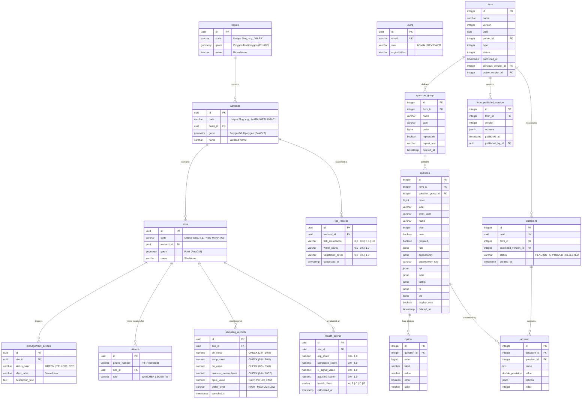

# Database Schema: NBD Citizen-Led Wetland Monitoring Platform

This document defines the relational database schema and architecture for the Nile Basin Discourse (NBD) Citizen-Led Data Generation and Management Platform.

---

## 1. System Overview & Architectural Philosophy

The platform serves as a formal channel for community-observed ecological data, bridging the gap between daily citizen observations and formal transboundary management systems. It targets the Mara Basin (Kenya/Tanzania) and Sio-Siteko Basin (Kenya/Uganda) in its Phase 1 deployment.

The database is built on **PostgreSQL 15+** with the **PostGIS 3.x** extension. The tables are partitioned into four functional layers:

* **Layer A (Spatial & Domain Reference)**: Manages the three-tier geographic hierarchy (Basins, Wetlands, Sites) and action recommendations.
* **Layer B (Identity, Access & Privacy)**: Governs users (SSO-linked) and watcher/scientist registrations (PII restricted).
* **Layer C (Dynamic Form Engine)**: Implements a relational representation of the `akvo-react-form` JSON schema.
* **Layer D (Ingestion, Triage & Outputs)**: Stores type-safe monitoring records, FGD data, and calculated health scores.

---

## 2. Entity-Relationship Diagram



---

## 3. Physical Schema Definition

### Layer A: Spatial & Domain Reference Models

#### `basins`
Stores the high-level hydrological basins acting as primary administrative and geospatial containers.

| Column | Data Type | Constraints | Description |
| :--- | :--- | :--- | :--- |
| `id` | `UUID` | `PRIMARY KEY` | Unique ID. |
| `code` | `VARCHAR(50)` | `UNIQUE`, `NOT NULL` | Unique basin slug/code (e.g., `'MARA'`, `'SIO-SITEKO'`). |
| `name` | `VARCHAR(100)` | `NOT NULL` | Full name of the basin. |
| `geom` | `geometry(MultiPolygon, 4326)` | `NOT NULL` | Spatial boundary of the basin. |

```sql
CREATE TABLE basins (
    id UUID PRIMARY KEY,
    code VARCHAR(50) UNIQUE NOT NULL,
    name VARCHAR(100) NOT NULL,
    geom geometry(MultiPolygon, 4326) NOT NULL
);
CREATE INDEX idx_basins_geom ON basins USING GIST (geom);
```

#### `wetlands`
Stores polygon-based boundary layers for wetlands mapped within a basin.

| Column | Data Type | Constraints | Description |
| :--- | :--- | :--- | :--- |
| `id` | `UUID` | `PRIMARY KEY` | Unique ID. |
| `code` | `VARCHAR(50)` | `UNIQUE`, `NOT NULL` | Unique wetland code. |
| `basin_id` | `UUID` | `REFERENCES basins(id)` | Parent basin identifier. |
| `name` | `VARCHAR(150)` | `NOT NULL` | Wetland name (e.g., `'Mara Floodplain'`). |
| `geom` | `geometry(Polygon, 4326)` | `NOT NULL` | Spatial boundary polygon. |

```sql
CREATE TABLE wetlands (
    id UUID PRIMARY KEY,
    code VARCHAR(50) UNIQUE NOT NULL,
    basin_id UUID NOT NULL REFERENCES basins(id) ON DELETE CASCADE,
    name VARCHAR(150) NOT NULL,
    geom geometry(Polygon, 4326) NOT NULL
);
CREATE INDEX idx_wetlands_geom ON wetlands USING GIST (geom);
CREATE INDEX idx_wetlands_basin_id ON wetlands(basin_id);
```

#### `sites`
Stores fixed sampling point locations where citizen scientists gather physical, chemical, or biological metrics.

| Column | Data Type | Constraints | Description |
| :--- | :--- | :--- | :--- |
| `id` | `UUID` | `PRIMARY KEY` | Unique ID. |
| `code` | `VARCHAR(50)` | `UNIQUE`, `NOT NULL` | Persistent structured identifier (e.g., `'NBD-MARA-001'`). |
| `wetland_id` | `UUID` | `REFERENCES wetlands(id)` | Parent wetland container. |
| `name` | `VARCHAR(150)` | `NOT NULL` | Description of the point location. |
| `geom` | `geometry(Point, 4326)` | `NOT NULL` | Latitude/Longitude coordinates of the point. |

```sql
CREATE TABLE sites (
    id UUID PRIMARY KEY,
    code VARCHAR(50) UNIQUE NOT NULL,
    wetland_id UUID NOT NULL REFERENCES wetlands(id) ON DELETE CASCADE,
    name VARCHAR(150) NOT NULL,
    geom geometry(Point, 4326) NOT NULL
);
CREATE INDEX idx_sites_geom ON sites USING GIST (geom);
CREATE INDEX idx_sites_wetland_id ON sites(wetland_id);
```

#### `spatial_boundaries`
Stores the administrative sub-counties and their geographic centroid coordinates for USSD reference mapping.

| Column | Data Type | Constraints | Description |
| :--- | :--- | :--- | :--- |
| `id` | `UUID` | `PRIMARY KEY` | Unique ID. |
| `name` | `VARCHAR(100)` | `NOT NULL` | Sub-county or district name (e.g., `'Tarime'`). |
| `basin_id` | `UUID` | `REFERENCES basins(id)` | Parent basin identifier. |
| `centroid_geom` | `geometry(Point, 4326)` | `NOT NULL` | Spatial point coordinates of the sub-county centroid. |

```sql
CREATE TABLE spatial_boundaries (
    id UUID PRIMARY KEY,
    name VARCHAR(100) NOT NULL,
    basin_id UUID NOT NULL REFERENCES basins(id) ON DELETE CASCADE,
    centroid_geom geometry(Point, 4326) NOT NULL
);
CREATE INDEX idx_spatial_boundaries_geom ON spatial_boundaries USING GIST (centroid_geom);
CREATE INDEX idx_spatial_boundaries_basin_id ON spatial_boundaries(basin_id);
```

#### `management_actions`
Editorial recommendations displayed on the public portal based on a site's health level.

| Column | Data Type | Constraints | Description |
| :--- | :--- | :--- | :--- |
| `id` | `UUID` | `PRIMARY KEY`, `DEFAULT gen_random_uuid()` | Unique primary key. |
| `site_id` | `UUID` | `REFERENCES sites(id)` | Associated monitoring site UUID. |
| `status_color` | `VARCHAR(10)` | `CHECK (status_color IN ('GREEN', 'YELLOW', 'RED'))` | Health status context triggering the action. |
| `short_label` | `VARCHAR(50)` | `NOT NULL` | 3-word primary display label (e.g., `'Establish Silt Traps'`). |
| `description_text` | `TEXT` | `NOT NULL` | Detailed instructional text. |

```sql
CREATE TABLE management_actions (
    id UUID PRIMARY KEY DEFAULT gen_random_uuid(),
    site_id UUID NOT NULL REFERENCES sites(id) ON DELETE CASCADE,
    status_color VARCHAR(10) NOT NULL CHECK (status_color IN ('GREEN', 'YELLOW', 'RED')),
    short_label VARCHAR(50) NOT NULL,
    description_text TEXT NOT NULL
);
CREATE INDEX idx_management_actions_site_color ON management_actions(site_id, status_color);
```

---

### Layer B: Identity, Access & Privacy

#### `users`
Profiles for internal staff (Admins/Reviewers using SSO) and external partners (with optional password hashes).

| Column | Data Type | Constraints | Description |
| :--- | :--- | :--- | :--- |
| `id` | `UUID` | `PRIMARY KEY` | Unique ID. |
| `email` | `VARCHAR(255)` | `UNIQUE`, `NOT NULL`, `INDEX` | User email. |
| `role` | `VARCHAR(50)` | `NOT NULL` | Role: 'Admin', 'Reviewer', 'Partner'. |
| `organization` | `VARCHAR(255)` | `NULL` | Organization name. |
| `password_hash` | `VARCHAR(255)` | `NULL` | Password hash for external Partners. |
| `is_active` | `BOOLEAN` | `NOT NULL`, `DEFAULT True` | Account active state. |

```sql
CREATE TABLE users (
    id UUID PRIMARY KEY,
    email VARCHAR(255) UNIQUE NOT NULL,
    role VARCHAR(50) NOT NULL,
    organization VARCHAR(255),
    password_hash VARCHAR(255),
    is_active BOOLEAN NOT NULL DEFAULT True
);
CREATE INDEX ix_users_email ON users (email);
```

#### `citizens`
Registered community recorders. Restricts direct access to PII.

| Column | Data Type | Constraints | Description |
| :--- | :--- | :--- | :--- |
| `id` | `UUID` | `PRIMARY KEY`, `DEFAULT gen_random_uuid()` | Unique identifier. |
| `phone_number` | `VARCHAR(50)` | `NOT NULL` | PII (Restricted to Admin trust zones). |
| `site_id` | `UUID` | `REFERENCES sites(id)` | Associated default monitoring point UUID. |
| `role` | `VARCHAR(20)` | `CHECK (role IN ('WATCHER', 'SCIENTIST'))` | Citizen role. |

```sql
CREATE TABLE citizens (
    id UUID PRIMARY KEY DEFAULT gen_random_uuid(),
    phone_number VARCHAR(50) NOT NULL,
    site_id UUID NOT NULL REFERENCES sites(id) ON DELETE RESTRICT,
    role VARCHAR(20) NOT NULL CHECK (role IN ('WATCHER', 'SCIENTIST'))
);
```

---

### Layer C: Dynamic Form Engine (`akvo-react-form`)

#### `form`
Dynamic survey definitions and version references.

| Column | Data Type | Constraints | Description |
| :--- | :--- | :--- | :--- |
| `id` | `INTEGER` | `PRIMARY KEY` | Serial database identifier. |
| `name` | `TEXT` | `NOT NULL` | Form display title. |
| `version` | `INTEGER` | `DEFAULT 1` | Incremental form layout version. |
| `uuid` | `UUID` | `UNIQUE`, `NOT NULL` | Globally unique identifier. |
| `kobo_asset_id` | `VARCHAR(255)` | `UNIQUE`, `NULL` | Unique Kobo Asset UID mapping. |
| `parent_id` | `INTEGER` | `REFERENCES form(id) ON DELETE CASCADE` | Parent form ID (for recursive inheritance). |
| `type` | `INTEGER` | `DEFAULT 1` | Form type classifier. |
| `status` | `INTEGER` | `DEFAULT 1` | Draft / published status indicator. |
| `published_at` | `TIMESTAMP` | `NULL` | Timestamp when the version was published. |
| `previous_version_id` | `INTEGER` | `REFERENCES form(id) ON DELETE SET NULL` | Pointer to the previous layout version. |
| `active_version_id` | `INTEGER` | `REFERENCES form_published_version(id) ON DELETE SET NULL` | Pointer to current published snapshot. |

```sql
CREATE TABLE form (
    id SERIAL PRIMARY KEY,
    name TEXT NOT NULL,
    version INTEGER NOT NULL DEFAULT 1,
    uuid UUID UNIQUE NOT NULL DEFAULT gen_random_uuid(),
    kobo_asset_id VARCHAR(255) UNIQUE,
    parent_id INTEGER REFERENCES form(id) ON DELETE CASCADE,
    type INTEGER NOT NULL DEFAULT 1,
    status INTEGER NOT NULL DEFAULT 1,
    published_at TIMESTAMP,
    previous_version_id INTEGER REFERENCES form(id) ON DELETE SET NULL,
    active_version_id INTEGER -- Added via ALTER TABLE after form_published_version exists
);
```

#### `question_group`
Structural question sections/categories within a dynamic form.

| Column | Data Type | Constraints | Description |
| :--- | :--- | :--- | :--- |
| `id` | `INTEGER` | `PRIMARY KEY` | Section database identifier. |
| `form_id` | `INTEGER` | `REFERENCES form(id) ON DELETE CASCADE` | Parent form container. |
| `name` | `VARCHAR(255)` | `NOT NULL` | Dynamic section slug/name. |
| `label` | `TEXT` | `NULL` | Category display title. |
| `order` | `BIGINT` | `NULL` | Display sequence order. |
| `repeatable` | `BOOLEAN` | `DEFAULT FALSE` | Denotes if the section supports loop structures. |
| `repeat_text` | `VARCHAR(255)` | `NULL` | Text to display on repeat button. |
| `deleted_at` | `TIMESTAMP` | `NULL` | Soft-delete timestamp indicator. |

```sql
CREATE TABLE question_group (
    id SERIAL PRIMARY KEY,
    form_id INTEGER NOT NULL REFERENCES form(id) ON DELETE CASCADE,
    name VARCHAR(255) NOT NULL,
    label TEXT,
    "order" BIGINT,
    repeatable BOOLEAN NOT NULL DEFAULT FALSE,
    repeat_text VARCHAR(255),
    deleted_at TIMESTAMP
);
CREATE UNIQUE INDEX unique_active_form_question_group ON question_group (form_id, name) WHERE deleted_at IS NULL;
```

#### `question`
Individual input fields and metadata defined within a question group.

| Column | Data Type | Constraints | Description |
| :--- | :--- | :--- | :--- |
| `id` | `INTEGER` | `PRIMARY KEY` | Question database identifier. |
| `form_id` | `INTEGER` | `REFERENCES form(id) ON DELETE CASCADE` | Parent form container. |
| `question_group_id` | `INTEGER` | `REFERENCES question_group(id) ON DELETE CASCADE` | Category section container. |
| `order` | `BIGINT` | `NULL` | Display sequence order. |
| `label` | `TEXT` | `NOT NULL` | Display question string. |
| `short_label` | `TEXT` | `NULL` | Abridged question text. |
| `name` | `VARCHAR(255)` | `NULL` | Unique data lookup key. |
| `type` | `INTEGER` | `NOT NULL` | Field data type enum classifier. |
| `meta` | `BOOLEAN` | `DEFAULT FALSE` | Metadata field flag. |
| `required` | `BOOLEAN` | `DEFAULT TRUE` | Validation requirement. |
| `rule` | `JSONB` | `NULL` | Nested limits and min/max validation rules. |
| `dependency` | `JSONB` | `NULL` | Skip logic dependencies configuration. |
| `dependency_rule` | `VARCHAR(3)` | `NULL` | Conditional evaluation rule context. |
| `api` | `JSONB` | `NULL` | Endpoint configurations. |
| `extra` | `JSONB` | `NULL` | Layout customizations. |
| `tooltip` | `JSONB` | `NULL` | Helper hover context. |
| `fn` | `JSONB` | `NULL` | Calculation logic definitions. |
| `pre` | `JSONB` | `NULL` | Prefill configurations. |
| `display_only` | `BOOLEAN` | `DEFAULT FALSE` | Read-only input element flag. |
| `deleted_at` | `TIMESTAMP` | `NULL` | Soft-delete timestamp indicator. |

```sql
CREATE TABLE question (
    id SERIAL PRIMARY KEY,
    form_id INTEGER NOT NULL REFERENCES form(id) ON DELETE CASCADE,
    question_group_id INTEGER NOT NULL REFERENCES question_group(id) ON DELETE CASCADE,
    "order" BIGINT,
    label TEXT NOT NULL,
    short_label TEXT,
    name VARCHAR(255),
    type INTEGER NOT NULL,
    meta BOOLEAN NOT NULL DEFAULT FALSE,
    required BOOLEAN NOT NULL DEFAULT TRUE,
    rule JSONB,
    dependency JSONB,
    dependency_rule VARCHAR(3),
    api JSONB,
    extra JSONB,
    tooltip JSONB,
    fn JSONB,
    pre JSONB,
    display_only BOOLEAN DEFAULT FALSE,
    deleted_at TIMESTAMP
);
CREATE UNIQUE INDEX unique_active_form_question ON question (form_id, name) WHERE deleted_at IS NULL;
```

#### `option`
Multiple-choice answers options mapping selection list items to questions.

| Column | Data Type | Constraints | Description |
| :--- | :--- | :--- | :--- |
| `id` | `INTEGER` | `PRIMARY KEY` | Option database identifier. |
| `question_id` | `INTEGER` | `REFERENCES question(id) ON DELETE CASCADE` | Target question container. |
| `order` | `BIGINT` | `NULL` | Selection list index order. |
| `label` | `TEXT` | `NULL` | Visual selection label. |
| `value` | `VARCHAR(255)` | `NULL` | Ingested value database key. |
| `other` | `BOOLEAN` | `DEFAULT FALSE` | Open-text placeholder flag. |
| `color` | `TEXT` | `NULL` | Visual highlight metadata. |

```sql
CREATE TABLE option (
    id SERIAL PRIMARY KEY,
    question_id INTEGER NOT NULL REFERENCES question(id) ON DELETE CASCADE,
    "order" BIGINT,
    label TEXT,
    value VARCHAR(255),
    other BOOLEAN NOT NULL DEFAULT FALSE,
    color TEXT
);
CREATE UNIQUE INDEX unique_question_option ON option (question_id, value);
```

#### `form_published_version`
Frozen layout snapshots captured when a form version gets published.

| Column | Data Type | Constraints | Description |
| :--- | :--- | :--- | :--- |
| `id` | `INTEGER` | `PRIMARY KEY` | Version snapshot key. |
| `form_id` | `INTEGER` | `REFERENCES form(id) ON DELETE CASCADE` | Target form. |
| `version` | `INTEGER` | `NOT NULL` | Form version sequential counter. |
| `schema` | `JSONB` | `NOT NULL` | Complete compiled form snapshot. |
| `published_at` | `TIMESTAMP` | `DEFAULT CURRENT_TIMESTAMP` | Time layout got frozen. |
| `published_by_id` | `UUID` | `REFERENCES users(id) ON DELETE SET NULL` | Publisher profile. |

```sql
CREATE TABLE form_published_version (
    id SERIAL PRIMARY KEY,
    form_id INTEGER NOT NULL REFERENCES form(id) ON DELETE CASCADE,
    version INTEGER NOT NULL,
    schema JSONB NOT NULL,
    published_at TIMESTAMP NOT NULL DEFAULT CURRENT_TIMESTAMP,
    published_by_id UUID REFERENCES users(id) ON DELETE SET NULL
);
CREATE UNIQUE INDEX unique_form_published_version ON form_published_version (form_id, version);
```

#### `datapoint`
Individual instances of a submitted form, anchored to exactly one level of the geographic hierarchy.

| Column | Data Type | Constraints | Description |
| :--- | :--- | :--- | :--- |
| `id` | `SERIAL` | `PRIMARY KEY` | Incrementing record ID. |
| `uuid` | `UUID` | `UNIQUE`, `NOT NULL` | Unique public UUID. |
| `form_id` | `INTEGER` | `REFERENCES form(id) ON DELETE RESTRICT` | Form being answered. |
| `published_version_id` | `INTEGER` | `REFERENCES form_published_version(id) ON DELETE SET NULL` | Layout snapshot used. |
| `name` | `TEXT` | `NULL` | Optional name of observation. |
| `basin_id` | `UUID` | `REFERENCES basins(id) ON DELETE SET NULL` | Geographically anchored basin. |
| `wetland_id` | `UUID` | `REFERENCES wetlands(id) ON DELETE SET NULL` | Geographically anchored wetland. |
| `site_id` | `UUID` | `REFERENCES sites(id) ON DELETE SET NULL` | Geographically anchored monitoring site. |
| `geo` | `JSONB` | `NULL` | Optional direct coordinate JSON. |
| `created_by_id` | `UUID` | `REFERENCES users(id) ON DELETE SET NULL` | Submitter user profile. |
| `created_at` | `TIMESTAMP` | `DEFAULT CURRENT_TIMESTAMP` | Timestamp of submission. |
| `updated_at` | `TIMESTAMP` | `NULL` | Timestamp of last update. |
| `duration` | `INTEGER` | `DEFAULT 0` | Ingestion duration. |
| `submitter` | `VARCHAR(255)` | `NULL` | Raw submitter name/agent. |
| `status` | `VARCHAR(20)` | `DEFAULT 'PENDING'` | Submission workflow state. |

```sql
CREATE TABLE datapoint (
    id SERIAL PRIMARY KEY,
    uuid UUID UNIQUE NOT NULL,
    form_id INTEGER NOT NULL REFERENCES form(id) ON DELETE RESTRICT,
    published_version_id INTEGER REFERENCES form_published_version(id) ON DELETE SET NULL,
    name TEXT,
    basin_id UUID REFERENCES basins(id) ON DELETE SET NULL,
    wetland_id UUID REFERENCES wetlands(id) ON DELETE SET NULL,
    site_id UUID REFERENCES sites(id) ON DELETE SET NULL,
    geo JSONB,
    created_by_id UUID REFERENCES users(id) ON DELETE SET NULL,
    created_at TIMESTAMP NOT NULL DEFAULT CURRENT_TIMESTAMP,
    updated_at TIMESTAMP,
    duration INTEGER NOT NULL DEFAULT 0,
    submitter VARCHAR(255),
    status VARCHAR(20) NOT NULL DEFAULT 'PENDING',
    CONSTRAINT chk_polymorphic_anchor CHECK (
        (basin_id IS NOT NULL)::int +
        (wetland_id IS NOT NULL)::int +
        (site_id IS NOT NULL)::int = 1
    )
);
CREATE INDEX ix_datapoint_id ON datapoint(id);
```

#### `answer`
The actual response values submitted for a given question.

| Column | Data Type | Constraints | Description |
| :--- | :--- | :--- | :--- |
| `id` | `SERIAL` | `PRIMARY KEY` | Incrementing record ID. |
| `datapoint_id` | `INTEGER` | `REFERENCES datapoint(id) ON DELETE CASCADE` | Submitter datapoint envelope. |
| `question_id` | `INTEGER` | `REFERENCES question(id) ON DELETE CASCADE` | Question answered. |
| `name` | `TEXT` | `NULL` | Response text/qualitative value. |
| `value` | `DOUBLE PRECISION` | `NULL` | Response numeric/float value. |
| `options` | `JSONB` | `NULL` | Response selected choice values. |
| `created_by_id` | `UUID` | `REFERENCES users(id) ON DELETE SET NULL` | Submitter user profile. |
| `created_at` | `TIMESTAMP` | `DEFAULT CURRENT_TIMESTAMP` | Timestamp of submission. |
| `updated_at` | `TIMESTAMP` | `NULL` | Timestamp of last update. |
| `index` | `INTEGER` | `DEFAULT 0` | Repeatable index counter. |

```sql
CREATE TABLE answer (
    id SERIAL PRIMARY KEY,
    datapoint_id INTEGER NOT NULL REFERENCES datapoint(id) ON DELETE CASCADE,
    question_id INTEGER NOT NULL REFERENCES question(id) ON DELETE CASCADE,
    name TEXT,
    value DOUBLE PRECISION,
    options JSONB,
    created_by_id UUID REFERENCES users(id) ON DELETE SET NULL,
    created_at TIMESTAMP NOT NULL DEFAULT CURRENT_TIMESTAMP,
    updated_at TIMESTAMP,
    index INTEGER NOT NULL DEFAULT 0,
    CONSTRAINT unique_datapoint_question_index UNIQUE (datapoint_id, question_id, index)
);
CREATE INDEX ix_answer_id ON answer(id);
```

---

### Layer D: Ingestion, Triage & Outputs

#### `sampling_records`
Holds validated, structured physical and chemical sampling datasets. Enforces strict physics constraints.

| Column | Data Type | Constraints | Description |
| :--- | :--- | :--- | :--- |
| `id` | `UUID` | `PRIMARY KEY` | Linked transaction record ID. |
| `site_id` | `UUID` | `REFERENCES sites(id)` | Location monitored UUID. |
| `ph_value` | `NUMERIC(4,2)` | `CHECK (ph_value BETWEEN 2.0 AND 10.0)` | Potential of hydrogen (2.0 - 10.0). |
| `temp_value` | `NUMERIC(4,1)` | `CHECK (temp_value BETWEEN 5.0 AND 50.0)` | Temperature in °C (5.0 - 50.0). |
| `do_value` | `NUMERIC(4,1)` | `CHECK (do_value BETWEEN 0.5 AND 35.0)` | Dissolved Oxygen in mg/L (0.5 - 35.0). |
| `invasive_macrophytes`| `NUMERIC(5,2)`| `CHECK (invasive_macrophytes BETWEEN 0.0 AND 100.0)` | Invasive weed surface coverage (0 - 100%). |
| `cpue_value` | `NUMERIC(6,2)` | `NULL` | Catch Per Unit Effort (fish caught / effort hours). |
| `water_level` | `VARCHAR(10)` | `CHECK (water_level IN ('HIGH', 'MEDIUM', 'LOW'))` | Relative water level assessment. |
| `sampled_at` | `TIMESTAMP` | `NOT NULL` | Field recording date and time. |

```sql
CREATE TABLE sampling_records (
    id UUID PRIMARY KEY,
    site_id UUID NOT NULL REFERENCES sites(id) ON DELETE RESTRICT,
    ph_value NUMERIC(4,2) NOT NULL CHECK (ph_value BETWEEN 2.0 AND 10.0),
    temp_value NUMERIC(4,1) NOT NULL CHECK (temp_value BETWEEN 5.0 AND 50.0),
    do_value NUMERIC(4,1) NOT NULL CHECK (do_value BETWEEN 0.5 AND 35.0),
    invasive_macrophytes NUMERIC(5,2) NOT NULL CHECK (invasive_macrophytes BETWEEN 0.0 AND 100.0),
    cpue_value NUMERIC(6,2),
    water_level VARCHAR(10) NOT NULL CHECK (water_level IN ('HIGH', 'MEDIUM', 'LOW')),
    sampled_at TIMESTAMP NOT NULL
);
CREATE INDEX idx_sampling_records_site_date ON sampling_records(site_id, sampled_at DESC);
```

#### `fgd_records`
Focus Group Discussion records capturing qualitative indicators to compile Indigenous Knowledge (IK) inputs.

| Column | Data Type | Constraints | Description |
| :--- | :--- | :--- | :--- |
| `id` | `UUID` | `PRIMARY KEY` | FGD log identifier. |
| `wetland_id` | `UUID` | `REFERENCES wetlands(id)` | Target wetland region UUID. |
| `fish_abundance` | `VARCHAR(15)` | `CHECK (fish_abundance IN ('Same', 'Slight', 'Moderate', 'Severe'))` | Decline status. Encoded to `(Same: 0.0, Slight: 0.3, Moderate: 0.6, Severe: 1.0)`. |
| `water_clarity` | `VARCHAR(15)` | `CHECK (water_clarity IN ('Same', 'Somewhat Worse', 'Much Worse'))` | Decline status. Encoded to `(Same: 0.0, Somewhat Worse: 0.5, Much Worse: 1.0)`. |
| `vegetation_cover` | `VARCHAR(15)` | `CHECK (vegetation_cover IN ('Same', 'Partial Loss', 'Severe Loss'))` | Decline status. Encoded to `(Same: 0.0, Partial Loss: 0.5, Severe Loss: 1.0)`. |
| `conducted_at` | `TIMESTAMP` | `NOT NULL` | Interview date and time. |

```sql
CREATE TABLE fgd_records (
    id UUID PRIMARY KEY,
    wetland_id UUID NOT NULL REFERENCES wetlands(id) ON DELETE RESTRICT,
    fish_abundance VARCHAR(15) NOT NULL CHECK (fish_abundance IN ('Same', 'Slight', 'Moderate', 'Severe')),
    water_clarity VARCHAR(15) NOT NULL CHECK (water_clarity IN ('Same', 'Somewhat Worse', 'Much Worse')),
    vegetation_cover VARCHAR(15) NOT NULL CHECK (vegetation_cover IN ('Same', 'Partial Loss', 'Severe Loss')),
    conducted_at TIMESTAMP NOT NULL
);
CREATE INDEX idx_fgd_records_wetland ON fgd_records(wetland_id, conducted_at DESC);
```

#### `health_scores`
The ultimate output generated by the fuzzy scoring logic engine.

| Column | Data Type | Constraints | Description |
| :--- | :--- | :--- | :--- |
| `id` | `UUID` | `PRIMARY KEY`, `DEFAULT gen_random_uuid()` | Scoring transaction key. |
| `site_id` | `UUID` | `REFERENCES sites(id)` | Monitored location context UUID. |
| `wqi_score` | `NUMERIC(3,2)` | `CHECK (wqi_score BETWEEN 0.00 AND 1.00)` | Computed Water Quality Index. |
| `composite_score` | `NUMERIC(3,2)` | `CHECK (composite_score BETWEEN 0.00 AND 1.00)` | Mean of Physico-chemical, Catchment, Ecological. |
| `ik_signal_value` | `NUMERIC(3,2)` | `CHECK (ik_signal_value BETWEEN 0.00 AND 1.00)` | Computed mean of FGD decline vectors. |
| `adjusted_score` | `NUMERIC(3,2)` | `CHECK (adjusted_score BETWEEN 0.00 AND 1.00)` | Fuzzy inference engine centroid output. |
| `health_class` | `CHAR(1)` | `CHECK (health_class IN ('A', 'B', 'C', 'D', 'E'))` | Aggregated class (A: 0.8-1.0 to E: 0.0-0.2). |
| `calculated_at` | `TIMESTAMP` | `DEFAULT CURRENT_TIMESTAMP` | Time evaluated. |

```sql
CREATE TABLE health_scores (
    id UUID PRIMARY KEY DEFAULT gen_random_uuid(),
    site_id UUID NOT NULL REFERENCES sites(id) ON DELETE CASCADE,
    wqi_score NUMERIC(3,2) NOT NULL CHECK (wqi_score BETWEEN 0.00 AND 1.00),
    composite_score NUMERIC(3,2) NOT NULL CHECK (composite_score BETWEEN 0.00 AND 1.00),
    ik_signal_value NUMERIC(3,2) NOT NULL CHECK (ik_signal_value BETWEEN 0.00 AND 1.00),
    adjusted_score NUMERIC(3,2) NOT NULL CHECK (adjusted_score BETWEEN 0.00 AND 1.00),
    health_class CHAR(1) NOT NULL CHECK (health_class IN ('A', 'B', 'C', 'D', 'E')),
    calculated_at TIMESTAMP NOT NULL DEFAULT CURRENT_TIMESTAMP
);
CREATE INDEX idx_health_scores_site ON health_scores(site_id, calculated_at DESC);

#### `dead_letters`
Stores unprocessable submissions and failed webhook payloads for quarantine and triage.

| Column | Data Type | Constraints | Description |
| :--- | :--- | :--- | :--- |
| `id` | `UUID` | `PRIMARY KEY` | Unique ID. |
| `source_system` | `VARCHAR(50)` | `NOT NULL` | Source system (e.g. `'KoboToolbox'`). |
| `raw_payload` | `JSONB` | `NOT NULL` | The raw JSON payload that failed processing. |
| `error_reason` | `TEXT` | `NOT NULL` | The validation error reason or exception message. |
| `status` | `VARCHAR(20)` | `NOT NULL`, `DEFAULT 'Pending Triage'` | Quarantine status: `'Pending Triage'`, `'Resolved'`, `'Discarded'`. |
| `created_at` | `TIMESTAMP` | `NOT NULL`, `DEFAULT now()` | Ingestion timestamp. |

```sql
CREATE TABLE dead_letters (
    id UUID PRIMARY KEY,
    source_system VARCHAR(50) NOT NULL,
    raw_payload JSONB NOT NULL,
    error_reason TEXT NOT NULL,
    status VARCHAR(20) NOT NULL DEFAULT 'Pending Triage',
    created_at TIMESTAMP NOT NULL DEFAULT now()
);
CREATE INDEX idx_dead_letters_status_source ON dead_letters (status, source_system);
```

#### `audit_logs`
Records compliance ledger events tracking administrative and data-moderation actions taken by NBD staff.

| Column | Data Type | Constraints | Description |
| :--- | :--- | :--- | :--- |
| `id` | `UUID` | `PRIMARY KEY` | Unique transaction ID. |
| `actor_id` | `UUID` | `NOT NULL`, `FOREIGN KEY` references `users(id)` ON DELETE RESTRICT | The administrator or reviewer account who triggered the change. |
| `action` | `VARCHAR(30)` | `NOT NULL` | Action type (e.g. `'APPROVE'`, `'REJECT'`, `'EDIT'`, `'DELETE'`, `'INVITE_USER'`). |
| `entity_type` | `VARCHAR(50)` | `NOT NULL` | Target resource type (e.g. `'Site'`, `'Datapoint'`). |
| `entity_id` | `VARCHAR(100)` | `NOT NULL` | The unique ID of the target resource. |
| `timestamp` | `TIMESTAMP` | `NOT NULL`, `DEFAULT now()` | Automated timestamp when the event was recorded. |

```sql
CREATE TABLE audit_logs (
    id UUID PRIMARY KEY,
    actor_id UUID NOT NULL REFERENCES users(id) ON DELETE RESTRICT,
    action VARCHAR(30) NOT NULL,
    entity_type VARCHAR(50) NOT NULL,
    entity_id VARCHAR(100) NOT NULL,
    timestamp TIMESTAMP NOT NULL DEFAULT now()
);
CREATE INDEX idx_audit_logs_entity ON audit_logs (entity_type, entity_id);
```

To enforce the append-only guarantee, a custom database trigger function blocks any `UPDATE` or `DELETE` statements on this table:

```sql
CREATE OR REPLACE FUNCTION block_audit_log_mutation()
RETURNS TRIGGER AS $$
BEGIN
    RAISE EXCEPTION 'Audit logs are immutable and cannot be updated or deleted.';
END;
$$ LANGUAGE plpgsql;

CREATE TRIGGER audit_logs_immutable_trigger
BEFORE UPDATE OR DELETE ON audit_logs
FOR EACH ROW EXECUTE FUNCTION block_audit_log_mutation();
```

#### `sync_watermarks`
Tracks incremental polling timestamps for various external data sources.

| Column | Data Type | Constraints | Description |
| :--- | :--- | :--- | :--- |
| `id` | `UUID` | `PRIMARY KEY` | Unique watermark transaction identifier. |
| `source_system` | `VARCHAR(50)` | `NOT NULL` | External system identifier (e.g. `'kobotoolbox'`). |
| `form_id` | `VARCHAR(100)` | `NULL` | Unique asset/form identifier. |
| `last_sync_time` | `TIMESTAMP` | `NOT NULL` | High-water mark timestamp for last processed record. |
| `updated_at` | `TIMESTAMP` | `NOT NULL` | Timestamp of the last successful synchronization. |

```sql
CREATE TABLE sync_watermarks (
    id UUID PRIMARY KEY,
    source_system VARCHAR(50) NOT NULL,
    form_id VARCHAR(100),
    last_sync_time TIMESTAMP NOT NULL,
    updated_at TIMESTAMP NOT NULL DEFAULT CURRENT_TIMESTAMP,
    CONSTRAINT uq_sync_watermarks_source_form UNIQUE (source_system, form_id)
);
```

#### `whatsapp_sessions`
Stores transient state machine context for interactive WhatsApp reporting flows.

| Column | Data Type | Constraints | Description |
| :--- | :--- | :--- | :--- |
| `id` | `INTEGER` | `PRIMARY KEY` | Serial database identifier. |
| `phone_number` | `VARCHAR(20)` | `NOT NULL`, `INDEX` | E.164 formatted telephone number of the reporter. |
| `state` | `VARCHAR(30)` | `NOT NULL`, `DEFAULT 'CONSENT'` | Current stage in the reporting state machine (e.g. `'CONSENT'`, `'INCIDENT'`). |
| `incident_type` | `VARCHAR(50)` | `NULL` | Selected incident category code. |
| `option_text` | `TEXT` | `NULL` | Raw selection label or answer value. |
| `media_url` | `VARCHAR(255)` | `NULL` | Temporary Meta CDN media URL for attachment download. |
| `location` | `VARCHAR(255)` | `NULL` | Location name or coordinates entered by the user. |
| `created_at` | `TIMESTAMP WITH TIME ZONE` | `NOT NULL`, `DEFAULT now()` | Session initialization timestamp. |
| `updated_at` | `TIMESTAMP WITH TIME ZONE` | `NULL` | Timestamp of the last state transition. |

```sql
CREATE TABLE whatsapp_sessions (
    id SERIAL PRIMARY KEY,
    phone_number VARCHAR(20) NOT NULL,
    state VARCHAR(30) NOT NULL DEFAULT 'CONSENT',
    incident_type VARCHAR(50),
    option_text TEXT,
    media_url VARCHAR(255),
    location VARCHAR(255),
    created_at TIMESTAMP WITH TIME ZONE NOT NULL DEFAULT now(),
    updated_at TIMESTAMP WITH TIME ZONE
);
CREATE INDEX idx_whatsapp_sessions_phone ON whatsapp_sessions (phone_number);
```

---

## 4. Architectural Decisions & Rationale

### Avoidance of the EAV (Entity-Attribute-Value) Anti-Pattern
While `datapoints` and `answers` are structured as a semi-dynamic EAV framework to capture varying user submissions from KoboCollect/`akvo-react-form`, the system enforces a strict **separate ingestion pipeline** for physical metrics.

1. **Type Safety & Constraints**: Sampling parameters like pH, DO, and temperature must follow rigorous check boundaries. Enforcing numeric ranges on an EAV model requires parsing generic string fields, leading to runtime failures and database bloat.
2. **Geospatial & Trend Analysis**: Storing measurements in explicit, structured columns in `sampling_records` enables low-latency spatial and temporal indexing, crucial for high-frequency queries.
3. **External Integrations**: A clean relational structure enables straightforward standard SQL joins against external datasets (e.g. Sentinel-based NDVI or CHIRPS precipitation points mapped via `site_id` or `wetland_id`), which would otherwise require complex and expensive JSON parser projections.

### Data Ingestion and Scoring Pipeline
1. **Raw Submission Cache**: The mobile or USSD ingestion worker writes the unstructured incoming JSON envelope into `datapoints` and `answers` in a state of `PENDING`.
2. **Curation & Triage**: Administrative tools filter valid submissions and mark the datapoint `APPROVED`.
3. **Trigger Scoring Process**:
    * Clean physical metrics are parsed from the approved payload and inserted into `sampling_records`.
    * A background listener recalculates the Water Quality Index ($WQI$) for the site using physical constraints.
    * Concurrently, qualitative FGD inputs from `fgd_records` are retrieved for the associated wetland basin and defuzzified into a composite $IK\ Signal$ metric.
    * The fuzzy engine blends both scores to yield the final `adjusted_score` and populates the `health_scores` ledger.
    * The portal renders the status color threshold (GREEN, YELLOW, RED) matching the calculated `health_class`, highlighting specific recommendations from `management_actions`.
