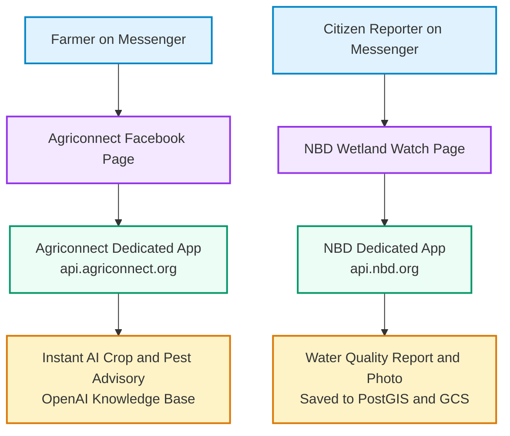
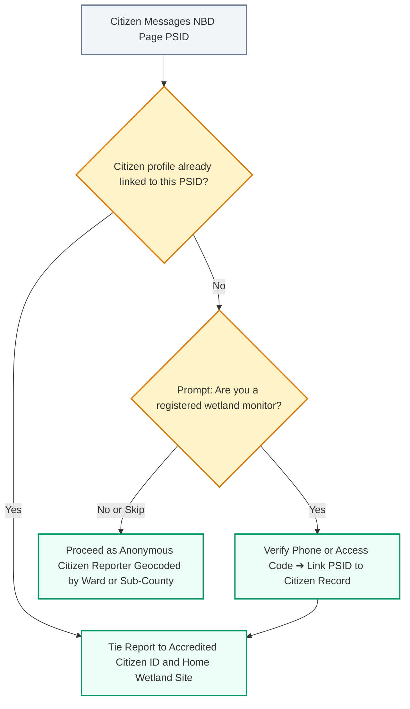
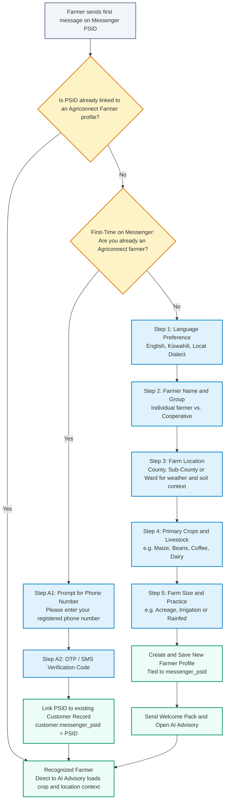

# Strategic Evaluation & Management Brief: Facebook Messenger Integration

**Prepared For**: Top-Level Management & Stakeholders (NBD & Agriconnect)  
**Prepared By**: Technical Architecture & Product Advisory Team  
**Date**: September 2026  
**Document Purpose**: Executive decision briefing on expanding citizen engagement and agricultural advisory to Facebook Messenger  

---

## 1. Executive Summary

This briefing evaluates the feasibility, business value, user adoption, financial impact, and governance considerations of introducing **Facebook Messenger** alongside our existing USSD and WhatsApp channels for:
1. **Agriconnect**: AI-driven agricultural advisory, crop pest diagnosis, and smallholder farmer support.
2. **Nile Basin Decision Support System (NBD)**: Inbound citizen environmental data collection, pollution incident reports, and visual photo evidence.

### Strategic Verdict
> [!NOTE]
> **Recommendation: PROCEED WITH PROOF OF CONCEPT (POC)**
> 
> Adding Facebook Messenger as an **additional complementary channel** provides substantial messaging cost protection (especially in light of Meta's upcoming October 1, 2026 WhatsApp pricing restructure), expands accessibility to active Facebook/Meta users without app downloads, and maintains our established multi-channel data collection strategy.

---

## 2. Key Business Questions & Strategic Findings

### Q1. What is required to set up Facebook Messenger?
- **Facebook Business Page(s)**: Branded public profiles (e.g., *Agriconnect*, *NBD Wetland Watch*).
- **Meta Business Verification**: Standard one-time organization verification using corporate registration documents.
- **Backend Webhook Integration**: Cloud API endpoint in our backend to receive events, authenticate payloads, and dispatch automated responses.

---

### Q2. Comparison to Current Twilio Setup: How does Twilio map to Meta Messenger?

In our current Twilio architecture, we operate a single Twilio Project ("Agriconnect") managing multiple phone numbers for different use cases. The table below maps this directly to Meta's architecture:

| Architectural Layer | Current Twilio Setup | Facebook Messenger Setup | Key Operational Difference |
| :--- | :--- | :--- | :--- |
| **Top-Level Organization** | Twilio Account / Project ("Agriconnect") | Meta Business Portfolio / Business Account | Verified **once** with corporate registration documents in both platforms. |
| **Channel / Ingestion Identifier** | Phone Numbers (e.g., `+254...` for Kenya, `+255...` for Tanzania) | Facebook Pages (e.g., *Agriconnect Advisory*, *NBD Wetland Watch*) | Adding new numbers in Twilio incurs monthly rental fees (\$15–\$115/mo); creating new Facebook Pages is **instant and free**. |
| **Routing & App Separation** | Single Twilio Webhook URL or per-number Webhook URL | Meta App Webhook Subscription per Page | Each domain (NBD vs Agriconnect) operates its own dedicated Meta App and backend webhook endpoint for total data isolation. |
| **User Identification** | Global MSISDN (`+254712345678`) | Page-Scoped User ID (`PSID`) | MSISDN is globally identical across chats; PSID is unique per Page, providing built-in cross-tenant privacy. |
| **Payload Transport** | `application/x-www-form-urlencoded` (`From`, `To`, `Body`, `MediaUrl0`) | `application/json` (`sender.id`, `recipient.id`, `message.text`, `attachments[]`) | JSON natively supports structured quick replies, carousels, and persistent menus. |
| **Cryptographic Authentication** | `X-Twilio-Signature` (HMAC-SHA1) | `X-Hub-Signature-256` (HMAC-SHA256) | Meta uses standard HMAC-SHA256 constant-time verification. |
| **Inbound / Outbound Platform Cost** | Billable per message/conversation | **\$0.00 (Free)** | Zero per-message fee on Messenger. |

#### Mapping Today's Single WhatsApp Number to Messenger
Today, users interact with a single WhatsApp phone number where routing logic attempts to separate agricultural advisory from wetland monitoring. On Messenger:
- **Agriconnect** operates the *Agriconnect Facebook Page* (dedicated to smallholder farmers and AI advisory).
- **NBD Platform** operates the *NBD Wetland Watch Page* (dedicated to citizen environmental monitoring and water quality alerts).
- This separation prevents conversational state confusion, isolates brand identity, and provides cleaner user journeys without needing menu disambiguation.

---

### Q3. Scaling & Multi-Tenancy: Single account vs. per-tenant Pages
- **Verification is done ONCE**: Corporate verification documents (tax ID, certificate of incorporation) are submitted **only once** for the parent organization.
- **Instant Page Creation**: Once verified, creating new Facebook Pages for new regions, projects, or basin pilots (e.g., Mara Basin, Sio-Siteko) is instantaneous **without submitting additional legal documents**.
- **Tenant Isolation**:
  - **Agriconnect**: Operates a dedicated Meta App & Webhook tailored for **AI Farmer Advisory**.
  - **NBD Platform**: Operates a dedicated Meta App & Webhook tailored for **Citizen Environmental Data Ingestion**.
  - NBD sub-pages (e.g. Mara Basin, Sio-Siteko) share the single NBD Meta App, requiring Meta App Review **only once**.

---

### Q4. User Retention: Is user identity persistent if they delete their chat?
- **Identity Stability**: A user's Page-Scoped ID (PSID) is **persistent under normal operating conditions**. It is a cryptographic mapping between the user's Facebook account and the specific Facebook Page.
- **Chat Deletion**: If a user clears their chat history or switches phone hardware, their PSID remains the same upon sending a new message.
- **Edge Cases**: The PSID is only invalidated if the user deletes their Facebook account entirely or exercises a formal Meta Data Deletion request.
- **Registered Citizen Profile Linking**: Users can link their registered Citizen profile (via phone number verification) so all subsequent Messenger reports are tied to their accredited monitor profile.

---

### Q5. Financial & Pricing Analysis (Including October 2026 Meta Pricing Changes)

> [!IMPORTANT]
> **Upcoming Industry Shift (October 1, 2026 WhatsApp Pricing Change)**:
> Meta has published rate cards (effective October 1, 2026) transitioning WhatsApp "service conversations" (free-form replies inside the 24-hour window) to a paid per-message billing model, with an allowance of 1,000 free service messages/month per WhatsApp Business Account (WABA).
> 
> - **WABA-Level Free Tier Allocation**: Meta's 1,000 free service messages allowance applies strictly **at the WABA level (per WhatsApp Business Account)**, shared across all phone numbers registered under that WABA (it does not multiply per phone number).
> - **East Africa Regional Rate**: Meta's published service message rate for Kenya, Uganda, Tanzania, and Rwanda is **\$0.0040 / msg** + Twilio transport fee **\$0.0050 / msg** = **\$0.0090 per message**.
> 
> For a volume of **10,000 monthly messages**:
> - **WhatsApp Cost**: \((10,000 - 1,000) \times \$0.0090 = \$81.00/\text{mo}\) + \$15–\$115 sender rental = **\$96 – \$196 / month**
> - **Facebook Messenger Cost**: **\$0.00 / month** (zero platform messaging fees, zero line rentals)

| Expense Category | Current Twilio WhatsApp | WhatsApp (Post-Oct 1, 2026) | Facebook Messenger | Financial Impact |
| :--- | :--- | :--- | :--- | :--- |
| **Inbound Messages** | ~\$0.005 / msg | ~\$0.005 / msg | **\$0.00 (Free)** | Zero inbound platform cost |
| **Outbound Replies (24h window)** | ~\$0.005 Twilio fee + Meta Conv. fee (\$0.03–\$0.06) | ~\$0.009 / msg (after 1,000 free/mo per WABA) | **\$0.00 (Free)** | **100% cost reduction** for conversational sessions |
| **Phone Number / Sender Rental** | \$15 – \$115 / month | \$15 – \$115 / month | **\$0.00 (Free)** | No recurring line rental charges |
| **Estimated Monthly Cost (10,000 messages)** | **~\$450 – \$750 / month** | **~\$96 – \$196 / month** | **\$0.00 / month** | **Direct savings of \$1,100 – \$7,000+ annually** |

---

## 3. High-Level Architecture & User Journeys

### NBD Citizen Profile-Linking Journey

### Agriconnect Farmer Onboarding & Account Linking Journey
For **Agriconnect**, first-time farmers are guided through a structured onboarding flow that captures critical farm metadata (location, crops, farm size) so the AI advisory engine can deliver localized agronomic insights:

---

## 4. Implementation Roadmap & Concrete Proof of Concept (POC) Results ⏱️

### Verified Proof of Concept (POC) Status: COMPLETE & PASSING
The backend engineering team has implemented, tested, and pushed the working POC to GitHub on branch [`poc/170-poc-explore-using-facebook-messenger-for-the-data-collection-workflows-that-we-run-on-whatsapp`](https://github.com/akvo/nbd-phase-1/tree/poc/170-poc-explore-using-facebook-messenger-for-the-data-collection-workflows-that-we-run-on-whatsapp) ([Verified Commit `86f577b`](https://github.com/akvo/nbd-phase-1/commit/86f577b)):
- **Cryptographic Security**: Validated `X-Hub-Signature-256` HMAC-SHA256 verification (rejects forged payloads with `403 Forbidden`).
- **Challenge Handshake**: Validated `GET /api/v1/messenger/webhook` challenge protocol with verify token.
- **Message De-Duplication**: Implemented idempotent deduplication using `ProcessedWebhookMessage` by `mid`.
- **Full Conversational State Machine**: Validated 5-step reporting flow (`CONSENT` ➔ `INCIDENT_SELECT` ➔ `MEDIA_UPLOAD` ➔ `LOCATION_SELECT` ➔ `DONE`) persisting records into PostGIS `Datapoint` and `Answer` tables with `source='MESSENGER'`.
- **Media Streaming**: Photo evidence downloaded from Meta CDN and streamed directly to Google Cloud Storage.
- **Data Deletion Compliance**: Implemented `POST /api/v1/messenger/data-deletion` callback compliant with Meta platform policies.
- **Test Automation**: **9 out of 9 automated test cases passing** (100% pass rate in 4.52s) with Flake8 lint compliance.

| Phase | Scope & Key Deliverables | Estimated Effort | Actual / Lead Time |
| :--- | :--- | :---: | :---: |
| **Phase 1: Proof of Concept (POC)** | Webhook router, HMAC guard, de-duplication, state engine, GCS photo streaming, PostGIS persistence, and full test suite. | 11.5 Hours | **8.0 Hours (Completed)** *(Vibe Coding)* |
| **Phase 2: Meta App Review & Verification** | Submit Meta Business Verification, create official Facebook Pages, submit `pages_messaging` permission with 1-min demo screencast. | 2.0 Hours | **24–72 Hours** *(Meta Review SLA; 1–2 wks if revision needed)* |
| **Phase 3: Pilot & Field Rollout** | Field verification with pilot farmer groups (Agriconnect) and Mara/Sio-Siteko basin monitors (NBD). | 4.0 Hours | **1–2 Weeks** *(Field Partner Pilot & Evaluation Period)* |

---

## 5. Strategic Risk Assessment & Governance

| Risk Area | Severity | Context & Impact | Mitigation Strategy |
| :--- | :---: | :--- | :--- |
| **24-Hour Messaging Window & Re-Engagement** | Medium | Meta strictly prohibits sending unsolicited messages outside a 24-hour window from the user's last message without pre-approved Message Tags. | Design flows to complete within one continuous session. For abandoned reports, use allowed Message Tags (e.g. `CONFIRMED_EVENT_UPDATE`) or rely on citizen re-engagement. |
| **Data Governance & Sovereignty** | Medium | Citizen environmental reports and media pass temporarily through Meta infrastructure before reaching our sovereign database and Google Cloud Storage. | Enforce end-to-end TLS encryption, sanitize all PII, implement Meta-mandated Data Deletion callbacks, and retain master spatial records strictly in sovereign PostGIS databases. |
| **Data Deletion Policy for Sovereign Datapoints** | Low | When a user requests data deletion via Meta, personal identifiers (PSID, name, phone) are scrubbed, and transient sessions are purged. | Permanent environmental data (`Datapoint`, `Answer`) collected for the public interest are retained in anonymized form with the `citizen_id` and `psid` severed (`citizen_id = NULL`). |
| **Meta Platform Approval & Review Variance** | Medium | App Review turnaround typically takes 24–72 hours, but can extend to 1–2 weeks if screencast demonstrations or privacy policies require resubmission. | Prepare a polished 1-minute demo screencast, complete terms of service, and accurate privacy policies prior to submission. NBD basin sub-pages share a single app to avoid multi-review overhead. |

---

## 6. Conclusion & Recommendation

Integrating Facebook Messenger offers a compelling commercial and operational advantage by eliminating per-message platform charges (especially critical with WhatsApp's upcoming October 1, 2026 pricing increase) while providing an interactive, rich-media channel for citizens and farmers.

**Next Action**: Review the completed Phase 1 POC results and authorize Phase 2 Meta App Review submission.

