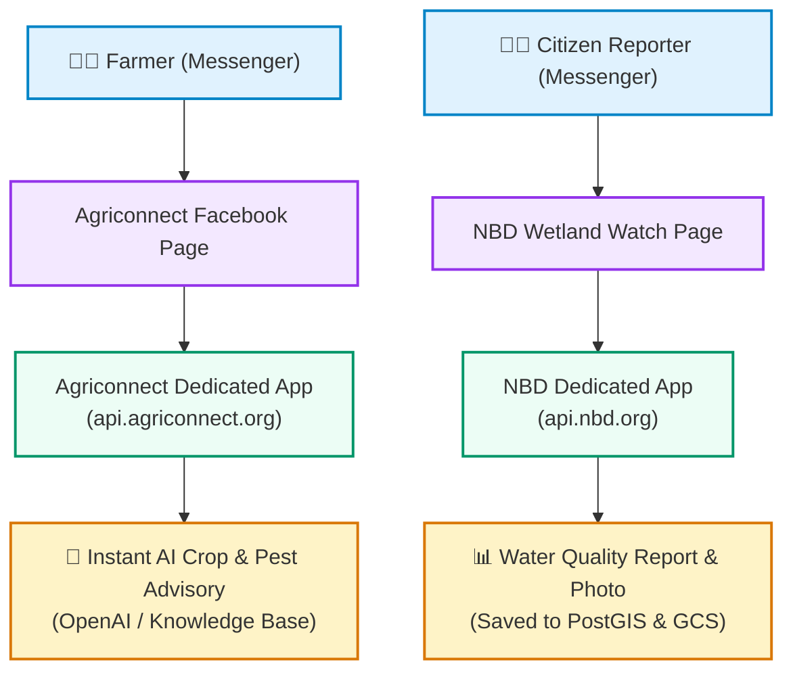

# Strategic Evaluation & Management Brief: Facebook Messenger Integration

**Prepared For**: Top-Level Management & Stakeholders (NBD & Agriconnect)  
**Prepared By**: Technical Architecture & Product Advisory Team  
**Date**: September 2026  
**Document Purpose**: Executive decision briefing on expanding citizen engagement and agricultural advisory to Facebook Messenger  

---

## 1. Executive Summary

This briefing evaluates the feasibility, business value, user adoption, financial impact, and governance considerations of introducing **Facebook Messenger** alongside our existing USSD and WhatsApp channels for:
1. **Agriconnect**: AI-driven agricultural advisory, crop pest diagnosis, and smallholder farmer support.
2. **Nile Basin Decision Support System (NBD)**: Inbound citizen environmental data collection, pollution incident reports, and visual photo evidence.

### Strategic Verdict
> [!NOTE]
> **Recommendation: PROCEED WITH PROOF OF CONCEPT (POC)**
> 
> Adding Facebook Messenger as an **additional complementary channel** provides substantial messaging cost protection (especially in light of Meta's upcoming October 1, 2026 WhatsApp pricing restructure), expands accessibility to active Facebook/Meta users without app downloads, and maintains our established multi-channel data collection strategy.

---

## 2. Key Business Questions & Strategic Findings

### Q1. What is required to set up Facebook Messenger?
- **Facebook Business Page(s)**: Branded public profiles (e.g., *Agriconnect*, *NBD Wetland Watch*).
- **Meta Business Verification**: Standard one-time organization verification using corporate registration documents.
- **Backend Webhook Integration**: Cloud API endpoint in our backend to receive events, authenticate payloads, and dispatch automated responses.

---

### Q2. How does it scale? Can one account manage multiple chatbots?
- **Multi-Bot Management**: A single verified Meta Business account can manage multiple distinct Facebook Pages and independent Meta Apps simultaneously.
- **Cross-Tenant Privacy**: Users are identified by a **Page-Scoped ID (PSID)**. A farmer interacting with the Agriconnect Page receives a different identifier than when messaging the NBD Page, ensuring full isolation of user data between tenants.
- **High Concurrency**: Meta’s platform easily handles spikes of hundreds of messages per second with enterprise-grade SLA.

---

### Q3. Multi-Tenancy & Governance: Does each tenant/page need separate document verification?
- **Verification is done ONCE**: Corporate verification documents (tax ID, certificate of incorporation) are submitted **only once** for the parent organization.
- **Instant Page Creation**: Once verified, creating new Facebook Pages for new regions, projects, or basin pilots is instantaneous **without submitting additional legal documents**.
- **Tenant Isolation**:
  - **Agriconnect**: Operates a dedicated Meta App & Webhook tailored for **AI Farmer Advisory**.
  - **NBD Platform**: Operates a dedicated Meta App & Webhook tailored for **Citizen Environmental Data Ingestion**.

---

### Q4. User Retention: Is user identity persistent if they delete their chat?
- **Identity Stability**: A user's Page-Scoped ID (PSID) is **persistent under normal operating conditions**. It is a cryptographic mapping between the user's Facebook account and the specific Facebook Page.
- **Chat Deletion**: If a user clears their chat history or switches phone hardware, their PSID remains the same upon sending a new message.
- **Edge Cases**: The PSID is only invalidated if the user deletes their Facebook account entirely or exercises a formal Meta Data Deletion request.

---

### Q5. Financial & Pricing Analysis (Including October 2026 Meta Pricing Changes)

> [!IMPORTANT]
> **Upcoming Industry Shift (October 1, 2026 WhatsApp Pricing Change)**:
> Meta has announced that starting October 1, 2026, WhatsApp "service conversations" (free-form replies inside the 24-hour customer service window) transition to a paid per-message billing model, eliminating the previously free 1,000 monthly service conversation allowance. This significantly increases ongoing WhatsApp operational costs, making Facebook Messenger's **$0 per-message policy** even more commercially attractive.

| Expense Category | Current Twilio WhatsApp | WhatsApp (Post-Oct 1, 2026) | Facebook Messenger | Financial Impact |
| :--- | :--- | :--- | :--- | :--- |
| **Inbound Messages** | ~$0.005 / msg | ~$0.005 / msg | **$0.00 (Free)** | Zero inbound platform cost |
| **Outbound Replies (24h window)** | ~$0.005 Twilio fee + Meta Conv. fee ($0.03–$0.06) | Per-message billing across all service messages | **$0.00 (Free)** | **100% cost reduction** for conversational sessions |
| **Phone Number / Sender Rental** | $15 – $115 / month | $15 – $115 / month | **$0.00 (Free)** | No recurring line rental charges |
| **Estimated Monthly Cost (10,000 sessions)** | **~$450 – $750 / month** | **~$650 – $950 / month** | **$0.00 / month** | **Direct savings of $5,000 – $11,000+ annually** |

---

## 3. High-Level Architecture & User Journeys

---

## 4. Implementation Roadmap & Vibe Coding Effort ⏱️

The engineering work follows our fast-paced **Vibe Coding** standard, structured into rapid implementation, test automation, and external platform certification:

| Phase | Scope & Key Deliverables | Vibe Coding Engineering Effort | External Platform Timeline |
| :--- | :--- | :---: | :---: |
| **Phase 1: Proof of Concept (POC)** | Build webhook router, HMAC-SHA256 guard, message de-duplication, GCS photo streaming, and full automated pytest suite. | **11.5 Hours (~1.5 Developer Days)** | Immediate (Runs in Local / Docker Staging) |
| **Phase 2: Meta App Review & Verification** | Submit Meta Business Verification, create official Facebook Pages, and submit `pages_messaging` permission with 1-min demo screencast. | **2.0 Hours** | **24–72 Hours** (Meta Review Turnaround) |
| **Phase 3: Pilot & Field Rollout** | Field verification with pilot farmer groups (Agriconnect) and Mara/Sio-Siteko basin monitors (NBD). | **4.0 Hours** | **1–2 Weeks** (Field Pilot Duration) |

---

## 5. Strategic Risk Assessment & Governance

| Risk Area | Severity | Context & Impact | Mitigation Strategy |
| :--- | :---: | :--- | :--- |
| **24-Hour Messaging Window & Re-Engagement** | Medium | Meta strictly prohibits sending unsolicited messages outside a 24-hour window from the user's last message without pre-approved Message Tags. | Design flows to complete within one continuous session. For abandoned reports, use allowed Message Tags (e.g. `CONFIRMED_EVENT_UPDATE`) or rely on citizen re-engagement. |
| **Data Governance & Sovereignty** | Medium | Citizen environmental reports and media pass temporarily through Meta infrastructure before reaching our sovereign database and Google Cloud Storage. | Enforce end-to-end TLS encryption, sanitize all PII, implement Meta-mandated Data Deletion callbacks, and retain master spatial records strictly in sovereign PostGIS databases. |
| **Meta Platform Approval** | Low | App Review could face delays if permissions are misconfigured. | Prepare a dedicated 1-minute demo screencast, clear terms of service, and accurate privacy policies prior to submission. |

---

## 6. Conclusion & Recommendation

Integrating Facebook Messenger offers a compelling commercial and operational advantage by eliminating per-message platform charges (especially critical with WhatsApp's upcoming October 1, 2026 pricing increase) while providing an interactive, rich-media channel for citizens and farmers.

**Next Action**: Authorize execution of the technical Proof of Concept (POC) in Phase 1 (11.5 hours) to validate end-to-end webhook processing, image streaming, and test automation.
