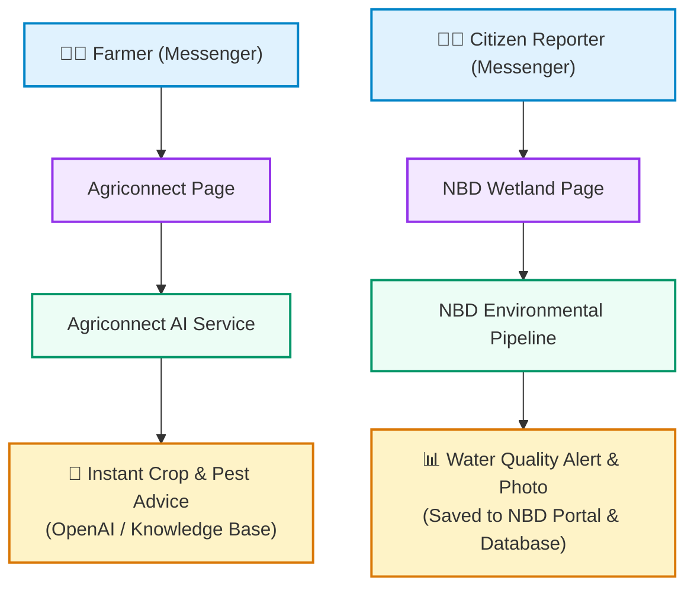

# Strategic Evaluation & Management Brief: Facebook Messenger Integration

**Prepared For**: Top-Level Management & Stakeholders (NBD & Agriconnect)  
**Prepared By**: Technical Architecture & Product Advisory Team  
**Date**: September 2026  
**Document Purpose**: Executive decision briefing on expanding citizen engagement and agricultural advisory to Facebook Messenger  

---

## 1. Executive Summary

This briefing evaluates the feasibility, business value, scalability, and financial impact of integrating **Facebook Messenger** as a core communication and data channel for:
1. **Agriconnect**: Delivering AI-powered agricultural advisory, crop pest diagnosis, and support to smallholder farmers.
2. **Nile Basin Decision Support System (NBD)**: Collecting citizen environmental reports, water pollution incidents, and photo evidence.

### Strategic Verdict
> [!NOTE]
> **Recommendation: PROCEED WITH POC**
> 
> Adding Facebook Messenger provides **significant operational cost savings ($0 message fees)**, reaches millions of Facebook users without requiring app downloads, and operates seamlessly alongside our existing WhatsApp channels.

---

## 2. Key Business Questions & Strategic Answers

### Q1. What is required to set up Facebook Messenger?
- **Facebook Business Page(s)**: Branded public presence (e.g. *Agriconnect Kenya*, *NBD Wetland Watch*).
- **Meta Business Verification**: Standard one-time organization verification using company registration documents.
- **Backend Webhook Integration**: A secure cloud endpoint to receive messages, process user requests, and dispatch automated replies.

---

### Q2. How does it scale? Can one account manage multiple chatbots?
- **Multi-Bot Support**: **Yes.** A single verified Meta Business account can manage multiple Facebook Pages and distinct chatbot applications simultaneously.
- **High Concurrency**: Meta’s infrastructure natively handles high message spikes (hundreds of messages per second) with enterprise-grade reliability.
- **Cross-Tenant Privacy**: Users receive a unique, secure identifier (*Page-Scoped ID*) per Facebook Page, ensuring complete data separation between different projects and countries.

---

### Q3. Multi-Tenancy & Governance: Does each tenant/page need separate document verification?
- **Verification is done ONCE**: Corporate verification documents (business registration, tax ID) are submitted **only once** for the parent organization.
- **Instant Page Creation**: Once verified, creating new Facebook Pages for new regions, projects, or partner initiatives is instantaneous **without submitting additional paperwork**.
- **Independent Operations**:
  - **Agriconnect** operates its own dedicated chatbot focused on **AI Farmer Advisory**.
  - **NBD** operates its own dedicated chatbot focused on **Environmental Data Collection**.

---

### Q4. User Retention & Re-Engagement: What happens if a user deletes their chat?
- **Permanent User Memory**: The user's system identifier never changes—even if they delete their chat history, clear their app cache, or switch smartphones.
- **Seamless Experience**: Returning farmers and citizen reporters are recognized immediately by name and context without having to repeat the onboarding questions.

---

### Q5. Cost & Pricing Analysis: WhatsApp (Twilio) vs. Facebook Messenger

| Expense Category | Current Twilio WhatsApp | Facebook Messenger | Management Takeaway |
| :--- | :--- | :--- | :--- |
| **Inbound Message Cost** | ~$0.005 / message | **$0.00 (Free)** | Eliminates inbound messaging costs |
| **Outbound Replies (24h window)** | ~$0.005 + Meta Conv. Fee (~$0.03–$0.06) | **$0.00 (Free)** | **100% cost reduction** for automated user interactions |
| **Phone Number / Sender Rental** | $15 – $115 / month | **$0.00 (Free)** | No recurring line rental charges |
| **User Barrier to Entry** | Requires active SIM & WhatsApp | Runs in Messenger & Facebook Lite | Zero install friction for Facebook users |

> [!TIP]
> **Financial Impact**: For an active base of 20,000 monthly user sessions, Facebook Messenger reduces messaging platform fees from **~\$800–\$1,200/month on WhatsApp to \$0/month on Messenger**.

---

## 3. High-Level System Architecture & User Journey

### Two Specialized Workflows
1. **Agriconnect (AI Farming Advisor)**:
   - Farmer sends a crop question or pest photo.
   - AI assistant identifies the crop problem, provides localized treatment recommendations in English or Swahili, and logs the interaction for field extension officers.
2. **NBD (Citizen Environmental Reporting)**:
   - Citizen sends an alert about water pollution or dumping.
   - Bot guides the citizen through a simple 3-step menu: Incident Type ➔ Photo Evidence ➔ Sub-county Selection.
   - Data and photo evidence stream directly into the official NBD Wetland Monitoring Portal.

---

## 4. Implementation Roadmap & Milestones

| Phase | Target Milestone | Key Deliverables | Timeline |
| :--- | :--- | :--- | :---: |
| **Phase 1: Proof of Concept (POC)** | Prototype Validation | Build backend webhook handlers, mock end-to-end conversation flow, verify photo uploads to cloud storage. | **1 Week** |
| **Phase 2: Meta App Review & Setup** | Platform Compliance | Submit Meta Business Verification, create official Facebook Pages, submit App Review permissions (`pages_messaging`). | **1–2 Weeks** |
| **Phase 3: Pilot Rollout** | Field Testing | Launch with pilot farming communities in Kenya (Agriconnect) and Mara/Sio-Siteko basin monitors (NBD). | **2 Weeks** |
| **Phase 4: Full Production Launch** | Public Scale | Full public launch across all target transboundary basins and farming cooperatives. | **Ongoing** |

---

## 5. Risk Assessment & Governance

| Risk | Severity | Mitigation Strategy |
| :--- | :---: | :--- |
| **Meta App Review Rejection** | Low | Follow standard Meta conversational guidelines, provide clear privacy policy URLs, and submit concise 1-minute demo screencasts. |
| **User Privacy & Data Consent** | Medium | Maintain an explicit step-zero consent notice before collecting any personal data or spatial reports. |
| **Internet / Connectivity in Rural Areas** | Medium | Messenger Lite and free Facebook basics access ensure accessibility even in low-bandwidth rural settings; existing USSD channel remains active for feature phones. |

---

## 6. Conclusion & Recommended Next Step

Expanding to Facebook Messenger is technically straightforward, commercially beneficial, and directly enhances the reach of both NBD and Agriconnect.

**Recommended Action**: Approve execution of the Proof of Concept (POC) in Phase 1 to validate end-to-end automated testing and cloud storage streaming.
