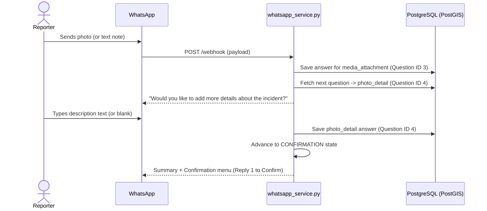

# 001 — Photo Description Field Spec

**Author**: Galih Pratama
**Date**: 2026-07-31
**Form Scope**: Pollution Monitoring Form — Citizen Reporter (Pipeline A)
**Estimate**: ≤ 4 hours

---

## Overview

After a citizen reporter submits a photo during a WhatsApp pollution incident report (or sends a message in the media step), the system moves seamlessly to an optional free-text question — `photo_detail` (or `photo_description`) — asking the reporter: _"Would you like to add more details about the incident?"_.

**Simplified & Standard ARF Design**:

- To remain **100% compliant with the Akvo React Form (ARF) specification** (which supports skip dependencies primarily for `option` and `number` types), we remove the custom `*skip*` keyword logic from the media step.
- The photo question (`media_attachment`) and photo detail question (`photo_detail`) follow a clean, standard linear sequence: `order: 3` (`media_attachment`) ➔ `order: 4` (`photo_detail`).
- No complex custom dependency operators (`!= SKIPPED`) or special prompt overrides are needed, keeping both the form schema and the WhatsApp routing engine clean, maintainable, and bug-free.

---

## User Acceptance Criteria (UAC)

- [ ] **UAC-1**: When prompted for photo evidence on WhatsApp, the message prompt is clean and straightforward without any `*skip*` instruction text.
- [ ] **UAC-2**: Immediately after the photo question, the bot asks: _"Would you like to add more details about the incident?"_
- [ ] **UAC-3**: The reporter can type free text explaining the incident/photo, which is saved with their submission report under `photo_detail`.
- [ ] **UAC-4**: If the reporter leaves the description blank, types whitespace, or replies `none`/`skip`, the system completes the report cleanly without error.
- [ ] **UAC-5**: The entire flow operates through standard dynamic form engine iteration without hardcoded custom state rules.

---

## Technical Acceptance Criteria (TAC)

- [ ] **TAC-1**: Form JSON blueprint version in `form_pipeline_a_citizen_reporter_v2.json` is bumped to `v7` to trigger automatic re-seeding upon system startup.
- [ ] **TAC-2**: Question `photo_detail` (`type: text`, `required: false`, `order: 4`, `dependency: null`) is inserted directly after `media_attachment` (`order: 3`).
- [ ] **TAC-3**: Standard `whatsapp_service.py` dynamic engine handles prompt iteration and saves text under the `photo_detail` question ID.
- [ ] **TAC-4**: No Alembic database migration is created (`answers` JSONB column on `WhatsAppSession` dynamically accommodates the new question ID).
- [ ] **TAC-5**: Swahili and Samia translations for `photo_detail` are registered in `translation.py`.
- [ ] **TAC-6**: All backend automated tests in `./dc.sh exec backend tests` pass cleanly.

---

## 5W1H Analysis

| Dimension | Detail |
| --------- | ------ |
| **Who**   | Citizen reporters submitting incident reports via WhatsApp |
| **What**  | Optional `photo_detail` text question (`order: 4`) following media upload (`order: 3`) |
| **Where** | `backend/app/seeds/forms/form_pipeline_a_citizen_reporter_v2.json` · `backend/app/services/whatsapp_service.py` · `backend/app/services/translation.py` |
| **When**  | Immediately following media upload step during WhatsApp reporting |
| **Why**   | Contextualizes incident reports while keeping form schema 100% compliant with standard ARF specifications |
| **How**   | Standard dynamic form engine advances through question order; text input stored in `Answer` model |

---

## Architecture Overview



---

## 1. Backend Implementation

### 1.1 Form Blueprint Seed (Standard ARF Format)

**File**: `backend/app/seeds/forms/form_pipeline_a_citizen_reporter_v2.json`

**Change A — Version Bump**:

```json
"version": 7
```

**Change B — Add `photo_detail` Question**:

```json
{
  "fn": null,
  "id": 4,
  "api": null,
  "pre": {},
  "meta": false,
  "name": "photo_detail",
  "rule": null,
  "type": "text",
  "extra": null,
  "label": "Would you like to add more details about the incident?",
  "order": 4,
  "option": null,
  "tooltip": null,
  "required": false,
  "allowOther": false,
  "dependency": null,
  "shortLabel": "Photo Details",
  "displayOnly": false,
  "hiddenString": false,
  "requiredSign": null,
  "translations": [
    {
      "name": "Would you like to add more details about the incident?",
      "language": "en"
    },
    {
      "name": "Je, ungependa kuongeza maelezo zaidi kuhusu tukio?",
      "language": "sw"
    }
  ],
  "allowOtherText": null,
  "dependencyRule": null,
  "requiredDoubleEntry": false
}
```

### 1.2 WhatsApp Service Simplification

**File**: `backend/app/services/whatsapp_service.py`

- Remove special `*skip*` prompt suffix injections from `_prompt_question`.
- Allow media step to handle photo uploads or text notes cleanly before proceeding to `photo_detail`.

### 1.3 Translation Registration

**File**: `backend/app/services/translation.py`

```python
"Would you like to add more details about the incident?": "Je, ungependa kuongeza maelezo zaidi kuhusu tukio?",
"Photo Details": "Maelezo ya Picha",
```

---

## 2. Verification & Testing

### 2.1 Automated Test Suite

Run backend pytest suite inside Docker container:

```bash
./dc.sh exec backend tests
# Specific test execution
./dc.sh exec backend python -m pytest tests/test_whatsapp.py -v
```

### 2.2 Manual QA Steps

1. Initiate WhatsApp reporting flow (`Hi` / `Ripoti`).
2. Verify photo prompt text is clean and does **NOT** contain `(or reply *skip* to continue)`.
3. Upload photo (or send text) -> Verify next prompt **IS** _"Would you like to add more details about the incident?"_.
4. Type description text -> Verify summary preview includes description -> Confirm report.
5. Verify database record created with `photo_detail` answer.

---

## 3. Epic & Ballpark Estimation

- **Author**: Galih Pratama
- **Confidence Level**: High
- **Dependencies**: None

| Task ID   | Component & Description                                                                | Est. Hours | Priority  |
| :-------- | :------------------------------------------------------------------------------------- | :--------: | :-------- |
| **T-001** | **Form Seed**: Version bump (v7) & `photo_detail` JSON question insertion (`order: 4`) |   0.25 h   | Must Have |
| **T-002** | **Service Simplification**: Clean up `_prompt_question` media prompt text              |   0.25 h   | Must Have |
| **T-003** | **i18n**: Register Swahili & Samia translations in `translation.py`                    |   0.25 h   | Must Have |
| **T-004** | **Automated Tests**: Update test cases in `test_whatsapp.py` & run pytest              |   0.75 h   | Must Have |
| **T-005** | **Manual QA & Verification**: End-to-end WhatsApp flow validation                      |   0.50 h   | Must Have |
| **TOTAL** | **Full Implementation Cycle**                                                          | **2.00 h** |           |
