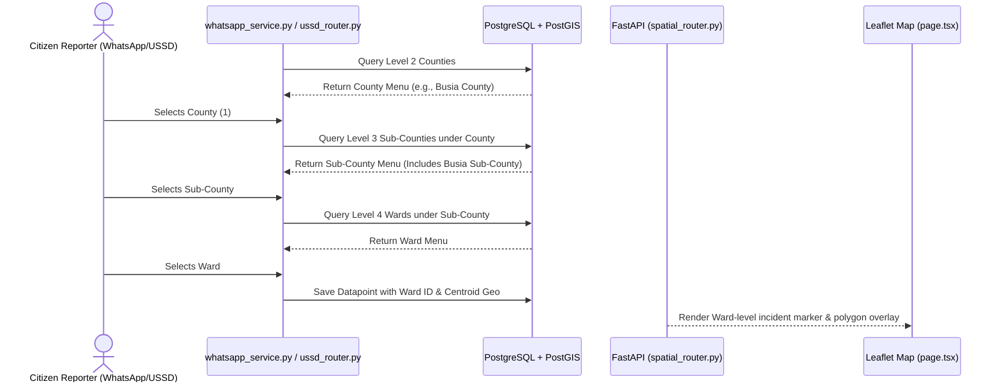

# 002 — Ward Level & Busia Sub-County Spatial Boundaries Integration Spec

**Author**: Galih Pratama
**Date**: 2026-07-31
**Scope**: Platform Spatial Infrastructure (PostGIS, Reference APIs, CSV Seeder, USSD Pager, WhatsApp Router, Leaflet Maps)
**Estimate**: ≤ 8 hours (Platform Implementation with Pre-Supplied CSV & GeoJSON)

---

## Overview

This feature expands the platform's administrative spatial hierarchy by introducing the **Ward level (`BoundaryLevel.WARD = 4`)** and integrating updated CSV mapping files and GeoJSON boundary files provided by the GIS team. The pre-supplied datasets contain Ward-level records (with CSV columns `County`, `Sub-County`, `Ward`) and explicitly include **"Busia" as a Sub-County** under Busia County.

Since the team pre-supplies the raw CSV and GeoJSON files, no external shapefile sourcing or GIS data cleaning is needed. This specification details the end-to-end platform integration across both reporting channels (**USSD** and **WhatsApp**): database model extension, Alembic migration, CSV & PostGIS seeding via `spatial_seeder_helper.py`, dynamic cascading reference APIs, USSD/WhatsApp 3-step location menu paging, and frontend Leaflet map rendering.

---

## User Acceptance Criteria (UAC)

- [ ] **UAC-1**: Users can filter environmental monitoring data down to the **Ward level** in the public portal map location dropdowns.
- [ ] **UAC-2**: **Busia** appears as a selectable Sub-County under Busia County in location selection cascades across Web, USSD, and WhatsApp channels.
- [ ] **UAC-3**: Selecting a Sub-County dynamically populates its child Wards in location filter dropdowns, USSD menus, and WhatsApp interactive messages.
- [ ] **UAC-4**: The Leaflet interactive map renders Ward boundary polygons when zoomed or selected in the spatial filter panel.
- [ ] **UAC-5**: Citizen reports submitted at the Ward level on USSD/WhatsApp accurately link to the parent Sub-County, County, and Basin in PostgreSQL/PostGIS.

---

## Technical Acceptance Criteria (TAC)

- [ ] **TAC-1**: `BoundaryLevel` enum in `backend/app/models/spatial.py` is updated to include `WARD = 4`.
- [ ] **TAC-2**: An Alembic database migration is created to support Level 4 spatial boundary hierarchy and indexing.
- [ ] **TAC-3**: CSV spatial seeder in `spatial_seeder_helper.py` is updated to parse new Ward-level CSV files (`Sio-wards.csv` / `Mara-wards.csv`) containing `County`, `Sub-County`, `Ward` headers, populating `spatial_boundaries` with 4-level parent-child pointers (`Ward` -> `Sub-County` -> `County` -> `Region/Basin`).
- [ ] **TAC-4**: Pre-processed static GeoJSON assets are placed in `frontend/public/spatial/` for client-side Leaflet vector rendering.
- [ ] **TAC-5**: API endpoint `GET /api/v1/reference/sub-counties/{parent_id}` correctly returns child Wards when passed a Sub-County UUID, and explicit alias endpoint `GET /api/v1/reference/wards/{sub_county_id}` is exposed.
- [ ] **TAC-6**: Both **USSD location pager** in `ussd_router.py` and **WhatsApp location cascade handler** in `whatsapp_service.py` support 3-step location paging (County -> Sub-County -> Ward).
- [ ] **TAC-7**: All automated backend tests in `./dc.sh exec backend tests` pass cleanly.

---

## 5W1H Analysis

| Dimension | Detail                                                                                                                                                                                                                                                                    |
| --------- | ------------------------------------------------------------------------------------------------------------------------------------------------------------------------------------------------------------------------------------------------------------------------- |
| **Who**   | Public Portal Visitors, Citizen Reporters (USSD/WhatsApp), and Admin Reviewers                                                                                                                                                                                            |
| **What**  | Ward-level spatial hierarchy (`BoundaryLevel.WARD = 4`), CSV seeder update, WhatsApp/USSD 3-step location cascade, and Busia Sub-County platform integration                                                                                                              |
| **Where** | `backend/app/models/spatial.py` · `backend/app/seeds/spatial/` · `backend/app/seeds/spatial_seeder_helper.py` · `backend/app/routers/spatial_router.py` · `backend/app/routers/ussd_router.py` · `backend/app/services/whatsapp_service.py` · `frontend/src/app/page.tsx` |
| **When**  | Upon database re-seeding with team-provided CSV and GeoJSON spatial datasets                                                                                                                                                                                              |
| **Why**   | Enables fine-grained spatial analysis at the local Ward community level and ensures administrative boundary accuracy across all data collection channels                                                                                                                  |
| **How**   | `spatial_seeder_helper.py` reads CSV `County,Sub-County,Ward` rows -> populates PostGIS `spatial_boundaries` table; reference APIs & USSD/WhatsApp handlers cascade children dynamically to Leaflet map & chat prompts                                                    |

---

## Architecture Overview



---

## 1. Backend Implementation

### 1.1 Database Model & Enum Update

**File**: `backend/app/models/spatial.py`

```python
class BoundaryLevel(int, enum.Enum):
    REGION = 1      # Province / Region
    DISTRICT = 2    # District / County
    SUB_COUNTY = 3  # Sub-county / Parish
    WARD = 4        # Ward / Local Community
```

### 1.2 Database Migration

**File**: `backend/alembic/versions/YYYY_MM_DD_HHMM-add_ward_level_spatial_boundaries.py`

- Add migration script creating index for level 4 queries.
- Ensure `parent_id` foreign key cascade rules support 4-tier hierarchy.

### 1.3 CSV & Spatial Seeder Update (`spatial_seeder_helper.py`)

**Files**:

- `backend/app/seeds/spatial/Sio-wards.csv` / `Mara-wards.csv`
- `backend/app/seeds/spatial_seeder_helper.py`

**CSV Format**:

```csv
id,County,Sub-County,Ward
,Busia,Busia,Township
,Busia,Matayos,Bukhayo West
```

**Seeder Logic Update**:

1. Parse CSV rows containing `County`, `Sub-County`, `Ward`.
2. Look up or create **County (Level 2)** under Region.
3. Look up or create **Sub-County (Level 3)** under County (including Busia as Sub-County).
4. Look up or create **Ward (Level 4)** under Sub-County (`parent_id = sub_county_obj.id`, `level = 4`).
5. Update centroid geometries (`ST_Centroid`) from team-provided GeoJSON polygons.

### 1.4 Reference Router Endpoints

**File**: `backend/app/routers/spatial_router.py`

1. Ensure `GET /api/v1/reference/sub-counties/{parent_id}` returns child Wards when `parent_id` is a Sub-County UUID.
2. Add explicit alias route:
   ```python
   @router.get("/reference/wards/{sub_county_id}", response_model=list[schemas.SpatialBoundary])
   def list_wards(sub_county_id: str, db: Session = Depends(get_db)):
       ...
   ```

### 1.5 USSD & WhatsApp Location Cascade Update

**Files**:

- `backend/app/routers/ussd_router.py`
- `backend/app/services/whatsapp_service.py`

1. **WhatsApp Location Handler (`whatsapp_service.py`)**:
   - Extend `curr_q.type == "cascade"` logic (lines 645–700) to support 3-step menu prompt (County ➔ Sub-County ➔ Ward).
   - In `_save_report`, traverse parent pointers from Ward (`level == 4`) to extract centroid point and basin ID for `Datapoint.geo` and `Datapoint.basin_id`.
2. **USSD Location Pager (`ussd_router.py`)**:
   - Extend USSD location selection state machine to include Ward selection step prior to incident confirmation.

---

## 2. Frontend Implementation

### 2.1 Location Filter Cascade & Leaflet Map Integration

**File**: `frontend/src/app/page.tsx`

1. **Filter Dropdowns**: Add `Ward` select element to the Location Filter panel (populates dynamically when a Sub-County is chosen).
2. **Leaflet GeoJSON Overlay**: Load and display Ward vector polygons from `frontend/public/spatial/` on map zoom/selection.

---

## 3. Verification & Testing

### 3.1 Automated Test Suite

Run backend pytest suite inside Docker container:

```bash
./dc.sh exec backend tests
# Specific test execution
./dc.sh exec backend python -m pytest tests/test_spatial_boundaries.py tests/test_whatsapp.py -v
```

### 3.2 Manual QA Steps

1. Run spatial seeder: `./dc.sh exec backend python -m app.seeds.spatial_seeder_helper`.
2. Open Swagger API docs (`http://localhost:8000/api/docs`).
3. Query `GET /api/v1/reference/sub-counties/{busia_county_id}` -> Verify **Busia** is listed as a Sub-County.
4. Query `GET /api/v1/reference/wards/{busia_subcounty_id}` -> Verify child Wards are returned.
5. Test WhatsApp reporting flow -> Select Busia County -> Select Busia Sub-County -> Select Ward -> Verify report saved with Ward location ID.
6. Open Public Portal (`http://localhost:3000`) -> Select Busia County -> Select Busia Sub-County -> Select Ward -> Verify Leaflet map zooms to Ward polygon.

---

## 4. Epic & Ballpark Estimation (≤ 8 Hours with Pre-Supplied CSV & GeoJSON)

- **Author**: Galih Pratama
- **Confidence Level**: High
- **Dependencies**: Team-provided CSV (`County,Sub-County,Ward`) & GeoJSON files placed in `backend/app/seeds/spatial/`

| Task ID   | Component & Description                                                                        | Est. Hours | Priority  |
| :-------- | :--------------------------------------------------------------------------------------------- | :--------: | :-------- |
| **T-001** | **Setup & Model**: Add `WARD = 4` to `BoundaryLevel` in `spatial.py` & setup CSV/GeoJSON paths |   0.75 h   | Must Have |
| **T-002** | **DB & CSV Seeder**: Alembic migration & update `spatial_seeder_helper.py` for Ward CSV format |   1.50 h   | Must Have |
| **T-003** | **API & USSD/WhatsApp**: Reference endpoints, USSD 4-tier pager, and WhatsApp 3-step cascade   |   1.50 h   | Must Have |
| **T-004** | **Frontend Map & UI**: Update location filter dropdown cascade & Leaflet Ward vector layers    |   2.50 h   | Must Have |
| **T-005** | **Testing & QA**: Add pytest unit tests in `test_spatial_boundaries.py` & `test_whatsapp.py`   |   1.25 h   | Must Have |
| **TOTAL** | **Full Platform Implementation Cycle**                                                         | **7.50 h** |           |
