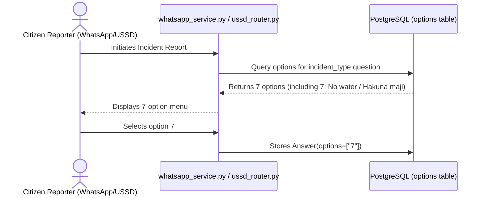

# 003 — "No Water" Option Addition to Citizen Report Form Spec

**Author**: Galih Pratama
**Date**: 2026-07-31
**Form Scope**: Pollution Monitoring Form — Citizen Reporter (Pipeline A)
**Estimate**: ≤ 2 hours

---

## Overview

Citizen reporters encountering dried-up streams or completely drained wetland areas currently do not have a dedicated option when reporting water level changes on USSD, WhatsApp, or Web forms (the options are currently limited to _"High water level"_ and _"Low water level"_).

This feature adds a 7th option — **"No water"** (Swahili: _"Hakuna maji"_) — to the `incident_type` question in the Citizen Reporter form blueprint seed (`form_pipeline_a_citizen_reporter_v2.json`).

---

## User Acceptance Criteria (UAC)

- [ ] **UAC-1**: When choosing an incident category on USSD or WhatsApp, **"7: No water"** (or Swahili _"7: Hakuna maji"_) appears as an option in the menu list.
- [ ] **UAC-2**: Selecting option `7` ("No water") successfully records `options: ["7"]` on the submission answer.
- [ ] **UAC-3**: The Admin Portal and public submission view display `"No water"` as the human-readable incident type name.
- [ ] **UAC-4**: In Swahili language mode, the prompt menu renders `"7: Hakuna maji"`.

---

## Technical Acceptance Criteria (TAC)

- [ ] **TAC-1**: Form JSON blueprint version in `form_pipeline_a_citizen_reporter_v2.json` is bumped to `v7` (or incremented version) to trigger automatic seeder updates.
- [ ] **TAC-2**: Option 7 (`id: 57`, `name: "No water"`, `value: "7"`, `order: 7`) is added to the `incident_type` question option array in `form_pipeline_a_citizen_reporter_v2.json`.
- [ ] **TAC-3**: `"No water": "Hakuna maji"` translation mapping is registered in `backend/app/services/translation.py`.
- [ ] **TAC-4**: No Alembic database migration is created (`options` table and `answers.options` JSONB column dynamically handle new option IDs and slugs).
- [ ] **TAC-5**: Backend unit tests in `test_seeder.py`, `test_ussd.py`, and `test_whatsapp.py` are updated and pass cleanly via `./dc.sh exec backend tests`.

---

## 5W1H Analysis

| Dimension | Detail                                                                                                                                    |
| --------- | ----------------------------------------------------------------------------------------------------------------------------------------- |
| **Who**   | Citizen reporters submitting incident reports via WhatsApp, USSD, or Web                                                                  |
| **What**  | Addition of `"No water"` option to `incident_type` question options                                                                       |
| **Where** | `backend/app/seeds/forms/form_pipeline_a_citizen_reporter_v2.json` · `backend/app/services/translation.py` · `backend/tests/test_ussd.py` |
| **When**  | Upon database re-seeding with updated form blueprint                                                                                      |
| **Why**   | Captures drought and stream desiccation events reported by local community reporters                                                      |
| **How**   | `form_seeder_helper.py` ingests option 7 -> USSD/WhatsApp menu renderers present option 7 dynamically                                     |

---

## Architecture Overview



---

## 1. Backend Implementation

### 1.1 Form Blueprint Seed Update

**File**: `backend/app/seeds/forms/form_pipeline_a_citizen_reporter_v2.json`

**Change A — Version Bump**:

```json
"version": 7
```

**Change B — Add Option 7 to `incident_type`**:

```json
{
  "id": 57,
  "name": "No water",
  "color": null,
  "label": "No water",
  "order": 7,
  "other": false,
  "value": "7",
  "translations": [
    { "name": "No water", "language": "en" },
    { "name": "Hakuna maji", "language": "sw" }
  ]
}
```

### 1.2 Translation Service Registration

**File**: `backend/app/services/translation.py`

```python
"No water": "Hakuna maji",
```

---

## 2. Verification & Testing

### 2.1 Automated Test Suite

Run backend pytest suite inside Docker container:

```bash
./dc.sh exec backend tests
# Specific test execution
./dc.sh exec backend python -m pytest tests/test_seeder.py tests/test_ussd.py tests/test_whatsapp.py -v
```

### 2.2 Manual QA Steps

1. Run form seeder: `./dc.sh exec backend python -m app.seeds.form_seeder_helper`.
2. Initiate USSD report flow -> Select Language -> Verify option `"7: No water"` appears in menu.
3. Initiate WhatsApp report flow -> Verify option `"7: No water"` appears in menu.
4. Select option `7` -> Complete report -> Verify `incident_type_name` resolves to `"No water"` in Swagger API `GET /api/v1/submissions`.

---

## 3. Epic & Ballpark Estimation

- **Author**: Galih Pratama
- **Confidence Level**: High
- **Dependencies**: None

| Task ID   | Component & Description                                                                  | Est. Hours | Priority  |
| :-------- | :--------------------------------------------------------------------------------------- | :--------: | :-------- |
| **T-001** | **Form Seed**: Bump version to 7 & insert option 7 (`"No water"`) into blueprint JSON    |   0.25 h   | Must Have |
| **T-002** | **i18n**: Register Swahili translation `"No water": "Hakuna maji"` in `translation.py`   |   0.25 h   | Must Have |
| **T-003** | **Automated Tests**: Update option count assertions in `test_seeder.py` & `test_ussd.py` |   0.50 h   | Must Have |
| **T-004** | **Manual QA & Verification**: Validate USSD/WhatsApp menu selection                      |   0.50 h   | Must Have |
| **TOTAL** | **Full Implementation Cycle**                                                            | **1.50 h** |           |
