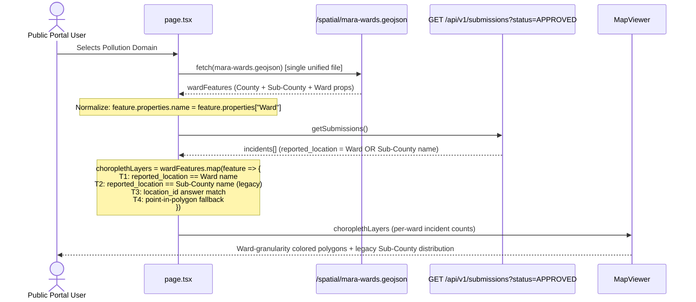

# 004 — Unified Ward Choropleth & Backward-Compatible Spatial Matching

**Author**: Galih Pratama
**Date**: 2026-08-06
**Issue**: #157 (follow-up)
**Scope**: Frontend Map Choropleth & Spatial Geometry Unification
**Estimate**: ≤ 4 hours

---

## Overview

After integrating Ward-level boundaries (Feature #002), the frontend now loads **two** separate GeoJSON files for the Pollution choropleth:

1. `mara-subcounties.geojson` / `sio-subcounties.geojson` → used for choropleth coloring
2. `mara-wards.geojson` / `sio-wards.geojson` → used for vector overlay

Since every Ward feature in `*-wards.geojson` already embeds its parent `"Sub-County"` as a property, **the sub-county GeoJSON files are redundant**. This feature unifies both into a single Ward GeoJSON dataset used for choropleth, filtering, and vector overlay.

### How backward compatibility is maintained

Existing incidents (collected before Wards existed) have `reported_location = "Bomet Central"` (a Sub-County name). New incidents have `reported_location = "Silibwet Township"` (a Ward name). The choropleth matching logic uses a **four-tier cascade**:

- **Tier 1** — matches `reported_location` against the Ward name → exact Ward-level hit
- **Tier 2** — matches `reported_location` against the Sub-County name → legacy incident is counted across **all Wards inside that Sub-County** (uniform distribution)
- **Tier 3** — matches `location_id` answer value by name
- **Tier 4** — point-in-polygon fallback for GPS-tagged incidents

This means **zero legacy incidents are dropped** from the map. A Sub-County tagged incident simply lights up the whole Sub-County at Ward granularity.

---

## Backward Compatibility Analysis

### How `reported_location` is resolved (backend)

In `option_resolver.py`, `reported_location` resolves by looking up the `location_id` answer and returning the **`SpatialBoundary.name`** of that UUID. This means:

| Submission Era        | Reporter Channel              | `location_id` UUID points to | `reported_location` value |
| --------------------- | ----------------------------- | ---------------------------- | ------------------------- |
| **Legacy (pre-Ward)** | USSD / WhatsApp / KoboCollect | Sub-County (Level 3)         | `"Bomet Central"`         |
| **New (post-Ward)**   | USSD / WhatsApp               | Ward (Level 4)               | `"Silibwet Township"`     |

### GeoJSON Property Schema Comparison

| GeoJSON                    | `feature.properties.name` | `feature.properties["Sub-County"]` | `feature.properties["Ward"]` |
| -------------------------- | ------------------------- | ---------------------------------- | ---------------------------- |
| `mara-subcounties.geojson` | `"Bomet Central"`         | `"Bomet Central"`                  | N/A                          |
| `mara-wards.geojson`       | NOT PRESENT               | `"Bomet Central"`                  | `"Silibwet Township"`        |

> [!IMPORTANT]
> **Critical gap**: `mara-wards.geojson` features do NOT have a `name` property. The existing choropleth matching code uses `feature.properties.name`. The fix is to **normalize the GeoJSON at load time (onLoad)** in `page.tsx`, mapping the `Ward` property to `name`. This ensures the frontend can digest raw files from the GIS team even if they update them in the future.

### Backward Compatibility Strategy: Two-Tier Matching

Because Ward features embed `"Sub-County"` in their properties, we can match legacy Sub-County incidents against Ward features using a **four-tier matching cascade**:

| Tier   | Match Condition                                          | Incident Type                                                                     |
| ------ | -------------------------------------------------------- | --------------------------------------------------------------------------------- |
| Tier 1 | `reported_location === feature.properties["Ward"]`       | New Ward-level incidents                                                          |
| Tier 2 | `reported_location === feature.properties["Sub-County"]` | Legacy Sub-County incidents — distributed across all Wards within that Sub-County |
| Tier 3 | `location_id answer value === Ward name`                 | Answer-based name match                                                           |
| Tier 4 | `booleanPointInPolygon(incident.geo, wardFeature)`       | GPS-tagged incidents                                                              |

**Legacy distribution behavior**: A legacy incident tagged `"Bomet Central"` will match ALL Ward features inside `"Bomet Central"` Sub-County. This means:

- The incident count per Ward will be `1` for each Ward inside that Sub-County
- The choropleth heat intensity across the Sub-County area will be uniform
- Historical incidents are never dropped from the map

---

## 5W1H

| Dimension | Detail                                                                                                                                              |
| --------- | --------------------------------------------------------------------------------------------------------------------------------------------------- |
| **Who**   | Public Portal Visitors viewing the Pollution choropleth map                                                                                         |
| **What**  | Unify Ward GeoJSON as sole geometry source for choropleth + vector overlay; implement four-tier backward-compatible incident matching               |
| **Where** | `frontend/src/app/page.tsx` · `frontend/src/components/ui/map-viewer.tsx`                                                                           |
| **When**  | Triggered when user switches to Pollution domain on the portal                                                                                      |
| **Why**   | Eliminates redundant dual GeoJSON load; enables fine-grained Ward choropleth while retaining 100% visibility of all historical Sub-County incidents |
| **How**   | Normalize Ward GeoJSON `name` property on fetch; replace `subcountyGeometry` with `wardGeometry` in choropleth pipeline; apply four-tier matching   |

---

## Architecture Overview



---

## Frontend Implementation

### T-001: Normalize Ward GeoJSON Properties at Load Time (onLoad)

**Files**: `frontend/src/app/page.tsx`

When fetching `*-wards.geojson`, normalize the feature properties on the fly to inject a `name` key (Ward name) and flatten parent labels.

**Why onLoad is better than modifying the static files:**
If the GIS team provides updated boundary files in the future, they will likely come in the exact same format (with `Ward` and `Sub-County` columns, but no `name`). By normalizing at load time, the frontend can seamlessly accept raw file replacements without requiring a developer to remember to run a pre-processing script. The runtime cost of mapping ~70 features is completely negligible (sub-millisecond).

```typescript
fetch(`/spatial/${fileName}?v=1.0.0`)
  .then((res) => (res.ok ? res.json() : null))
  .then((data) => {
    if (data && data.features) {
      // Normalize features so choropleth logic can use .name
      const normalizedFeatures = data.features.map((f: any) => ({
        ...f,
        properties: {
          ...f.properties,
          name: f.properties["Ward"],
          subCountyName: f.properties["Sub-County"],
          countyName: f.properties["County"],
        },
      }));
      setWardGeometry({ ...data, features: normalizedFeatures });
    } else {
      setWardGeometry(data);
    }
  });
```

**Backward compatibility**: Existing `onSelectSubCounty` callback and sidebar matching use `selectedSubCounty.properties.name`. After normalization, this becomes the **Ward name** — the correct fine-grained unit. The Sub-County name is preserved in `properties.subCountyName` for Tier 2 legacy matching.

### T-002: Remove Retired `subcountyGeometry` State & useEffect

**Files**: `frontend/src/app/page.tsx`

Remove:

- `const [subcountyGeometry, setSubcountyGeometry] = useState<any>(null);`
- The `useEffect` block that fetches `*-subcounties.geojson` (lines 297–317)

Update `choroplethLayers` useMemo:

- Remove `subcountyGeometry` from dependency list; replace with `wardGeometry`
- The Ward GeoJSON is already fetched unconditionally (existing `useEffect`, lines 319–332) — no new fetch needed

### T-003: Two-Tier Choropleth Matching Logic

Replace the existing `choroplethLayers` useMemo incident matching with the four-tier cascade:

```typescript
const choroplethLayers = useMemo(() => {
  if (selectedDomain !== "pollution" || !wardGeometry || loading) return [];

  const features = JSON.parse(JSON.stringify(wardGeometry.features || []));

  return features
    .map((feature: any) => {
      let count = 0;
      const breakdown: Record<string, number> = {};

      const wardName = feature.properties?.name?.toLowerCase().trim();
      const subCountyName = feature.properties?.subCountyName
        ?.toLowerCase()
        .trim();

      filteredIncidents.forEach((incident) => {
        const reportedLoc = incident.reported_location
          ?.toString()
          .toLowerCase()
          .trim();

        // Tier 1: Exact Ward match (new incidents)
        let isInside = !!(reportedLoc && wardName && reportedLoc === wardName);

        // Tier 2: Sub-County match (legacy incidents — uniform distribution)
        if (
          !isInside &&
          reportedLoc &&
          subCountyName &&
          reportedLoc === subCountyName
        ) {
          isInside = true;
        }

        // Tier 3: location_id answer name match
        if (!isInside) {
          const locationAns = incident.answers?.find(
            (a: any) =>
              a.question_name === "location_id" &&
              a.value?.toString().toLowerCase().trim() === wardName
          );
          if (locationAns) isInside = true;
        }

        // Tier 4: Point-in-polygon (GPS-tagged)
        if (!isInside) {
          const coords = incident.geo?.coordinates;
          if (coords && coords.length >= 2) {
            try {
              isInside = booleanPointInPolygon(point(coords), feature);
            } catch {
              /* silent */
            }
          }
        }

        if (isInside) {
          count++;
          const typeLabel = incident.incident_type_name || "Unknown";
          breakdown[typeLabel] = (breakdown[typeLabel] || 0) + 1;
        }
      });

      feature.properties = {
        ...feature.properties,
        incidentCount: count,
        incidentBreakdown: breakdown,
      };
      return feature;
    })
    .filter((f: any) => {
      const cnt = f.properties?.incidentCount || 0;
      return cnt >= pollutionRange[0] && cnt <= pollutionRange[1];
    });
}, [selectedDomain, wardGeometry, filteredIncidents, loading, pollutionRange]);
```

### T-004: Update Sidebar Header to Show Ward + Sub-County Context

**Files**: `frontend/src/app/page.tsx` (line ~912)

Update the sidebar title so clicking a Ward polygon reads:

```
Pollution Incidents: Silibwet Township (Bomet Central) — 3
```

Change:

```tsx
selectedSubCounty
  ? `Pollution Incidents: ${selectedSubCounty.properties.name || "Selected Sub-County"} (${sidebarIncidents.length})`
  : `Pollution Incidents (${sidebarIncidents.length})`;
```

To:

```tsx
selectedSubCounty
  ? `Pollution Incidents: ${selectedSubCounty.properties.name}${selectedSubCounty.properties.subCountyName ? ` (${selectedSubCounty.properties.subCountyName})` : ""} (${sidebarIncidents.length})`
  : `Pollution Incidents (${sidebarIncidents.length})`;
```

### T-005: Update MapViewer Choropleth Tooltip

**Files**: `frontend/src/components/ui/map-viewer.tsx`

Update choropleth polygon tooltip to show Ward + Sub-County hierarchy:

```typescript
// In tooltip render:
`${feature.properties.name} — ${feature.properties.subCountyName || feature.properties["Sub-County"] || ""}`.trim();
```

---

## Verification Plan

### Automated Tests

```bash
./dc.sh exec frontend yarn lint
./dc.sh exec frontend yarn prettier:check
./dc.sh exec backend tests  # no backend changes, confirm still green
```

### Manual QA Steps

1. Open `http://localhost:3000` → Switch to **Pollution** domain.
2. Verify choropleth renders **Ward-level polygons** (finer grain than before).
3. Click a Ward polygon → Sidebar shows `Pollution Incidents: [Ward Name] ([Sub-County]) (N)`.
4. **Legacy incident backward-compat test**:
   - Find an incident with `reported_location = "Bomet Central"` (Sub-County).
   - Verify the incident appears in the sidebar when clicking **any Ward inside Bomet Central**.
5. **New incident test**:
   - Find an incident with `reported_location = "Silibwet Township"` (Ward).
   - Verify it appears **only** when clicking the "Silibwet Township" Ward polygon.
6. Verify `pollutionRange` slider still filters Ward polygon visibility correctly.
7. Confirm no console errors and zero GeoJSON 404s.
8. Confirm `mara-subcounties.geojson` / `sio-subcounties.geojson` are no longer fetched (DevTools Network tab).

---

## Estimation

| Task ID   | Description                                                                       | Est. Hours | Priority    |
| --------- | --------------------------------------------------------------------------------- | :--------: | ----------- |
| **T-001** | Normalize Ward GeoJSON `name` property on fetch (onLoad)                          |   0.25 h   | Must Have   |
| **T-002** | Remove `subcountyGeometry` state + `useEffect`; wire choropleth to `wardGeometry` |   0.5 h    | Must Have   |
| **T-003** | Four-tier choropleth matching logic (Ward + Sub-County legacy fallback)           |   1.0 h    | Must Have   |
| **T-004** | Update sidebar header to show `Ward (Sub-County)` context                         |   0.25 h   | Must Have   |
| **T-005** | MapViewer tooltip: Ward + Sub-County hierarchy label                              |   0.25 h   | Should Have |
| **T-006** | QA, cleanup, comments                                                             |   0.5 h    | Must Have   |
| **TOTAL** |                                                                                   | **2.75 h** |             |

**Confidence**: High — no backend changes, no DB migrations, no new API endpoints required.
