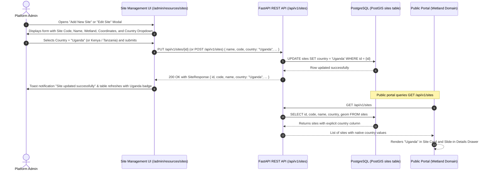

# Feature Spec 005: Editable Site Country in Site Management

| Attribute          | Value                                    |
| ------------------ | ---------------------------------------- |
| **Feature Name**   | Editable Site Country in Site Management |
| **Feature ID**     | `005_editable_site_country`              |
| **Status**         | `DRAFT`                                  |
| **Author**         | Galih Pratama                            |
| **Created Date**   | 2026-08-14                               |
| **Target Release** | Phase 1 Maintenance                      |

---

## 1. Executive Summary & 5W1H Analysis

Currently, the `sites` database table does not store `country` as an explicit column. Instead, the backend derives country dynamically via a `@computed_field` property using site code string checks (e.g., `SIO` ➔ Kenya, `MARA` ➔ Tanzania, and special overrides for `SIO-002`/`SIO-003` ➔ Uganda).

While this works for the initial 8 pilot sites, it creates architectural rigidity: adding or moving sites across transboundary basins (e.g., Kenya, Uganda, Tanzania) requires hardcoded code updates in Python and TypeScript.

This feature adds a first-class `country` column to the `sites` table in PostgreSQL, exposes `country` across all CRUD API endpoints (`GET`, `POST`, `PUT`), seeds all existing pilot sites with their true country in `spatial_data.json`, and adds an interactive **Country Select Dropdown** to the Admin Site Management UI (`/admin/resources/sites`).

### 5W1H Matrix

| Dimension | Detail                                                                                                                                                                                                                       |
| --------- | ---------------------------------------------------------------------------------------------------------------------------------------------------------------------------------------------------------------------------- |
| **Who**   | **Platform Admins & GIS Coordinators** managing monitoring sites across transboundary pilot basins.                                                                                                                          |
| **What**  | Store `country` as a database column on `sites`, expose it in backend schemas, populate via seeder, and provide an editable dropdown (`Kenya`, `Tanzania`, `Uganda`) in Admin Site Management.                               |
| **Where** | **Backend**: `models/spatial.py`, `schemas/spatial.py`, `spatial_seeder_helper.py`, `spatial_data.json`, Alembic migration.<br>**Frontend**: `frontend/src/app/admin/resources/sites/page.tsx`, `frontend/src/app/page.tsx`. |
| **When**  | Triggered when admins create or edit a site, or during database seeding.                                                                                                                                                     |
| **Why**   | Replaces fragile code-level regex/prefix matching with a database-driven single source of truth, enabling non-technical admins to assign countries freely without software code deployments.                                 |
| **How**   | Add nullable `country` VARCHAR(50) column via Alembic migration, update Pydantic models with validation, populate seeder records, and add a Country selector and table column in the Admin UI.                               |

---

## 2. Architecture & Data Flow



---

## 3. User Acceptance Criteria (UAC)

### Scenario 1: Pre-populated Country on Editing an Existing Site

- **Given** an admin is logged into the Admin Dashboard at `/admin/resources/sites`
- **When** the admin clicks the **"Edit"** button on site `NBD-SIO-002` (_Majanji subcounty sitobelo_)
- **Then** the Edit Site modal opens and the **Country** dropdown is pre-selected with `"Uganda"`
- **And** when clicking on site `NBD-MARA-001` (_Nyansurura_), the dropdown is pre-selected with `"Tanzania"`.

### Scenario 2: Changing Site Country and Persisting to Database

- **Given** the admin is editing site `NBD-SIO-001` (_Musoma_)
- **When** the admin changes the **Country** dropdown from `"Kenya"` to `"Uganda"` and clicks **"Save Changes"**
- **Then** a loading indicator appears while saving
- **And** the modal closes, a success toast appears, and the Sites table displays an **"Uganda"** badge in the Country column
- **And** refreshing the page retains `"Uganda"` from the database.

### Scenario 3: Creating a New Site with Explicit Country

- **Given** the admin clicks **"Add New Site"** on `/admin/resources/sites`
- **When** the admin fills in `code = "NBD-SIO-005"`, `name = "Lumino Monitoring Station"`, selects wetland, clicks map coordinates, and chooses **"Uganda"** from the Country dropdown
- **And** clicks **"Create Site"**
- **Then** the new site is created in PostgreSQL with `country = "Uganda"`
- **And** the public portal displays `"Uganda"` for this site in the site drawer and left sidebar list.

### Scenario 4: Backward-Compatible Fallback for Legacy/Null DB Records

- **Given** a legacy database record in the `sites` table has `country = NULL`
- **When** the backend serializes the site via `Site` response schema or frontend renders it
- **Then** the backend and frontend automatically fall back to determining the country from the site code (`SIO-002`/`003` ➔ `"Uganda"`, `SIO` ➔ `"Kenya"`, `MARA` ➔ `"Tanzania"`), preventing any `null` or broken UI badges.

---

## 4. Technical Acceptance Criteria (TAC)

### 4.1 Database Layer (PostgreSQL & Alembic)

- [x] **Model Definition**: Add `country = Column(String(50), nullable=True)` to `class Site` in `backend/app/models/spatial.py`.
- [x] **Migration Script**: Create an Alembic migration script in `backend/alembic/versions/` that executes:
  ```python
  op.add_column("sites", sa.Column("country", sa.String(length=50), nullable=True))
  ```
  with a proper downgrade function (`op.drop_column("sites", "country")`).
- [x] **Zero Data Loss**: Migration must be safe to run against production database without locking or altering existing data points.

### 4.2 Backend Schemas & Serialization (`backend/app/schemas/spatial.py`)

- [x] **`SiteBase`**: Update schema to include `country: Optional[str] = Field(default=None, max_length=50, description="Country name e.g. Kenya, Uganda, Tanzania")`.
- [x] **`SiteCreate` & `SiteUpdate`**: Support optional `country` in request payloads.
- [x] **`Site` (Response Model)**: Update `country` resolution:
  - If `self.country` (from database column) is set and non-empty, return stored `self.country`.
  - Else, fall back to `SITE_COUNTRIES` and `COUNTRIES` keyword lookup for backward compatibility.
- [x] **API Route Handlers (`backend/app/routers/spatial_router.py`)**:
  - `POST /sites`: Assigns `country=payload.country` when instantiating `Site`.
  - `PUT /sites/{id}`: Updates `site.country = payload.country` when provided.

### 4.3 Database Seeder (`spatial_data.json` & `spatial_seeder_helper.py`)

- [x] Update `backend/app/seeds/spatial/spatial_data.json` site definitions:
  - `NBD-MARA-001` through `NBD-MARA-004` ➔ `"country": "Tanzania"`
  - `NBD-SIO-001` & `NBD-SIO-004` ➔ `"country": "Kenya"`
  - `NBD-SIO-002` & `NBD-SIO-003` ➔ `"country": "Uganda"`
- [x] Update `spatial_seeder_helper.py` in the site loop:
  - When creating a site: `country=s_data.get("country")`.
  - When updating an existing site: `site.country = s_data.get("country", site.country)`.

### 4.4 Frontend Admin UI (`frontend/src/app/admin/resources/sites/page.tsx`)

- [x] **Form State**: Add `country: string` to `SiteFormData` with default value `""` (or `"Kenya"`).
- [x] **Modal Selector**: Add a styled Country `<select>` input with options:
  - `<option value="Kenya">Kenya</option>`
  - `<option value="Uganda">Uganda</option>`
  - `<option value="Tanzania">Tanzania</option>`
- [x] **Table Column**: Add a **Country** header and column to the Sites Table rendering a clean badge (e.g. `bg-emerald-50 text-emerald-700` for Kenya, `bg-amber-50 text-amber-700` for Uganda, `bg-sky-50 text-sky-700` for Tanzania).
- [x] **Form Submission**: Pass `country: formData.country` in `apiClient.post("/sites", payload)` and `apiClient.put("/sites/${editingSite.id}", payload)`.

---

## 5. UI / UX Specification & ASCII Wireframe

### 5.1 Site Create / Edit Modal Wireframe

```
+-----------------------------------------------------------------------+
|  [MapPin] Edit Site: NBD-SIO-002                                  [X] |
+-----------------------------------------------------------------------+
|                                                                       |
|  Site Code *                     Wetland *                            |
|  [ NBD-SIO-002                 ] [ Sio-Siteko Wetland        |v]      |
|                                                                       |
|  Site Name *                     Country *                            |
|  [ Majanji subcounty sitobelo  ] [ Uganda                    |v]      |
|                                  | - Kenya                            |
|  Description                     | - Uganda (selected)                |
|  [ Monitoring point at river.. ] | - Tanzania                         |
|                                  +------------------------------------+
|                                                                       |
|  Coordinates (Click map to pick)                                      |
|  Latitude: [ 0.2552          ]   Longitude: [ 34.0225        ]        |
|                                                                       |
|  +-----------------------------------------------------------------+  |
|  | [ Leaflet Interactive Map Picker Tool ]                         |  |
|  |   * (Marker at 0.2552, 34.0225)                                 |  |
|  +-----------------------------------------------------------------+  |
|                                                                       |
|                                    [ Cancel ]  [ Save Changes (Sky) ] |
+-----------------------------------------------------------------------+
```

### 5.2 Sites Table Column Wireframe

```
+---------------------------------------------------------------------------------------+
| Sites Overview                                                      [ + Add New Site ] |
+---------------+-----------------------------+-------------------+----------+----------+
| Code          | Name                        | Wetland           | Country  | Actions  |
+---------------+-----------------------------+-------------------+----------+----------+
| NBD-MARA-001  | Nyansurura (Tarime)         | Mara Wetland      | Tanzania | [V][E][D]|
| NBD-SIO-001   | Musoma                      | Sio-Siteko Wetland| Kenya    | [V][E][D]|
| NBD-SIO-002   | Majanji subcounty sitobelo  | Sio-Siteko Wetland| Uganda   | [V][E][D]|
| NBD-SIO-003   | Nahyusi-Bunyandeti          | Sio-Siteko Wetland| Uganda   | [V][E][D]|
| NBD-SIO-004   | Siteko village              | Sio-Siteko Wetland| Kenya    | [V][E][D]|
+---------------+-----------------------------+-------------------+----------+----------+
```

---

## 6. Implementation & Verification Plan

### Step-by-Step Execution Plan

```
[Phase 1: Backend DB & Migration]
  ├── Step 1.1: Add `country` column in `backend/app/models/spatial.py`
  ├── Step 1.2: Generate Alembic migration file `alembic/versions/*_add_country_to_sites.py`
  └── Step 1.3: Run `alembic upgrade head` in test environment

[Phase 2: Backend Schemas & Seeder]
  ├── Step 2.1: Update `SiteBase`, `SiteCreate`, `SiteUpdate`, and `Site` schemas in `schemas/spatial.py`
  ├── Step 2.2: Update `spatial_data.json` with country keys for all 8 pilot sites
  └── Step 2.3: Update `spatial_seeder_helper.py` and `spatial_router.py` to persist `country`

[Phase 3: Frontend UI Enhancements]
  ├── Step 3.1: Update `SiteFormData` and state in `admin/resources/sites/page.tsx`
  ├── Step 3.2: Add Country `<select>` input to Site Form Modal
  └── Step 3.3: Add Country column with color badges to Sites Data Table

[Phase 4: Verification & Automated Tests]
  ├── Step 4.1: Run `backend/tests/test_seeder.py` and `backend/tests/test_spatial_api.py`
  ├── Step 4.2: Run `./run-tests.sh` (Flake8, Pytest, ESLint, Prettier, Vitest)
  └── Step 4.3: Manual UI verification via ngrok/localhost
```

---

## 7. Work Breakdown Structure (WBS) & Estimation

| Task ID   | Task Description                                                             | Target File(s)                                                            |  Estimate  | Confidence | Risk & Mitigation                                      |
| --------- | ---------------------------------------------------------------------------- | ------------------------------------------------------------------------- | :--------: | :--------: | ------------------------------------------------------ |
| **T-001** | Add `country` column to `Site` SQLAlchemy model & generate Alembic migration | `backend/app/models/spatial.py`, `backend/alembic/versions/`              | **0.50 h** |    High    | Low risk: Nullable column avoids database table locks. |
| **T-002** | Update `SiteBase`, `SiteCreate`, `SiteUpdate`, and `Site` schemas            | `backend/app/schemas/spatial.py`, `backend/app/routers/spatial_router.py` | **0.25 h** |    High    | Keep fallback logic for backward compatibility.        |
| **T-003** | Update `spatial_data.json` & `spatial_seeder_helper.py` to seed `country`    | `backend/app/seeds/spatial/spatial_data.json`, `spatial_seeder_helper.py` | **0.25 h** |    High    | Low risk: Idempotent `get_or_create` logic.            |
| **T-004** | Add Country dropdown & table column to Frontend Site Management UI           | `frontend/src/app/admin/resources/sites/page.tsx`                         | **0.50 h** |    High    | Re-use existing Tailwind/Radix select styling.         |
| **T-005** | Update unit tests and run full test suite verification                       | `backend/tests/test_seeder.py`, `test_spatial_api.py`                     | **0.25 h** |    High    | Run `./run-tests.sh` for full pass.                    |

**Total Estimated Hours**: **1.75 hours** (~1 hour 45 minutes)

---

## 8. Rollback & Safety Strategy

- **Database Downgrade**: If needed, `alembic downgrade -1` cleanly removes the `country` column from `sites`.
- **API Backwards Compatibility**: The `Site` response schema retains the fallback dictionary resolution, guaranteeing that even if `country` is `NULL`, all consumer interfaces receive the correct country string without throwing exceptions.
