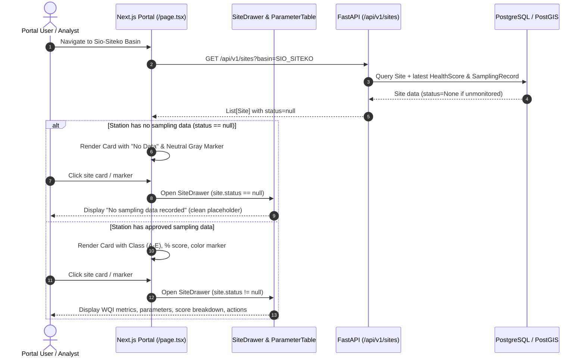

# Monitoring Station No Data & Sio-Siteko Scoring Fix - Feature Specification

**Author**: Galih Pratama
**Date**: 2026-08-25
**Issue**: [#161] Monitoring station card shows no data / blank parameters / misleading 0.5 scoring
**Estimate**: ≤ 2 hours (Vibe Coding Estimation: ~1.75 hours)

---

## Overview

When monitoring stations have no approved water quality sampling submissions (as observed on Sio-Siteko pilot sites):

1. The frontend defaults the composite score to `0.5` (50%), health class to `"C"` (At Risk / Amber), and parameters to `"-"` with `"Normal"` flags.
2. The map markers display a teal/green icon (`icons.siteDefault`) while the sidebar card displays an amber badge and progress bar, creating a visual contradiction.
3. The Indigenous Knowledge (IK) form v2 (`form_pipeline_c_admin_indigenous_knowledge_v2.json`) was unseeded, and legacy FGD records were anchored to deprecated wetland codes (`LOWER_MARA_WETLAND`, `SIO_ESTUARY_WETLAND`) rather than the active wetland entities (`Mara_Wetland`, `Sio_Siteko_Wetland`), causing `get_latest_fgd_record()` to return `None` and IK fuzzy adjustments to evaluate to `0.00`.

This specification details the end-to-end fix:

- **Frontend**: Explicit `null` / unmonitored state handling across the portal sidebar, monitoring station drawer, parameter table, and Leaflet map markers.
- **Backend & Seeding**: Form 3 v2 seeding, database wetland foreign key alignment, and comprehensive test/seed generation across all Mara and Sio-Siteko pilot sites.

---

## User Acceptance Criteria (UAC)

- [ ] **UAC-1: Unmonitored Station Card State**: Stations with no approved sampling submissions display a distinct "No Data" / "Unmonitored" state on the left sidebar (gray badge / neutral status bar / "No sampling data recorded") rather than a synthetic 50% Grade C score.
- [ ] **UAC-2: Map Marker Alignment**: Unmonitored station map markers render with a neutral gray / dashed map icon with tooltip `"<Site Name> (No data)"` matching the card, eliminating the green vs. yellow color conflict.
- [ ] **UAC-3: Drawer Empty State**: Opening the station drawer for an unmonitored site shows:
  - Neutral header status circle (slate/gray).
  - Last reported: "No reports yet".
  - Alert banner: suppressed (no misleading "Water quality declining" warning).
  - Parameter table & score breakdown: clean "No sampling records available for this station" banner or placeholders.
- [ ] **UAC-4: Sio-Siteko Scoring & Data Integrity**: When approved monthly sampling submissions exist for Sio-Siteko sites (e.g. `NBD-SIO-001` through `NBD-SIO-004`), the portal displays actual computed WQI, parameters, and fuzzy-adjusted scores.
- [ ] **UAC-5: Indigenous Knowledge (FGD) Linkage**: Seeded and newly submitted Form 3 v2 records correctly link to `Sio_Siteko_Wetland` and `Mara_Wetland`, enabling fuzzy logic adjustment for all child sites.

---

## Technical Acceptance Criteria (TAC)

- [ ] **TAC-1: Frontend Site Normalization**: `normalizeSite()` in `frontend/src/app/page.tsx` explicitly preserves `current_health_class: site.status ? site.status.health_class : null` and `current_score: site.status ? Math.round(site.status.ik_adjusted_score * 100) : null`.
- [ ] **TAC-2: Map Marker Icons**: `frontend/src/components/ui/map-viewer.tsx` provides `siteUnscored` / `siteDefault` styling with neutral gray tones (`bg-slate-400`, `bg-slate-500`) instead of green/teal (`bg-teal-400`, `bg-teal-600`).
- [ ] **TAC-3: Form 3 v2 Seeding**: `form_pipeline_c_admin_indigenous_knowledge_v2.json` is seeded and published as Form ID 3 version 3.
- [ ] **TAC-4: Spatial FK Migration/Cleanup**: Existing `FgdRecord` and `Datapoint` rows associated with deprecated wetland codes are migrated to `Mara_Wetland` and `Sio_Siteko_Wetland`, and deprecated wetland entries are cleared.
- [ ] **TAC-5: Automated Test Coverage**: Unit tests added for unmonitored site drawer rendering, map marker status resolution, and scoring reconciliation.

---

## Architecture Overview



---

## 1. Backend Implementation

### 1.1 Database & Seeder Alignment

**Files**:

- `backend/app/seeds/spatial_seeder_helper.py`
- `backend/app/seeds/seed_fake_submissions.py`
- `backend/app/seeds/form_seeder_helper.py`

#### Changes:

1. **Form Seeding**: Ensure `form_seeder_helper.py` non-interactive mode publishes the latest version of all forms (including `form_pipeline_c_admin_indigenous_knowledge_v2.json`).
2. **Wetland Deduplication & Migration**: Ensure spatial seeder cleans up old orphan wetland rows (`LOWER_MARA_WETLAND`, `SIO_ESTUARY_WETLAND`) and re-links existing `FgdRecord` and `Datapoint` entries to `Mara_Wetland` and `Sio_Siteko_Wetland`.
3. **Fake Submission Seeder**: Ensure `seed_fake_submissions.py` generates consistent 5-week history for all 8 pilot sites (`NBD-MARA-001..004` and `NBD-SIO-001..004`) and attaches FGD records to active wetlands.

### 1.3 Recalculation Script & Endpoint

**File**: `/backend/app/scripts/recalculate_scores.py`

CLI script executable via `./dc.sh exec backend python -m app.scripts.recalculate_scores`:

1. Clears existing derived `HealthScore`, `SamplingRecord`, and `FgdRecord` entries.
2. Ingests and scores all `APPROVED` Form 3 (`INDIGENOUS_KNOWLEDGE`) submissions in ascending chronological order (`created_at` ASC) to populate active wetland `FgdRecord` histories.
3. Ingests and scores all `APPROVED` Form 2 (`CITIZEN_SCIENTIST`) submissions in ascending chronological order (`created_at` ASC) to generate accurate `SamplingRecord`s and fuzzy-adjusted `HealthScore`s.
4. Auto-reconciles any approved Form 4 (`LAB_QA`) reports.
5. Supports optional filters: `--site-id <SITE_ID>`, `--basin <BASIN_ID>`.

---

## 2. Frontend Implementation

### 2.1 Portal State & Normalization

**File**: `frontend/src/app/page.tsx`

1. **`normalizeSite()`**:
   - `current_health_class`: `site.status?.health_class || null`
   - `current_score`: `site.status?.ik_adjusted_score != null ? Math.round(site.status.ik_adjusted_score * 100) : null`
   - `last_updated`: `site.status?.sampling_date || null`
2. **Sidebar Card Rendering**:
   - When `site.current_score === null`:
     - Display a neutral gray pill: `"No Data"`
     - Progress bar: neutral slate background, width 0% or dimmed
     - Alert action: `"No sampling records recorded for this station."` (neutral styling)
3. **Map Marker Mapping**:
   - Pass `status: site.status?.health_class || "UNSCORED"`

### 2.2 Map Viewer Marker Styles

**File**: `frontend/src/components/ui/map-viewer.tsx`

1. Update `icons.siteDefault` / `siteUnscored`:
   ```ts
   // Unmonitored site marker: Neutral Slate
   pingBg = "bg-slate-300";
   centerBg = "bg-slate-500";
   ```
2. Update popup text: `${site.name} (${site.status?.health_class || "No Data"})`.

### 2.3 Site Drawer & Parameter Table

**Files**:

- `frontend/src/components/ui/site-drawer.tsx`
- `frontend/src/components/ui/site-drawer/parameter-table.tsx`
- `frontend/src/components/ui/site-drawer/score-breakdown-panel.tsx`

1. **Site Drawer Header**:
   - When `site.current_health_class` is null:
     - Render neutral gray circle: `bg-slate-200 text-slate-500 border-slate-300` with `"—"` inside.
     - `lastReported` badge: `"No reports"`
     - Suppress warning alert banner.
2. **Parameter Table**:
   - If all metric values are null and `samplingsHistory` is empty, render a clean empty notice: `"No sampling records available for this monitoring station."`
3. **Score Breakdown**:
   - Display a neutral message `"Scoring pending sampling approval"` when un-scored.

---

## 3. Verification & Testing

### 3.1 Automated Tests

- **Backend Tests**:
  ```bash
  ./dc.sh exec backend python -m pytest tests/test_public_api.py tests/test_scoring.py tests/test_seeder.py -v
  ```
- **Frontend Tests**:
  ```bash
  ./dc.sh exec frontend yarn test
  ```

### 3.2 Manual Verification Steps

1. Launch portal (`http://localhost:3000`).
2. Switch Basin dropdown to **Sio-Siteko Basin**.
3. Verify unmonitored sites render with **No Data** gray styling on cards, neutral markers on the map, and no synthetic 50% score.
4. Click on a site card or map marker: verify the drawer opens with neutral header circle, "No reports" timestamp, and empty parameter table state without crashes.
5. In Admin, approve a pending Form 2 sampling submission for Sio-Siteko (`NBD-SIO-001`).
6. Refresh portal: verify `NBD-SIO-001` now dynamically computes WQI, renders color-coded marker, and displays live parameters in the drawer.

---

## 4. Work Breakdown Structure & Vibe Coding Estimation

- Confidence Level: **High**
- Dependencies: None

| Task ID   | Task Description                                                                          | Target File(s)                                                                                                            |  Estimate  | Priority  |
| :-------- | :---------------------------------------------------------------------------------------- | :------------------------------------------------------------------------------------------------------------------------ | :--------: | :-------- |
| **T-001** | Frontend site normalization, sidebar card "No Data" state, and map marker color alignment | `frontend/src/app/page.tsx`, `frontend/src/components/ui/map-viewer.tsx`                                                  | **0.50 h** | Must Have |
| **T-002** | SiteDrawer & ParameterTable empty state handling for unmonitored sites                    | `frontend/src/components/ui/site-drawer.tsx`, `frontend/src/components/ui/site-drawer/parameter-table.tsx`                | **0.25 h** | Must Have |
| **T-003** | Database seeder fix, wetland cleanup/re-anchoring, Form 3 v2 publishing                   | `backend/app/seeds/form_seeder_helper.py`, `spatial_seeder_helper.py`, `seed_fake_submissions.py`                         | **0.25 h** | Must Have |
| **T-004** | Dedicated Score Recalculation script (`recalculate_scores.py`)                            | `backend/app/scripts/recalculate_scores.py`                                                                               | **0.50 h** | Must Have |
| **T-005** | Unit tests for unmonitored states (frontend + backend) & end-to-end verification          | `frontend/src/app/__tests__/page.test.tsx`, `frontend/src/components/ui/__tests__/site-drawer.test.tsx`, `backend/tests/` | **0.25 h** | Must Have |

**Total Estimated Hours**: **1.75 hours** (~1 hour 45 minutes)

---

## 5. Post-Merge Operational Steps (Deployment Checklist)

Once this PR is merged to `main` and deployed to the target environment (Test or Production cluster):

### Step 1: Run Spatial Seeder Migration

Migrate deprecated wetland codes (`LOWER_MARA_WETLAND`, `SIO_ESTUARY_WETLAND`) to active spatial polygons (`Mara_Wetland`, `Sio_Siteko_Wetland`) and re-link child monitoring stations:

```bash
./dc.sh exec backend python -m app.seeds.spatial_seeder_helper
```

### Step 2: Recalculate Historical Scores

Replay and recalculate derived scores in chronological order (Form 3 FGDs $\rightarrow$ Form 2 Sampling $\rightarrow$ Form 4 Lab QA Auto-reconciliation):

```bash
./dc.sh exec backend python -m app.scripts.recalculate_scores
```

### Step 3: Production Smoke Test & Verification

1. Open the public Wetland Portal (`https://<domain>`).
2. Verify stations in **Mara Basin** and **Sio-Siteko Basin**:
   - Monitored stations display color-coded pins (Green/Amber/Red) corresponding to their calculated scores.
   - Any stations with no sampling data cleanly display neutral slate pins, `"—"` / `"No Data"`, and `"No sampling records recorded for this station."` without fallback 50% / Grade C warnings.
3. Open the monitoring station drawer for Sio-Siteko stations:
   - Confirm physico-chemical metrics, historical trend graphs, and FGD Indigenous Knowledge cards render populated values.
