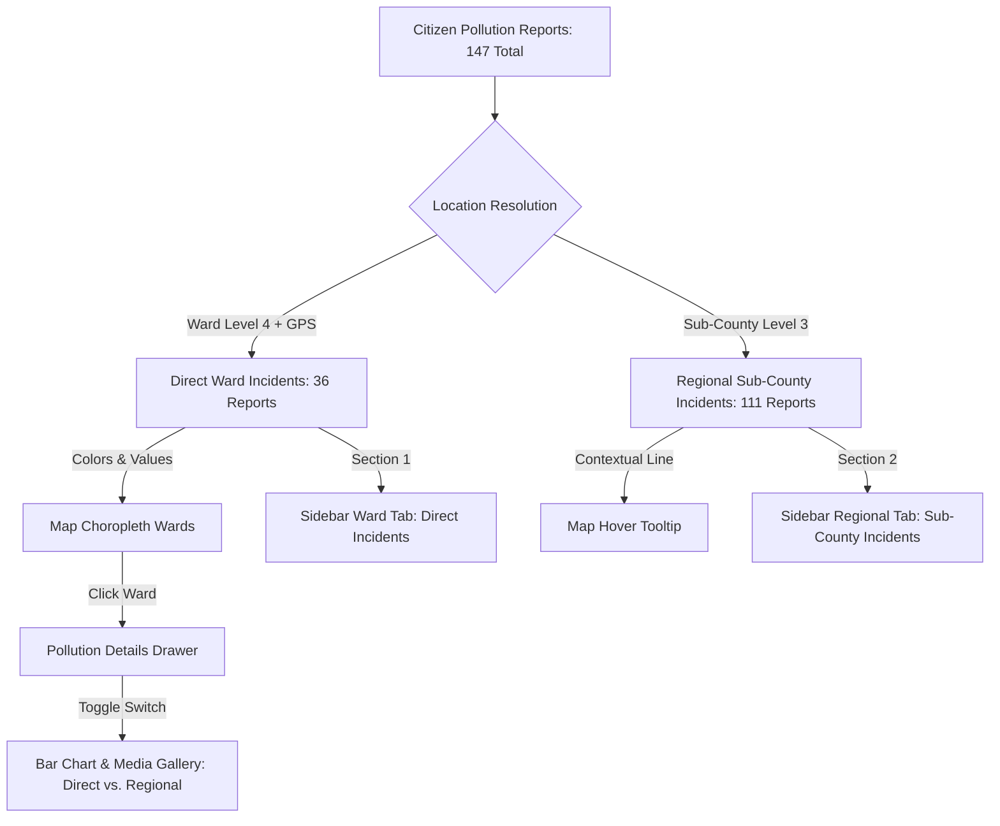

# 007 — Hierarchical Separation of Direct Ward & Regional Sub-County Pollution Reports

**Author**: Galih Pratama
**Date**: 2026-09-01
**Issue**: #164 / #166
**Scope**: Frontend Map Choropleth, Tooltip, Sidebar Lists, and Pollution Details Drawer
**Status**: DRAFT (Pending Review)

---

## 1. Executive Summary & Problem Context

In the NBD Wetland & Pollution Monitoring Platform, citizen pollution reports are collected across multiple channels and evolutionary timeframes:

1. **Phase 1 & Lightweight Mobile Channels (July – Aug 2026 / USSD / WhatsApp)**:
   - Collected location data down to **Level 3 (Sub-County)** (e.g. 83 reports in Kilgoris, 23 in Chepalungu).
   - USSD menus and WhatsApp bot sessions historically prompted `County -> Sub-County` to stay within mobile telecom 160-character / 30-second session limits.
2. **Phase 2 & Web / Mobile Apps (Post-August 6, 2026)**:
   - Enabled full hierarchical cascade down to **Level 4 (Ward)** (e.g. 12 in Kimintet, 3 in Chebunyo).

### The Core Problem:

Previously, the choropleth map attributed Sub-County level reports (like the 83 Kilgoris reports) to **every constituent ward** inside that sub-county.

- **Map Inflation**: Wards inside Kilgoris (_Kimintet_ and _Angata Barikoi_) both displayed 83+ incidents, making the map appear as though 166+ incidents occurred in just two wards.
- **List vs. Map Discrepancy**: The total basin list correctly showed **147 unique incidents**, but the sum of ward counts on the map was significantly higher due to multi-attribution.

---

## 2. Proposed Architecture: Dual-Level Hierarchical Representation

To **preserve 100% of historical and mobile Sub-County data** without **falsely inflating the Ward map**, the system implements a clean hierarchical disaggregation:



---

## 3. UI/UX Specifications

### 3.1. Map Choropleth & Hover Tooltip

1. **Choropleth Polygon Coloring**:
   - Ward polygon color is calculated strictly from **Direct Ward Reports** (Tier 1 exact ward name + Tier 4 GPS point-in-polygon).
   - _Example_: _Kimintet Ward_ displays **12 incidents** (Yellow) instead of 96 (Red).
2. **Hover Tooltip**:
   - When hovering over a ward, displays both the direct ward count and the parent sub-county regional count:
   ```
   ┌─────────────────────────────────────────────────┐
   │ Kimintet (Kilgoris Sub-County)                  │
   │ • 12 Direct Ward Incidents                      │
   │ • 83 Regional Incidents (Kilgoris Sub-County)   │
   └─────────────────────────────────────────────────┘
   ```

---

### 3.2. Left Sidebar Incident List (When a Ward is Clicked)

When the user clicks a ward on the map (e.g. _Kimintet_), the left sidebar renders a clean segmented controller/tab header:

```
┌────────────────────────────────────────────────────────────┐
│ POLLUTION INCIDENTS: Kimintet                              │
│                                                            │
│  [  Direct Ward (12)  ]   [  Kilgoris Sub-County (83) ]    │
├────────────────────────────────────────────────────────────┤
│ • INCIDENT #142  [Kilgoris Sub-County]                     │
│   Reported on: 12 Aug 2026                                 │
│   Type: Water colour | Severity: Critical                  │
│                                                            │
│ • INCIDENT #139  [Kilgoris Sub-County]                     │
│   Reported on: 08 Aug 2026                                 │
│   Type: Fish kill | Severity: Critical                     │
└────────────────────────────────────────────────────────────┘
```

- **Tab 1: Direct Ward (12)**: Lists only the 12 incidents located specifically inside Kimintet.
- **Tab 2: Kilgoris Sub-County (83)**: Lists the 83 regional incidents submitted at the Kilgoris sub-county level.
- **All-Basin State** (no ward selected): The sidebar lists all **147 unique incidents** across the basin.

---

### 3.3. Right Drawer (`PollutionDetailsDrawer`)

Inside the right-side inspection drawer:

1. **Status Banner**: Displays `12 Direct Incidents in Kimintet` with a subtitle indicating `(+ 83 Regional reports in Kilgoris Sub-County)`.
2. **Scope Switcher**: A segmented control allows toggling the **Incident Distribution Bar Chart** and **Reported Photos Gallery** between:
   - `[ Direct Ward (12) ]`: Shows breakdown and photos for Kimintet.
   - `[ Kilgoris Sub-County (83) ]`: Shows aggregated breakdown and photos for all 83 Kilgoris reports.

---

## 4. Technical Implementation Plan

### 4.1. Frontend State & GeoJSON Processing (`frontend/src/app/page.tsx`)

1. In `allWardLayers` calculation:
   - Compute `directIncidentCount`: Match Tier 1 (exact ward name) + Tier 4 (point-in-polygon).
   - Compute `subCountyIncidentCount`: Match Tier 2 (sub-county name).
   - Set `feature.properties.incidentCount = directIncidentCount` (for choropleth color scale).
   - Set `feature.properties.subCountyIncidentCount = subCountyIncidentCount`.
2. In `sidebarIncidents`:
   - Separate `directIncidents` and `regionalIncidents`.
   - Support active tab selection (`activeTab: "ward" | "subcounty"`).

### 4.2. Map Component (`frontend/src/components/ui/map-viewer.tsx`)

- Update `bindTooltip` to format the two-line tooltip showing both direct ward and regional sub-county totals.

### 4.3. Details Drawer (`frontend/src/components/ui/pollution-details-drawer.tsx`)

- Add scope toggle for bar chart and image gallery.

---

## 5. Acceptance Criteria (UAC / TAC)

### User Acceptance Criteria (UAC)

- [ ] **UAC-1**: When viewing the Mara Basin map, _Kimintet Ward_ displays a direct count of 12 (Yellow) and _Chebunyo_ displays 3, eliminating multi-count duplication.
- [ ] **UAC-2**: Hovering over a ward shows both the direct ward total and the parent sub-county regional count.
- [ ] **UAC-3**: When a ward is clicked, the sidebar provides tabs to view Direct Ward incidents vs. Parent Sub-County incidents.
- [ ] **UAC-4**: When no ward is clicked, the sidebar displays all 147 incidents across the basin.
- [ ] **UAC-5**: The right drawer provides a switcher to inspect bar charts and photos for either direct ward or sub-county scope.

### Technical Acceptance Criteria (TAC)

- [ ] **TAC-1**: All 30 frontend test suites pass (`yarn test`).
- [ ] **TAC-2**: Backend test suite passes (`pytest`).
- [ ] **TAC-3**: ESLint & Prettier checks pass with 0 errors.

---

## 6. Estimated Effort

- **Frontend Implementation**: 2.5 hours
- **Unit Testing & Documentation**: 1 hour
- **Total Estimate**: ~3.5 hours
