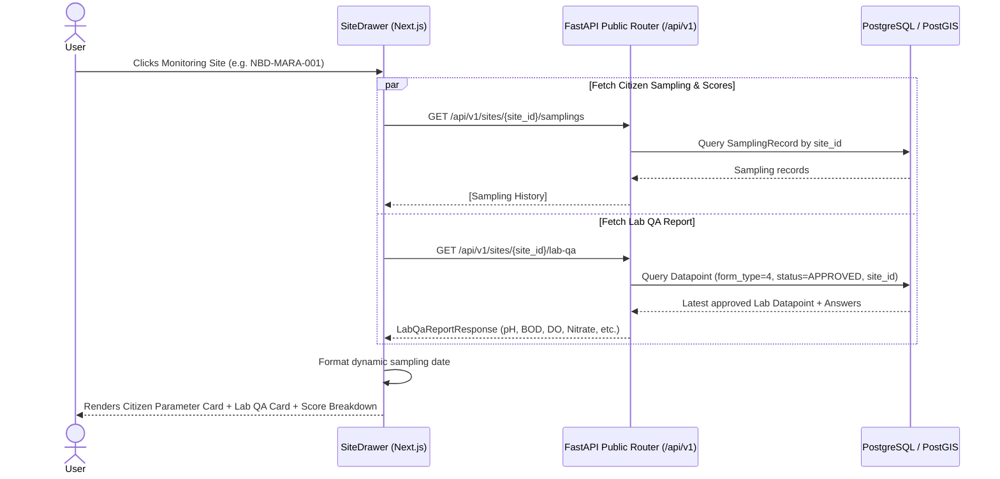

# 008 — Lab Reporting: Display Data on Side-Panel & Eliminate Hardcoded Data

**Author**: Winston (Architect) & Amelia (Developer)
**Date**: 2026-09-10
**Issue**: Lab Reporting Side-Panel Integration & Dynamic Data Audit
**Scope**: Backend Public API (`public_router.py`), Frontend Wetland Station Drawer (`site-drawer.tsx`, `lab-qa-card.tsx`), Locale Translations (`en.json`, `sw.json`)
**Status**: IMPLEMENTED (Merged in PR #168)
**Estimate**: ≤ 8 hours (Actual: 2.5 hours)

---

## 1. Executive Summary & Problem Context

In the Nile Basin Wetland Monitoring Platform, environmental assessments rely on two complementary water quality pipelines:
1. **Citizen Science Monitoring (Form 2)**: Regular community-collected physico-chemical readings (pH, DO, temperature, invasive macrophytes, water level) that feed into the WQI calculation.
2. **Accredited Laboratory QA Testing (Form 4)**: Periodic, rigorous laboratory control testing measuring extended parameters (pH, DO, water temperature, BOD, orthophosphate, nitrate, mercury, heavy metals, total nitrogen, and total phosphorus).

### The Problems
1. **Missing Lab QA on Wetland Station Detail**: The public portal's right side-panel (`SiteDrawer`) currently only renders the citizen scientist parameter table and composite score breakdown. Data from approved Form 4 Lab QA submissions is invisible to users on the monitoring station drawer.
2. **Hardcoded Dates & Stale Sampling References**:
   - The score breakdown header in `frontend/messages/en.json` and `sw.json` contains a hardcoded date: `"Parameter group scores (May 2026 sampling)"` / `"Alama za vikundi vya vigezo (sampuli ya Mei 2026)"`.
   - `frontend/src/components/ui/site-drawer.tsx` hardcodes an arbitrary 35-day query limit (`now - 35 days`) for fetching samplings and scores. If a site was last sampled 40 days ago, the drawer displays "No sampling data available".
   - `backend/app/routers/public_router.py` defaults to `now - 30 days` if `date_from` is omitted.
   - `frontend/src/lib/charts.ts` hardcodes `"en-US"` locale in chart date labels.

---

## 2. User Acceptance Criteria (UAC)

- [x] **UAC-1**: When viewing any wetland monitoring station detail on the right side-panel (`SiteDrawer`), a distinct **Lab QA Report** card is displayed alongside the citizen parameter card.
- [x] **UAC-2**: The Lab QA card displays the latest approved laboratory measurements:
  - pH (`lab_ph`)
  - Water Temperature (`lab_temperature`, °C)
  - Dissolved Oxygen (`lab_dissolved_oxygen`, mg/L)
  - Biochemical Oxygen Demand (`bod`, mg/L)
  - Orthophosphate (`orthophosphate`, mg/L)
  - Nitrate (`nitrate`, mg/L)
  - Total Nitrogen (`total_nitrogen`, mg/L)
  - Total Phosphorus (`total_phosphorus`, mg/L)
  - Mercury (`mercury`, mg/L)
  - Heavy Metals (`heavy_metals`, text description / ppm)
- [x] **UAC-3**: The Lab QA card clearly shows the laboratory test date (`created_at`) with clean styling (excluding structural `site_id` questions and redundant analyst name headers).
- [x] **UAC-4**: If no approved Lab QA report exists for the selected site, the card displays a graceful empty state: *"No laboratory QA reports recorded for this station yet."*
- [x] **UAC-5**: The Score Breakdown panel dynamically displays the actual date of sampling (e.g. *"Parameter group scores (Aug 2026 sampling)"*) rather than the hardcoded string *"May 2026 sampling"*.
- [x] **UAC-6**: Stations with sampling records older than 30–35 days still display their recent sampling history and trend charts without being artificially truncated.
- [x] **UAC-7**: Chart date labels on timeseries graphs adapt to the active locale (`en` vs `sw`).
- [x] **UAC-8**: Each numeric Lab QA parameter row includes an interactive collapsible historical trend chart showing longitudinal variations over time when multiple lab readings exist.
- [x] **UAC-9**: The `SiteDrawer` layout is expanded to `max-w-lg` for enhanced data visualization density.

---

## 3. Technical Acceptance Criteria (TAC)

- [x] **TAC-1**: New public backend endpoint `GET /api/v1/sites/{site_id}/lab-qa` returns the latest approved Form 4 submission (`Form.type == 4` and `status == 'APPROVED'`) with unpacked parameters, units, and historical time-series entries (`history`).
- [x] **TAC-2**: Unapproved, draft, or pending Lab QA reports are strictly filtered out of the public endpoint.
- [x] **TAC-3**: In `backend/app/routers/public_router.py`, the artificial default `timedelta(days=30)` cutoff is removed or expanded when `date_from` is not supplied, allowing historical samplings to be discovered.
- [x] **TAC-4**: In `frontend/src/components/ui/site-drawer.tsx`, the hardcoded `dateFrom.setDate(dateFrom.getDate() - 35)` is replaced with dynamic date fetching, ensuring stations show available history.
- [x] **TAC-5**: In `frontend/messages/en.json` and `sw.json`, `parameterGroupScores` is decoupled from May 2026 and parameterized as `parameterGroupScores` ("Parameter group scores") and `parameterGroupScoresWithDate` ("Parameter group scores ({date} sampling)").
- [x] **TAC-6**: A new component `frontend/src/components/ui/site-drawer/lab-qa-card.tsx` renders the laboratory parameters table with clean tooltips, units, sorted parameter ordering (`PARAM_ORDER`), and `<CollapsibleChartContainer />` trend charts.
- [x] **TAC-7**: All automated tests (`./dc.sh exec backend tests` with ≥80% coverage and `./dc.sh exec frontend yarn test`) pass with 0 lint errors.

---

## 4. 5W1H Analysis

| Dimension | Detail |
| --------- | ------ |
| **Who**   | Public portal users, environmental researchers, river basin authorities, and wetland monitors |
| **What**  | Display Form 4 Lab QA analytical measurements in a dedicated card on the monitoring station drawer, and eliminate hardcoded dates/windows |
| **Where** | `backend/app/routers/public_router.py` · `frontend/src/components/ui/site-drawer/lab-qa-card.tsx` · `frontend/src/components/ui/site-drawer.tsx` · `frontend/messages/*.json` |
| **When**  | When a user clicks any monitoring site marker on the wetland monitoring map |
| **Why**   | Provides scientific transparency by showing accredited lab verification alongside citizen scientist readings, while fixing stale date bugs |
| **How**   | Query approved `Datapoint` (Form 4) by `site_id`, transform dynamic `Answer` records into structured metrics, and render a high-fidelity card in Next.js |

---

## 5. Architecture Overview



---

## 6. Backend Implementation

### 6.1 Pydantic Response Schema (`backend/app/schemas/spatial.py`)

Add schema models for Lab QA parameters and response:

```python
class LabQaMetricEntry(BaseModel):
    value: Any
    unit: str | None = None
    status: str = "Verified"
    label: str
    icon: str | None = None

class LabQaHistoryEntry(BaseModel):
    date: str
    parameters: dict[str, Any]

class LabQaReportResponse(BaseModel):
    id: int
    created_at: datetime
    status: str
    submitter: str | None = None
    metrics: dict[str, LabQaMetricEntry] = Field(default_factory=dict)
    history: list[LabQaHistoryEntry] = Field(default_factory=list)

    model_config = ConfigDict(from_attributes=True)
```

### 6.2 Router Endpoint (`backend/app/routers/public_router.py`)

Add `GET /api/v1/sites/{site_id}/lab-qa`:

```python
@router.get(
    "/sites/{site_id}/lab-qa",
    response_model=Optional[schemas.LabQaReportResponse],
)
@limiter.limit("60/minute")
def get_site_lab_qa(
    request: Request,
    site_id: str,
    db: Session = Depends(get_db),
):
    # 1. Resolve site UUID or Code
    db_site = resolve_site(db, site_id)
    if not db_site:
        raise HTTPException(status_code=404, detail=f"Site '{site_id}' not found.")

    # 2. Query all approved Lab QA Datapoints in chronological order
    lab_dps = (
        db.query(Datapoint)
        .join(Form, Datapoint.form_id == Form.id)
        .filter(
            Form.type == FormType.LAB_QA.value,
            Datapoint.site_id == db_site.id,
            Datapoint.status == SubmissionStatus.APPROVED,
        )
        .order_by(Datapoint.created_at.asc())
        .all()
    )
    if not lab_dps:
        return None

    # 3. Unpack latest metrics and build historical time-series entries
    ...
```

### 6.3 Remove Stale 30-Day Default in Samplings Endpoint

In `get_site_samplings` (`public_router.py`):
Remove the hardcoded `timedelta(days=30)` fallback so querying without `date_from` fetches all recorded samplings (up to the query `limit`), preventing stations with >30-day-old samplings from showing as empty.

---

## 7. Frontend Implementation

### 7.1 API Client (`frontend/src/lib/api.ts`)

Define interface and fetch function:

```typescript
export interface LabQaMetricEntry {
  value: string | number | null;
  unit: string | null;
  status: string;
  label: string;
  icon: string | null;
}

export interface LabQaHistoryEntry {
  date: string;
  parameters: Record<string, any>;
}

export interface LabQaReport {
  id: number;
  created_at: string;
  status: string;
  submitter?: string | null;
  metrics: Record<string, LabQaMetricEntry>;
  history?: LabQaHistoryEntry[];
}

export const getSiteLabQa = async (siteId: string): Promise<LabQaReport | null> => {
  const response = await apiClient.get(`/sites/${siteId}/lab-qa`);
  return response.data;
};
```

### 7.2 Lab QA Component (`frontend/src/components/ui/site-drawer/lab-qa-card.tsx`)

Build `LabQaCard`:
- Header: Title "LAB QA REPORT" with clean typography.
- Table structure matching `ParameterTable`:
  - Columns: Parameter | Value | Status / Flag
  - Rows for `lab_ph`, `lab_temperature`, `lab_dissolved_oxygen`, `bod`, `orthophosphate`, `nitrate`, `total_nitrogen`, `total_phosphorus`, `mercury`, `heavy_metals`.
  - Tooltips explaining parameter meanings.
  - Collapsible historical trend charts for each numeric parameter using `<CollapsibleChartContainer />` and ECharts when history has ≥2 readings.
- Clean empty state when no report is available.

### 7.3 Drawer Integration (`frontend/src/components/ui/site-drawer.tsx`)

1. Call `getSiteLabQa(site.site_id)` on mount and when `site.site_id` changes.
2. Render `<LabQaCard />` directly beneath `<ParameterTable />`.
3. Eliminate `dateFrom.setDate(dateFrom.getDate() - 35);` — query sampling history dynamically.
4. Pass dynamic sampling date to `ScoreBreakdownPanel`.
5. Widen side drawer container to `max-w-lg`.

### 7.4 Score Breakdown Dynamic Date (`score-breakdown-panel.tsx` & messages)

- Update `score-breakdown-panel.tsx` to format `site.last_updated`:
  ```tsx
  <p className="text-xs text-slate-500 mt-0.5">
    {site.last_updated
      ? t("parameterGroupScoresWithDate", {
          date: new Date(site.last_updated).toLocaleDateString(locale, {
            month: "short",
            year: "numeric",
          }),
        })
      : t("parameterGroupScores")}
  </p>
  ```
- Update `en.json` and `sw.json` messages.

---

## 8. Verification & Quality Assurance

### 8.1 Automated Tests
Run all checks in Docker via `./dc.sh`:

```bash
# Backend Quality Checks
./dc.sh exec backend flake8
./dc.sh exec backend tests                      # or ./dc.sh exec backend python -m pytest tests/ -v

# Frontend Quality Checks
./dc.sh exec frontend yarn prettier:check
./dc.sh exec frontend yarn lint
./dc.sh exec frontend yarn test                 # or ./dc.sh exec frontend sh test.sh
```

### 8.2 Manual Verification Steps
1. Navigate to `http://localhost:3000` on the wetland monitoring domain.
2. Click any monitoring station with an approved lab report (e.g. Mara or Sio station).
3. Confirm the **Lab QA Report** card displays beneath the citizen science parameters with all chemical parameters (BOD, Orthophosphate, Nitrate, etc.).
4. Confirm the date shown on the Lab QA report card reflects its submission date.
5. Verify the Score Breakdown subtitle says `(Aug 2026 sampling)` instead of `(May 2026 sampling)`.
6. Switch locale to Swahili (`sw`) and verify translation displays properly without English fallback text.
7. Click "Export detailed report (PDF)" and verify print layout includes both Citizen and Lab QA tables cleanly.

---

## 9. Ballpark Estimation

> Provide ballpark estimates in developer hours.
- **Confidence Level**: High
- **Dependencies**: None (Form 4 blueprints and approved Lab QA submissions already exist in database)

| Task ID | Component & Description | Est. Hours (Min - Max) | Priority |
|---------|-------------------------|------------------------|----------|
| T-001   | Backend: `GET /api/v1/sites/{site_id}/lab-qa` endpoint & Pydantic schemas | 2h - 3h | Must Have |
| T-002   | Backend: Remove 30-day artificial cutoff in `public_router.py` | 0.5h - 1h | Must Have |
| T-003   | Frontend: `getSiteLabQa` API client & `LabQaCard` UI component | 2h - 3h | Must Have |
| T-004   | Frontend: Integrate `LabQaCard` into `SiteDrawer` & print CSS | 1h - 2h | Must Have |
| T-005   | Frontend: Dynamic sampling date in `ScoreBreakdownPanel` & translations | 1h - 1.5h | Must Have |
| T-006   | Quality Assurance: Backend pytest & Frontend Vitest unit tests | 1.5h - 2.5h | Must Have |
