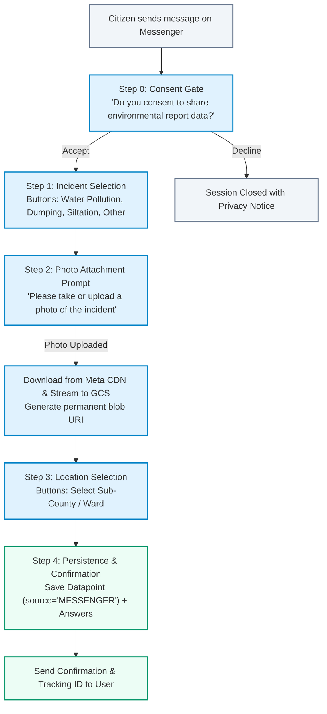
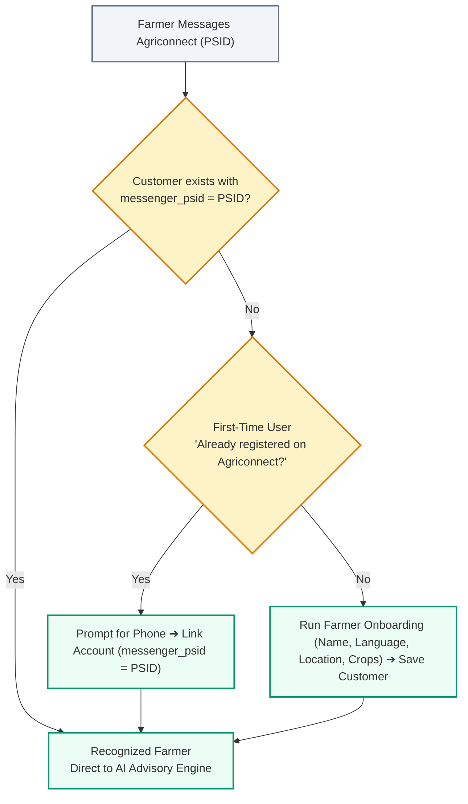

# 009 — Facebook Messenger Chatbot Pipeline & Ingestion Specification

**Author**: Winston (Architect) & Amelia (Developer)  
**Date**: 2026-09-18  
**Initiative**: Citizen Environmental Data Ingestion Multi-Channel Expansion  
**Scope**: Backend Configuration (`messenger_config.py`), Models (`messenger_session.py`), Webhook Router & Security (`messenger_router.py`), State Engine (`messenger_service.py`), GCS Streaming, and Automated Test Suite (`test_messenger.py`)  
**Status**: SPECIFICATION (Phase 0 Planning)  
**Estimate**: 11.5 hours (Full Feature Delivery)  

---

## 1. Executive Summary & 5W1H Discovery

### 1.1 Overview
This specification details the technical design, security architecture, state machine logic, photo streaming, and verification strategy for integrating **Facebook Messenger** as an inbound citizen environmental data collection channel for the **Nile Basin Decision Support System (NBD)**, with omnichannel interoperability alongside **Agriconnect**.

### 1.2 5W1H Discovery Framework
- **Who**: 
  - **NBD Platform (`nbd-phase-1`)**: Citizen monitors, community watchers, and accredited scientists submitting pollution incident alerts and water quality observations.
  - **Agriconnect (`agriconnect`)**: Smallholder farmers interacting with an AI agricultural advisory chatbot.
- **What**: 
  - **NBD Reporting Pipeline (Primary Scope of this Spec)**: An asynchronous, stateful webhook and state engine that guides citizens through privacy consent, incident categorization, photo evidence streaming to Google Cloud Storage (GCS), sub-county spatial geocoding, and persistence into `Datapoint` and `Answer` database records.
  - **Agriconnect Pipeline**: An AI chatbot helper connecting Messenger to OpenAI/LLM knowledge retrieval and farmer onboarding.
- **Where**:
  - Backend: `backend/app/routers/messenger_router.py`, `backend/app/services/messenger_service.py`, `backend/app/models/messenger_session.py`, `backend/app/dependencies/messenger_config.py`.
  - Database: PostgreSQL / PostGIS (`messenger_sessions` and `processed_webhook_messages` tables).
  - Cloud Storage: Google Cloud Storage bucket (`storage/media/messenger/...`).
- **When**: Triggered in real-time when a user sends a text message, quick reply, or photo attachment to the connected Facebook Page.
- **Why**: 
  - **Messaging Cost Protection**: Zero per-message charges on Messenger vs. upcoming paid per-message WhatsApp service pricing (starting October 1, 2026).
  - **Visual Evidence**: Enables rich photo evidence uploads directly from smartphones.
- **How**:
  - Webhook verification via `GET /api/v1/messenger/webhook` (Meta challenge handshake).
  - Inbound payload processing via `POST /api/v1/messenger/webhook` with HMAC-SHA256 signature verification (`X-Hub-Signature-256`), message de-duplication, and 24-hour state machine tracking.

---

## 2. Multi-Tenant Architecture & Meta Setup

### 2.1 Chosen Architecture: Dedicated Meta Apps with Separate Webhook Endpoints
To guarantee total domain and service separation between NBD and Agriconnect, each platform operates its own dedicated Meta App with an independent Webhook URL:

```mermaid
flowchart TD
    classDef client fill:#e0f2fe,stroke:#0284c7,stroke-width:2px;
    classDef meta fill:#f3e8ff,stroke:#9333ea,stroke-width:2px;
    classDef backend fill:#ecfdf5,stroke:#059669,stroke-width:2px;
    classDef storage fill:#fef3c7,stroke:#d97706,stroke-width:2px;

    subgraph ChannelNBD [NBD Platform Ingestion]
        UserB["👨‍🔬 Citizen Reporter"]:::client --> PageB["NBD Wetland Watch Page"]:::meta
        PageB --> AppB["NBD Meta App\n(MESSENGER_APP_SECRET_NBD)"]:::meta
        AppB -->|POST JSON Webhook| WH_NBD["NBD Webhook Endpoint\nhttps://api.nbd.org/api/v1/messenger/webhook"]:::backend
        WH_NBD --> NBDState["NBD Ingestion State Engine\n(Consent ➔ Incident ➔ Photo ➔ Location)"]:::backend
        NBDState --> DB_NBD[("NBD PostgreSQL / PostGIS\n(Datapoints & Answers)")]:::storage
        NBDState -.-> GCS[("Google Cloud Storage\n(Incident Photos)")]:::storage
    end

    subgraph ChannelAgri [Agriconnect Advisory (External)]
        UserA["👩‍🌾 Farmer"]:::client --> PageA["Agriconnect Facebook Page"]:::meta
        PageA --> AppA["Agriconnect Meta App\n(MESSENGER_APP_SECRET_AGRI)"]:::meta
        AppA -->|POST JSON Webhook| WH_Agri["Agriconnect Webhook Endpoint\nhttps://api.agriconnect.org/api/v1/messenger/webhook"]:::backend
        WH_Agri --> AgriAI["Agriconnect AI Engine\n(OpenAI / Knowledge Base)"]:::backend
        AgriAI --> DB_Agri[("Agriconnect Database\n(Customers & Messages)")]:::storage
    end
```

> **Alternative Evaluated & Deferred**: A single shared Meta App routing multiple Pages via `recipient.id` was evaluated. While it requires only 1 App Review submission, dedicated apps provide cleaner security boundaries and independent release lifecycles.

### 2.2 Meta App Review & Verification Breakdown
1. **Business Verification (1x Only — Shared)**:
   - Corporate registration documents are verified once at the central Meta Business Portfolio level. Both the NBD App and Agriconnect App share this organizational verification.
2. **Per-App Review Submission (`pages_messaging` permission)**:
   - Submit each app in Meta Developer Console with:
     - Public Privacy Policy and Terms of Service URLs.
     - 1–2 minute screencast video demonstrating the chatbot interaction.
     - Reviewer test instructions (e.g. "Send 'Hello' to begin report").
   - **Review Turnaround**: Meta typically reviews within **24 to 72 hours** (>95% approval rate for utility chatbots).

---

## 3. Conversational Flows & User Identity

### 3.1 NBD Citizen Reporting Flow (Core Workflow)



### 3.2 User Identification & PSID Persistence
- **Page-Scoped User ID (PSID)**: Meta identifies each user by a PSID (e.g. `sender.id = "8912345678901234"`).
- **Stability**: A user's PSID is persistent under normal operating conditions. If a citizen clears their chat history, archives the thread, or switches devices, their PSID remains the same upon sending a new message.
- **Registered vs. Anonymous Reports**:
  - **Registered Citizen**: If the user links their registered Citizen profile (by phone number), their reports are tied to their verified `citizen_id` and home wetland site.
  - **Anonymous Citizen**: If unlinked, reports are stored as public submissions geocoded to the selected sub-county's centroid.

### 3.3 Interoperability Reference: Agriconnect Onboarding & Account Linking Flow



---

## 4. Technical Specifications & Database Schema

### 4.1 Database Models (`backend/app/models/messenger_session.py`)

```python
from sqlalchemy import Column, Integer, String, DateTime, Text, Boolean, Index
from sqlalchemy.dialects.postgresql import JSONB
from sqlalchemy.sql import func
from app.database import Base


class MessengerSession(Base):
    __tablename__ = "messenger_sessions"

    id = Column(Integer, primary_key=True, index=True)
    psid = Column(
        String(64),
        nullable=False,
        index=True,
        comment="Page-Scoped User ID from Messenger",
    )
    page_id = Column(
        String(64),
        nullable=False,
        index=True,
        comment="Facebook Page ID (Tenant & Routing Key)",
    )
    state = Column(
        String(30),
        nullable=False,
        default="CONSENT",
        comment="Current state (CONSENT, INCIDENT_SELECT, MEDIA_UPLOAD, LOCATION_SELECT, DONE)",
    )
    incident_type = Column(
        String(50), nullable=True, comment="Selected incident category code"
    )
    option_text = Column(
        Text, nullable=True, comment="Human readable option text"
    )
    media_url = Column(
        String(1024), nullable=True, comment="Permanent GCS blob path"
    )
    location = Column(
        String(255), nullable=True, comment="Selected sub-county or ward name"
    )
    boundary_id = Column(
        Integer, nullable=True, comment="Matched SpatialBoundary ID"
    )
    language = Column(
        String(5), nullable=False, default="en", comment="Selected locale"
    )
    answers = Column(
        JSONB, nullable=True, default=dict, comment="Form answers JSON"
    )
    current_question_id = Column(
        Integer, nullable=True, comment="Active dynamic question ID"
    )
    created_at = Column(
        DateTime(timezone=True), server_default=func.now(), nullable=False
    )
    updated_at = Column(
        DateTime(timezone=True), onupdate=func.now(), nullable=True
    )


class ProcessedWebhookMessage(Base):
    """Message de-duplication table for Meta webhook retries."""

    __tablename__ = "processed_webhook_messages"

    id = Column(Integer, primary_key=True, index=True)
    mid = Column(
        String(128),
        unique=True,
        nullable=False,
        index=True,
        comment="Meta Message ID (mid)",
    )
    psid = Column(String(64), nullable=False, index=True)
    created_at = Column(
        DateTime(timezone=True), server_default=func.now(), nullable=False
    )
```

### 4.2 Configuration Dependencies (`backend/app/dependencies/messenger_config.py`)

```python
from pydantic_settings import BaseSettings, SettingsConfigDict
from pydantic import Field
from functools import lru_cache
from typing import Optional


class MessengerConfig(BaseSettings):
    model_config = SettingsConfigDict(
        env_file=".env",
        env_file_encoding="utf-8",
        case_sensitive=False,
        extra="ignore",
    )

    messenger_app_secret: str = Field(
        default="mock_app_secret",
        description="Meta App Secret used for HMAC-SHA256 signature verification",
    )
    messenger_verify_token: str = Field(
        default="nbd_messenger_verify_token",
        description="Webhook GET challenge verification token",
    )
    messenger_page_token: str = Field(
        default="mock_page_token",
        description="Meta Graph API Page Access Token",
    )
    messenger_page_id: Optional[str] = Field(
        default=None,
        description="Primary Facebook Page ID for NBD",
    )


@lru_cache()
def get_messenger_config() -> MessengerConfig:
    return MessengerConfig()
```

---

## 5. Security Architecture, Resilience & Governance

### 5.1 Cryptographic Verification & Replay Protection
- **HMAC-SHA256 Signature Guard**: The raw request body is verified against `X-Hub-Signature-256` using constant-time comparison (`hmac.compare_digest`).
- **Timestamp Window & Replay Protection**: Inbound events older than 5 minutes (based on `entry[].time`) are discarded to prevent replay attacks.
- **Webhook Rate Limiting**: The `/webhook` route is protected with rate limiting (100 req/min per IP) to guard against denial-of-service attempts.

### 5.2 Message De-Duplication Engine
- Meta frequently retries webhooks if the response takes >3 seconds or if transient network errors occur.
- When an event arrives, the service checks `ProcessedWebhookMessage` by `mid` (`entry[0].messaging[0].message.mid`). If already present, the event is acknowledged with `200 OK` and dropped from processing.

### 5.3 24-Hour Session Timeout & Abandonment Handling
- **Session Expiry**: Incomplete `MessengerSession` records older than 24 hours are automatically flagged as expired.
- **Pruning Task**: A scheduled background worker executes `DELETE FROM messenger_sessions WHERE created_at < NOW() - INTERVAL '24 hours'` to prevent stale database bloat.
- **24-Hour Messaging Window Policy**: Outbound bot replies are only sent in response to user-initiated messages within Meta's standard 24-hour customer service window.

### 5.4 Mandatory Meta Data Deletion Request Callback
To comply with Meta Platform Policies and international privacy regulations (GDPR/Data Protection Acts):
- **Endpoint**: `POST /api/v1/messenger/data-deletion`
- **Logic**:
  1. Decodes Meta's signed request using `MESSENGER_APP_SECRET`.
  2. Generates a unique tracking confirmation code.
  3. Enqueues a background job to scrub any transient sessions matching the user's `user_id`/`PSID`.
  4. Returns JSON `{ "url": "https://portal.nbd.org/data-deletion-status?code=...", "confirmation_code": "..." }`.

---

## 6. Verification & Automated Testing Plan

### 6.1 Test Suite Breakdown (`backend/tests/test_messenger.py`)

| Test Area | Description & Assertions |
| :--- | :--- |
| **Handshake Verification** | `GET /api/v1/messenger/webhook` returns `hub.challenge` on matching verify token; returns `403 Forbidden` on invalid token. |
| **HMAC Security Guard** | `POST /api/v1/messenger/webhook` verifies valid HMAC-SHA256 signature; rejects altered/forged body with `403 Forbidden`. |
| **Message De-Duplication** | Duplicate `mid` webhook payload is processed once and ignored on second delivery. |
| **Full Conversation Progression** | Simulates complete state cycle: `CONSENT` ➔ `INCIDENT_SELECT` ➔ `MEDIA_UPLOAD` (mock GCS upload) ➔ `LOCATION_SELECT` ➔ `Datapoint` & `Answer` database records saved with `source='MESSENGER'`. |
| **Session Expiration** | Verifies that sessions older than 24 hours are dropped upon receiving a new message. |
| **Data Deletion Callback** | Verifies `POST /api/v1/messenger/data-deletion` decodes signed request and returns confirmation URL. |

### 6.2 Deterministic Execution Command
```bash
./dc.sh exec backend python -m pytest tests/test_messenger.py -v
```

---

## 7. Epic & Vibe Coding Estimation ⏱️

> Tasks are estimated using the 3-part breakdown: **Vibe Coding (Dev)** + **Automated Testing** + **QA & Review** = **Total Est. Time**.

| Task ID | Component & Description | Vibe Coding (Dev) | Automated Testing | QA & Review | Total Est. Time | Priority |
| :--- | :--- | :---: | :---: | :---: | :---: | :--- |
| **TASK-01** | **Configuration & Database Models**: `MessengerConfig`, `MessengerSession`, `ProcessedWebhookMessage` models + Alembic migration. | 35m | 25m | 15m | **75m (1.25h)** | P1 |
| **TASK-02** | **Webhook Router & Security Guard**: GET handshake, POST HMAC-SHA256 verification, rate limiting, and Data Deletion callback. | 45m | 35m | 25m | **105m (1.75h)** | P1 |
| **TASK-03** | **Message De-Duplication & Session Cleaner**: Idempotent message tracking by `mid` and 24h session auto-pruning. | 35m | 30m | 20m | **85m (1.4h)** | P1 |
| **TASK-04** | **State Machine Service & GCS Streaming**: Conversational branching, Quick Replies, Meta CDN photo download ➔ GCS streaming. | 65m | 45m | 30m | **140m (2.3h)** | P1 |
| **TASK-05** | **Datapoint & Answer Persistence**: Mapping completed sessions to PostGIS `Datapoint` and `Answer` tables (`source='MESSENGER'`). | 40m | 30m | 20m | **90m (1.5h)** | P1 |
| **TASK-06** | **Comprehensive Automated Test Suite**: Full coverage in `tests/test_messenger.py` verifying all edge cases (≥90% coverage). | 55m | 50m | 25m | **130m (2.2h)** | P1 |
| **TASK-07** | **Documentation & Staging Deployment Guide**: Syncing API docs, updating LLD/PRD, and Meta App submission guide. | 30m | 15m | 20m | **65m (1.1h)** | P2 |
| **Total** | **Full Feature Delivery** | **305m** | **230m** | **155m** | **690m (11.5h)** | - |
