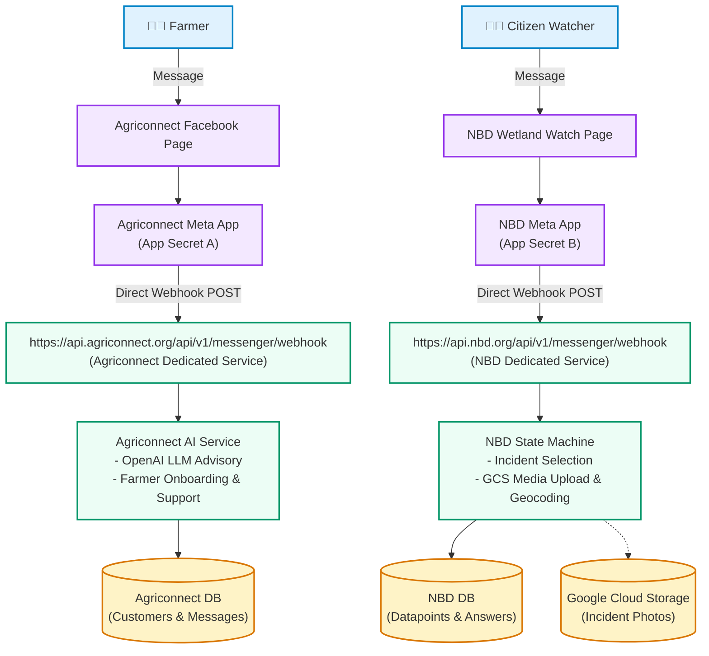
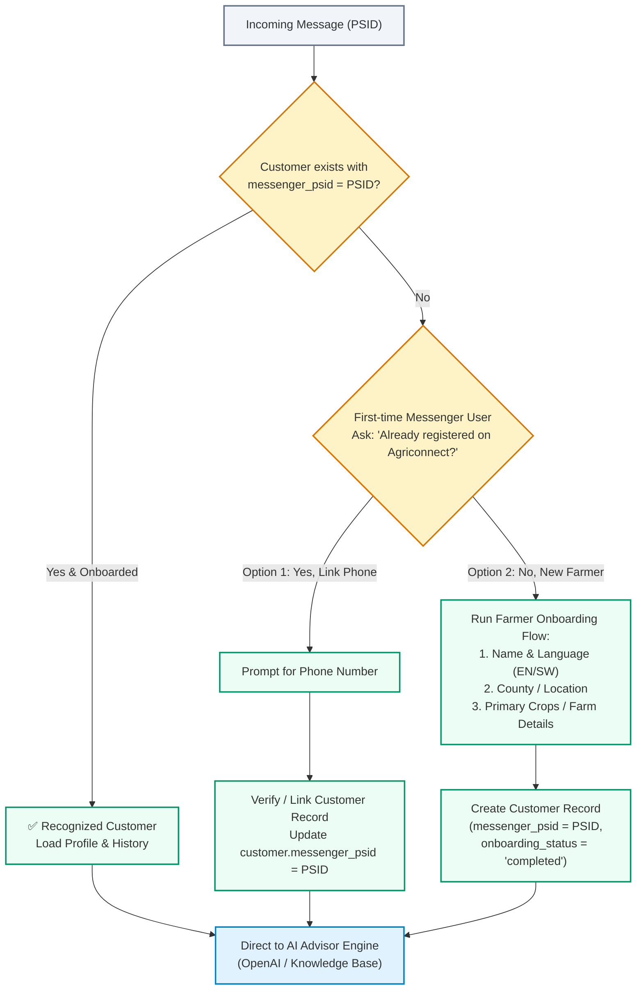
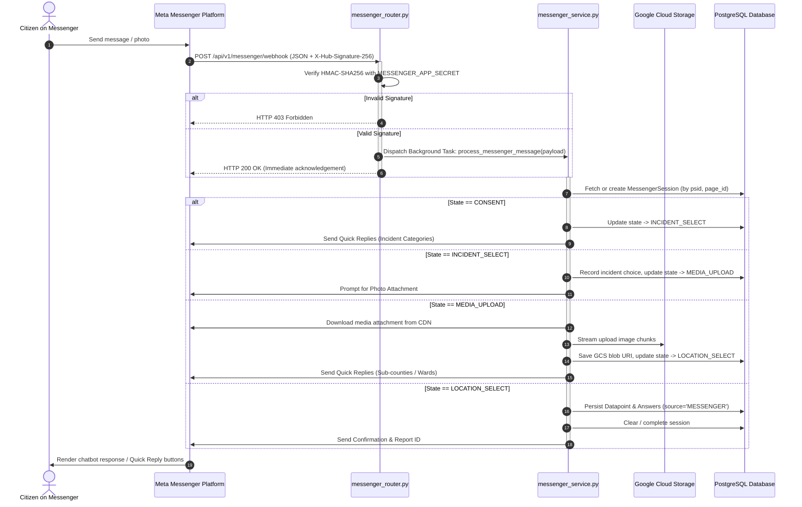

# 009 — Facebook Messenger Chatbot Data Pipeline & Multi-Tenant Integration

**Author**: Winston (Architect) & Amelia (Developer)  
**Date**: 2026-09-18  
**Initiative**: Citizen Reporter Multi-Channel Expansion (Facebook Messenger Ingestion)  
**Scope**: Backend Configuration (`messenger_config.py`), Models (`messenger_session.py`), Router (`messenger_router.py`), Service (`messenger_service.py`), GCS Storage Streaming, and Automated Test Suite (`test_messenger.py`)  
**Status**: SPECIFICATION (Phase 0 Planning)  
**Estimate**: 5.7 hours  

---

## 1. Executive Summary & 5W1H Discovery

### 1.1 Overview
This feature specification outlines the architecture, multi-tenant scaling model, security verification, pricing model, and implementation design for integrating **Facebook Messenger** as an inbound citizen environmental data collection channel for the **Nile Basin Decision Support System (NBD)** and **Agriconnect**.

### 1.2 5W1H Discovery Framework
- **Who**: 
  - **Agriconnect Tenant (`agriconnect`)**: Smallholder farmers asking for agricultural advice, crop management, weather guidance, and pest solutions.
  - **NBD Platform Tenant (`nbd-phase-1`)**: Citizen monitors, watchers, and community scientists reporting wetland pollution and water quality incidents.
- **What**: 
  - **Agriconnect Pipeline**: An AI Chatbot Helper pipeline connecting Facebook Messenger to the OpenAI/LLM agricultural advisory engine, customer onboarding, and ticket support.
  - **NBD Pipeline**: A stateful data ingestion pipeline guiding users through privacy consent, incident selection, photo evidence streaming to Google Cloud Storage (GCS), and PostGIS datapoint persistence.
- **Where**:
  - Agriconnect Service: `backend/routers/messenger.py` (`POST /api/v1/messenger/webhook`).
  - NBD Service: `backend/app/routers/messenger_router.py` (`POST /api/v1/messenger/webhook`).
- **When**: Triggered in real-time when a user sends a text message, quick reply, or image attachment to the respective Facebook Business Page.
- **Why**: 
  - **Zero Messaging Costs**: WhatsApp via Twilio incurs per-message and conversation fees; Facebook Messenger offers **$0 platform fees** within standard 24-hour customer service windows.
  - **Multi-Tenant Isolation**: Dedicated webhook endpoints per tenant ensure clear separation of concerns (AI Helper vs Environmental Ingestion).
- **How**:
  - Each tenant operates its own Facebook Page and dedicated Meta App (or routed gateway) with its own Webhook URL.
  - Inbound payloads are verified using constant-time HMAC-SHA256 (`X-Hub-Signature-256`) with the respective tenant's `MESSENGER_APP_SECRET`.
  - Background asynchronous task workers process the message, invoke the appropriate engine (AI Advisor or Data Ingestion State Machine), and reply via Meta's Graph Send API (`POST /v21.0/me/messages`).

---

## 2. Multi-Tenancy, Scalability & Pricing Architecture

### 2.1 Multi-Tenant Page Routing & Verification Model
- **Account-Level Verification**: Meta Business Verification and document upload occurs **once** at the central Meta Business Portfolio level.
- **Multiple Pages**: Under one verified Business Account, unlimited Facebook Pages can be created (e.g. *NBD Mara Basin Watch*, *NBD Sio-Siteko Watch*, *Agriconnect Kenya*). **No individual document verification is required per Page.**
- **Single App, Multi-Page Subscription**: A single central Meta App subscribes to webhooks across all tenant Facebook Pages.
- **Routing**: Inbound payloads provide `recipient.id` (Page ID). The backend dynamically resolves the tenant organization, form definition, and target basin.

### 2.1 Dedicated Meta Apps & Webhook Architecture (Chosen Model)

To achieve complete domain and service isolation, **Agriconnect** and **NBD** operate as dedicated Meta Apps with their own direct Webhook URLs:



### 2.1.1 Deep-Dive: Meta App Review Effort for Dedicated Meta Apps

When choosing **Dedicated Meta Apps with Separate Webhook URLs**, here is the exact breakdown of the Meta App Review process:

1. **Business Verification (1x Only — Shared)**:
   - Verification documents (company registration / tax ID) are submitted **once** at the central Meta Business Portfolio level. Both apps inherit this verification automatically.
2. **Per-App Review Submission (`pages_messaging` permission)**:
   For each Meta App (Agriconnect App and NBD App), submit the following in the Meta Developer Console:
   - **Privacy Policy URL & Terms**: (e.g. `agriconnect.org/privacy` and `nbd.org/privacy`).
   - **Description of Bot Functionality**:
     - *Agriconnect*: "Automated AI assistant providing agricultural advice, crop management, and farmer onboarding."
     - *NBD*: "Citizen environmental reporting bot allowing users to submit wetland pollution alerts with photo evidence."
   - **1–2 Minute Screencast Demo**: A short screen recording demonstrating a test conversation with the bot.
   - **Reviewer Test Instructions**: Simple steps for Meta's human reviewer (e.g., "Send 'Hello' to initiate the chatbot").
3. **Turnaround Time**:
   - Meta typically completes review in **24 to 72 hours**.
   - While under review, developers and test users can already use the bot in Development Mode.

---

### 2.2 User Identification, PSID Permanence & Onboarding

#### Is `sender.id` (PSID) Permanent if the User Deletes the Chat?
> [!IMPORTANT]
> **YES. The `sender.id` (PSID) is 100% permanent and NEVER changes, even if the user deletes the chat history.**
>
> A Page-Scoped ID (PSID) is a deterministic, cryptographic hash tied to the pair `(User Account, Facebook Page)`. 
> - If a user deletes their chat thread, archives it, changes phones, or messages years later, their **PSID remains identical**.
> - As a result, once a farmer or citizen completes onboarding, they remain permanently linked in the database!

#### Registration & Identification Strategy



1. **Database Model Extension**:
   - Add `messenger_psid: Column(String(64), unique=True, index=True, nullable=True)` to `customers` table.
2. **First-Time Identification Flow**:
   - **Step 1**: Incoming webhook checks `Customer.messenger_psid == sender.id`.
   - **Step 2 (Existing Farmer)**: If found and `onboarding_status == 'completed'`, the AI Advisor greets them by name and answers their agricultural query with existing farm context.
   - **Step 3 (New or Unlinked Farmer)**:
     - The bot prompts a Quick Reply: *"Welcome to Agriconnect! 🌾 Are you an existing member or a new farmer?"*
     - If **Existing Member**: Bot asks for phone number to link account (`customer.messenger_psid = PSID`).
     - If **New Farmer**: Bot triggers standard onboarding (Name, Language `en`/`sw`, County/Ward, Main Crops) and saves the customer record with `messenger_psid`.
3. **Optional Meta Profile Pre-fill**:
   - Query Meta Graph API `GET https://graph.facebook.com/v21.0/{PSID}?fields=first_name,last_name&access_token={PAGE_TOKEN}` to auto-fill their full name and reduce onboarding friction!

### 2.2 Pricing Model: Facebook Messenger vs. Twilio WhatsApp

| Channel | Inbound Messages | Outbound Replies (24h window) | Monthly Subscription / Senders |
| :--- | :--- | :--- | :--- |
| **Facebook Messenger** | **FREE ($0.00)** | **FREE ($0.00)** | **$0.00** |
| **WhatsApp via Twilio** | ~$0.005 / msg | ~$0.005 Twilio fee + Meta conversation fee (~$0.03–$0.06) | ~$15–$115/mo per Dedicated Sender |

---

## 3. System Architecture & Sequence Flow



---

## 4. Technical Specifications & Components

### 4.1 Database Model (`backend/app/models/messenger_session.py`)

```python
from sqlalchemy import Column, Integer, String, DateTime, Text
from sqlalchemy.dialects.postgresql import JSONB
from sqlalchemy.sql import func
from app.database import Base


class MessengerSession(Base):
    __tablename__ = "messenger_sessions"

    id = Column(Integer, primary_key=True, index=True)
    psid = Column(
        String(64),
        nullable=False,
        index=True,
        comment="Page-Scoped User ID from Messenger",
    )
    page_id = Column(
        String(64),
        nullable=False,
        index=True,
        comment="Facebook Page ID (Tenant & Routing Key)",
    )
    state = Column(
        String(30),
        nullable=False,
        default="CONSENT",
        comment="Current conversation state (CONSENT, INCIDENT_SELECT, MEDIA_UPLOAD, LOCATION_SELECT, DONE)",
    )
    incident_type = Column(
        String(50), nullable=True, comment="Selected incident category code"
    )
    option_text = Column(
        Text, nullable=True, comment="Human readable option text"
    )
    media_url = Column(
        String(1024), nullable=True, comment="GCS permanent blob path"
    )
    location = Column(
        String(255), nullable=True, comment="Selected sub-county or ward name"
    )
    boundary_id = Column(
        Integer, nullable=True, comment="Matched SpatialBoundary ID"
    )
    language = Column(
        String(5), nullable=False, default="en", comment="Selected locale"
    )
    answers = Column(
        JSONB, nullable=True, default=dict, comment="Form answers JSON"
    )
    current_question_id = Column(
        Integer, nullable=True, comment="Active dynamic form question ID"
    )
    created_at = Column(
        DateTime(timezone=True), server_default=func.now(), nullable=False
    )
    updated_at = Column(
        DateTime(timezone=True), onupdate=func.now(), nullable=True
    )
```

### 4.2 Configuration Dependencies (`backend/app/dependencies/messenger_config.py`)

```python
from pydantic_settings import BaseSettings, SettingsConfigDict
from pydantic import Field
from functools import lru_cache
from typing import Dict, Optional


class MessengerConfig(BaseSettings):
    model_config = SettingsConfigDict(
        env_file=".env",
        env_file_encoding="utf-8",
        case_sensitive=False,
        extra="ignore",
    )

    messenger_app_secret: str = Field(
        default="mock_app_secret", description="Meta App Secret for HMAC"
    )
    messenger_verify_token: str = Field(
        default="nbd_messenger_verify_token",
        description="Webhook GET challenge verification token",
    )
    messenger_default_page_token: str = Field(
        default="mock_page_token",
        description="Default Meta Graph API Page Access Token",
    )
    messenger_page_tokens: Optional[str] = Field(
        default=None,
        description="JSON dictionary mapping page_id to page_access_token",
    )


@lru_cache()
def get_messenger_config() -> MessengerConfig:
    return MessengerConfig()
```

### 4.3 Webhook Router & Security Guard (`backend/app/routers/messenger_router.py`)
- **GET `/api/v1/messenger/webhook`**:
  - Query parameters: `hub.mode`, `hub.verify_token`, `hub.challenge`.
  - Validates `hub.mode == "subscribe"` and `hub.verify_token == config.messenger_verify_token`.
  - Returns `Response(content=hub.challenge, media_type="text/plain", status_code=200)`.
- **POST `/api/v1/messenger/webhook`**:
  - Header: `X-Hub-Signature-256`.
  - Reads raw request body bytes and performs constant-time HMAC-SHA256 validation (`hmac.compare_digest`).
  - Dispatches `process_messenger_message` via FastAPI `BackgroundTasks`.
  - Returns `Response(content="EVENT_RECEIVED", status_code=200)`.

### 4.4 Service State Engine (`backend/app/services/messenger_service.py`)
- Handles conversational state branching.
- Sends Quick Replies and text responses via `https://graph.facebook.com/v21.0/me/messages`.
- Ingests photo attachments: streams binary from CDN to GCS bucket using `StorageService.stream_upload_async`.
- Persists completed report into `Datapoint` (with `source="MESSENGER"`) and creates `Answer` records.

---

## 5. Verification & Testing Strategy

### 5.1 Automated Test Plan (`backend/tests/test_messenger.py`)
- **Handshake Verification Test**: `GET /api/v1/messenger/webhook` returns challenge on valid token and 403 on invalid token.
- **Security HMAC-SHA256 Test**: `POST /api/v1/messenger/webhook` validates signatures and rejects forged payloads.
- **End-to-End Conversation State Test**:
  1. User starts conversation ➔ Consent prompt with Quick Replies.
  2. User accepts consent ➔ Incident selection menu.
  3. User selects incident ➔ Photo upload prompt.
  4. User sends image attachment ➔ Mocked GCS stream upload ➔ Location selection menu.
  5. User selects location ➔ Final `Datapoint` and `Answer` saved in database with `source='MESSENGER'`.
- **Multi-Tenant Routing Test**: Messages to Page ID `1001` (NBD) and Page ID `1002` (Agriconnect) route to their respective form configurations.

### 5.2 Verification Command
```bash
./dc.sh exec backend python -m pytest tests/test_messenger.py -v
```

---

## 6. Epic & Vibe Coding Estimation ⏱️

| Task ID | Component & Description | Vibe Coding (Dev) | Automated Testing | QA & Review | Total Est. Time | Priority |
| :--- | :--- | :---: | :---: | :---: | :---: | :--- |
| **TASK-01** | **Configuration & Database Model**: Add `MessengerConfig`, `MessengerSession` model and Alembic migration. | 25m | 15m | 10m | **50m (0.8h)** | P1 |
| **TASK-02** | **Webhook Router & Security Guard**: `GET` challenge handshake + `POST` HMAC-SHA256 validation. | 30m | 20m | 15m | **65m (1.1h)** | P1 |
| **TASK-03** | **Conversation State Service & Ingestion**: Quick Replies, GCS photo streaming, and Datapoint persistence. | 45m | 30m | 20m | **95m (1.6h)** | P1 |
| **TASK-04** | **Multi-Tenant Page Routing**: Dynamic Page ID resolution for NBD & Agriconnect tenants. | 25m | 20m | 15m | **60m (1.0h)** | P2 |
| **TASK-05** | **Automated Test Suite & Mocking**: Full unit test coverage in `tests/test_messenger.py` (≥90% coverage). | 30m | 25m | 15m | **70m (1.2h)** | P1 |
| **Total** | **Full Feature Delivery** | **155m** | **110m** | **75m** | **340m (5.7h)** | - |
