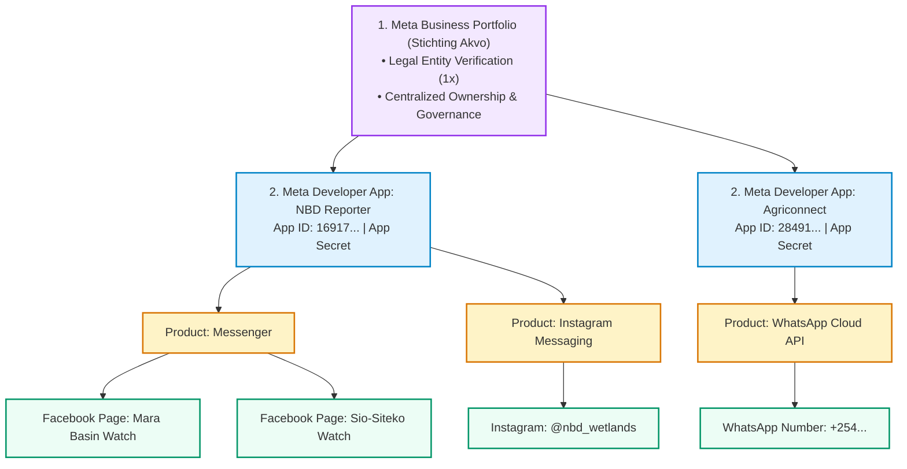
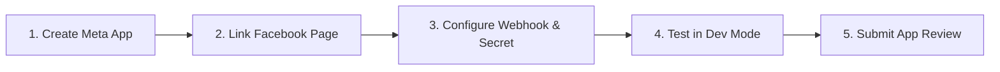
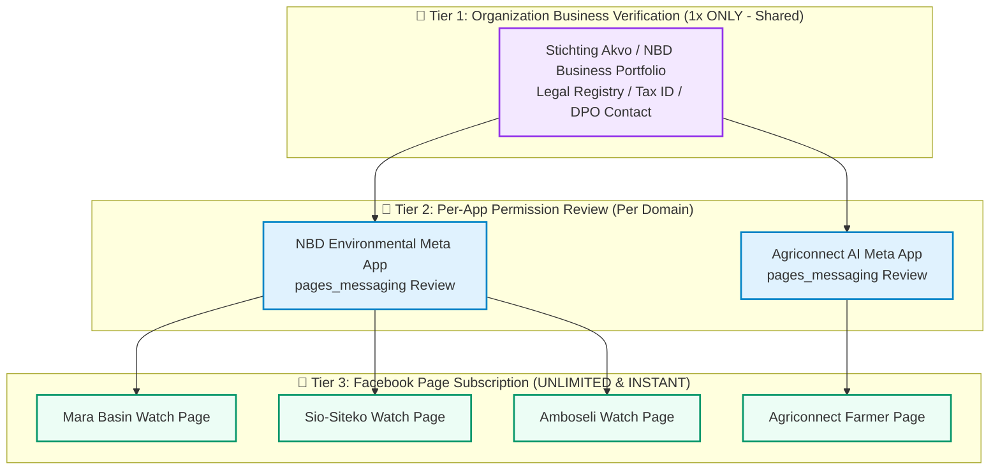
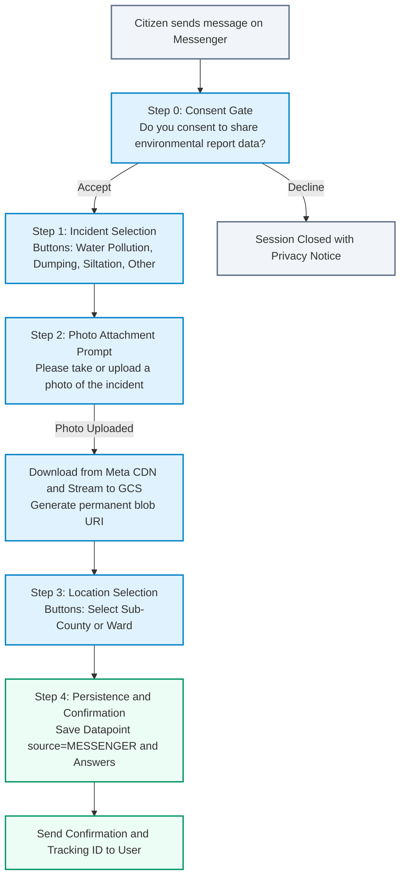
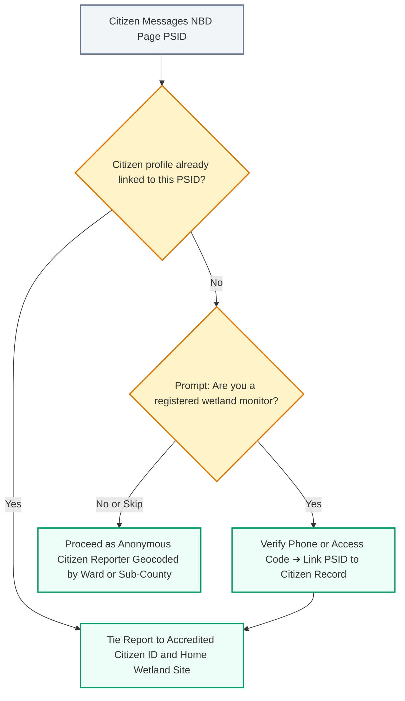
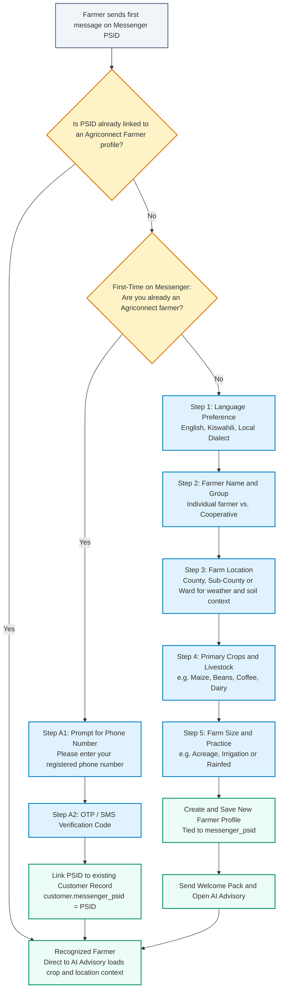

# 009 — Facebook Messenger Chatbot Pipeline & Ingestion Specification

**Author**: Winston (Architect) & Amelia (Developer)  
**Date**: 2026-09-18  
**Initiative**: Citizen Environmental Data Ingestion Multi-Channel Expansion  
**Scope**: Backend Configuration (`messenger_config.py`), Models (`messenger_session.py`), Webhook Router & Security (`messenger_router.py`), State Engine (`messenger_service.py`), GCS Streaming, and Automated Test Suite (`test_messenger.py`)  
**Status**: SPECIFICATION (Phase 0 Planning)  
**Estimate**: 11.5 hours (Full Feature Delivery)  

---

## 1. Executive Summary & 5W1H Discovery

### 1.1 Overview
This specification details the technical design, security architecture, state machine logic, photo streaming, and verification strategy for integrating **Facebook Messenger** as an inbound citizen environmental data collection channel for the **Nile Basin Decision Support System (NBD)**, with omnichannel interoperability alongside **Agriconnect**.

### 1.2 5W1H Discovery Framework
- **Who**: 
  - **NBD Platform (`nbd-phase-1`)**: Citizen monitors, community watchers, and accredited scientists submitting pollution incident alerts and water quality observations.
  - **Agriconnect (`agriconnect`)**: Smallholder farmers interacting with an AI agricultural advisory chatbot.
- **What**: 
  - **NBD Reporting Pipeline (Primary Scope of this Spec)**: An asynchronous, stateful webhook and state engine that guides citizens through privacy consent, incident categorization, photo evidence streaming to Google Cloud Storage (GCS), sub-county spatial geocoding, and persistence into `Datapoint` and `Answer` database records.
  - **Agriconnect Pipeline**: An AI chatbot helper connecting Messenger to OpenAI/LLM knowledge retrieval and farmer onboarding.
- **Where**:
  - Backend: `backend/app/routers/messenger_router.py`, `backend/app/services/messenger_service.py`, `backend/app/models/messenger_session.py`, `backend/app/dependencies/messenger_config.py`.
  - Database: PostgreSQL / PostGIS (`messenger_sessions` and `processed_webhook_messages` tables).
  - Cloud Storage: Google Cloud Storage bucket (`storage/media/messenger/...`).
- **When**: Triggered in real-time when a user sends a text message, quick reply, or photo attachment to the connected Facebook Page.
- **Why**: 
  - **Messaging Cost Protection**: Zero per-message charges on Messenger vs. upcoming paid per-message WhatsApp service pricing (starting October 1, 2026).
  - **Visual Evidence**: Enables rich photo evidence uploads directly from smartphones.
- **How**:
  - Webhook verification via `GET /api/v1/messenger/webhook` (Meta challenge handshake).
  - Inbound payload processing via `POST /api/v1/messenger/webhook` with HMAC-SHA256 signature verification (`X-Hub-Signature-256`), message de-duplication, and 24-hour state machine tracking.

---

## 2. Multi-Tenant Architecture & Meta Setup

### 2.1 Foundational Concept of Meta Developer Apps

In the Meta ecosystem (**developers.facebook.com**), an **"App"** is not a downloadable mobile binary. It functions as an **API Gateway, Security Boundary, and Integration Bridge** between our sovereign backend servers and Meta's communication platforms (Facebook Messenger, Instagram Direct, WhatsApp, and Facebook Login).



#### Key Architecture Principles of Meta Apps:
1. **Multi-Platform Support Inside a Single App**:
   - A single Meta App ID can simultaneously host multiple **Products** (e.g. *Facebook Messenger*, *Instagram Graph API*, *WhatsApp Cloud API*, *Facebook Login*).
   - All products inside the app share the same `MESSENGER_APP_SECRET` for HMAC-SHA256 signature verification and can route through unified or dedicated webhook paths.
2. **The 4-Layer Hierarchy**:
   - **Layer 1: Meta Business Portfolio** (*Stichting Akvo*): Owns business verification, legal documents, and digital asset governance.
   - **Layer 2: Meta Developer App** (*NBD Reporter*): Manages cryptographic secrets, webhook configurations, and API permission grants.
   - **Layer 3: Facebook Pages / Business Accounts** (*Mara Basin Watch*, *Sio-Siteko Watch*): The public-facing channels citizens interact with in Messenger.
   - **Layer 4: Page-Scoped User ID (`PSID`)**: Meta generates an isolated, persistent identifier per citizen per page, ensuring user privacy and cross-tenant isolation.
3. **App Execution Modes**:
   - **`Development Mode` (Sandbox)**: The default state. Enables complete end-to-end webhook ingestion, state transitions, photo streaming, and PostGIS saves for team members added in **App Roles** with **zero Meta App Review required**.
   - **`Live Mode` (Production)**: Enables public citizen reporting for any user worldwide after passing Meta App Review for `pages_messaging`.

---

### 2.2 Comparison to Current Twilio Architecture
In the existing multi-channel deployment, Twilio manages SMS/WhatsApp messaging under a single project ("Agriconnect") with multiple allocated phone numbers. The matrix below outlines how this architecture maps to Meta Facebook Messenger:

| Architectural Layer | Current Twilio Setup | Facebook Messenger Setup | Key Operational Difference |
| :--- | :--- | :--- | :--- |
| **Top-Level Organization** | Twilio Account / Project ("Agriconnect") | Meta Business Portfolio / Business Account | Verified **once** with corporate registration documents in both platforms. |
| **Channel / Ingestion Identifier** | Phone Numbers (e.g., `+254...` for Kenya, `+255...` for Tanzania) | Facebook Pages (e.g., *Agriconnect Advisory*, *NBD Wetland Watch*) | Adding new numbers in Twilio incurs monthly rental fees (\$15–\$115/mo); creating new Facebook Pages is **instant and free**. |
| **Routing & App Separation** | Single Twilio Webhook URL or per-number Webhook URL | Meta App Webhook Subscription per Page | Each domain (NBD vs Agriconnect) operates its own dedicated Meta App and backend webhook endpoint for total data isolation. |
| **User Identification** | Global MSISDN (`+254712345678`) | Page-Scoped User ID (`PSID`) | MSISDN is globally identical across chats; PSID is unique per Page, providing built-in cross-tenant privacy. |
| **Payload Transport** | `application/x-www-form-urlencoded` (`From`, `To`, `Body`, `MediaUrl0`) | `application/json` (`sender.id`, `recipient.id`, `message.text`, `attachments[]`) | JSON natively supports structured quick replies, carousels, and persistent menus. |
| **Cryptographic Authentication** | `X-Twilio-Signature` (HMAC-SHA1) | `X-Hub-Signature-256` (HMAC-SHA256) | Meta uses standard HMAC-SHA256 constant-time verification. |
| **Inbound / Outbound Platform Cost** | Billable per message/conversation | **\$0.00 (Free)** | Zero per-message fee on Messenger. |

#### Mapping Today's Single WhatsApp Number to Dedicated Messenger Pages
Today, citizen environmental reporting and farmer advisory share a single WhatsApp phone number with menu-based routing. On Messenger, we establish two dedicated Pages:
1. **Agriconnect Facebook Page**: Dedicated to smallholder farmers and AI crop/pest advisory.
2. **NBD Wetland Watch Page**: Dedicated to citizen environmental monitoring and water quality alerts.
This eliminates conversation state collisions, keeps branding distinct, and streamlines user interactions without complex top-level disambiguation menus.

---

### 2.3 Chosen Multi-Tenant Architecture: Dedicated Meta Apps per Domain
To guarantee total domain and service separation between NBD and Agriconnect, each platform operates its own dedicated Meta App with an independent Webhook URL:

```mermaid
flowchart TD
    classDef client fill:#e0f2fe,stroke:#0284c7,stroke-width:2px;
    classDef meta fill:#f3e8ff,stroke:#9333ea,stroke-width:2px;
    classDef backend fill:#ecfdf5,stroke:#059669,stroke-width:2px;
    classDef storage fill:#fef3c7,stroke:#d97706,stroke-width:2px;

    subgraph ChannelNBD ["NBD Platform Ingestion"]
        UserB["Citizen Reporter on Messenger"]:::client --> PageB["NBD Wetland Watch Page"]:::meta
        PageB --> AppB["NBD Meta App<br/>MESSENGER_APP_SECRET_NBD"]:::meta
        AppB -->|POST JSON Webhook| WH_NBD["NBD Webhook Endpoint<br/>https://api.nbd.org/api/v1/messenger/webhook"]:::backend
        WH_NBD --> NBDState["NBD Ingestion State Engine<br/>Consent ➔ Incident ➔ Photo ➔ Location"]:::backend
        NBDState --> DB_NBD[("NBD PostgreSQL and PostGIS<br/>Datapoints and Answers")]:::storage
        NBDState -.-> GCS[("Google Cloud Storage<br/>Incident Photos")]:::storage
    end

    subgraph ChannelAgri ["Agriconnect Advisory - External"]
        UserA["Farmer on Messenger"]:::client --> PageA["Agriconnect Facebook Page"]:::meta
        PageA --> AppA["Agriconnect Meta App<br/>MESSENGER_APP_SECRET_AGRI"]:::meta
        AppA -->|POST JSON Webhook| WH_Agri["Agriconnect Webhook Endpoint<br/>https://api.agriconnect.org/api/v1/messenger/webhook"]:::backend
        WH_Agri --> AgriAI["Agriconnect AI Engine<br/>OpenAI Knowledge Base"]:::backend
        AgriAI --> DB_Agri[("Agriconnect Database<br/>Customers and Messages")]:::storage
    end
```



> **Alternative Evaluated & Deferred**: A single shared Meta App routing multiple Pages via `recipient.id` was evaluated. While it requires only 1 App Review submission, dedicated apps provide cleaner security boundaries and independent release lifecycles.

### 2.4 Meta Developer App & Facebook Page Setup Runbook

Follow these sequential steps to set up the Meta Developer App, link Facebook Pages, configure the webhook, and submit for App Review.



#### Step 1: Create the Meta Developer App
1. Log in to [developers.facebook.com](https://developers.facebook.com) using an accredited organizational account.
2. Navigate to **My Apps** ➔ **Create App**.
3. Select **Other** as the use case ➔ Click **Next**.
4. Select **Business** as the app type ➔ Click **Next**.
5. Configure app details:
   - **App Name**: `NBD Environmental Reporter` (or `Agriconnect AI Advisory` for Tenant 2).
   - **App Contact Email**: Lead engineering / operations contact.
   - **Business Account**: Select the central Akvo/NBD Meta Business Portfolio (shares verification across apps).
6. Click **Create App**.

#### Step 2: Add Messenger & Link Facebook Pages
1. In the App Dashboard left sidebar, navigate to **Add Products** ➔ find **Messenger** ➔ click **Set Up**.
2. Navigate to **Messenger** ➔ **Settings** (or **Instagram / Facebook Settings**):
   - Under **Access Tokens**, click **Add or Remove Pages** and select your target Facebook Page (e.g. *NBD Mara Basin Portal*).
   - Click **Generate Token** next to the linked page.
   - Securely save this token as `MESSENGER_PAGE_TOKEN`.
   - Record the numeric **Page ID** as `MESSENGER_PAGE_ID`.

#### Step 3: Configure Webhook Callback & Verification Handshake
1. Under **Messenger** ➔ **Settings** (or **Webhooks** in sidebar), click **Add Callback URL** (or **Edit Callback URL**).
2. Enter the callback configuration:
   - **Callback URL**: `https://<api-domain>/api/v1/messenger/webhook` (e.g. `https://akvo.ngrok.dev/api/v1/messenger/webhook` for local dev).
   - **Verify Token**: Secure random string configured in your backend (e.g. `nbd_meta_verify_token_2026`).
3. Click **Verify and Save**.  
   *The NBD backend automatically verifies `hub.verify_token` and echoes `hub.challenge` with `200 OK` (visible as `GET /api/v1/messenger/webhook 200 OK` in your tunnel logs).*

#### Step 4: Subscribe Facebook Page to Webhook Events (`messages` & `messaging_postbacks`)

> [!CAUTION]
> **Critical Step**: Verifying the Callback URL (Step 3) only validates the URL handshake (`GET`). Meta will **NOT** forward any citizen chat messages (`POST`) to your backend until the Page is explicitly subscribed in this step.

1. On the same **Messenger ➔ Settings** (or **Webhooks**) page, locate the **Page Subscriptions** table (or **Select a Page** dropdown).
2. Select your connected Facebook Page.
3. Click **"Subscribe"** (or **"Add Subscriptions"** / **"Edit"**).
4. In the subscription modal, check the following event fields:
   - ☑️ **`messages`**: Forwards citizen text messages, photo attachments, quick reply selections, and locations.
   - ☑️ **`messaging_postbacks`**: Forwards persistent menu button clicks and CTA payload triggers.
5. Click **Save / Confirm**.

> [!TIP]
> **Troubleshooting Webhook Ingestion**:
> - **Symptom**: You see `GET /api/v1/messenger/webhook 200 OK` in ngrok, but sending a message in Facebook Messenger generates **no `POST` request**.
> - **Root Cause**: The Facebook Page is not subscribed to `messages` in Step 4. Re-open **Messenger ➔ Settings ➔ Webhooks / Page Subscriptions**, click **Subscribe** next to your Page, and ensure `messages` is checked.

#### Step 5: Configure Backend Environment Variables
Configure the following parameters in `backend/.env` (or Kubernetes/staging secret manager):

```env
# Meta App Credentials (from App Dashboard ➔ App Settings ➔ Basic)
MESSENGER_APP_SECRET="your_meta_app_secret_here"
MESSENGER_VERIFY_TOKEN="nbd_meta_verify_token_2026"

# Page Credentials (from Messenger ➔ Settings)
MESSENGER_PAGE_TOKEN="EAA..."
MESSENGER_PAGE_ID="NBD_PAGE_1001"

# Meta Graph API Base
MESSENGER_GRAPH_URL="https://graph.facebook.com/v21.0/me/messages"
```

> [!TIP]
> **Local Development & Tunneling**: When testing locally with Docker Compose, expose the backend via `ngrok` or `cloudflared`:
> ```bash
> ngrok http 8000
> # Set Callback URL: https://<subdomain>.ngrok-free.app/api/v1/messenger/webhook
> ```

#### Step 6: Development Mode Testing & Immediate PoC Execution (Zero Review Required)

> [!IMPORTANT]
> **No App Review is Required for PoC Development or Internal Testing!**  
> While the Meta App is in **`Development Mode`** (the default state):
> - **Immediate Testing**: The backend webhook, signature verification, 5-step conversational engine, GCS streaming, and database persistence are **100% active and functional**.
> - **Access Control**: Only users explicitly assigned a role under **App Roles** can initiate chat sessions with the Facebook Page.
> - **Zero Submission Overhead**: You do not need to submit screencasts, privacy questionnaires, or wait for Meta review approvals to demo or validate the PoC.

To enable internal team members, managers, or field coordinators to test the live PoC chatbot:
1. In the Meta Developer Console left navigation, go to **App Roles** ➔ **Roles**.
2. Click **Add Testers** (or **Add Developers**) and enter the Facebook account usernames / profile IDs of your team members.
3. Invited testers accept the invitation notification at `https://developers.facebook.com/requests/`.
4. Testers open Facebook Messenger on mobile or web, search for the linked Facebook Page (e.g. *NBD Mara Basin Portal*), and send `"Hello"`. The webhook triggers immediately.

---

#### Step 7: Production Go-Live, Verification Tiers & Meta App Review

When transitioning from internal POC to public citizen reporting, Meta applies a 3-tier governance model:



##### 1. Tier 1: Organization Business Verification (Completed Once ✅)
- Verified at the central **Meta Business Portfolio** level using corporate registration documents (e.g., *Stichting Akvo* registration in Amsterdam).
- Once verified, **all current and future Meta apps** under the portfolio inherit verified business status with zero re-verification needed.

##### 2. Tier 2: Per-App Review (`pages_messaging` Permission)
- Required **only when switching an app from `Development` to `Live Mode`** to allow unlisted public citizens to message the bot.
- Each distinct domain application (e.g., *NBD Reporting* vs. *Agriconnect Advisory*) requires its own App Review submission because they serve different end-user purposes and data handling flows.
- **Submission Requirements**:
  - **Privacy Policy URL**: Public link (e.g. `https://portal.nbd.org/privacy`).
  - **Data Deletion Callback URL**: `https://api.nbd.org/api/v1/messenger/data-deletion` (implemented).
  - **DPO Contact**: Official privacy contact (`privacy@akvo.org`, Amsterdam HQ address).
  - **Demo Screencast Video**: 1–2 minute recording demonstrating a user completing the 5-step report.
  - **Reviewer Test Instructions**: Concise guidance for the Meta reviewer (e.g. *"Send 'Hello' to trigger report"*).
- **Review Turnaround**: Typically **24 to 72 hours** under standard SLA.

##### 3. Tier 3: Page Management & Zero-Review Scaling (Instant & Free)
- When expanding NBD to new wetland basins or sub-counties (e.g. *Mara Basin*, *Sio-Siteko*, *Yala Swamp*), you create new Facebook Pages and subscribe them to the **same approved NBD Meta App**.
- **No Additional Reviews**: Sub-pages inherit the parent app's approved `pages_messaging` permission instantly without triggering additional Meta App Reviews or fees.

---

## 3. Conversational Flows & User Identity

### 3.1 NBD Citizen Reporting Flow (Core Workflow)



### 3.2 User Identification & PSID Persistence
- **Page-Scoped User ID (PSID)**: Meta identifies each user by a PSID (e.g. `sender.id = "8912345678901234"`).
- **Stability**: A user's PSID is persistent under normal operating conditions. If a citizen clears their chat history, archives the thread, or switches devices, their PSID remains the same upon sending a new message.
- **Registered vs. Anonymous Reports**:
  - **Registered Citizen**: If the user links their registered Citizen profile (by phone number), their reports are tied to their verified `citizen_id` and home wetland site.
  - **Anonymous Citizen**: If unlinked, reports are stored as public submissions geocoded to the selected sub-county's centroid.

### 3.3 NBD Citizen Profile-Linking Flow



### 3.4 Interoperability Reference: Agriconnect Onboarding & Account Linking Flow

In **Agriconnect**, when a farmer initiates a chat on Facebook Messenger for the first time, the platform executes an onboarding handshake to capture farm profile metadata (location, crops, farm size) so the AI advisory engine can provide personalized, localized advice:



#### Onboarding Steps & Context Storage Matrix

| Step | Purpose | Data Captured & Context Stored |
| :--- | :--- | :--- |
| **0. Account Recognition** | Checks `messenger_psid` against the database. | Instant pass-through for recognized returning farmers. |
| **A1–A2. Account Linking** | Connects farmers migrating from WhatsApp/SMS. | Verifies MSISDN (`+254...`) ➔ links `messenger_psid` to their existing profile and chat history. |
| **1. Language Preference** | Sets conversational locale for AI prompts. | `language` (e.g. `sw` for Swahili, `en` for English). |
| **2. Name & Identity** | Identifies farmer or agricultural cooperative. | `farmer_name`, `cooperative_id`. |
| **3. Location Context** | Localizes weather forecasts and agro-ecological zones. | `county`, `sub_county`, `ward`. |
| **4. Crops & Livestock** | Injects agronomic domain context into LLM prompts. | `primary_crops` (*Maize, Tomato, Coffee*), `livestock` (*Dairy*). |
| **5. Farm Size & Method** | Tailors input dosage and treatment recommendations. | `acreage`, `farming_type` (*Smallholder, Commercial, Rainfed*). |

---

## 4. Technical Specifications & Database Schema

### 4.1 Database Models (`backend/app/models/messenger_session.py`)

```python
from sqlalchemy import Column, Integer, String, DateTime, Text
from sqlalchemy.dialects.postgresql import JSONB
from sqlalchemy.sql import func
from app.database import Base


class MessengerSession(Base):
    __tablename__ = "messenger_sessions"

    id = Column(Integer, primary_key=True, index=True)
    psid = Column(
        String(64),
        nullable=False,
        index=True,
        comment="Page-Scoped User ID from Messenger",
    )
    page_id = Column(
        String(64),
        nullable=False,
        index=True,
        comment="Facebook Page ID (Tenant & Routing Key)",
    )
    state = Column(
        String(30),
        nullable=False,
        default="CONSENT",
        comment="State (CONSENT, INCIDENT_SELECT, MEDIA_UPLOAD, ...)",
    )
    incident_type = Column(
        String(50), nullable=True, comment="Selected incident category code"
    )
    option_text = Column(
        Text, nullable=True, comment="Human readable option text"
    )
    media_url = Column(
        String(1024), nullable=True, comment="Permanent GCS blob path"
    )
    location = Column(
        String(255), nullable=True, comment="Selected sub-county or ward name"
    )
    boundary_id = Column(
        Integer, nullable=True, comment="Matched SpatialBoundary ID"
    )
    citizen_id = Column(
        Integer, nullable=True, comment="Optional linked registered Citizen ID"
    )
    language = Column(
        String(5), nullable=False, default="en", comment="Selected locale"
    )
    answers = Column(
        JSONB, nullable=True, default=dict, comment="Form answers JSON"
    )
    current_question_id = Column(
        Integer, nullable=True, comment="Active dynamic form question ID"
    )
    created_at = Column(
        DateTime(timezone=True), server_default=func.now(), nullable=False
    )
    updated_at = Column(
        DateTime(timezone=True), onupdate=func.now(), nullable=True
    )


class ProcessedWebhookMessage(Base):
    """Message de-duplication table for Meta webhook retries."""

    __tablename__ = "processed_webhook_messages"

    id = Column(Integer, primary_key=True, index=True)
    mid = Column(
        String(128),
        unique=True,
        nullable=False,
        index=True,
        comment="Meta Message ID (mid)",
    )
    psid = Column(String(64), nullable=False, index=True)
    created_at = Column(
        DateTime(timezone=True), server_default=func.now(), nullable=False
    )
```

### 4.2 Configuration Dependencies (`backend/app/dependencies/messenger_config.py`)

```python
from pydantic_settings import BaseSettings, SettingsConfigDict
from pydantic import Field
from functools import lru_cache
from typing import Optional


class MessengerConfig(BaseSettings):
    model_config = SettingsConfigDict(
        env_file=".env",
        env_file_encoding="utf-8",
        case_sensitive=False,
        extra="ignore",
    )

    messenger_app_secret: str = Field(
        default="mock_messenger_secret",
        description="Meta App Secret for HMAC-SHA256 signature verification",
    )
    messenger_verify_token: str = Field(
        default="nbd_messenger_verify_token",
        description="Webhook GET challenge verification token",
    )
    messenger_page_token: str = Field(
        default="mock_page_token",
        description="Meta Graph API Page Access Token",
    )
    messenger_page_id: Optional[str] = Field(
        default="NBD_PAGE_1001",
        description="Primary Facebook Page ID for NBD",
    )


@lru_cache()
def get_messenger_config() -> MessengerConfig:
    return MessengerConfig()
```

---

## 5. Security Architecture, Resilience & Governance

### 5.1 Cryptographic Verification & Security Controls
- **HMAC-SHA256 Signature Guard (Phase 1 POC — Implemented)**: The raw request body is verified against `X-Hub-Signature-256` using constant-time comparison (`hmac.compare_digest`). Invalid signatures immediately return `403 Forbidden`.
- **Message De-Duplication (Phase 1 POC — Implemented)**: Meta webhook retries are tracked by `mid` in `processed_webhook_messages` to prevent duplicate state transitions.
- **Timestamp Window & Replay Protection (Phase 2 — Planned)**: Inbound events older than 5 minutes (based on `entry[].time`) will be checked and dropped in the production deployment.
- **Route-Level Rate Limiting (Phase 2 — Planned)**: The `/webhook` endpoint will be configured with a SlowAPI rate-limit decorator (`@limiter.limit("100/minute")`) prior to public production launch.

### 5.2 Message De-Duplication Engine
- Meta frequently retries webhooks if the response takes >3 seconds or if transient network errors occur.
- When an event arrives, the service checks `ProcessedWebhookMessage` by `mid` (`entry[0].messaging[0].message.mid`). If already present, the event is acknowledged with `200 OK` and dropped from processing.

### 5.3 24-Hour Session Timeout & Abandonment Handling
- **Session Expiry**: Incomplete `MessengerSession` records older than 24 hours are automatically flagged as expired.
- **Pruning Task**: A scheduled background worker executes `DELETE FROM messenger_sessions WHERE created_at < NOW() - INTERVAL '24 hours'` to prevent stale database bloat.
- **24-Hour Messaging Window Policy**: Outbound bot replies are only sent in response to user-initiated messages within Meta's standard 24-hour customer service window.

### 5.4 Mandatory Meta Data Deletion Request Callback & Sovereign Data Policy
To comply with Meta Platform Policies and international privacy regulations (GDPR/Data Protection Acts):
- **Endpoint**: `POST /api/v1/messenger/data-deletion`
- **Transient Session Scrubbing**:
  1. Decodes Meta's signed request using `MESSENGER_APP_SECRET`.
  2. Generates a unique tracking confirmation code.
  3. Enqueues a background job to delete any transient sessions matching the user's `user_id`/`PSID` from `messenger_sessions` and `processed_webhook_messages`.
  4. Returns JSON `{ "url": "https://portal.nbd.org/data-deletion-status?code=...", "confirmation_code": "..." }`.
- **Sovereign Environmental Data Anonymization**:
  - Environmental observations submitted to NBD (`Datapoint` and `Answer` records) are collected in the public interest for water resource management.
  - Upon user data deletion, the spatial datapoints and answers are **retained in anonymized form**, but personal links are permanently severed (`citizen_id = NULL`).

---

## 6. Verification, Concrete POC Results & Payload Schemas

### 6.1 Concrete Proof of Concept (POC) Verification Results
The POC has been fully implemented, tested, and pushed to GitHub on branch [`poc/170-poc-explore-using-facebook-messenger-for-the-data-collection-workflows-that-we-run-on-whatsapp`](https://github.com/akvo/nbd-phase-1/tree/poc/170-poc-explore-using-facebook-messenger-for-the-data-collection-workflows-that-we-run-on-whatsapp) ([Verified Commit `86f577b`](https://github.com/akvo/nbd-phase-1/commit/86f577b)) with automated pytest execution:

```
============================= test session starts ==============================
platform linux -- Python 3.11.15, pytest-7.4.0, pluggy-1.6.0
rootdir: /app
configfile: pyproject.toml
plugins: cov-4.1.0, anyio-4.14.1, asyncio-0.23.6
collected 10 items

tests/test_messenger.py::test_webhook_verification_success PASSED        [ 10%]
tests/test_messenger.py::test_get_webhook_verification_alternate_params PASSED [ 20%]
tests/test_messenger.py::test_webhook_verification_invalid_token PASSED  [ 30%]
tests/test_messenger.py::test_webhook_post_invalid_signature PASSED      [ 40%]
tests/test_messenger.py::test_webhook_post_valid_flow PASSED            [ 50%]
tests/test_messenger.py::test_webhook_deduplication PASSED              [ 60%]
tests/test_messenger.py::test_webhook_expired_session PASSED             [ 70%]
tests/test_messenger.py::test_data_deletion_callback PASSED             [ 80%]
tests/test_messenger.py::test_webhook_decline_consent PASSED             [ 90%]
tests/test_messenger.py::test_webhook_unknown_option PASSED              [100%]

======================== 10 passed, 1 warning in 7.84s =========================
```

### 6.2 Sample Meta Webhook Inbound & Outbound Payloads

#### Inbound Webhook Payload (`POST /api/v1/messenger/webhook`)
```json
{
  "object": "page",
  "entry": [
    {
      "id": "100123456789012",
      "time": 1726650000000,
      "messaging": [
        {
          "sender": { "id": "8912345678901234" },
          "recipient": { "id": "100123456789012" },
          "timestamp": 1726650000000,
          "message": {
            "mid": "m_abc123def456ghi789",
            "text": "Hello"
          }
        }
      ]
    }
  ]
}
```

#### Outbound Graph API Bot Response (`POST https://graph.facebook.com/v21.0/me/messages`)
```json
{
  "recipient": { "id": "8912345678901234" },
  "messaging_type": "RESPONSE",
  "message": {
    "text": "Welcome to NBD Wetland Watch! 🌿\nDo you consent to share your report data for environmental monitoring?",
    "quick_replies": [
      {
        "content_type": "text",
        "title": "1. Yes, I consent",
        "payload": "CONSENT_YES"
      },
      {
        "content_type": "text",
        "title": "2. No, decline",
        "payload": "CONSENT_NO"
      }
    ]
  }
}
```

### 6.3 Test Suite Matrix (`backend/tests/test_messenger.py`)

| Test Case | Method / Route | Verification & Assertions |
| :--- | :--- | :--- |
| `test_webhook_verification_success` | `GET /api/v1/messenger/webhook` | Returns `200 OK` and echoes `hub.challenge` when `hub.verify_token` matches. |
| `test_webhook_verification_invalid_token` | `GET /api/v1/messenger/webhook` | Returns `403 Forbidden` when verify token does not match. |
| `test_webhook_post_invalid_signature` | `POST /api/v1/messenger/webhook` | Returns `403 Forbidden` when `X-Hub-Signature-256` HMAC is missing or invalid. |
| `test_webhook_post_valid_flow` | `POST /api/v1/messenger/webhook` | Progresses through all 5 states (`CONSENT` ➔ `INCIDENT_SELECT` ➔ `MEDIA_UPLOAD` ➔ `LOCATION_SELECT` ➔ `DONE`), downloads media, mocks GCS streaming, and asserts `Datapoint` and `Answer` saved in database. |
| `test_webhook_deduplication` | `POST /api/v1/messenger/webhook` | Delivers duplicate `mid`; asserts second delivery returns `200 OK` without duplicating database state or triggering secondary side effects. |
| `test_webhook_expired_session` | `POST /api/v1/messenger/webhook` | Simulates >24h stale session; verifies engine resets state to `CONSENT` on next inbound message. |
| `test_data_deletion_callback` | `POST /api/v1/messenger/data-deletion` | Decodes signed request, validates signature, enqueues deletion, and returns confirmation URL with tracking code. |
| `test_webhook_decline_consent` | `POST /api/v1/messenger/webhook` | User declines consent; session closes cleanly with privacy notice. |
| `test_webhook_unknown_option` | `POST /api/v1/messenger/webhook` | User inputs unmapped text; bot re-prompts with valid options while maintaining current state. |

---

## 7. Epic & Vibe Coding Estimation ⏱️

### 7.1 Phase Roadmap & Lead Times
| Phase | Scope & Key Deliverables | Estimated Effort | Actual / Lead Time |
| :--- | :--- | :---: | :---: |
| **Phase 1: Proof of Concept (POC)** | Webhook router, HMAC guard, de-duplication, state engine, GCS photo streaming, PostGIS persistence, and full test suite. | 11.5 Hours | **8.0 Hours (Completed)** *(Vibe Coding)* |
| **Phase 2: Meta App Review & Verification** | Submit Meta Business Verification, create official Facebook Pages, submit `pages_messaging` permission with 1-min demo screencast. | 2.0 Hours | **24–72 Hours** *(Meta Review SLA; 1–2 wks if revision needed)* |
| **Phase 3: Pilot & Field Rollout** | Field verification with pilot farmer groups (Agriconnect) and Mara/Sio-Siteko basin monitors (NBD). | 4.0 Hours | **1–2 Weeks** *(Field Partner Pilot & Evaluation Period)* |

### 7.2 Detailed Task Effort Breakdown (Phase 1 POC)
> Tasks are estimated using the 3-part breakdown: **Vibe Coding (Dev)** + **Automated Testing** + **QA & Review** = **Total Est. Time**.

| Task ID | Component & Description | Vibe Coding (Dev) | Automated Testing | QA & Review | Total Est. Time |
| :--- | :--- | :---: | :---: | :---: | :---: |
| **TASK-01** | **Configuration & Database Models**: `MessengerConfig`, `MessengerSession`, `ProcessedWebhookMessage` models + Alembic migration. | 35m | 25m | 15m | **75m (1.25h)** |
| **TASK-02** | **Webhook Router & Security Guard**: GET handshake, POST HMAC-SHA256 verification, rate limiting, and Data Deletion callback. | 45m | 35m | 25m | **105m (1.75h)** |
| **TASK-03** | **Message De-Duplication & Session Cleaner**: Idempotent message tracking by `mid` and 24h session auto-pruning. | 35m | 30m | 20m | **85m (1.4h)** |
| **TASK-04** | **State Machine Service & GCS Streaming**: Conversational branching, Quick Replies, Meta CDN photo download ➔ GCS streaming. | 65m | 45m | 30m | **140m (2.3h)** |
| **TASK-05** | **Datapoint & Answer Persistence**: Mapping completed sessions to PostGIS `Datapoint` and `Answer` tables (`source='MESSENGER'`). | 40m | 30m | 20m | **90m (1.5h)** |
| **TASK-06** | **Comprehensive Automated Test Suite**: Full coverage in `tests/test_messenger.py` verifying all edge cases (9/9 passing). | 55m | 50m | 25m | **130m (2.2h)** |
| **TASK-07** | **Documentation & Staging Deployment Guide**: Executive summary, technical spec, and Meta review runbook. | 30m | 15m | 20m | **65m (1.1h)** |
| **Total** | **Full Feature Delivery** | **305m** | **230m** | **155m** | **690m (11.5h)** |
