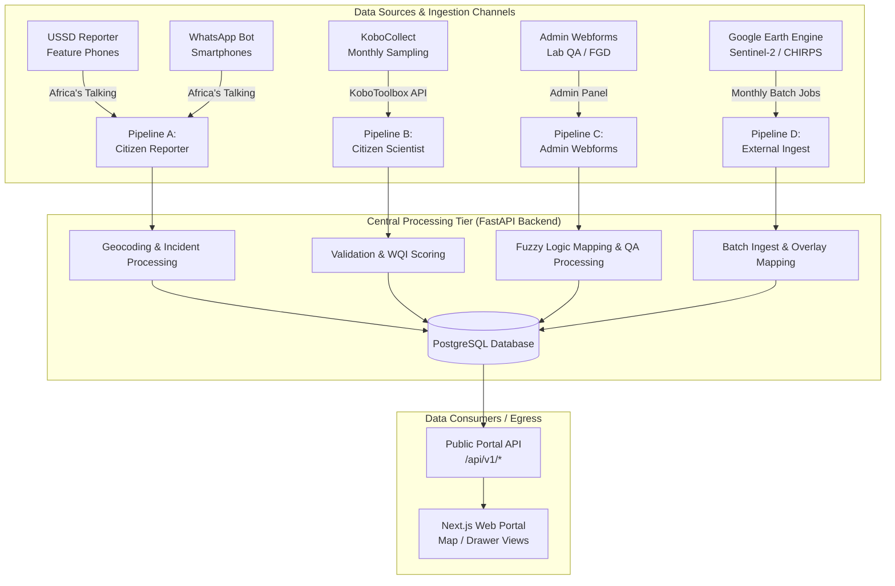
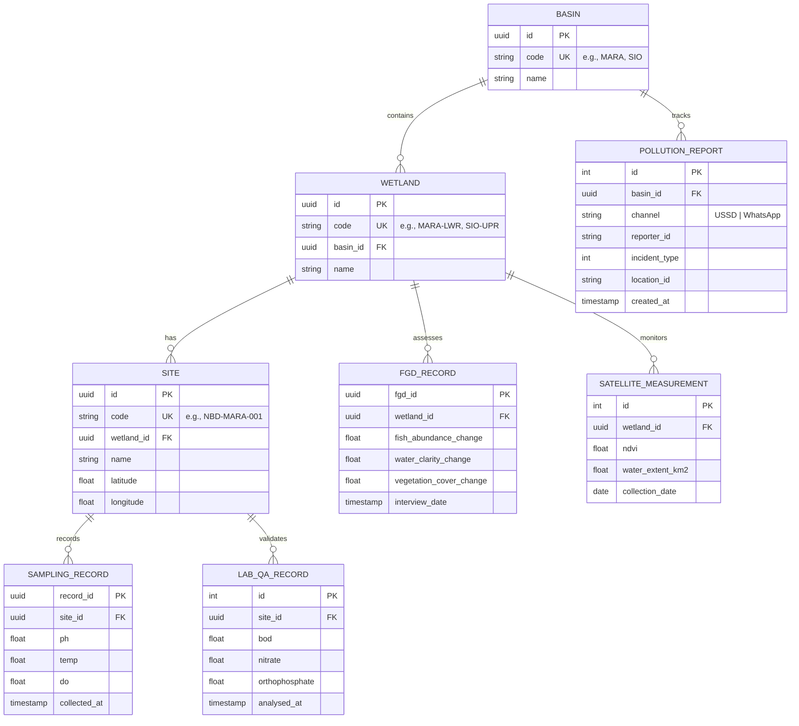

# Schema API Contract: Nile Basin Wetland Monitoring Platform

## 1. Document Overview and Scope

This document defines the formal data structures and API contracts for the Nile Basin Citizen-Led Data Platform (Phase 1). The platform is a centralised technical repository designed to ingest and manage environmental data across transboundary pilot sites, specifically within the Mara and Sio-Siteko basins.

This contract specifies four primary ingest pipelines:

1. **Pipeline A: Citizen Reporter** (Pollution alerts via USSD and WhatsApp).
2. **Pipeline B: Citizen Scientist** (Structured monthly sampling via KoboCollect).
3. **Pipeline C: Admin Webforms** (Laboratory QA and Indigenous Knowledge/FGD).
4. **Pipeline D: External Data Ingest** (Satellite Earth Observation and Climate data).

All schemas are meticulously aligned with the `akvo-react-form` specification and the NBD Solution Design Document. Implementation must adhere to these definitions to ensure interoperability between the mobile collection layer and the administrative processing tier. All specifications are provided in English (United Kingdom).

---

## 2. Ingest Pipelines Architecture & Data Flow



---

## 3. Pipeline A Architectural Analysis: USSD vs. WhatsApp

The "Citizen Reporter" channel is designed for rapid, low-barrier incident reporting. While both channels serve the same backend purpose, their architectural constraints necessitate distinct processing models.

### 3.1 Technical Comparison of Channels

| Dimension | USSD (Feature Phone) | WhatsApp (Smartphone) |
| :--- | :--- | :--- |
| **Network Requirement** | GSM Voice network only | Mobile Data (TCP/IP) |
| **Hardware Support** | Any basic GSM handset | Android 7.0+ / iOS 12+ |
| **Media Capabilities** | Text-only branching menus | Photos, voice notes, and text |
| **Geospatial Processing** | Server-side geocoding (Menu-based) | Server-side geocoding (Menu/GPS) |
| **User Interaction Model** | Synchronous session-based | Asynchronous bot-driven |

### 3.2 Gateway and Geocoding Logic

* **Africa's Talking (Telco Gateway)**: Africa's Talking acts as the unified "Telco Gateway". For USSD, it manages the short-code session state (e.g., Dial `*123#` - placeholder for NBD-allocated short code). For WhatsApp, it serves as the webhook provider, delivering incoming payloads to the FastAPI backend.
* **Geocoding Logic**:
  * **USSD**: Due to the lack of GPS hardware on feature phones, the user selects a sub-county from a hierarchical menu. The backend maps this `location_id` to a specific geospatial coordinate or polygon for storage.
  * **WhatsApp**: Users are prompted for their sub-county via the bot to maintain parity with the USSD pipeline, but have the option to provide higher-fidelity data via GPS-stamped media attachments.

---

## 4. Pipeline A: Citizen Reporter Schema (Pollution Reporting)

This pipeline ingests incident-based alerts. The schema is optimised for high-speed reporting of sudden ecological changes.

### 4.1 JSON Schema Definition (`akvo-react-form` compatible)

```json
{
  "name": "Pollution Reporting Form",
  "question_group": [
    {
      "id": 1,
      "order": 1,
      "name": "Incident Details",
      "question": [
        {
          "id": "incident_type",
          "order": 1,
          "type": "option",
          "name": "Report a change in water",
          "required": true,
          "option": [
            { "name": "Water colour suddenly became darker/murkier", "value": 1 },
            { "name": "Water is smelling bad", "value": 2 },
            { "name": "Many dead fishes or animals in the river", "value": 3 },
            { "name": "Water level is too high (storm event)", "value": 4 },
            { "name": "Water level is too low after low flows", "value": 5 }
          ]
        },
        {
          "id": "location_id",
          "order": 2,
          "type": "cascade",
          "name": "Select Sub-County",
          "required": true,
          "endpoint": "/api/v1/reference/sub-counties",
          "comment": "External API dependency for hierarchical sub-county list"
        }
      ]
    }
  ]
}
```

### 4.2 Submission Payload (USSD)

```json
{
  "channel": "USSD",
  "reporter_id": "HASHED_PHONE_ID",
  "payload": {
    "incident_type": 1,
    "location_id": "KEN-MARA-001",
    "timestamp": "2026-06-15T10:30:00Z"
  }
}
```

### 4.3 Submission Payload (WhatsApp)

```json
{
  "channel": "WhatsApp",
  "reporter_id": "HASHED_PHONE_ID",
  "payload": {
    "incident_type": 3,
    "location_id": "KEN-MARA-001",
    "text_comment": "Observed near the bridge.",
    "media_attachments": [
      {
        "type": "photo",
        "url": "https://storage.nbd.org/media/photo_001.jpg"
      },
      {
        "type": "voice_note",
        "url": "https://storage.nbd.org/media/voice_001.ogg"
      }
    ]
  }
}
```

---

## 5. Pipeline B: Citizen Scientist Schema (Monthly Sampling)

This pipeline ingests physico-chemical, ecological, and hydrological data collected via KoboCollect.

### 5.1 JSON Schema Definition

```json
{
  "name": "Monthly Wetland Sampling",
  "question_group": [
    {
      "id": 1,
      "order": 1,
      "name": "Site Details",
      "question": [
        { "id": "sampling_id", "order": 1, "type": "input", "name": "Sampling ID", "required": true },
        { "id": "site_photo", "order": 2, "type": "image", "name": "Site Photo" },
        { "id": "location", "order": 3, "type": "geo", "name": "GPS Reading", "required": true }
      ]
    },
    {
      "id": 2,
      "order": 2,
      "name": "Water Quality",
      "question": [
        {
          "id": "ph",
          "order": 1,
          "type": "number",
          "name": "pH Level",
          "rule": { "min": 2, "max": 10, "allowDecimal": true }
        },
        {
          "id": "temp",
          "order": 2,
          "type": "number",
          "name": "Water Temperature (°C)",
          "rule": { "min": 5, "max": 50, "allowDecimal": true }
        },
        {
          "id": "do",
          "order": 3,
          "type": "number",
          "name": "Dissolved Oxygen (mg/L)",
          "rule": { "min": 0.5, "max": 35, "allowDecimal": true }
        }
      ]
    },
    {
      "id": 3,
      "order": 3,
      "name": "Catchment",
      "question": [
        { "id": "crops", "order": 1, "type": "text", "name": "Crops grown in catchment" },
        { "id": "plants", "order": 2, "type": "text", "name": "Plant species in catchment" }
      ]
    },
    {
      "id": 4,
      "order": 4,
      "name": "Ecological",
      "question": [
        { "id": "invasive_percent", "order": 1, "type": "number", "name": "% Invasive Macrophytes" },
        { "id": "target_species", "order": 2, "type": "input", "name": "Main fish species (X)" },
        { "id": "total_catch", "order": 3, "type": "number", "name": "Total species caught (Y)" },
        { "id": "fishing_effort", "order": 4, "type": "number", "name": "Active fishing hours" }
      ]
    },
    {
      "id": 5,
      "order": 5,
      "name": "Hydrological",
      "question": [
        {
          "id": "water_level",
          "order": 1,
          "type": "option",
          "name": "Water Level",
          "option": [
            { "name": "High", "value": "high" },
            { "name": "Medium", "value": "medium" },
            { "name": "Low", "value": "low" }
          ]
        }
      ]
    }
  ]
}
```

### 5.2 Submission Payload: Site Visit NBD-MARA-001

> [!NOTE]
> Derived CPUE scores must not be included in the ingest payload; scoring is performed server-side.

```json
{
  "site_id": "NBD-MARA-001",
  "group_responses": {
    "site_details": {
      "sampling_id": "SAMP-2026-06-001",
      "location": { "lat": -1.523, "lng": 34.122 }
    },
    "water_quality": {
      "ph": 7.8,
      "temp": 23.25,
      "do": 4.77
    },
    "ecological": {
      "invasive_percent": 25,
      "target_species": "Tilapia",
      "total_catch": 12,
      "fishing_effort": 3.5
    },
    "hydrological": {
      "water_level": "medium"
    }
  }
}
```

### 5.3 Customisation & Moderation Mapping Rules

When modifying or extending the Monthly Wetland Sampling questionnaire, developers and admins must respect the following mapping constraints:

* **Question Identifiers (`Question.name`)**: The backend submission moderation router relies on exact question identifier matches (`ph`, `temp`, `do`, `invasive_percent`, `water_level`) to parse values and insert them into the structured `sampling_records` database table upon approval.
  * Changing the order or display labels of these questions in the form blueprint is completely safe.
  * If any of these five question names/identifiers are modified in the form blueprint, the matching logic inside the backend code (`submission_router.py`) must be updated accordingly.
* **Adding New Parameters**: Any new parameters added to the questionnaire in the future (e.g. salinity, turbidity) will require:
  * A database migration to add corresponding columns in the `sampling_records` table.
  * Updating the extraction loop in `submission_router.py` to map the new answer value to the new database column.

---

## 6. Pipeline C: Admin Webforms (Lab QA and FGD)

These internal schemas handle shadow-validation by academic partners and qualitative indigenous knowledge capture.

### 6.1 Lab QA Report Schema

This schema includes heavy metal and nutrient parameters for professional laboratory validation.

```json
{
  "name": "Lab QA Report",
  "question_group": [
    {
      "id": 1,
      "order": 1,
      "name": "Chemical & Nutrient Analysis",
      "question": [
        { "id": "bod", "type": "number", "name": "Biochemical Oxygen Demand (BOD)", "rule": { "allowDecimal": true } },
        { "id": "orthophosphate", "type": "number", "name": "Orthophosphate", "rule": { "allowDecimal": true } },
        { "id": "nitrate", "type": "number", "name": "Nitrate", "rule": { "allowDecimal": true } },
        { "id": "mercury", "type": "number", "name": "Mercury", "rule": { "allowDecimal": true } },
        { "id": "heavy_metals", "type": "text", "name": "Heavy Metals (Description/PPM)" },
        { "id": "total_nitrogen", "type": "number", "name": "Total Nitrogen (N)", "rule": { "allowDecimal": true } },
        { "id": "total_phosphorus", "type": "number", "name": "Total Phosphorus (P)", "rule": { "allowDecimal": true } }
      ]
    }
  ]
}
```

### 6.2 Indigenous Knowledge (FGD) Schema

Captured during Monthly Barazas, this schema integrates qualitative biodiversity and social metadata into the platform.

```json
{
  "name": "Indigenous Knowledge Record",
  "question_group": [
    {
      "id": 1,
      "order": 1,
      "name": "Contextual Metadata",
      "question": [
        {
          "id": "dependent_population",
          "type": "option",
          "name": "Dependant Population",
          "option": [
            { "name": "500-1000", "value": 1 },
            { "name": "1000-2000", "value": 2 },
            { "name": ">2000", "value": 3 }
          ]
        },
        { "id": "wetland_uses", "type": "text", "name": "Different uses of the wetland" },
        { "id": "major_threats", "type": "text", "name": "Major anthropogenic/natural threats" },
        { "id": "land_use", "type": "text", "name": "Primary land use in the area" },
        { "id": "area", "type": "text", "name": "Approximate area of the wetland" }
      ]
    },
    {
      "id": 2,
      "order": 2,
      "name": "Fuzzy Logic Dimensions",
      "question": [
        {
          "id": "fish_abundance_change",
          "type": "option",
          "name": "Fish Abundance Trend",
          "option": [
            { "name": "Same or increased", "value": 0.0 },
            { "name": "Slightly declined", "value": 0.3 },
            { "name": "Moderately declined", "value": 0.6 },
            { "name": "Severely declined", "value": 1.0 }
          ]
        },
        {
          "id": "water_clarity_change",
          "type": "option",
          "name": "Water Clarity Trend",
          "option": [
            { "name": "Same or clearer", "value": 0.0 },
            { "name": "Somewhat worse", "value": 0.5 },
            { "name": "Much worse", "value": 1.0 }
          ]
        },
        {
          "id": "vegetation_cover_change",
          "type": "option",
          "name": "Vegetation Cover Trend",
          "option": [
            { "name": "Same or more", "value": 0.0 },
            { "name": "Partially lost", "value": 0.4 },
            { "name": "Severely lost", "value": 1.0 }
          ]
        },
        {
          "id": "biodiversity_change",
          "type": "option",
          "name": "Biodiversity Change Trend",
          "option": [
            { "name": "Declined a little bit", "value": 0.3 },
            { "name": "Moderate decline", "value": 0.6 },
            { "name": "Rapid decline", "value": 1.0 }
          ]
        },
        { "id": "floods_regularity_change", "type": "text", "name": "Has floods in and around the wetland become more regular over the last 10 years?" },
        { "id": "spawning_period_change", "type": "text", "name": "Have the fish-spawning periods in the wetland changed over the last 10 years?" },
        { "id": "papyrus_growth_change", "type": "text", "name": "Have the Papyrus growth cycles of the wetland changed over the last 10 years?" }
      ]
    },
    {
      "id": 3,
      "order": 3,
      "name": "Historical and Local Practices",
      "question": [
        {
          "id": "earlier_fish_types",
          "type": "text",
          "name": "Earlier how many types of fishes did you capture/observe? Please name the prominent ones."
        },
        {
          "id": "earlier_bird_varieties",
          "type": "text",
          "name": "How many bird varieties did you observe? Please name the prominent ones."
        },
        {
          "id": "earlier_plant_types",
          "type": "text",
          "name": "How many types of plants did you observe? Please name the prominent ones."
        },
        {
          "id": "historical_prediction_methods",
          "type": "text",
          "name": "How did you predict floods or droughts in the olden days?"
        },
        {
          "id": "riverbank_erosion_prevention",
          "type": "text",
          "name": "How did you prevent riverbank erosion earlier?"
        },
        {
          "id": "soil_moisture_preservation",
          "type": "text",
          "name": "How did you preserve moisture and/or organic matter in the soil in the olden days?"
        }
      ]
    }
  ]
}
```

---

## 7. Pipeline D: External Data Ingest (Satellite & Climate)

Data arrives via monthly batch jobs from Google Earth Engine (GEE).

### 7.1 GEE Output Schema

```json
{
  "external_data": [
    {
      "id": "ndvi_record",
      "source": "Sentinel-2",
      "parameters": {
        "ndvi": 0.72,
        "water_extent_km2": 420.5
      },
      "metadata": {
        "provenance": "Google Earth Engine",
        "collection_date": "2026-06-01",
        "version": "1.0"
      }
    },
    {
      "id": "precip_record",
      "source": "CHIRPS",
      "parameters": {
        "precipitation_mm": 120.4
      },
      "metadata": {
        "provenance": "UCSB Climate Hazards Center",
        "collection_date": "2026-06-01",
        "version": "2.0"
      }
    }
  ]
}
```

---

## 8. Data Interoperability & Entity Relationships

The technical "glue" of the platform is a structured hierarchy of identifiers that allow for data joining without manual field mapping.

### 8.1 Primary Interoperability Keys

| Key | Technical Format | Pipeline Association |
| :--- | :--- | :--- |
| **`id` (Site)** | `UUID` | Monthly Sampling, Lab QA, Health Scores |
| **`id` (Wetland)** | `UUID` | FGD/IK Records, Sentinel NDVI/Extent |
| **`id` (Basin)** | `UUID` | Pollution Reports, CHIRPS Precipitation |
| **`code` (Slug)** | `VARCHAR(50)` (e.g. `MARA`, `NBD-MARA-001`) | Natural string keys used in URLs, USSD, and forms |

### 8.2 Interoperability Mapping



---

## 9. API Contract & Versioning Policy

### 9.1 Implementation Rules

* **Versioning Strategy**: Endpoints are prefixed with `/api/v1/`.
* **Stability**: The `v1` contract is immutable. Breaking changes require `/api/v2/` with a 12-month deprecation period.
* **Public Read-Only Endpoints**:
  * `GET /api/v1/sites`: Metadata and current health classes.
  * `GET /api/v1/incidents`: Aggregated pollution alerts (PII-stripped).
* **Rate Limiting**: 60 requests per minute per IP.
* **Data Privacy**: All PII (Phone Numbers) must be stripped from public projections.

### 9.2 Standard Error Responses

#### 400 Bad Request (Validation Failure)

```json
{
  "error": "VALIDATION_ERROR",
  "message": "The provided value is outside the permissible range.",
  "details": [
    { "field": "ph", "rule": "min:2, max:10", "rejected_value": 11.2 }
  ]
}
```

#### 429 Too Many Requests (Rate Limiting)

```json
{
  "error": "RATE_LIMIT_EXCEEDED",
  "message": "Fair-use limit of 60 requests per minute exceeded. Please retry after 30 seconds."
}
```
