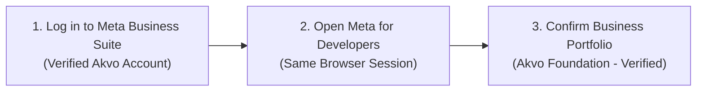
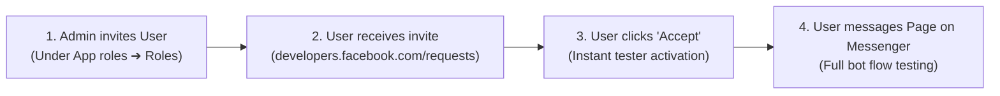
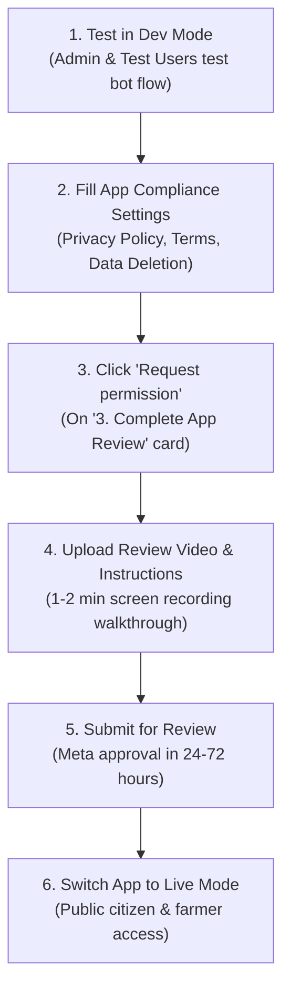

# Meta (Facebook) Messenger Setup & Verification Guide

**Target Audience:** Technical Program Managers (TPMs), Lead Developers, and QA Engineers.  
**Applicability:** NBD, Agriconnect, and all Akvo platforms using Meta Messenger for conversational data collection.  
**Scope:** Configuring the Meta Business Portfolio, Facebook Page, Meta Developer App, Webhook Subscription, and completing Meta App Review / Verification.

---

## 1. Overview & Setup Prerequisites

This guide covers the administrative and Meta Developer configuration required to connect a Facebook Page to an Akvo platform backend and publish it for public use.

### Prerequisites:
- **Verified Akvo Meta Business Account**: Admin access to the verified Akvo Business Portfolio on Meta.
- **Deployed Backend Webhook**: A running backend with HTTPS webhook endpoint:
  - Webhook Endpoint: `https://<api-domain>/api/v1/messenger/webhook`
- **Public Compliance Links**:
  - Privacy Policy URL (e.g. `https://platform.akvo.org/privacy`)
  - Terms of Service URL (e.g. `https://platform.akvo.org/terms`)
  - User Data Deletion URL (either the automated backend callback `https://<api-domain>/api/v1/messenger/data-deletion` or a static deletion instructions webpage)

> [!NOTE]
> **Why is a Data Deletion URL required?**
> Under [Meta Platform Terms (Section 4.a - Data Retention and Deletion)](https://developers.facebook.com/terms/) and GDPR regulations, Meta mandates that every Facebook-integrated application must give users a way to request deletion of their data.
> When a user goes to their Facebook profile under *Settings ➔ Apps and Websites* and removes your app/bot, Meta triggers this request.
> Meta provides two compliant options in the App Dashboard (see [Meta Data Deletion Callback Guide](https://developers.facebook.com/docs/development/create-an-app/app-dashboard/data-deletion-callback/)):
> 1. **Data Deletion Callback URL**: Meta sends an automated signed POST request to `https://<api-domain>/api/v1/messenger/data-deletion`. The backend decodes the payload, deletes any transient conversational sessions for that user ID, and returns a confirmation code.
> 2. **Data Deletion Instructions URL**: A static webpage URL on your site explaining manual steps to contact Akvo (e.g. via email) to request data erasure.
> *Configuring one of these options is mandatory for Meta App Review approval.*

---

## 2. Phase 1: Meta Business & Developer Access



### Step 1.1: Log in to Meta Business Suite
1. Open a browser session and log in to [Meta Business Suite](https://business.facebook.com/).
2. Use the **verified Akvo corporate Facebook account** (or your personal Facebook account with Portfolio Admin privileges).
3. Ensure Two-Factor Authentication (2FA) is completed.
4. Verify you are operating within the **Akvo Business Portfolio** using the business switcher dropdown at the top-left (confirm `Akvo` or `Akvo Foundation`).

### Step 1.2: Open Meta for Developers in the Same Browser
1. In the **same browser session/tab**, open [Meta for Developers](https://developers.facebook.com/).
2. Your login session will automatically carry over. If prompted, confirm registration to link your developer profile to the Akvo business entity.

---

## 3. Phase 2: Facebook Page & Meta Developer App Setup

### Step 2.1: Create or Connect a Facebook Page
1. In [Meta Business Suite ➔ Pages](https://business.facebook.com/latest/settings/pages) (or [Facebook Pages](https://www.facebook.com/pages/create)):
   - Create a new public page or select an existing page representing the initiative (e.g., *NBD Citizen Reporter*, *Agriconnect Advisory*).
   - Ensure the page is owned by or linked to the **Akvo Business Portfolio**.
2. Note: You can find the numeric **Page ID** under *Page Settings ➔ About*, or later directly in the Meta Developer App when linking the page.

### Step 2.2: Create a Meta for Developers App under Akvo Portfolio
1. In the [Meta for Developers Apps Dashboard](https://developers.facebook.com/apps/), click **Create app** (top-right button).
2. Follow the 5-step Meta App creation wizard:
   - **Step 1 — App details**:
     - **App name**: Enter the app name (max 30 characters, e.g. `Akvo NBD Messenger` or `Akvo Agriconnect`).
     - **App contact email**: Enter an active team or developer email address (e.g. `tech@akvo.org`).
     - Click **Next**.
   - **Step 2 — Use cases**:
     - Select **Other** (or **Engage customers with messaging / Customize a Messenger experience**), then click **Next**.
   - **Step 3 — Business**:
     - Select the verified **Akvo** (or `Akvo Foundation`) Business Portfolio from the dropdown list.
     - Click **Next**.
   - **Step 4 — Requirements**:
     - Review Meta Developer Policies and requirements, then click **Next**.
   - **Step 5 — Overview**:
     - Review your summary, click **Create app**, and complete the password/security verification prompt if requested.

### Step 2.3: Add the Messenger Product
1. Once inside the new App Dashboard, navigate to the left sidebar (or scroll on the Dashboard page) and click **Add Product** (or **Set up** on the Messenger card).
2. Locate **Messenger** and click **Set Up**.

---

## 4. Phase 3: Credentials Generation & Webhook Connection

### Step 3.1: Retrieve App Secret (`MESSENGER_APP_SECRET`)
1. In the left sidebar, navigate to **App Settings ➔ Basic**.
2. Under **App Secret**, click **Show** and authenticate.
3. Copy the secret string and save it in a secure location (e.g. your team password manager or vault).

### Step 3.2: Create a Verify Token (`MESSENGER_VERIFY_TOKEN`)
1. Generate a secure random string (at least 32 characters, e.g. using `openssl rand -hex 24` or a password generator).
2. Save this token securely. You will use this exact string in both the Meta Webhook settings and the platform environment variables.

### Step 3.3: Connect Facebook Page & Generate Page Access Token (`MESSENGER_PAGE_ACCESS_TOKEN`)
1. In the left sidebar, navigate to **Messenger ➔ Instagram & Facebook settings** (or **Messenger ➔ Settings**).
2. Scroll to the **2. Generate access tokens** section:
   - **First Time Connecting a Page**:
     1. Click **Connect** (or **Add Pages** / **Add or Remove Pages**).
     2. A Facebook OAuth authorization popup will appear. Select your Facebook Page from the list.
     3. Ensure all requested Page messaging permissions are toggled on (*Manage and access Page conversations in Messenger*, *Show a list of the Pages you manage*, etc.).
     4. Click **Continue / Save / Done** ➔ Click **Got it** to complete the authorization.
   - **Generating the Token & Page Subscription**:
     1. The authorized Facebook Page will now appear in the **Generate access tokens** table.
     2. Next to your Page name, click **Manage / Edit Page Subscriptions** (or **Generate Token**).
     3. In the **Edit Page Subscriptions** popup modal:
        - ✅ Check **`messages`** (receives user text messages, photos, audio, and location).
        - ✅ Check **`messaging_postbacks`** (receives button taps, quick replies, and menu clicks).
        - Click **Confirm** (blue button).
     4. Click **Generate Token** next to your Page name.
     5. In the popup, check the acknowledgment box (*"I understand..."*), then click **Copy**.
     6. Save this token securely as `MESSENGER_PAGE_ACCESS_TOKEN`.
3. In this same table, copy the numeric **Page ID** displayed under your Page name and save it as `MESSENGER_PAGE_ID`.

> [!IMPORTANT]
> **Why `messaging_postbacks` is required:**
> When users tap interactive quick reply buttons (e.g. language selection `"English"` or terms confirmation `"Accept"`), Meta sends a `messaging_postbacks` payload. If only `messages` is checked, the webhook will receive text messages but ignore button selections. Always ensure both **`messages`** and **`messaging_postbacks`** are checked in the **Edit Page Subscriptions** modal.

### Step 3.4: Configure Webhooks
1. In the same Messenger Settings section, navigate to **1. Configure webhooks**:
   - **Callback URL**: Enter your public backend webhook URL (e.g., `https://<api-domain>/api/v1/messenger/webhook` or your tunnel URL like `https://akvo.ngrok.dev/api/v1/messenger/webhook`).
   - **Verify token**: Enter the `MESSENGER_VERIFY_TOKEN` you created in Step 3.2.
   - Click **Verify and save**. (Meta sends a `GET` handshake request to your endpoint; upon matching verify token, a green checkmark appears).
2. Under the **Webhook fields** table directly below:
   - Scroll through the list (or use browser search `Ctrl+F` / `Cmd+F`):
     - Locate **`messages`** ➔ Toggle the switch under the **Subscribe** column to **Subscribed**.
     - Locate **`messaging_postbacks`** ➔ Toggle the switch under the **Subscribe** column to **Subscribed**.
   - *(Optional: You can click the **Test** link next to a subscribed field to send a test event to your webhook).*

---

## 5. Phase 4: Platform Environment Configuration

Add the generated credentials to the target deployment environment (`.env`, GCP Secret Manager, or Kubernetes Secret):

```bash
# ===========================================================================
# Meta Facebook Messenger Configuration
# ===========================================================================
# Shared secret for GET /webhook challenge verification
MESSENGER_VERIFY_TOKEN="your-secure-verify-token-min-32-chars"

# Meta Developer App Secret for HMAC-SHA256 signature verification
MESSENGER_APP_SECRET="your-meta-app-secret-hex-string"

# Page Access Token for outbound messages
MESSENGER_PAGE_ACCESS_TOKEN="EAAxxxxxxx...long-token"

# Numeric Facebook Page ID
MESSENGER_PAGE_ID="100928374659281"

# Meta Graph API Version
MESSENGER_API_VERSION="v21.0"
```

---

## 6. Phase 5: Adding Testers & Developers in Development Mode (App Roles)

While your App is in **Development Mode**, only individuals with an assigned role on the App can message your Facebook Page and receive responses from the bot.



### Step 5.1: How to Add QA, TPMs, and Developers as Testers
1. In the Meta Developer Dashboard left sidebar, navigate to **App roles ➔ Roles** (or **Roles ➔ Roles**).
2. Click **Add people** (or **Add Testers** / **Add Developers**).
3. Select the appropriate role:
   - **Testers** *(Recommended for QA, TPMs, and Field Officers)*: Allows users to message the bot on Messenger and test workflows without access to modify app settings or view API secrets.
   - **Developers** *(Recommended for Software Engineers)*: Allows API debugging, access to Graph API Explorer, webhook payload inspection, and messaging the bot.
   - **Administrators**: Full access to app settings, credentials, and review submissions.
4. Enter the user's **Facebook Name**, **Facebook Username**, or **Facebook Profile ID**.
5. Click **Add**.

### Step 5.2: How the Invited User Accepts the Invitation (Mandatory)
The invited person **must accept the pending invitation** before they can interact with the bot:
1. The user logs into their personal Facebook account.
2. In the same browser, the user navigates directly to **[developers.facebook.com/requests/](https://developers.facebook.com/requests/)** (or clicks the invitation notification received on Facebook).
3. Click **Accept Invitation**.
4. Once accepted, the user can open Facebook Messenger (mobile app or web), search for your Facebook Page, send `"Hi"`, and test the complete conversational survey!

---

## 7. Phase 6: Meta Verification & App Review Process (Step-by-Step)

> [!IMPORTANT]
> **When do you need App Review?**
> - **During Development & Testing**: You **do not** need App Review yet. While the app is in **Development Mode**, all App Admins, Developers, and added Test Users can message the Facebook Page and test the full conversational workflow.
> - **When Launching to the Public (Production)**: You must complete App Review. Once approved, you can switch the App from Development to **Live**, allowing any public Facebook user to interact with the bot.



### Step 6.1: Confirm Business Verification Linkage
Akvo Foundation is **already verified** by Meta.
1. In the [Meta for Developers Dashboard](https://developers.facebook.com/apps/) ➔ **App Settings ➔ Basic**:
2. Scroll to the **Verification** section and confirm that the App is connected to the verified **Akvo** Business Portfolio. (No new company documentation or verification steps are required).

### Step 6.2: Complete App Compliance Settings (Prerequisite for Review)
Before submitting for review, fill in these mandatory fields under **App Settings ➔ Basic**:
1. **App Icon**: Upload a 1024×1024 px PNG/JPG square logo representing the project.
2. **Privacy Policy URL**: Enter the project's public privacy policy (e.g., `https://platform.akvo.org/privacy`).
3. **Terms of Service URL**: Enter the project's public terms (e.g., `https://platform.akvo.org/terms`).
4. **User Data Deletion**: Choose either:
   - **Data Deletion Callback URL**: `https://<api-domain>/api/v1/messenger/data-deletion` (automated backend handler), OR
   - **Data Deletion Instructions URL**: A link to your privacy policy section explaining manual data deletion requests (e.g., `https://platform.akvo.org/privacy#data-deletion`).
5. **App Category**: Select **Business and Pages** or **Government & Non-profit**.
6. Click **Save Changes**.

### Step 6.3: Submit Messenger Permissions for App Review
When your bot is tested and ready for production launch:
1. In the Messenger Settings section, scroll to card **3. Complete App Review**:
2. Click the blue **Request permission** button next to **`pages_messaging`** (or go to **App Review ➔ Permissions and Features** in the left sidebar).
3. Fill out the review submission: (see [Meta App Review Guide for Messenger](https://developers.facebook.com/docs/messenger-platform/app-review/)):

#### 1. Request `pages_messaging` (Mandatory):
Click **Request** next to [`pages_messaging`](https://developers.facebook.com/docs/permissions/reference/pages_messaging/) and fill out the questionnaire:

- **Use Case Description**:
  > *"Our platform connects to our verified organization Facebook Page to provide an automated conversational data collection workflow. Citizens, farmers, and field agents interact with the Page on Messenger to report environmental observations, water quality incidents, and agricultural survey data via dynamic questionnaires."*

- **Reviewer Demonstration Video (Mandatory)**:
  Upload a 1–2 minute screen recording (.mp4 or .mov) showing:
  1. Opening Messenger and navigating to the Facebook Page.
  2. Sending `"Hi"` to initiate the bot.
  3. The bot presenting Language selection and Terms acceptance quick replies.
  4. Navigating dynamic questions, selecting options, picking locations from menus, and uploading an image (or skipping).
  5. Receiving the final summary confirmation message from the bot.

- **Step-by-Step Instructions for Meta Reviewer**:
  Provide explicit instructions in the text area:
  > 1. Open the Facebook Page: `[Insert Page Name & URL]`.  
  > 2. Send the message `"Hi"` to start the workflow.  
  > 3. Select `"1. English"`.  
  > 4. Select `"1. Accept"` to accept the data collection terms.  
  > 5. Follow the interactive prompts: choose an incident option (e.g. reply `"1"`), select location options from the menu, upload any sample image (or reply `"skip"`), and reply `"1"` to confirm the report.

#### 2. Request `pages_show_list` (Mandatory):
Click **Request** next to [`pages_show_list`](https://developers.facebook.com/docs/permissions/reference/pages_show_list/):
- **Use Case Description**:
  > *"Required to list and connect our organization's official Facebook Page to our webhook backend for processing incoming survey submissions."*

### Step 6.4: Review Submission & Timeline
1. Click **Submit for Review**.
2. Meta reviews submissions within **24 to 72 hours**.
3. Monitoring status in **App Review ➔ Requests**:
   - **Approved**: Permissions turn green. Proceed to Step 6.5.
   - **Changes Requested**: Review feedback notes, update instructions/video as requested, and click **Re-submit**.

### Step 6.5: Switch App to Live Mode
1. In the Meta Developer Dashboard top navigation bar, toggle the **App Mode** switch from **In Development** to **Live**.
2. **Public Smoke Test**: Message the Page from a standard personal Facebook account (non-admin/non-developer) to confirm the bot is live and responsive to the public.

---

## 8. Phase 7: Troubleshooting Meta Dashboard Errors

| Symptom / Error in Meta Dashboard | Root Cause | Resolution |
| :--- | :--- | :--- |
| **"The callback URL or verify token couldn't be validated"** | Token mismatch or endpoint didn't return raw challenge. | Ensure `GET /webhook` returns `hub.challenge` as plain text (`text/plain`) with HTTP 200 when `hub.verify_token` matches. |
| **Webhook shows "Server Error (HTTP 5xx)"** | Backend threw an unhandled exception during verification. | Check backend logs (`./dc.sh logs backend`) to verify the endpoint is reachable. |
| **"Invalid parameter: quick_replies" in Graph API calls** | Quick reply title exceeded 20 characters or >13 items sent. | Truncate quick reply titles to `[:20]` chars and limit list to `[:13]` items. |
| **"OAuthException: Error validating access token" (Code 190)** | Page Access Token was invalidated or revoked. | Go to **Messenger ➔ Settings ➔ Access Tokens** and generate a new token. |
| **Public users receive no response** | App is still in Development mode. | Complete App Review (Phase 6) and toggle the App Mode switch to **Live**. |

---

## 9. Official Meta Policy & Reference Links

| Topic / Requirement | Official Meta Documentation Link |
| :--- | :--- |
| **Meta Platform Terms** | [developers.facebook.com/terms/](https://developers.facebook.com/terms/) |
| **User Data Deletion Callback** | [developers.facebook.com/.../data-deletion-callback/](https://developers.facebook.com/docs/development/create-an-app/app-dashboard/data-deletion-callback/) |
| **Messenger Platform Overview** | [developers.facebook.com/docs/messenger-platform/](https://developers.facebook.com/docs/messenger-platform/) |
| **App Review for Messenger** | [developers.facebook.com/docs/messenger-platform/app-review/](https://developers.facebook.com/docs/messenger-platform/app-review/) |
| **`pages_messaging` Permission** | [developers.facebook.com/docs/permissions/reference/pages_messaging/](https://developers.facebook.com/docs/permissions/reference/pages_messaging/) |
| **`pages_show_list` Permission** | [developers.facebook.com/docs/permissions/reference/pages_show_list/](https://developers.facebook.com/docs/permissions/reference/pages_show_list/) |
| **Meta Business Verification Help** | [facebook.com/business/help/2058515294227817](https://www.facebook.com/business/help/2058515294227817) |
| **Meta Webhook Setup Guide** | [developers.facebook.com/docs/graph-api/webhooks/](https://developers.facebook.com/docs/graph-api/webhooks/) |

