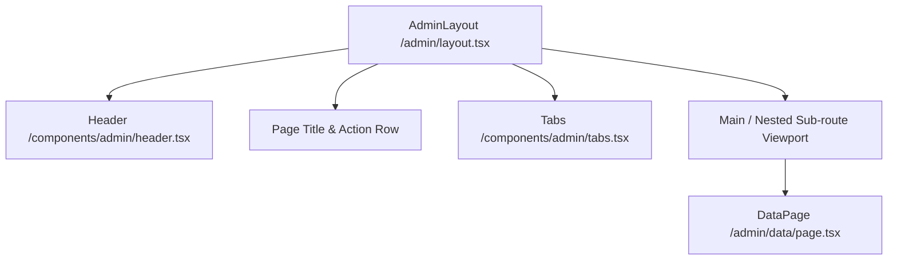

# LLD — NBD Platform Admin Layout

> **Stage 3 of 3 — Documentation Hierarchy**
> Owner: Tech Lead / Winston (Architect) | Target Location: `docs/lld/admin_layout_lld.md` | References: `docs/prd/admin_layout_prd.md`
> Status: `Approved`

---

## 1. Overview & Scope

### Component / Module
The administration portal layout framework and interactive submissions table located at `/admin` (enclosed within the `/admin` Next.js route group). This includes the responsive navigation shell, sub-navigation tabs, and data moderation table component.

### PRD References
- **FR-001** (Global top navigation header with "Admin view", "Projects", "Tasks")
- **FR-002** (Active top navigation item styling using sky-blue highlights)
- **FR-003** (Sub-navigation tabs: "Data", "User management", "Site management")
- **FR-004** (Right-hand utility panel: Settings, Notifications, and Account dropdown)
- **FR-005** (Dynamic tab switching with page context preservation)

---

## 2. Component Architecture & Directory Structure

The module is implemented in the frontend using Next.js 15 App Router structure:

```
frontend/src/
├── app/
│   └── admin/
│       ├── layout.tsx             # Universal layout wrapper with headers, action controls, and titles
│       ├── page.tsx               # Admin portal entry point / dashboard landing page
│       ├── data/
│       │   └── page.tsx           # Moderation table and filters panel ("Data" tab view)
│       ├── users/
│       │   └── page.tsx           # Mock/placeholder for User Management view
│       └── sites/
│           └── page.tsx           # Mock/placeholder for Site Configuration view
└── components/
    └── admin/
        ├── header.tsx             # Top navigation header containing branding, links, and utilities
        └── tabs.tsx               # Inline category/section switching sub-navigation pills
```

### Layout Hierarchy



---

## 3. UI Component Details

### 3.1 Top Navigation Header (`header.tsx`)
- **Theme**: Light-themed, border-b with `border-slate-200` and background `bg-white`.
- **Navigation Links**:
  - `Admin view` (routes to `/admin`). Highlights as active when `pathname.startsWith('/admin')` is true. Styling: `bg-sky-50 text-sky-500`.
  - `Projects` (routes to `/admin/projects-placeholder`).
  - `Tasks` (routes to `/admin/tasks-placeholder`).
- **Utility Actions**: Includes settings gear, relative-positioned notifications badge (bell with a red dot indicator), and account details menu selector.

### 3.2 Sub-Navigation Tabs (`tabs.tsx`)
- Inline horizontal navigation container wrapping individual link pills.
- Active states dynamically evaluate matches with `pathname`.
- Tabs list:
  - **Data**: `/admin/data` (Submissions Moderation Grid)
  - **User management**: `/admin/users` (Roles and User settings)
  - **Site management**: `/admin/sites` (Basin & Sites setups)

### 3.3 Data Moderation Sub-View (`data/page.tsx`)
Contains the interactive moderation board:
- **Filtering Row**:
  - Drops for **Form** type, **Status** (Active, Pending, Rejected), and **Basin** selection.
  - Interactive "Clear" button resets filters.
- **Submissions Table**:
  - Table columns: `Id`, `Form type`, `Basin/Site`, `Date`, `Submitted by` (Name & Email), `Status` (labeled pills), and `Actions`.
  - Action controls per row: `Reject` (changes status to Rejected) and `Approve` (changes status to Active).

---

## 4. State Management & Data Flow

### Filter and Moderation State Reactivity
The page state is managed locally at the page component level using standard React hook:
```typescript
interface Submission {
  id: string;
  formType: string;
  basinSite: string;
  date: string;
  submittedBy: { name: string; email: string; };
  status: 'Active' | 'Pending' | 'Rejected';
}
```

- **Filter criteria**: Tracked in component state (`formFilter`, `statusFilter`, `basinFilter`).
- **Record list state**: Tracked in `submissions` array. Approvals and rejections perform inline mutations returning a new state reference, triggering view re-renders:
  - `handleApprove(id)`: Maps `status` to `'Active'`.
  - `handleReject(id)`: Maps `status` to `'Rejected'`.

---

## 5. Verification Plan

### Automated Tests
- Run the Vitest test suite via `npm run test` or the docker wrapper to verify render reliability.
- Key test coverage:
  - [layout.test.tsx](file:///Users/galihpratama/Sites/nbd-phase-1/frontend/src/app/admin/__tests__/layout.test.tsx) - Asserts header navigation highlights, tab switching presence, title rendering, and sub-page nesting correctness.

### Manual Verification
- Simulate viewport widths of 375px, 768px, and 1200px in Google Chrome/Firefox dev mode to verify navigation menu responsive alignment.
- Verify status changes in the submissions grid when click interactions occur on the "Approve" and "Reject" buttons.
