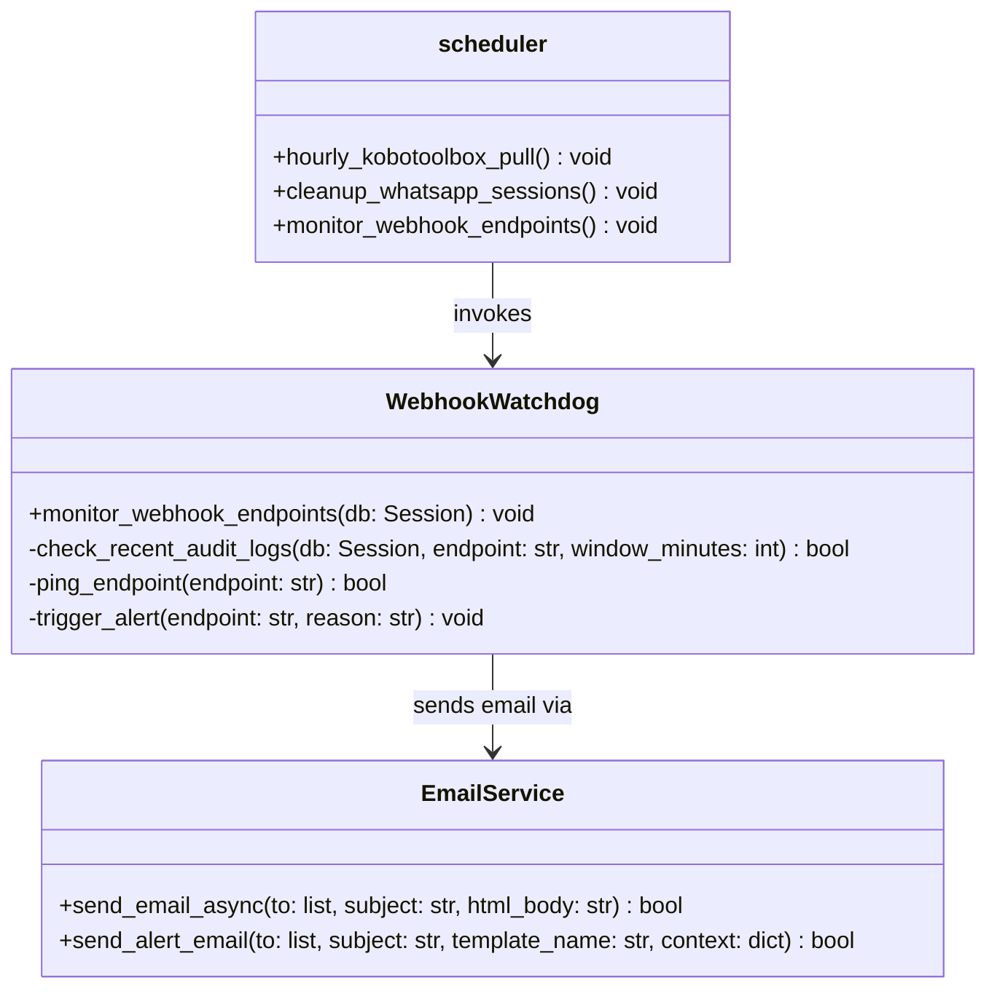
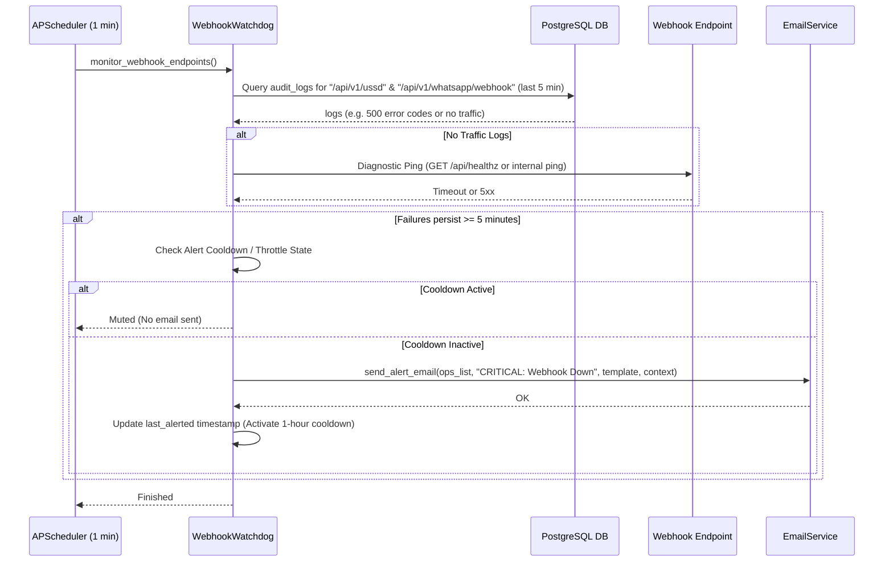
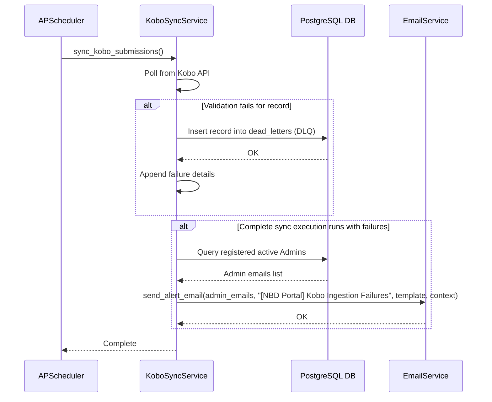

# LLD — Application Monitoring & Alert Hooks

> **Stage 3 of 3 — Documentation Hierarchy**
> Owner: Tech Lead / Senior Engineer | Target Location: `docs/lld/application_monitoring_lld.md` | References: `docs/prd/application_monitoring_prd.md`
> Status: `Approved` | Open Questions Remaining: `0`

---

## 1. Overview & Scope

This low-level design document details the implementation of Task 7: Application Monitoring & Alert Hooks.

### Component / Module
* **`WebhookWatchdogService`**: Background check runs every 1 minute in `scheduler.py` to check the health of Africa's Talking USSD and WhatsApp webhooks.
* **`EmailService` (Refactored)**: Enhanced to render and send styled HTML email alerts using Jinja2 templates.
* **`KoboSyncAlertHook`**: Refactored Kobo sync module to send structured, beautifully styled alert emails when a sync fails completely or submissions are quarantined.
* **`WhatsAppSessionCleanup`**: Automated task verified and tested to prune stale sessions (> 24 hours old) daily.

### PRD References
* **UAC-01**: Webhook Monitoring & 5-minute continuous failure window alert.
* **UAC-02**: Kobo sync failure alert to Admins.
* **UAC-03**: DLQ quarantine alerts to Admins.
* **UAC-04**: Styled responsive HTML email template matching NBD visual branding.
* **TAC-01**: Webhook Watchdog scheduler implementation querying `audit_logs`.
* **TAC-02**: WhatsApp session pruning hourly execution.

### Out of Scope
* Integration with Datadog, PagerDuty, or Sentry.
* Frontend status dashboard.

---

## 2. Component & Class Design

We will extend `EmailService` and build a `WebhookWatchdog` inside the scheduler.



### Class Responsibilities:
| Class | Responsibility | SOLID Principle |
|-------|---------------|-----------------|
| `EmailService` | Handles SMTP configuration, loads HTML alert templates, and dispatches asynchronous emails. | SRP — single email delivery domain concern. |
| `WebhookWatchdog` | Performs availability checks, audits error codes from the database logs, pings endpoints on zero-traffic state, and throttles alert dispatch. | SRP — separate concern from core scheduling. |
| `scheduler.py` | Orchestrates the periodic execution of the monitoring, sync, and pruning tasks. | SRP — scheduling loop driver. |

---

## 3. Sequence Diagrams

### 3.1 Webhook Check Failure Path (5-Minute Window & Alerting)



### 3.2 Kobo Ingestion DLQ Alerting Path



---

## 4. API Contracts

### 4.1 Mock Webhook Failure Endpoint (Testing Only)
`GET /api/v1/test/mock-webhook-failure`
* **Purpose**: Simulates a webhook failure by writing a dummy error log entry to `audit_logs` (or setting a mock flag) to test the 5-minute continuous failure window logic.
* **Query Parameters**:
  * `endpoint` (Required): String, either `ussd` or `whatsapp`.
  * `status_code` (Optional): Integer, default `500`.
* **Response `200 OK`**:
  ```json
  {
    "status": "logged",
    "endpoint": "/api/v1/ussd",
    "logged_status_code": 500
  }
  ```

---

## 5. Database Schema

No new tables are introduced. Webhook logs will be persisted to the existing `audit_logs` table using a seeded **System User**:

* **System User Email**: `system@nbd-wetland.org`
* **Role**: `Admin`

### Audit Log Fields Mapping for Webhook Calls:
* `actor_id`: UUID of the system user.
* `action`: HTTP Method (e.g. `"POST"`).
* `entity_type`: `"ussd_webhook"` or `"whatsapp_webhook"`.
* `entity_id`: Status Code returned by the handler (e.g., `"200"`, `"500"`, `"503"`, `"ERROR"`).

### Index Strategy:
The existing composite index `idx_audit_logs_entity` on `(entity_type, entity_id)` and the `timestamp` column enables high-performance queries for logs in the last 5 minutes.

---

## 6. Logic & Algorithms

### Webhook Availability Logic (Every 1 Minute)
```
FUNCTION monitor_webhook_endpoints():
    FOR EACH endpoint IN ["ussd_webhook", "whatsapp_webhook"]:
        // Query database logs
        recent_logs = SELECT * FROM audit_logs
                      WHERE entity_type = endpoint
                      AND timestamp >= NOW() - 5 minutes
                      ORDER BY timestamp DESC

        continuous_failures = 0
        total_requests = LENGTH(recent_logs)

        IF total_requests > 0:
            FOR log IN recent_logs:
                IF INT(log.entity_id) >= 500 OR log.entity_id == "ERROR":
                    continuous_failures += 1
                ELSE:
                    # Healthy log found, break continuous failure chain
                    BREAK
        ELSE:
            # Zero traffic. Run diagnostic ping
            status = diagnostic_ping(endpoint)
            IF status >= 500 or status == "TIMEOUT":
                continuous_failures = 5 # Trigger alert immediately

        IF continuous_failures >= 5:
            IF NOT is_muted(endpoint):
                dispatch_ops_alert(endpoint, "Continuous failures detected in the last 5 minutes.")
                mark_muted(endpoint)
        ELSE:
            IF is_muted(endpoint):
                dispatch_ops_recovery(endpoint)
                unmark_muted(endpoint)
```

---

## 7. Design Patterns

* **Observer Pattern / Hooks**: Refactoring the end of the Kobo sync run to compile quarantined payloads and notify registered observers (Admin emails) via `EmailService`.
* **Throttling/State pattern**: Storing the mute state for each watchdog target in the Scheduler class memory (persisted for the lifecycle of the scheduler container) to throttle repeated alerts.

---

## 8. Error Handling & Edge Cases

| Scenario | Detection | Mitigation |
|----------|-----------|------------|
| SMTP Service Down | SMTP connection timeout / exception. | Catch exception, log error to standard logger, write warning to system output. Do not crash background loop. |
| Zero traffic on webhook | Length of recent `audit_logs` is 0. | Trigger active ping to local backend webhook endpoints to verify responsiveness. |
| Memory leak in Scheduler | Continuous run of APScheduler. | Keep alert state variables localized and minimal. Ensure DB sessions are properly closed using `try-finally` blocks. |

---

## 9. Non-Functional Design Decisions

### Performance
* Queries on `audit_logs` are limited to the past 5 minutes, keeping DB read overhead extremely low.
* Emails are compiled and sent asynchronously using `fastapi_mail` to prevent locking the main scheduler loop.

### Security
* The system email template exposes stack traces only to registered Admin/Ops email lists, avoiding public exposure.
* System user credentials used for automated logs do not have password hashes, preventing login attempts.
