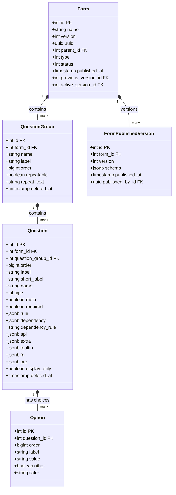
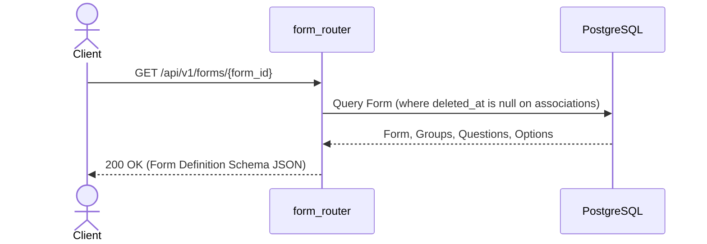
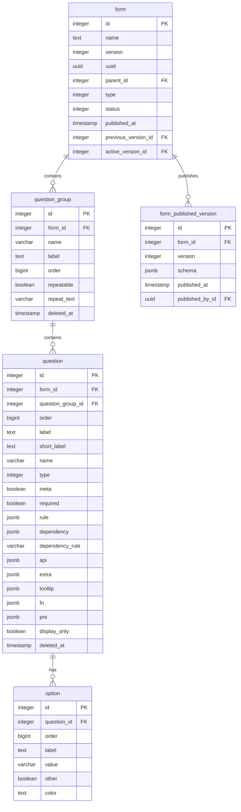

# LLD — ARF Form Blueprint (Dynamic Form Structures)

> **Stage 3 of 3 — Documentation Hierarchy**
> Owner: Winston (Architect) | Target Location: `docs/lld/arf_form_blueprint_lld.md` | References: `docs/prd/arf_form_blueprint_prd.md`
> Status: `Draft`

---

## 1. Overview & Scope

**Component / Module**:
Dynamic Form Engine Schema & SQLAlchemy Models (`Form`, `QuestionGroup`, `Question`, `Option`, `FormPublishedVersion`).

**PRD References**:
FR-001, FR-002, FR-003, FR-004.

**Out of Scope for this LLD**:
- Ingestion models/workflows like `datapoints` and `answers` submissions.
- Form definition/validation editing API endpoints.

---

## 2. Component & Class Design

We design Layer C (Dynamic Form Engine) models to map the Django reference structure to SQLAlchemy ORM models.



### Class Responsibilities
- `Form`: Stores form-level metadata, status state machine, version counters, and historical chain tracking.
- `QuestionGroup`: Group sections inside forms. Supports soft delete tracking via `deleted_at`.
- `Question`: Question details, field validators, input rules, dependencies, and soft delete tracking.
- `Option`: Select choices unique per question value.
- `FormPublishedVersion`: Deep immutable copies of form questions configurations.

---

## 3. Sequence Diagrams

### 3.1 Retrieve Form Schema


---

## 4. API Contracts

### `POST /api/v1/forms` (Admin only)
**Purpose**: Create a draft form.
**Request Body**:
```json
{
  "name": "Physico-Chemical Water Probe Form",
  "type": 1,
  "status": 1
}
```
**Success Response** `201 Created`:
```json
{
  "id": 1,
  "name": "Physico-Chemical Water Probe Form",
  "version": 1,
  "uuid": "f47ac10b-58cc-4372-a567-0e02b2c3d479",
  "type": 1,
  "status": 1
}
```

---

## 5. Database Schema & Index Strategy

### Schema ER Diagram


### Index Strategy

| Table | Index | Type | Rationale |
|---|---|---|---|
| `form` | `(uuid)` | Unique | UUID-based queries |
| `question_group` | `(form_id, name)` WHERE `deleted_at IS NULL` | Unique B-Tree | Allows recreating groups with same name if deleted |
| `question` | `(form_id, name)` WHERE `deleted_at IS NULL` | Unique B-Tree | Allows recreating questions with same name if deleted |
| `option` | `(question_id, value)` | Unique B-Tree | Enforce option uniqueness per question value |
| `form_published_version` | `(form_id, version)` | Unique B-Tree | Fast lookup of version snapshots |

---

## 6. Logic & Algorithms

### Soft Delete Queries
SQLAlchemy queries on `QuestionGroup` and `Question` must default to adding `deleted_at IS NULL` in their filters to prevent returning deleted elements.
```python
# Query pattern helper
db.query(QuestionGroup).filter(
    QuestionGroup.form_id == form_id,
    QuestionGroup.deleted_at.is_(None)
).all()
```

---

## 7. Error Handling & Edge Cases

| Scenario | Detection | Response | Fallback |
|---|---|---|---|
| Creating duplicate question name | Conditional index violation | 400 Bad Request ("Question name already active") | — |
| Fetching retired schema version | Snapshot version check | Load matching `form_published_version.schema` | Fail gracefully |

---

## Exit Criterion

> [!IMPORTANT]
> This LLD MUST be reviewed in a tech design review session before implementing.

**Design Review Checklist**:
- [ ] All FR-xxx references from the PRD are addressed
- [ ] Database schema mapped accurately to SQLAlchemy types
- [ ] Uniqueness constraints and indices configured
- [ ] Soft deletion queries defined
