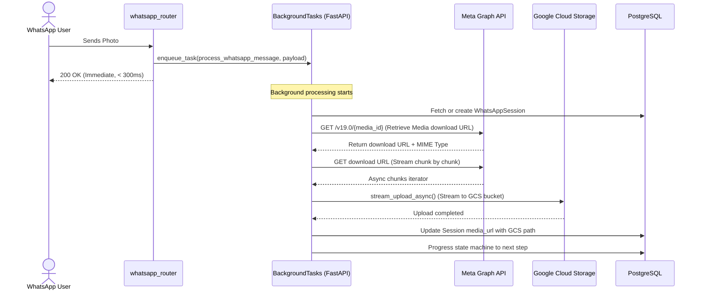

# LLD — Asynchronous Media Ingestion & Unified GCS Path Strategy

> **Stage 3 of 3 — Documentation Hierarchy**
> Owner: Winston (Architect) | Target Location: `docs/lld/async_media_ingestion_lld.md` | References: `docs/prd/async_media_ingestion_prd.md`
> Status: `Approved`
> Design Review: Winston (Architect), June 2026 | Open Questions Remaining: `0`

---

## 1. Overview & Scope

**Component / Module**:

- `app.services.storage` (`StorageService`, `build_blob_path`, `stream_upload_async`)
- `app.services.whatsapp_service` (`process_whatsapp_message`, `_get_media_url`, `_iter_media_chunks`)
- `app.routers.whatsapp_router` (Meta webhook routing with `BackgroundTasks`)

**PRD References**:

- `docs/prd/async_media_ingestion_prd.md` (FR-001, FR-002, FR-003, FR-004, FR-005, FR-006)

---

## 2. Dynamic GCS Path Convention

A centralized path generation module guarantees consistent key schemas across development and production environments.

```python
def build_blob_path(pipeline: str, ext: str) -> str:
    env = os.getenv("APP_ENV", "development")
    uid = uuid.uuid4()
    return f"{env}/{pipeline}/{uid}.{ext}"
```

- **`APP_ENV`**: Defaults to `"development"` if not set.
- **`pipeline`**: Ingestion source category (e.g., `"whatsapp"`).
- **`ext`**: Normalized file extension without a leading dot (e.g., `"jpg"`, `"mp4"`).

---

## 3. Storage Service Architecture

The GCS backend service supports memory-safe resumable streaming uploads without buffering full binary bodies into RAM.

### Class Method Signature

```python
async def stream_upload_async(
    blob_name: str,
    chunks: AsyncIterator[bytes],
    content_type: str | None = None
) -> None:
    ...
```

### Execution Flow & Thread Handlers

Since `google-cloud-storage` SDK calls are synchronous and block the Python event loop, the upload task runs in an worker thread:

1. Create a raw `io.BytesIO` memory stream.
2. Iterate over the async bytes generator and write to the memory stream.
3. Call `asyncio.to_thread` to execute `blob.upload_from_file(memory_stream)` on a threadpool worker.
4. Keep the total memory consumption capped per upload.

---

## 4. WhatsApp Media Ingestion Sequence

The webhook request handling logic immediately returns `200 OK` to Meta to prevent timeout retries, deferring heavy file downloads and uploads to FastAPI's background workers.



---

## 5. Error Handling & Sentinel States

- **Upload Failures**: If Meta Graph API queries or GCS upload fail, the exception is logged with a full stack trace (`logger.exception`).
- **DB Sentinel State**: The `session.media_url` is updated with `"UPLOAD_FAILED"`.
- **Database Answer Exclusion**: When saving the final report, if the option is `"UPLOAD_FAILED"`, the EAV Answer row for the `media_attachment` question is skipped rather than inserting a invalid value or triggering a foreign key violation.
