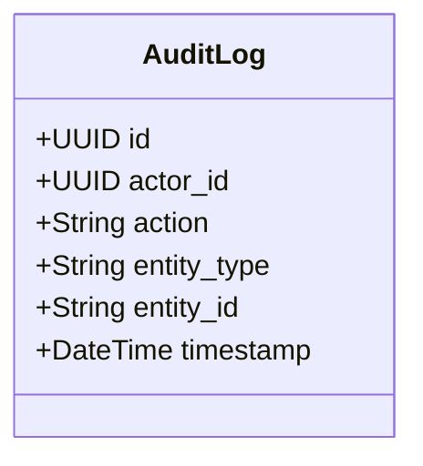

# Low-Level Design (LLD) — Immutable Audit Trail (The Audit Logs Table)

> **Stage 3 of 3 — Documentation Hierarchy**
> Owner: Winston (Architect) | Target Location: `docs/lld/audit_log_lld.md` | References: `docs/prd/audit_log_prd.md`, `docs/architecture_map.md`
> Status: `Draft`

---

## 1. Component Overview

The Immutable Audit Trail acts as a secure compliance ledger recording administrative and data-moderation actions taken by NBD staff. The design ensures database-level append-only guarantees, foreign-key safety for deactivated users (soft deletion), and query structures to load the audit trail of any site or record efficiently.

---

## 2. Architecture & Design Patterns

### 2.1 Class Diagram



---

## 3. Database Schema & Privilege Enforcement

The `audit_logs` table has the following physical design:

| Column | Type | Constraints | Description |
| :--- | :--- | :--- | :--- |
| `id` | UUID | PRIMARY KEY, default=uuid4 | Unique transaction ID. |
| `actor_id` | UUID | FOREIGN KEY references `users(id)`, ON DELETE RESTRICT | The administrator or reviewer account who triggered the change. |
| `action` | VARCHAR(30) | NOT NULL | Action keyword (e.g., `'APPROVE'`, `'REJECT'`, `'EDIT'`, `'DELETE'`, `'INVITE_USER'`). |
| `entity_type` | VARCHAR(50) | NOT NULL | Target resource type (e.g., `'Site'`, `'Datapoint'`). |
| `entity_id` | VARCHAR(100) | NOT NULL | The unique ID of the target resource. |
| `timestamp` | TIMESTAMP | NOT NULL, default=now() | Automated timestamp when the event was recorded. |

### 3.1 Composite Index
* `idx_audit_logs_entity` on `(entity_type, entity_id)` to optimize queries looking up the lifecycle of a specific record.

### 3.2 Append-Only Database Guarantees
To prevent FastAPI application roles from editing or clearing logs, the Alembic migration script will execute the following raw DDL queries after table creation:
```sql
-- Revoke update and delete privileges from nbd_user for audit_logs
REVOKE UPDATE, DELETE ON TABLE audit_logs FROM nbd_user;
```

---

## 4. API Endpoints Contract

### 4.1 Create Audit Log
* **Endpoint**: `POST /api/v1/audit-logs`
* **Request Schema**:
  ```json
  {
    "actor_id": "8f4a1918-7b72-4ea1-b9d1-37472ffb575e",
    "action": "APPROVE",
    "entity_type": "Datapoint",
    "entity_id": "123"
  }
  ```
* **Response Schema (201 Created)**:
  ```json
  {
    "id": "e22934ef-7e9b-4f1b-90f1-4df2348a7b1b",
    "actor_id": "8f4a1918-7b72-4ea1-b9d1-37472ffb575e",
    "action": "APPROVE",
    "entity_type": "Datapoint",
    "entity_id": "123",
    "timestamp": "2026-06-04T13:51:35Z"
  }
  ```

### 4.2 List Audit Logs
* **Endpoint**: `GET /api/v1/audit-logs`
* **Query Parameters**:
  - `actor_id` (UUID, optional)
  - `action` (string, optional)
  - `entity_type` (string, optional)
  - `entity_id` (string, optional)
* **Response Schema (200 OK)**

---

## 5. Error Handling & Edge Cases

1. **DB Privilege Denied on Mutate**:
   - If an application code route or external database client attempts an `UPDATE` or `DELETE` on `audit_logs`, the database will throw `psycopg2.errors.InsufficientPrivilege` (HTTP 500 error on the API layer).
2. **Deactivating Staff Account (Soft-Delete)**:
   - To prevent database orphan violations, the `users` table uses the `is_active` boolean field. Physical user deletion is prohibited on accounts tied to any audit logs (`ON DELETE RESTRICT`).
