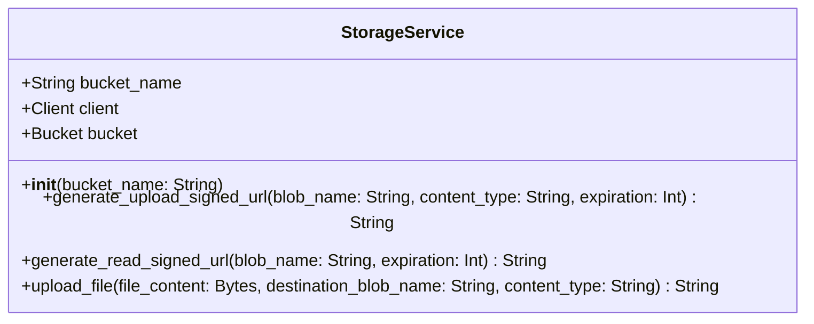

# Low-Level Design (LLD) — Google Cloud Storage Backend Service

> **Stage 3 of 3 — Documentation Hierarchy**
> Owner: Winston (Architect) | Target Location: `docs/lld/cloud_storage_lld.md` | References: `docs/prd/cloud_storage_prd.md`, `docs/architecture_map.md`
> Status: `In Review`

---

## 1. Component Overview

The Cloud Storage service wrapper enables the FastAPI application to interact securely with Google Cloud Storage. It provides abstract interfaces to:
1. Generate signed upload URLs so the client/frontend can upload files directly to GCS without passing file bytes through the backend (saving server bandwidth and memory).
2. Generate signed read URLs to allow authorized clients to download/view private citizen photos temporarily.
3. Perform direct byte uploads from the backend when needed (e.g., handling internal reports or sync processes).

## 2. Architecture & Design Patterns

### 2.1 Dependency Inversion Principle (DIP)
To facilitate testing, the `StorageService` can load credentials dynamically. If `GOOGLE_APPLICATION_CREDENTIALS` is not set or in a test environment, the service can fall back to a mock storage driver or raise descriptive configuration errors.



---

## 3. Data Models and Environment Variables

The following environment variables are required:

| Environment Variable | Description | Example |
|----------------------|-------------|---------|
| `GOOGLE_APPLICATION_CREDENTIALS` | Path to service account JSON key file | `/credentials/nbd-service-account.json` |
| `GCS_BUCKET_NAME` | The bucket name in Google Cloud Storage | `nbd-storage` |

---

## 4. API Endpoints Contract

### 4.1 Get Signed Upload URL
* **Endpoint**: `POST /api/v1/storage/presigned-upload`
* **Request Schema**:
  ```json
  {
    "file_name": "survey_photo_123.jpg",
    "content_type": "image/jpeg"
  }
  ```
* **Response Schema (200 OK)**:
  ```json
  {
    "upload_url": "https://storage.googleapis.com/nbd-storage/survey_photo_123.jpg?GoogleAccessId=...",
    "blob_name": "survey_photo_123.jpg"
  }
  ```

### 4.2 Get Signed Read URL
* **Endpoint**: `GET /api/v1/storage/presigned-read`
* **Query Parameters**:
  - `blob_name` (string, required): The target object path in the bucket.
* **Response Schema (200 OK)**:
  ```json
  {
    "read_url": "https://storage.googleapis.com/nbd-storage/survey_photo_123.jpg?GoogleAccessId=..."
  }
  ```

---

## 5. Error Handling & Edge Cases

1. **Missing Environment Variables**:
   - If `GCS_BUCKET_NAME` is missing, the service raises `ValueError` on startup.
   - If credentials are not present during signed URL generation, the SDK will throw an exception. The service catches this and raises an `HTTPException(status_code=500)` with a clean message: "Storage provider configuration error."
2. **Invalid Blob Request**:
   - If the requested blob does not exist when requesting a read URL, the SDK might still sign a URL, but the client will get a 404 from GCS. We will generate the signature as requested; checking existence first via an API round-trip is an optional check that can be toggled depending on performance requirements.
