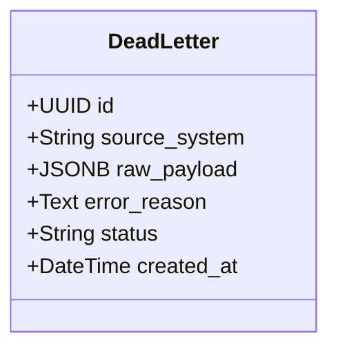

# Low-Level Design (LLD) — Dead-Letter Table (Resilience Infrastructure)

> **Stage 3 of 3 — Documentation Hierarchy**
> Owner: Winston (Architect) | Target Location: `docs/lld/dead_letter_lld.md` | References: `docs/prd/dead_letter_prd.md`, `docs/architecture_map.md`
> Status: `Approved`

---

## 1. Component Overview

The Dead-Letter resilience infrastructure provides a database quarantine zone for storing failed citizen submissions, API sync errors, or malformed webhook payloads. This component ensures 100% data durability during ingestion pipelines by catching validation failures and archiving the raw inputs.

---

## 2. Architecture & Design Patterns

### 2.1 Component Diagram



---

## 3. Database Schema

The `dead_letters` table is configured as follows:

| Column | Type | Constraints | Description |
| :--- | :--- | :--- | :--- |
| `id` | UUID | PRIMARY KEY, default=uuid4 | Unique identifier for each quarantined item. |
| `source_system` | VARCHAR(50) | NOT NULL | Source system of the payload (e.g. `'KoboToolbox'`). |
| `raw_payload` | JSONB | NOT NULL | Raw unstructured payload that failed processing. |
| `error_reason` | TEXT | NOT NULL | Validation error details or traceback description. |
| `status` | VARCHAR(20) | NOT NULL, default='Pending Triage' | Triage states: `'Pending Triage'`, `'Resolved'`, `'Discarded'`. |
| `created_at` | TIMESTAMP | NOT NULL, default=now() | Ingestion timestamp. |

### 3.1 Indexes
* **Composite Index**: `idx_dead_letters_status_source` on columns `(status, source_system)` to optimize high-volume filtering.

---

## 4. API Endpoints Contract

### 4.1 Create Dead Letter
* **Endpoint**: `POST /api/v1/dead-letters`
* **Request Schema**:
  ```json
  {
    "source_system": "KoboToolbox",
    "raw_payload": { "foo": "bar" },
    "error_reason": "Missing required field: pH",
    "status": "Pending Triage"
  }
  ```
* **Response Schema (201 Created)**:
  ```json
  {
    "id": "31b28236-4076-4d2d-9850-eb914756477c",
    "source_system": "KoboToolbox",
    "raw_payload": { "foo": "bar" },
    "error_reason": "Missing required field: pH",
    "status": "Pending Triage",
    "created_at": "2026-06-04T05:39:38Z"
  }
  ```

### 4.2 List Dead Letters
* **Endpoint**: `GET /api/v1/dead-letters`
* **Query Parameters**:
  - `status` (string, optional)
  - `source_system` (string, optional)
* **Response Schema (200 OK)**:
  ```json
  [
    {
      "id": "31b28236-4076-4d2d-9850-eb914756477c",
      "source_system": "KoboToolbox",
      "raw_payload": { "foo": "bar" },
      "error_reason": "Missing required field: pH",
      "status": "Pending Triage",
      "created_at": "2026-06-04T05:39:38Z"
    }
  ]
  ```

### 4.3 Get Single Dead Letter
* **Endpoint**: `GET /api/v1/dead-letters/{id}`
* **Response Schema (200 OK)**

### 4.4 Update Dead Letter Status
* **Endpoint**: `PUT /api/v1/dead-letters/{id}`
* **Request Schema**:
  ```json
  {
    "status": "Resolved"
  }
  ```
* **Response Schema (200 OK)**

---

## 5. Error Handling & Edge Cases

1. **Incorrect Status Transition**:
   - The status field is restricted at the schema and route layers to `Pending Triage`, `Resolved`, and `Discarded`. Invalid status strings return `422 Unprocessable Entity`.
2. **Missing Record Triage**:
   - Querying a non-existent UUID returns `404 Not Found`.
