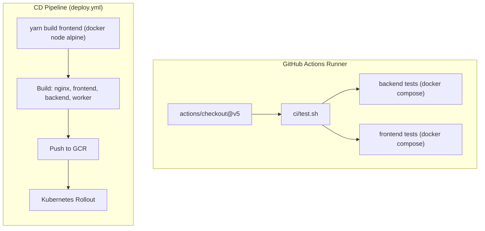

# LLD — CI/CD Pipeline and Deployment Automation

> **Stage 3 of 3 — Documentation Hierarchy**
> Owner: Winston (Architect) + Amelia (Developer) | Target Location: `docs/lld/deployment_lld.md` | References: `docs/prd/deployment_prd.md`
> Status: `Approved`

---

## 1. Overview & Scope

**Component / Module**:
CI/CD Pipeline Setup (GitHub Actions + Docker Compose + Bash scripts) for NBD Wetland Monitoring Platform.

**PRD References**:
- `FR-001`: Execution of `ci/test.sh` on PR/push triggers via reusable workflow.
- `FR-002`: Run isolated test compose environment (`docker-compose.test.yml`).
- `FR-003`: Build/tag Docker images for `nginx`, `frontend`, `backend`, and `worker`.
- `FR-004`: Authenticate and push images to GCR using composite actions (ref: `0.0.10`).
- `FR-005`: Trigger Kubernetes rollouts for the four deployments in `nbd-namespace`.

**Out of Scope for this LLD**:
- Direct configuration of GCP credentials/secrets (injected via GHA repository secrets).
- Setup or provisioning of the GKE Kubernetes cluster.

---

## 2. Component Design & Architecture

---

## 3. Configuration Details

### 3.1 Docker Compose Test Configuration (`docker-compose.test.yml`)
- **`db`**: Runs `postgis/postgis:15-3.3-alpine` image to support spatial operations. Injected credentials are standard test defaults (`nbd_user`/`password`).
- **`backend`**: Built dynamically on CI using `backend/Dockerfile` and runs `./test.sh` (migrations and pytest).
- **`frontend`**: Built dynamically on CI using `frontend/Dockerfile` and runs `./test.sh` (Vitest tests).

### 3.2 Test Script (`ci/test.sh`)
- Detects changed files using `tj-actions/changed-files@v47`.
- Runs frontend or backend tests selectively if changes are detected in respective folders.
- Triggers full testing suite for tags or pushes to `main`.

---

## 4. GitHub Actions Workflows

### 4.1 test-reusable.yml
- Reusable test workflow verifying checkout, changed files detection, and execution of `ci/test.sh`.

### 4.2 test.yml
- Runs on push to release version tags and pull requests to `main` by invoking `test-reusable.yml`.

### 4.3 deploy.yml
- Runs on pushes to `main`.
- Invokes `test-reusable.yml` first, then:
  1. Checks out source repo and composite actions (ref: `0.0.10`).
  2. Executes frontend build inside a Node 20 Docker container.
  3. Builds, pushes, and rolls out images for `nginx`, `frontend`, `backend`, and `worker` to GCR and `nbd-namespace` namespace.

---

## 5. Logic & Error Handling

- **Migration execution**: Database migrations are run inside the backend test container prior to running the test suite via `alembic upgrade head`.
- **Test execution failure**: If migrations or tests fail, the exit code is non-zero, terminating the GHA run immediately and flagging the build status as failed.

---

## Exit Criterion

> [!IMPORTANT]
> This LLD has been reviewed and approved by the engineering team. No open questions remain.
