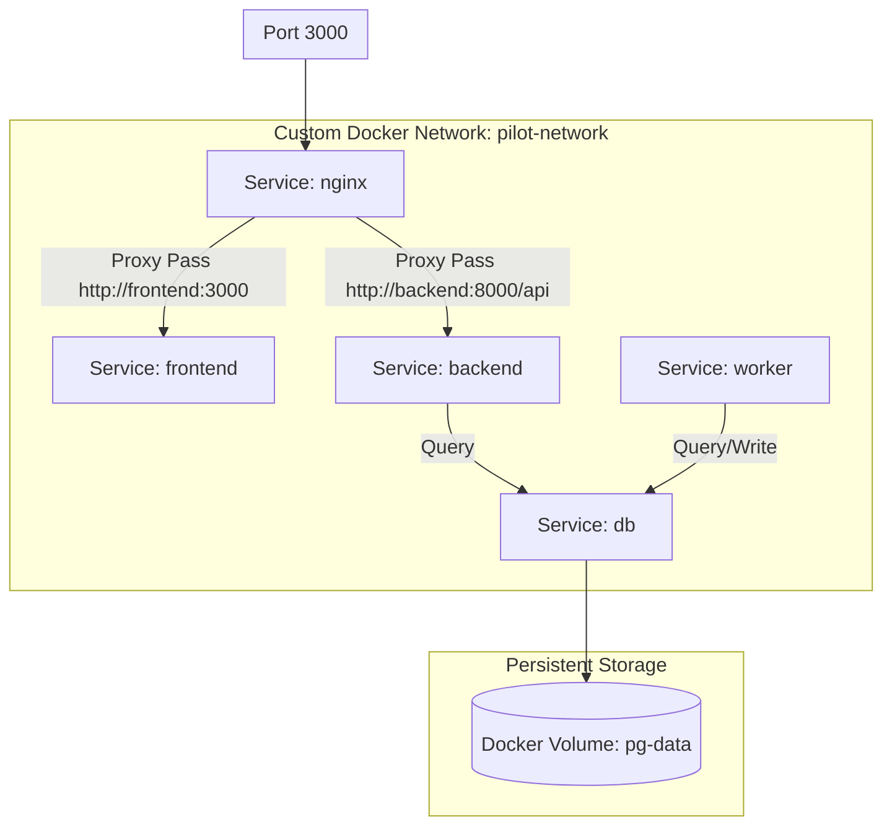

# LLD — Multi-Service Dockerized Project Setup

> **Stage 3 of 3 — Documentation Hierarchy**
> Owner: Winston (Architect) / Amelia (Developer) | Target Location: `docs/lld/docker_setup_lld.md` | References: `docs/prd/docker_setup_prd.md`
> Status: `Approved`

---

## 1. Overview & Scope

**Component / Module**:
Multi-service Docker Compose topology (`nginx`, `db` with PostGIS, `backend` with FastAPI, `worker` with native APScheduler, and `frontend` with Next.js 16).

**PRD References**:
- FR-001 (Unified compose file)
- FR-002 (Nginx reverse routing)
- FR-003 (PostgreSQL persistence)
- FR-004 (dc.sh developer wrapper CLI)

**Out of Scope for this LLD**:
- Production SSL certs setup
- Continuous Integration/Deployment setups

---

## 2. Docker Architecture Design

The following diagram details the network interfaces, volumes, and ports mapping:



### Service Specs Table

| Service | Image/Dockerfile | Exposed Ports | Internal Ports | Volumes | Depends On |
|---------|------------------|---------------|----------------|---------|------------|
| `nginx` | `nginx:alpine` | `3000:80` | `80` | `./nginx.conf:/etc/nginx/nginx.conf:ro` | `frontend`, `backend` |
| `db` | `postgis/postgis:15-3.3-alpine` | None (Internal) | `5432` | `pg-data:/var/lib/postgresql/data` | None |
| `backend` | `./backend/Dockerfile` | None (Internal) | `8000` | `./backend:/app` | `db` |
| `worker` | `./backend/Dockerfile` | None | None | `./backend:/app` | `db` |
| `frontend` | `./frontend/Dockerfile` | None (Internal) | `3000` | `./frontend:/app` | `backend` |

---

## 3. Configuration & Code Schema

### 3.1 Nginx Routing Configuration (`nginx.conf`)
Nginx must act as the primary ingress:
```nginx
events { worker_connections 1024; }

http {
    upstream frontend {
        server frontend:3000;
    }

    upstream backend {
        server backend:8000;
    }

    server {
        listen 80;
        server_name localhost;

        location /api {
            proxy_pass http://backend;
            proxy_set_header Host $host;
            proxy_set_header X-Real-IP $remote_addr;
            proxy_set_header X-Forwarded-For $proxy_add_x_forwarded_for;
            proxy_set_header X-Forwarded-Proto $scheme;
        }

        location / {
            proxy_pass http://frontend;
            proxy_set_header Host $host;
            proxy_set_header X-Real-IP $remote_addr;
            proxy_set_header X-Forwarded-For $proxy_add_x_forwarded_for;
            proxy_set_header X-Forwarded-Proto $scheme;
        }
    }
}
```

### 3.2 Developer CLI Wrapper script (`dc.sh`)
Provides standard orchestration commands:
- `./dc.sh up` -> starts containers
- `./dc.sh down` -> stops containers
- `./dc.sh logs` -> tails logs
- `./dc.sh exec [service] [cmd]` -> executes command in container

---

## 4. Verification Plan

### Automated Tests
- Run `./dc.sh exec backend flake8` (linting)
- Run `./dc.sh exec backend python -m pytest tests/` (once tests are defined)

### Manual Verification
1. Boot stack: `./dc.sh up -d`
2. Test gateway entrypoint: `curl -I http://localhost:3000` (expecting Next.js response)
3. Test API entrypoint: `curl -I http://localhost:3000/api` (expecting backend response)
4. Verify PostGIS: Run `CREATE EXTENSION postgis;` in the db container.
