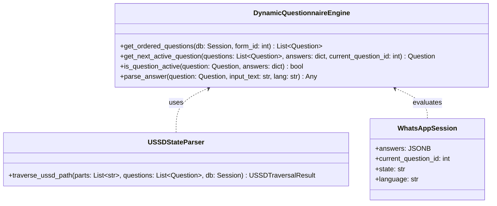
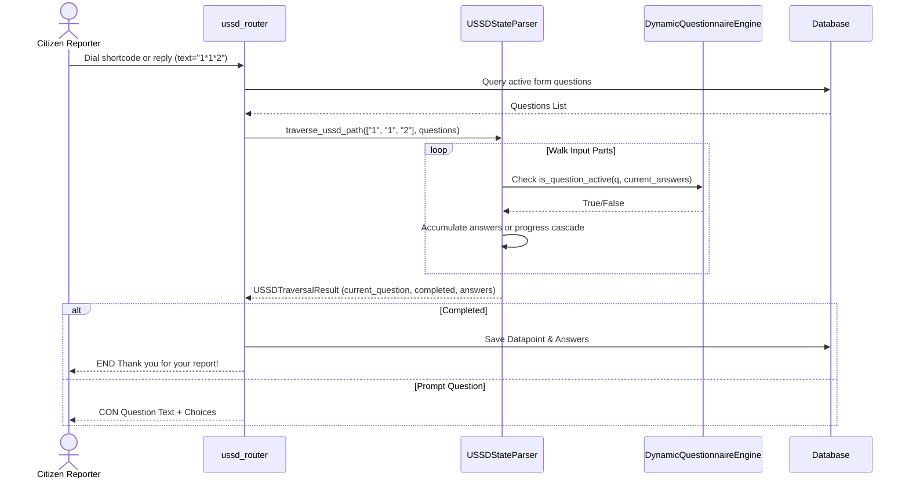

# LLD — Dynamic Form Support for USSD and WhatsApp Channels

> **Stage 3 of 3 — Documentation Hierarchy**
> Owner: Tech Lead / Senior Engineer | Target Location: `docs/lld/dynamic_forms_lld.md` | References: `docs/prd/dynamic_forms_prd.md`
> Status: `Approved`
> Design Review: _[Pending]_ | Open Questions Remaining: `0`

---

## 1. Overview & Scope

### Component / Module
`DynamicQuestionnaireEngine` (shared logic), `ussd_router.py` (stateless wrapper), and `whatsapp_service.py` (stateful state machine).

### PRD References
Implements all requirements in [dynamic_forms_prd.md](file:///Users/galihpratama/Sites/nbd-phase-1/docs/prd/dynamic_forms_prd.md):
- **FR-001 (Dynamic Ordering)**: Retrieves form questions sorted by group order and question order.
- **FR-002 (Skip Logic / Dependencies)**: Evaluates skip logic rules.
- **FR-003 (Stateless USSD)**: Walkthrough parser for concatenated USSD input parts.
- **FR-004 (WhatsApp Session Persistence)**: JSONB answers column.
- **FR-005 (Question Type Parsing)**: Dynamic prompts and value parsing.
- **FR-006 (Report Persistence)**: Dynamic Datapoint/Answer creation.

### Out of Scope for this LLD
- Web-based form creator UI.
- Repeatable question groups.

---

## 2. Component & Class Design



### Class Responsibilities
| Class | Responsibility | SOLID Compliance |
|-------|---------------|------------------|
| `DynamicQuestionnaireEngine` | Core form traversal, skip logic check, and value validation. | **SRP**: Single concern for dynamic form rule checking. |
| `USSDStateParser` | Statelessly walks the USSD inputs sequence to resolve current position and answers. | **SRP**: Decoupled from stateful DB operations. |
| `WhatsAppSession` | Holds database state for ongoing sessions. | **SRP**: Holds data representation. |

---

## 3. Sequence Diagrams

### 3.1 USSD Traversal & Prompt Path (Stateless)



---

## 4. API Contracts

Existing API webhook endpoints remain unchanged:
* **USSD Callback**: `POST /api/v1/ussd` (Form Data fields: `sessionId`, `phoneNumber`, `networkCode`, `serviceCode`, `text`)
* **WhatsApp Callback**: `POST /api/v1/whatsapp` (JSON Webhook payload from Meta)

All payload schemas and path parameters remain fully backwards compatible.

---

## 5. Database Schema

### `whatsapp_sessions` (Modified)
```sql
ALTER TABLE whatsapp_sessions ADD COLUMN answers JSONB DEFAULT '{}';
ALTER TABLE whatsapp_sessions ADD COLUMN current_question_id INTEGER;
```

---

## 6. Logic & Algorithms

### Skip Logic & Dependency Evaluation
```python
def is_question_active(question: Question, answers: dict) -> bool:
    if not question.dependency:
        return True

    rule = (question.dependency_rule or "AND").upper()
    matches = []

    for dep in question.dependency:
        dep_id = dep.get("id")
        dep_val = dep.get("value")

        # Support both numeric ID and name/slug key
        ans = answers.get(dep_id) or answers.get(str(dep_id))
        if ans is None:
            matches.append(False)
            continue

        # Match value (inclusion check for multiple options, string compare for single option)
        if isinstance(ans, list):
            match = any(str(v) == str(dep_val) for v in ans)
        else:
            match = str(ans) == str(dep_val)
        matches.append(match)

    if rule == "OR":
        return any(matches)
    return all(matches)
```

---

## 7. Design Patterns

| Pattern | Where Applied | Rationale |
|---------|--------------|-----------|
| **Strategy Pattern** | Question Parsing & Prompts | Different question types (`option`, `cascade`, `text`) implement specialized prompt formatting and response parsing strategies, conforming to the Open/Closed Principle. |
| **State Pattern / Session Manager** | `whatsapp_sessions` JSONB | Storing the answers in JSONB allows the state machine to be fully dynamic without executing migrations for future question changes. |

---

## 8. Error Handling & Edge Cases

| Scenario | Detection | Response | Fallback |
|----------|-----------|----------|----------|
| USSD Out-of-bounds input | User enters choice "6" for a 5-option menu | Re-prompt same menu with error message prefix | Closed session on 3 consecutive errors |
| WhatsApp Upload Failures | GCS media stream upload fails | Save answer value as "UPLOAD_FAILED" | Proceed with next questions |
| Missing Location centroid | PostGIS lookup for sub-county returns NULL geom | Site ID/Basin ID is set to null | Assign default basin |
