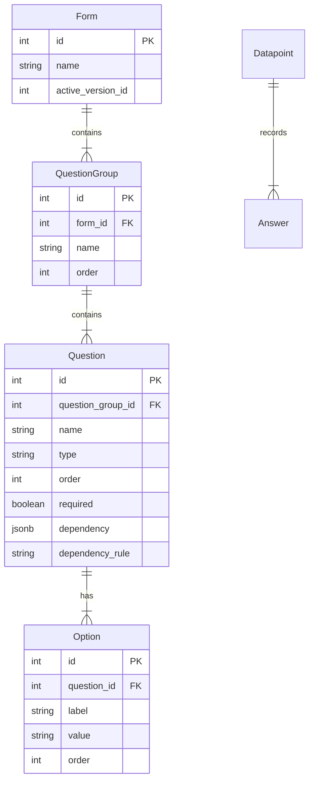

# LLD — Dynamic Form Support for USSD and WhatsApp Channels

> **Stage 3 of 3 — Documentation Hierarchy**
> Owner: Tech Lead / Senior Engineer | Target Location: `docs/lld/dynamic_forms_lld.md` | References: `docs/prd/dynamic_forms_prd.md`
> Status: `Approved`

---

## 1. Overview & Scope

### Component / Module
`DynamicQuestionnaireEngine` (shared logic), `ussd_router.py` (stateless wrapper), and `whatsapp_service.py` (stateful state machine).

### PRD References
Implements all requirements in `docs/prd/dynamic_forms_prd.md`:
- **FR-001 (Dynamic Ordering)**: Retrieves form questions sorted by group order and question order.
- **FR-002 (Skip Logic / Dependencies)**: Evaluates skip logic rules.
- **FR-003 (Stateless USSD)**: Walkthrough parser for concatenated USSD input parts.
- **FR-004 (WhatsApp Session Persistence)**: JSONB answers column.
- **FR-005 (Question Type Parsing)**: Dynamic prompts and value parsing.
- **FR-006 (Report Persistence)**: Dynamic Datapoint/Answer creation.

### Out of Scope for this LLD
- Web-based form creator UI.
- Repeatable question groups.

---

## 2. Component & Class Design

### 2.1 Database Entities & Relationships


```mermaid
erDiagram
    Form ||--|{ QuestionGroup : contains
    QuestionGroup ||--|{ Question : contains
    Question ||--|{ Option : has
    Datapoint ||--|{ Answer : records

    Form {
        int id PK
        string name
        int active_version_id
    }
    QuestionGroup {
        int id PK
        int form_id FK
        string name
        int order
    }
    Question {
        int id PK
        int question_group_id FK
        string name
        string type
        int order
        boolean required
        jsonb dependency
        string dependency_rule
    }
    Option {
        int id PK
        int question_id FK
        string label
        string value
        int order
    }
```

---

## 3. Shared Questionnaire Traversal Engine

### 3.1 Fetching Ordered Active Questions

```python
def get_ordered_questions(db: Session, form_id: int) -> List[Question]:
    """Retrieve all questions for a form, ordered by group order and question order."""
    return (
        db.query(Question)
        .join(QuestionGroup)
        .filter(QuestionGroup.form_id == form_id)
        .order_by(QuestionGroup.order.asc(), Question.order.asc())
        .all()
    )
```

### 3.2 Dependency / Skip Logic Evaluation

```python
def is_question_active(question: Question, answers: Dict[str, Any]) -> bool:
    """Evaluate if a question is active based on its dependency skip-logic."""
    if not question.dependency:
        return True

    rule = (question.dependency_rule or "AND").upper()
    matches = []

    for dep in question.dependency:
        dep_id = dep.get("id")
        dep_val = dep.get("value")
        ans = answers.get(str(dep_id))

        if ans is None:
            matches.append(False)
            continue

        if isinstance(ans, list):
            match = any(str(v) == str(dep_val) for v in ans)
        else:
            match = str(ans) == str(dep_val)
        matches.append(match)

    if rule == "OR":
        return any(matches)
    return all(matches)
```

---

## 4. Design Patterns

| Pattern | Where Applied | Rationale |
|---------|--------------|-----------|
| **Strategy Pattern** | Question Parsing & Prompts | Different question types (`option`, `cascade`, `text`) implement specialized prompt formatting and response parsing strategies, conforming to the Open/Closed Principle. |
| **State Pattern / Session Manager** | `whatsapp_sessions` JSONB | Storing answers in JSONB allows the state machine to be fully dynamic without executing migrations for future question changes. |

---

## 5. Error Handling & Edge Cases

| Scenario | Detection | Response | Fallback |
|----------|-----------|----------|----------|
| USSD Out-of-bounds input | User enters choice "6" for a 5-option menu | Re-prompt same menu with error message prefix | Closed session on 3 consecutive errors |
| WhatsApp Upload Failures | Storage stream upload fails | Save answer value as "UPLOAD_FAILED" | Proceed with next questions |
| Missing Location centroid | PostGIS lookup for sub-county returns NULL geom | Site ID/Basin ID is set to null | Assign default basin |
