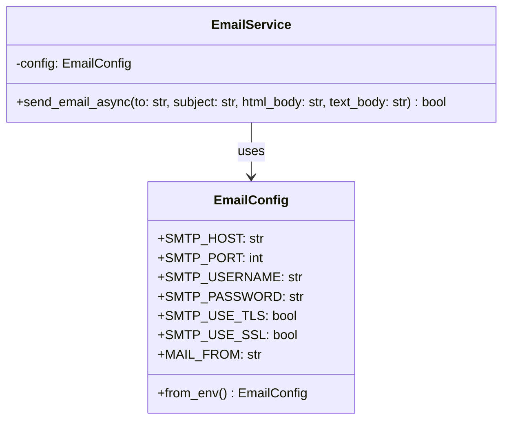
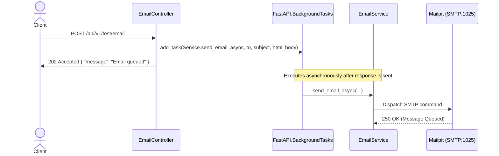

# LLD — SMTP Relay & Local Email Testing (Mailpit) Setup

> **Stage 3 of 3 — Documentation Hierarchy**
> Owner: Winston (Architect) | Target Location: `docs/lld/email_testing_relay_lld.md` | References: `docs/prd/email_testing_relay_prd.md`
> Status: `Approved`

---

## 1. Overview & Scope

**Component / Module**:
`EmailService` (FastAPI backend mail module) & Local Docker Topology configuration.

**PRD References**:
- FR-001, FR-002, FR-003, FR-004, FR-005 in `docs/prd/email_testing_relay_prd.md`

**Out of Scope for this LLD**:
- Designing front-end template manager.
- Celery task integration (since we are strictly using FastAPI BackgroundTasks in this topology).

**SOLID Compliance Commitment**:
- **Single Responsibility Principle (SRP)**: The `EmailService` is exclusively responsible for sending emails and mapping configurations.
- **Dependency Inversion Principle (DIP)**: High-level application logic will rely on a generic `send_email` helper rather than direct `fastapi-mail` client instances.

---

## 2. Component & Class Design



**Class Responsibilities**:
| Class | Responsibility | SOLID Principle |
|-------|---------------|-----------------|
| `EmailConfig` | Holds validated configuration values derived from environment variables. | SRP |
| `EmailService` | Manages connection parameters and uses `fastapi-mail` to dispatch async emails. | SRP |

---

## 3. Sequence Diagrams

### 3.1 Async Email Dispatch via BackgroundTasks (Happy Path)



---

## 4. API Contracts

### `POST /api/v1/test/email`

**Purpose**: Test endpoint to verify email delivery is working correctly in the current environment.

**Request Headers**:
| Header | Required | Value |
|--------|----------|-------|
| `Content-Type` | Yes | `application/json` |

**Request Body**:
```json
{
  "to": "test@example.com",
  "subject": "Test Email Subject",
  "body": "<p>This is test content.</p>"
}
```

**Success Response** `202 Accepted`:
```json
{
  "message": "Test email has been queued",
  "recipient": "test@example.com"
}
```

**Error Responses**:
| Status | Code | Scenario |
|--------|------|----------|
| `422` | `VALIDATION_ERROR` | Email format invalid or fields missing |
| `500` | `INTERNAL_ERROR` | Connection or transmission failure on SMTP client init |

---

## 5. Logic & Algorithms

### Configuration Lookup
```
FUNCTION load_email_config():
    IF APP_ENV == "development":
        SMTP_HOST = "mailpit"
        SMTP_PORT = 1025
        SMTP_USERNAME = ""
        SMTP_PASSWORD = ""
        SMTP_USE_TLS = FALSE
        SMTP_USE_SSL = FALSE
    ELSE:
        SMTP_HOST = GET_ENV("SMTP_HOST")
        SMTP_PORT = GET_ENV("SMTP_PORT")
        SMTP_USERNAME = GET_ENV("SMTP_USERNAME")
        SMTP_PASSWORD = GET_ENV("SMTP_PASSWORD")
        SMTP_USE_TLS = GET_ENV("SMTP_USE_TLS")
        SMTP_USE_SSL = GET_ENV("SMTP_USE_SSL")
```

---

## 6. Error Handling & Edge Cases

| Scenario | Detection | Response | Fallback |
|----------|-----------|----------|----------|
| SMTP Port blocked / timeout | Timeout exception in `fastapi-mail` | Log error in backend stdout | Log to DLQ or warning log for admin inspection |
| Credentials missing in Production | Config validation fails on startup | Raise runtime exception | Stop container to prevent silent failure |
| Recipient invalid | `SMTPRecipientsRefused` | Log warning with recipient domain | Fail silently to caller (as request is already accepted) |

---

## 7. Non-Functional Design Decisions

- **Security**: Production connection settings are completely injected from environment, ensuring no production credentials reside in codebase.
- **Performance**: Dispatch is fully offloaded to `BackgroundTasks` so the endpoint returns instantly.
- **Topology**: Mailpit uses official `axllent/mailpit` container mapped to `mainnetwork` to prevent developer port conflicts.
