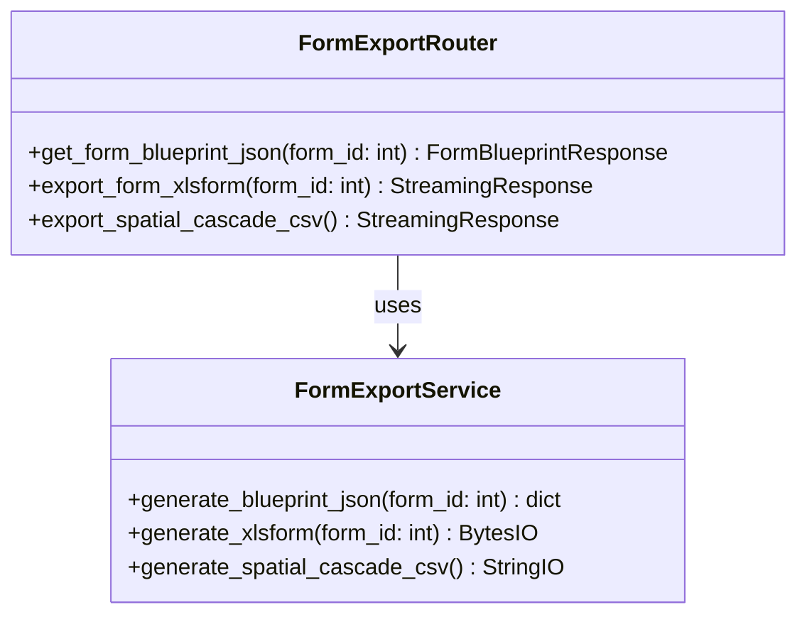
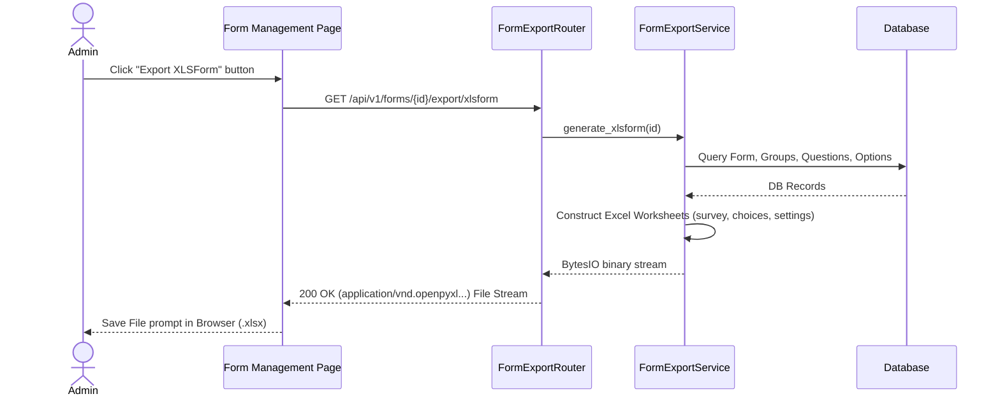

# LLD — Form Blueprint Export Utility

> **Stage 3 of 3 — Documentation Hierarchy**
> Owner: Winston (Architect) | Target Location: `docs/lld/form_blueprint_export_lld.md` | References: `docs/prd/form_blueprint_export_prd.md`
> Status: `Draft` | Open Questions Remaining: `0`

---

## 1. Overview & Scope

**Component / Module**:

- `FormExportService`: Generates XLSForm Excel files and shared cascade select CSV files.
- `FormExportRouter`: Exposes endpoints to trigger downloads of JSON, XLSForm, and cascade datasets.
- `FormListExportButton`: React/TypeScript addition to the Form List Admin page.

**PRD References**:

- `docs/prd/form_blueprint_export_prd.md`

**Out of Scope for this LLD**:

- Processing uploads or importing XLSForms back into the system database.

---

## 2. Component & Class Design



### Class Responsibilities

| Class               | Responsibility                                                                                                                                          | SOLID Principle |
| :------------------ | :------------------------------------------------------------------------------------------------------------------------------------------------------ | :-------------- |
| `FormExportRouter`  | Router layer: parses query params, converts BytesIO/StringIO to StreamingResponse with attachment headers                                               | SRP             |
| `FormExportService` | Service layer: queries database models (`Form`, `QuestionGroup`, `Question`, `Option`, `SpatialBoundary`) and compiles Excel workbook rows and CSV rows | SRP             |

---

## 3. Sequence Diagram

### XLSForm Generation & Download



---

## 4. Database & Models

No database migrations are required. The exporter operates entirely on read-only queries from the following tables:

- `form`
- `form_published_version` (for retrieving pre-compiled JSON blueprint schemas)
- `question_group` (fallback for draft)
- `question` (fallback for draft)
- `option` (fallback for draft)
- `spatial_boundary` (for cascade values)

### Query Logic Flow

1. Exporter checks if `?draft=true` is requested.
2. If `draft` is `true`, or if no published versions exist (`form.active_version_id` is null):
   - Exporter queries the relational tables (`question_group`, `question`, `option`) and normalizes the payload using `FormBlueprintResponse.from_orm_model()`.
3. If `draft` is `false` (default) and the form is published:
   - Exporter queries the `form_published_version` table where `id = form.active_version_id` and reads the pre-compiled `schema` JSON column directly.

---

## 5. XLSForm Generation Rules

### 1. `survey` Worksheet Mapping

- For each `QuestionGroup`:
  - Append `begin_group` row: `type="begin_group"`, `name=group.name`, `label=group.label`.
  - Process each child `Question` in group order:
    - **Name Mapping (Unique Identifier)**: Set the `name` column to `question.name`. This must match exactly to serve as the unique key linking Kobo submission payloads back to our database `question.name`.
    - **Multiple Choice**: `type="select_one option_{question.name}"` or `type="select_multiple option_{question.name}"`. If the question has `allowOther` set to true, `or_other` is appended to the type (e.g. `select_one option_{question.name} or_other`).
    - **Text / Numbers**: `type="text"` or `type="integer"` or `type="decimal"`.
    - **Cascade Selection**: `type="select_one_from_file spatial_cascade.csv"`.
    - Map `label::English (en)` to `question.label`, `label::Swahili (sw)` to the Swahili translation, `required` (yes/no), and constraints.
  - Append `end_group` row: `type="end_group"`.

### 2. `choices` Worksheet Mapping

- Loop through all questions with choices options.
- For each option under the question:
  - `list_name="option_{question.name}"`
  - `name=option.value`
  - `label::English (en)=option.label`
  - `label::Swahili (sw)=option.translations.get("sw")`

### 3. `settings` Worksheet Mapping

- `form_title=form.name`
- `form_id=form.name.lower().replace(" ", "_")`
- `version=form.version`
- `default_language="English (en)"`

---

## 6. Shared Cascade Select File

- `GET /api/v1/reference/spatial-cascade/csv` will query the spatial database to map out the geographic hierarchy (counties, subcounties, basins, wetlands, sites).
- File structure for `spatial_cascade.csv`:
  ```csv
  list_name,name,label,parent_key
  county,ug-east,Eastern Uganda,
  subcounty,kanduyi,Kanduyi,ug-east
  basin,sio-siteko,Sio-Siteko,kanduyi
  site,sampling-point-1,Sampling Point 1,sio-siteko
  ```

---

## 7. Edge Cases & Error Handling

- **Missing Translations**: Fall back to the default English label if a translation is missing.
- **Empty Question Groups**: Skip exporting groups that do not have active questions.
- **Large Cascade Dataset Performance**: Cache the generated CSV or stream it sequentially to keep memory usage low.
