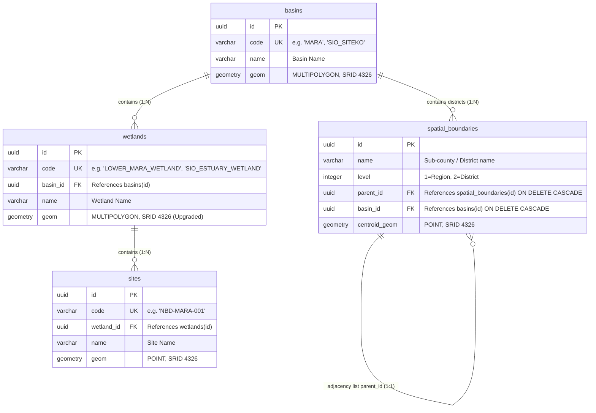

# Low-Level Design (LLD) — Spatial GeoJSON Ingestion Pipeline

## 1. Physical Schema and Relationships

To support loading complex administrative boundaries (such as wetlands with disjoint segments), we will modify the database schema by upgrading the `wetlands.geom` type from `POLYGON` to `MULTIPOLYGON`.

### 1.1 Schema Relationship Map

The spatial database tables share the following structure and references:



---

## 2. Component Design & SQLAlchemy Model Updates

### 2.1 Model Modification (`backend/app/models/spatial.py`)
Modify the `Wetland` class to specify `MULTIPOLYGON` as its geometry type:

```python
class Wetland(Base):
    __tablename__ = "wetlands"

    id = Column(UUID(as_uuid=True), primary_key=True, default=uuid.uuid4)
    code = Column(String(50), unique=True, nullable=False)
    basin_id = Column(UUID(as_uuid=True), ForeignKey("basins.id", ondelete="CASCADE"), nullable=False)
    name = Column(String(150), nullable=False)
    # Changed from POLYGON to MULTIPOLYGON
    geom = Column(Geometry("MULTIPOLYGON", srid=4326), nullable=False)

    basin = relationship("Basin", back_populates="wetlands")
    sites = relationship("Site", back_populates="wetland", cascade="all, delete-orphan")
```

---

## 3. Database Migration Strategy

We will provision a new Alembic migration script.

### 3.1 Migration Code Draft (`backend/alembic/versions/xxxx_alter_wetlands_geom_to_multipolygon.py`)
```python
def upgrade() -> None:
    # 1. Drop existing GIST index
    op.execute("DROP INDEX IF EXISTS idx_wetlands_geom")

    # 2. Alter column type using PostGIS helpers
    op.execute(
        "ALTER TABLE wetlands ALTER COLUMN geom TYPE geometry(MultiPolygon, 4326) "
        "USING ST_Multi(geom)"
    )

    # 3. Re-create GIST index
    op.execute("CREATE INDEX idx_wetlands_geom ON wetlands USING GIST (geom)")


def downgrade() -> None:
    # 1. Drop index
    op.execute("DROP INDEX IF EXISTS idx_wetlands_geom")

    # 2. Revert back to POLYGON
    op.execute(
        "ALTER TABLE wetlands ALTER COLUMN geom TYPE geometry(Polygon, 4326) "
        "USING ST_GeometryN(geom, 1)"
    )

    # 3. Re-create index
    op.execute("CREATE INDEX idx_wetlands_geom ON wetlands USING GIST (geom)")
```

---

## 4. Seeder Parsing Pipeline Design

### 4.1 Parser Mapping Specifications
The seeder will read static GeoJSON files and associate them with corresponding records from `spatial_data.json` based on their identifiers:

| Target Model | Target Record Code | Source Path | Geometry Type | Promotion Needed? |
| :--- | :--- | :--- | :--- | :--- |
| `Basin` | `MARA` | `spatial/mara-basin.geojson` | `MultiPolygon` | No |
| `Basin` | `SIO_SITEKO` | `spatial/sio-basin.geojson` | `GeometryCollection` containing `Polygon` | Yes (Polygon -> MultiPolygon) |
| `Wetland` | `LOWER_MARA_WETLAND` | `spatial/mara-wetland.geojson` | `Polygon` | Yes (Polygon -> MultiPolygon) |
| `Wetland` | `SIO_ESTUARY_WETLAND` | `spatial/sio-siteko-wetland.geojson` | `MultiPolygon` | No |

### 4.2 Parsing and Promotion Logic in Seeder
```python
from shapely.geometry import shape, Polygon, MultiPolygon
from geoalchemy2.shape import from_shape

def load_geojson_geometry(filename: str) -> MultiPolygon:
    path = os.path.join(os.path.dirname(__file__), "spatial", filename)
    with open(path, "r") as f:
        data = json.load(f)

    # Handle direct geometry extraction depending on GeoJSON root type
    if data.get("type") == "FeatureCollection":
        geom_data = data["features"][0]["geometry"]
    elif data.get("type") == "GeometryCollection":
        # Filter first Polygon/MultiPolygon
        geom_data = [g for g in data["geometries"] if g["type"] in ("Polygon", "MultiPolygon")][0]
    else:
        geom_data = data

    geom = shape(geom_data)

    # Promote Polygon to MultiPolygon to satisfy table constraints
    if isinstance(geom, Polygon):
        geom = MultiPolygon([geom])

    return geom
```
These parsed geometries will be loaded using `from_shape(geom, srid=4326)` and assigned to the database models.
