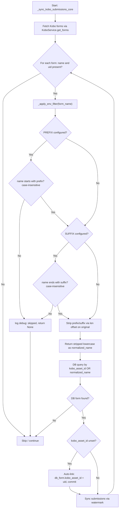

# LLD — Kobo Forms Environment Separation

> **Stage 3 of 3 — Documentation Hierarchy**
> Owner: Tech Lead / Senior Engineer | Target Location: `docs/lld/kobo_env_separation_lld.md` | References: `docs/prd/kobo_env_separation_prd.md`
> Status: `Approved` | Open Questions Remaining: `0`

---

## 1. Overview & Scope

This document details the low-level implementation of environment-specific Kobo form name filtering to prevent cross-contamination of submission data between production and non-production environments.

### Component / Module

- **`_apply_env_filter`** _(new)_: Standalone helper function in `backend/app/services/kobo.py`. Reads `KOBO_FORM_NAME_PREFIX` and `KOBO_FORM_NAME_SUFFIX` from the environment, validates the Kobo form name against the configured filter, and returns the normalized DB lookup name or `None` if the form should be skipped.
- **`_sync_kobo_submissions_core`** _(modified)_: The existing sync loop is updated to delegate name normalization to `_apply_env_filter` instead of a bare `.strip().lower()` call.

### PRD References

- **UAC-01**: Suffix-filtered sync (e.g., `KOBO_FORM_NAME_SUFFIX=" [TEST]"`).
- **UAC-02**: No-filter fallback — all forms evaluated as before.
- **TAC-01**: Case-insensitive, whitespace-trimmed matching.
- **TAC-02**: `kobo_asset_id` auto-link only triggers when name-match constraints are fully satisfied.
- **Nice-to-Have**: Debug log showing skipped forms.

### Out of Scope

- Creating or editing Kobo forms programmatically.
- Managing multiple KoboToolbox accounts per environment.
- Frontend UI for configuring environment filters.

---

## 2. Component & Function Design

### 2.1 New Helper: `_apply_env_filter`

**Location**: `backend/app/services/kobo.py` — inserted immediately after `parse_kobo_timestamp` (currently at L57–L67).

```python
def _apply_env_filter(form_name: str) -> str | None:
    """
    Applies environment-specific Kobo form name filtering.

    Reads KOBO_FORM_NAME_PREFIX and KOBO_FORM_NAME_SUFFIX from the environment.
    Returns the normalized (stripped + lowercased) form name for DB lookup,
    or None if the form does not match the configured filter and should be skipped.

    Matching is case-insensitive. Stripping uses len() offset on the original
    string to preserve mid-string casing before final lowercasing.
    """
    prefix = os.getenv("KOBO_FORM_NAME_PREFIX", "").strip().lower()
    suffix = os.getenv("KOBO_FORM_NAME_SUFFIX", "").strip().lower()
    name_lower = form_name.lower()

    if prefix and not name_lower.startswith(prefix):
        logger.debug(
            f"Skipping Kobo form '{form_name}': "
            f"does not match prefix '{prefix}'"
        )
        return None

    if suffix and not name_lower.endswith(suffix):
        logger.debug(
            f"Skipping Kobo form '{form_name}': "
            f"does not match suffix '{suffix}'"
        )
        return None

    # Strip from original (offset by len) to preserve mid-string casing
    stripped = form_name
    if prefix:
        stripped = stripped[len(prefix):]
    if suffix:
        stripped = stripped[: len(stripped) - len(suffix)]

    return stripped.strip().lower()
```

**Signature**: `_apply_env_filter(form_name: str) -> str | None`

| Parameter   | Type          | Description                                      |
| ----------- | ------------- | ------------------------------------------------ |
| `form_name` | `str`         | Raw Kobo form name from API response             |
| **Returns** | `str \| None` | Normalized name for DB lookup, or `None` to skip |

### 2.2 Modified: `_sync_kobo_submissions_core`

**Change**: Replace the bare `normalized_name = form_name.strip().lower()` at L104 with a delegated call and guard.

```python
# BEFORE (L104):
normalized_name = form_name.strip().lower()

# AFTER:
normalized_name = _apply_env_filter(form_name)
if normalized_name is None:
    continue
```

The rest of the loop — DB query, `kobo_asset_id` auto-link, watermark, submission fetching — is **unchanged**.

---

## 3. Data Flow



---

## 4. Environment Variable Schema

**Location**: `.env.example` — appended to the `# KoboToolbox API Integration` block.

```dotenv
# KoboToolbox API Integration
KOBOTOOLBOX_API_URL=https://eu.kobotoolbox.org
KOBOTOOLBOX_API_TOKEN=your_actual_token_here

# Optional: Restrict Kobo sync to forms matching this environment prefix/suffix.
# Leave unset (or empty) in production to sync all forms without filtering.
# Example (staging): KOBO_FORM_NAME_PREFIX=Staging_
# Example (dev):     KOBO_FORM_NAME_SUFFIX= [DEV]
KOBO_FORM_NAME_PREFIX=
KOBO_FORM_NAME_SUFFIX=
```

| Variable                | Type  | Default                 | Description                                                                   |
| ----------------------- | ----- | ----------------------- | ----------------------------------------------------------------------------- |
| `KOBO_FORM_NAME_PREFIX` | `str` | `""` (empty = disabled) | Only sync Kobo forms whose names **start with** this value (case-insensitive) |
| `KOBO_FORM_NAME_SUFFIX` | `str` | `""` (empty = disabled) | Only sync Kobo forms whose names **end with** this value (case-insensitive)   |

> **AND logic**: When both are set, a form must satisfy **both** prefix AND suffix conditions to be synced.

---

## 5. Logic & Algorithm Detail

### 5.1 Matching Rules

| Scenario       | Prefix set | Suffix set | Form name                 | Result                                |
| -------------- | ---------- | ---------- | ------------------------- | ------------------------------------- |
| No filter      | —          | —          | `Water Quality`           | ✅ synced (unchanged behavior)        |
| Suffix only    | —          | `[test]`   | `Water Quality [TEST]`    | ✅ synced, DB lookup: `water quality` |
| Suffix only    | —          | `[test]`   | `Water Quality`           | ❌ skipped                            |
| Prefix only    | `dev_`     | —          | `Dev_Water Quality`       | ✅ synced, DB lookup: `water quality` |
| Both           | `dev_`     | `[dev]`    | `Dev_Water Quality [DEV]` | ✅ synced, DB lookup: `water quality` |
| Both (partial) | `dev_`     | `[dev]`    | `Dev_Water Quality`       | ❌ skipped (missing suffix)           |

### 5.2 Strip Algorithm

The stripping uses `len()` offset on the **original** (non-lowercased) string:

```text
form_name       = "Dev_Water Quality [DEV]"
prefix (lower)  = "dev_"           → len = 4
suffix (lower)  = " [dev]"         → len = 6

stripped = form_name[4:]           → "Water Quality [DEV]"
stripped = stripped[: 19 - 6]     → "Water Quality"
result   = stripped.strip().lower()→ "water quality"
```

This preserves mid-string characters correctly regardless of case.

---

## 6. Error Handling & Edge Cases

| Case                                                       | Behaviour                                                                       |
| ---------------------------------------------------------- | ------------------------------------------------------------------------------- |
| `form_name` is empty / None                                | Caught by existing null guard at L99 — `_apply_env_filter` never called         |
| `KOBO_FORM_NAME_PREFIX` = `""` or whitespace-only          | `.strip()` → `""` → prefix check is **skipped** (no-op)                         |
| `KOBO_FORM_NAME_SUFFIX` = `""` or whitespace-only          | `.strip()` → `""` → suffix check is **skipped** (no-op)                         |
| Form name is exactly the prefix/suffix (empty after strip) | `stripped.strip()` → `""` → DB query returns no match → form skipped gracefully |
| Both prefix and suffix set, only one matches               | ❌ Skipped — AND logic enforced                                                 |
| Non-ASCII / accented characters in form name               | Safe — offset slicing on original string avoids encoding issues                 |
| Production: no env vars set                                | Behaves identically to current implementation                                   |
| `kobo_asset_id` auto-link                                  | Only triggered **after** `_apply_env_filter` passes — TAC-02 satisfied          |

---

## 7. Test Specification

**File**: `backend/tests/test_kobo_sync.py`
**Pattern**: `@patch("app.services.kobo.KoboService.get_forms")` + `@patch("app.services.kobo.KoboService.get_submissions")`
**Env cleanup**: `try/finally` with `os.environ.pop(key, None)` per test.

### Test Cases

| Test                                   | Env                                 | Kobo Name                   | DB Name         | Expected                            |
| -------------------------------------- | ----------------------------------- | --------------------------- | --------------- | ----------------------------------- |
| `test_sync_env_suffix_filter_matches`  | `SUFFIX=" [test]"`                  | `Water Quality [TEST]`      | `Water Quality` | `processed_forms == 1`              |
| `test_sync_env_prefix_filter_matches`  | `PREFIX="dev_"`                     | `Dev_Water Quality`         | `Water Quality` | `processed_forms == 1`              |
| `test_sync_env_filter_skips_unmatched` | `SUFFIX=" [test]"`                  | `Water Quality` (no suffix) | `Water Quality` | `processed_forms == 0`              |
| `test_sync_env_both_prefix_and_suffix` | `PREFIX="dev_"` + `SUFFIX=" [dev]"` | `Dev_Water Quality [DEV]`   | `Water Quality` | `processed_forms == 1`              |
| `test_sync_env_no_filter_syncs_all`    | _(none)_                            | `Water Quality`             | `Water Quality` | `processed_forms == 1` (regression) |

### Env Cleanup Pattern

```python
os.environ["KOBO_FORM_NAME_SUFFIX"] = " [test]"
try:
    result = sync_kobo_submissions(db_session)
    assert result["processed_forms"] == 1
finally:
    os.environ.pop("KOBO_FORM_NAME_SUFFIX", None)
```

---

## 8. Design Patterns Applied

| Pattern                         | Rationale                                                                                                                 |
| ------------------------------- | ------------------------------------------------------------------------------------------------------------------------- |
| **Single Responsibility (SRP)** | `_apply_env_filter` owns the filter/strip logic exclusively; `_sync_kobo_submissions_core` stays focused on orchestration |
| **KISS**                        | Two `os.getenv` reads + two `str` checks — no regex, no dataclass                                                         |
| **YAGNI**                       | No config object, no database column, no admin UI — only what the PRD requires                                            |
| **Graceful Degradation**        | Empty env vars → no-op; production environments unaffected                                                                |

---

## 9. Files Changed

| File                              | Type   | Description                                                                  |
| --------------------------------- | ------ | ---------------------------------------------------------------------------- |
| `backend/app/services/kobo.py`    | MODIFY | Add `_apply_env_filter` helper; update `_sync_kobo_submissions_core` L104    |
| `.env.example`                    | MODIFY | Append `KOBO_FORM_NAME_PREFIX` and `KOBO_FORM_NAME_SUFFIX` to the Kobo block |
| `backend/tests/test_kobo_sync.py` | MODIFY | Add 5 new test cases with env cleanup pattern                                |
