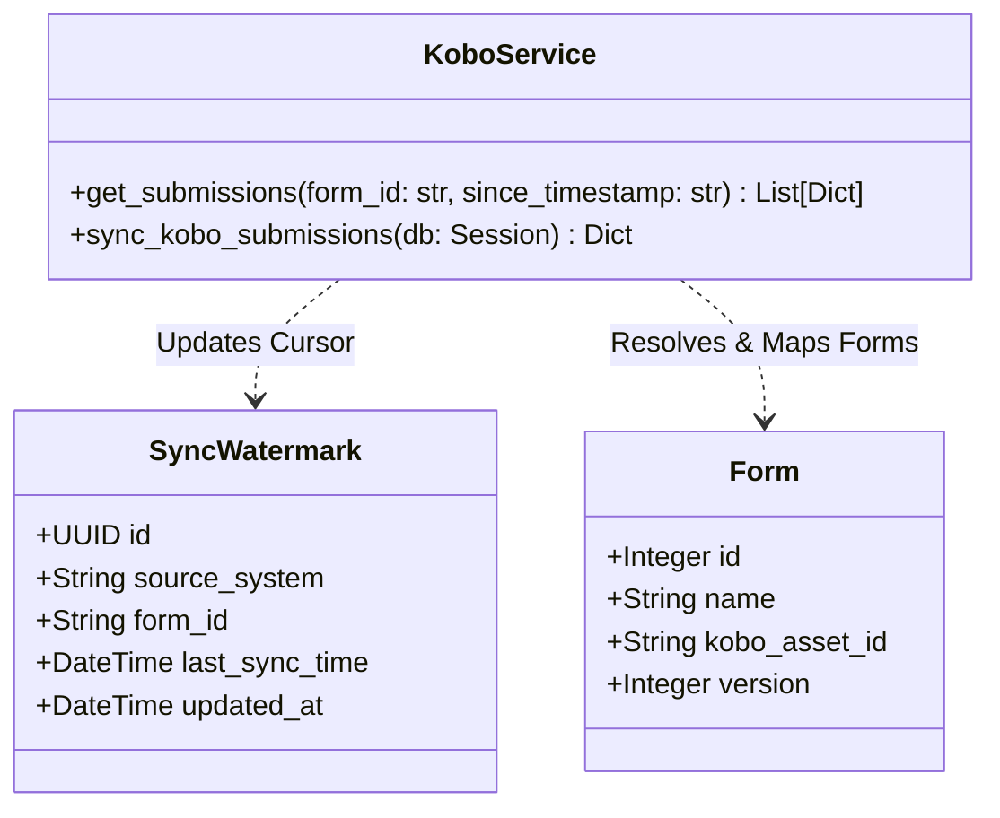

# Low-Level Design (LLD) — KoboToolbox API Connector & Hourly Watermark Engine

> **Stage 3 of 3 — Documentation Hierarchy**
> Owner: Winston (Architect) | Target Location: `docs/lld/kobo_watermark_lld.md` | References: `docs/prd/kobo_watermark_prd.md`, `docs/architecture_map.md`
> Status: `Approved`

---

## 1. Component Overview

The KoboToolbox API Connector & Hourly Watermark Engine connects to KoboToolbox, fetches submitted citizen science forms hourly, deduplicates records, and stages them in the platform's standard database tables. By implementing persistent watermarks, the engine tracks progress and prevents duplicate API load.

---

## 2. Architecture & Design Patterns

### 2.1 Component Diagram



### 2.2 Matching Algorithm with Name Mismatch Handling

The synchronization workflow processes each Kobo form using a multi-step matching resolution algorithm:

1. **Query by `kobo_asset_id`**: First, look up the form using Kobo's unique `uid`:
   ```python
   db_form = db.query(Form).filter(Form.kobo_asset_id == uid).first()
   ```
2. **Fallback to Name Lookup**: If no record matches by ID, query by name:
   ```python
   db_form = db.query(Form).filter(Form.name == form_name).first()
   ```
3. **Auto-Linking Update**: If found via name but `kobo_asset_id` is null, write the Kobo asset UID to `kobo_asset_id` and commit to persist the link:
   ```python
   db_form.kobo_asset_id = uid
   db.commit()
   ```
4. **Skip Unknown Forms**: If neither check matches, skip syncing submissions for the form.

---

## 3. Database Schema

### 3.1 `sync_watermarks` Table

Stores the watermarks cursor for each external data source.

| Column | Type | Constraints | Description |
| :--- | :--- | :--- | :--- |
| `id` | UUID | PRIMARY KEY, default=uuid4 | Unique watermark ID. |
| `source_system` | VARCHAR(50) | NOT NULL | Identifier (e.g. `'kobotoolbox'`). |
| `form_id` | VARCHAR(100) | NULLABLE | The Kobo Form Asset UID. |
| `last_sync_time` | TIMESTAMP | NOT NULL | Last processed `_submission_time` timestamp. |
| `updated_at` | TIMESTAMP | NOT NULL, default=now() | Last update timestamp. |

* **Constraints**: `uq_sync_watermarks_source_form` unique constraint on `(source_system, form_id)`.

### 3.2 `form` Table Extension

Extends the local form blueprint with external identifiers.

| Column | Type | Constraints | Description |
| :--- | :--- | :--- | :--- |
| `kobo_asset_id` | VARCHAR(255) | NULLABLE, UNIQUE, INDEX | Unique Kobo Asset UID mapping. |

---

## 4. Execution & API Interfaces

### 4.1 Hourly Background Ingestion
* **Trigger**: Background worker daemon (`backend/app/scheduler.py`).
* **Frequency**: Wakes up every 60 minutes.
* **Query Builder**: Calls `GET /api/v2/assets/{form_id}/data.json?query={"_submission_time": {"$gt": "LAST_WATERMARK"}}`.

### 4.2 Manual Command-Line Trigger
* **Command**: Execute directly inside the backend container.
  ```bash
  python app/scripts/sync_kobo.py
  ```

---

## 5. Error Handling & Edge Cases

1. **Idempotency Guard**:
   Each incoming submission payload checks `_uuid`. If a record with that UUID already exists in the `datapoint` table, it is skipped.
2. **Missing Watermark Fallback**:
   If no sync watermark is found, the engine queries submissions from the last 60 minutes (`now() - 60 minutes`).
