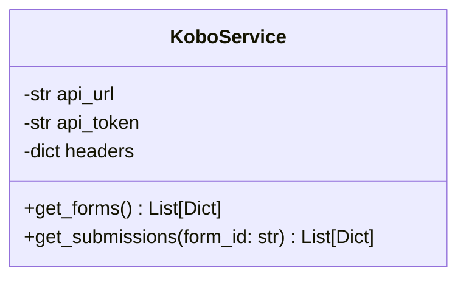

<!-- DIRTY_AMENDMENT: [Added kobo_asset_id column to form table and updated name-matching logic, approved by John 2026-06-09] -->
# Low-Level Design (LLD) — KoboToolbox API Integration

> **Stage 3 of 3 — Documentation Hierarchy**
> Owner: Winston (Architect) | Target Location: `docs/lld/kobotoolbox_integration_lld.md` | References: `docs/prd/kobotoolbox_integration_prd.md`
> Status: `Approved`

---

## 1. Authentication Protocol

KoboToolbox API v2 utilizes Token-based authentication. The client must present the credentials on every HTTP request inside the `Authorization` header:

```http
Authorization: Token YOUR_API_TOKEN
```

The credentials and URL are loaded from the environment variables:
- `KOBOTOOLBOX_API_URL` (e.g. `https://eu.kobotoolbox.org`)
- `KOBOTOOLBOX_API_TOKEN` (e.g. `your_api_token`)

---

## 2. Component Design

We will introduce a dedicated service class `KoboService` in `backend/app/services/kobo.py` wrapping HTTP client operations using `httpx`.



### 2.1 Interface & Methods

- **`get_forms()`**: Fetches deployed assets/form structures.
  - Endpoint: `GET {KOBOTOOLBOX_API_URL}/api/v2/assets.json`
- **`get_submissions(form_id: str)`**: Fetches all responses submitted to a specific form.
  - Endpoint: `GET {KOBOTOOLBOX_API_URL}/api/v2/assets/{form_id}/data.json`

---

## 3. Worker Integration

The APScheduler daemon in `backend/app/scheduler.py` runs the background worker. We will import `KoboService` into `hourly_kobotoolbox_pull` to execute the sync:

1. Retrieve active form blueprints configured in the system database.
2. Initialize `KoboService`.
3. Fetch new submissions from KoboToolbox since the last successful sync timestamp.
4. Stage and ingest submissions into `datapoint` and `answer` tables.
