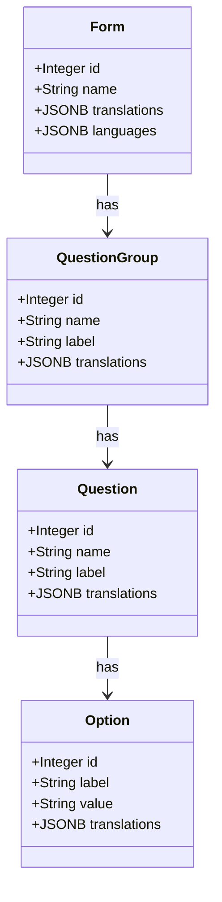

# Low-Level Design (LLD) — Multilingual Questionnaire Support (Swahili & English)

## 1. System Components & Data Model

We will add a single `translations` column of type `JSONB` to the `form`, `question_group`, `question`, and `option` tables, allowing dynamic translation lookup for any language.



### Database Fields Specifications

*   **`Form.translations`**: `JSONB` array of dicts matching:
    ```json
    [{"name": "Komunitas Kuliner Survey 2021", "language": "id"}]
    ```
*   **`Form.languages`**: `JSONB` array of strings matching:
    ```json
    ["en", "id"]
    ```
*   **`QuestionGroup.translations`**: `JSONB` array of dicts matching:
    ```json
    [{"name": "Registrasi", "language": "id"}]
    ```
*   **`Question.translations`**: `JSONB` array of dicts matching:
    ```json
    [{"name": "Lokasi", "language": "id"}]
    ```
*   **`Option.translations`**: `JSONB` array of dicts matching:
    ```json
    [{"name": "Jawa Barat", "language": "id"}]
    ```

---

## 2. API Design & Dynamic Serialization

To return localized questionnaires dynamically to the frontend, the FastAPI routers and Pydantic schemas will intercept the active language parameter and resolve fields.

### Translation Helper

A central utility function to resolve translations:

```python
# backend/app/services/translation.py

from typing import List, Dict, Any

def get_translation(translations: List[Dict[str, Any]] | None, lang: str, fallback: str) -> str:
    """Finds the text corresponding to 'lang' in a translations JSONB list, falling back to 'fallback'."""
    if not translations:
        return fallback
    for entry in translations:
        if entry.get("language") == lang:
            return entry.get("name", fallback)
    return fallback
```

### Serializer Integration

Pydantic schemas will dynamically resolve translated labels if `lang` context is passed (or read from requests):

```python
class QuestionResponse(BaseModel):
    id: int
    name: str
    label: str
    type: str

    @classmethod
    def from_orm_localized(cls, db_obj, lang: str):
        # Substitute label with translated value if lang matches
        label = get_translation(db_obj.translations, lang, db_obj.label)
        return cls(
            id=db_obj.id,
            name=db_obj.name,
            label=label,
            type=db_obj.type.value
        )
```

---

## 3. Webhook Channels Integration

### A. USSD Menu Engine (`ussd_router.py`)

1.  **Welcome State**: If `sessionState` has no `language`, prompt the user to select a language:
    ```
    CON Welcome to NBD Portal. Choose Language / Chagua Lugha:
    1. English
    2. Kiswahili
    ```
2.  **State Persistence**: When selection is made:
    *   `1` -> save `language = "en"` in session dict.
    *   `2` -> save `language = "sw"` in session dict.
3.  **Rendering**: All subsequent USSD prompts (e.g. incident select list) will fetch translations using `get_translation(question.translations, session.language, question.label)`.

### B. WhatsApp Chat Tree (`whatsapp_service.py`)

1.  **Welcome Message**: WhatsApp triggers a selection button message (Swahili / English).
2.  **Session Database**: The `whatsapp_sessions` table stores the `language` value (default `"en"`).
3.  **Chat States**: All interactive menus are populated by translating question/option labels dynamically before building the Meta template payload.

---

## 4. Verification Plan

### Automated Tests
*   **Seeder Test**: Verify seed JSON files containing `translations` array are imported correctly into PostgreSQL.
*   **Resolution Test**: Call the translation utility with empty, matching, and non-matching language parameters to confirm exact fallback functionality.
*   **USSD Mock Test**: Mock USSD session transition to Swahili ("2") and assert that subsequent prompt contains Swahili labels.
*   **API Localisation Test**: Request `GET /api/v1/forms/{id}?lang=sw` and assert that the returned fields contain Swahili text.
