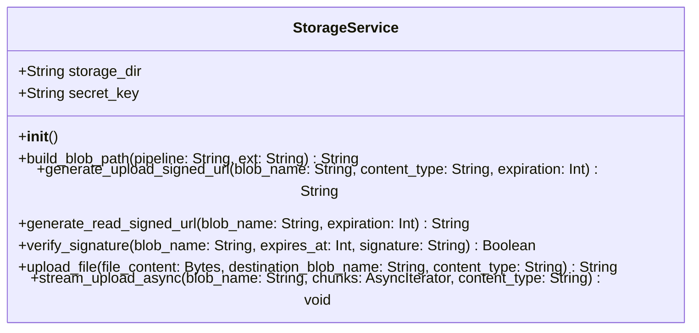

# Low-Level Design (LLD) — NFS Storage Migration

> **Stage 3 of 3 — Documentation Hierarchy**
> Owner: Winston (Architect) | Target Location: `docs/lld/nfs_storage_migration_lld.md` | References: `docs/prd/nfs_storage_migration_prd.md`, `docs/api_contract.md`
> Status: `Approved`

---

## 1. Component Overview

The Storage Service is being migrated from Google Cloud Storage (GCS) to a Network File System (NFS) mounted directory. To support this migration without changing the frontend logic or requiring complex auth headers in `` tags, we implement a secure, stateless, signature-based local file access system.

It provides interfaces to:

- Generate local presigned upload URLs appended with HMAC-SHA256 signatures.
- Generate local presigned read URLs appended with HMAC-SHA256 signatures.
- Validate these signatures and expiration timestamps on request ingestion.
- Stream files to/from the local filesystem (`STORAGE_DIR`).

---

## 2. Architecture & Design Patterns

### 2.1 File Path Strategy

The legacy behavior of appending `APP_ENV` to the path prefix (e.g. `development/whatsapp/uuid.jpg`) is removed. Since environments (dev, staging, production) use physically isolated NFS mounts, all paths are stored relative to the mount root:

- Media Ingestion: `media/{pipeline}/{uuid}.{ext}`
- General Exports/Documents: `file/{filename}`

### 2.2 HMAC-SHA256 Signature Verification

To serve images to native HTML `` elements (which cannot supply `Authorization` headers), presigned URLs contain signature tokens verified by the backend.

```text
Signature = HMAC-SHA256(SECRET_KEY, "blob_name:expires_at")
```

The signature parameter is calculated using:

- `blob_name`: The relative file path inside the storage directory (e.g. `media/whatsapp/uuid.jpg`).
- `expires_at`: The expiration timestamp as an integer epoch timestamp (seconds).
- `SECRET_KEY`: The application-wide secret key.



---

## 3. Configuration & Environment Variables

The following backend environment variables are required:

| Environment Variable | Description                           | Default        |
| -------------------- | ------------------------------------- | -------------- |
| `STORAGE_DIR`        | The path to the mounted NFS directory | `/app/storage` |
| `SECRET_KEY`         | The secret key used to compute HMACs  | (Raises error) |

---

## 4. API Endpoints Contract

### 4.1 Request Presigned Upload URL

Generates a local upload URL pointing to the new local backend upload route.

- **Endpoint**: `POST /api/v1/storage/presigned-upload`
- **Request Schema**:

  ```json
  {
    "file_name": "media/whatsapp/survey_photo_123.jpg",
    "content_type": "image/jpeg"
  }
  ```

- **Response Schema (200 OK)**:

  ```json
  {
    "upload_url": "http://localhost:8000/api/v1/storage/upload/media/whatsapp/survey_photo_123.jpg?expires=1781152862&signature=abcdef123456...",
    "blob_name": "media/whatsapp/survey_photo_123.jpg"
  }
  ```

### 4.2 Request Presigned Read URL

Generates a local retrieval URL pointing to the new local file serving route.

- **Endpoint**: `GET /api/v1/storage/presigned-read`
- **Query Parameters**:
  - `blob_name` (string, required): The target file path relative to `STORAGE_DIR`.
- **Response (200 OK)**:

  ```json
  {
    "read_url": "http://localhost:8000/api/v1/storage/files/media/whatsapp/survey_photo_123.jpg?expires=1781152862&signature=abcdef123456..."
  }
  ```

### 4.3 Serve Uploaded File (PUT Upload)

Authenticates the request using the query parameters and writes the stream directly to the filesystem.

- **Endpoint**: `PUT /api/v1/storage/upload/{blob_name:path}`
- **Query Parameters**:
  - `expires` (int): Expiration epoch.
  - `signature` (string): HMAC signature.
- **Headers**: `Content-Type: <mime-type>`
- **Payload**: Raw binary data stream.
- **Response**: `200 OK` on success, `403 Forbidden` if signature is invalid or expired, `500 Internal Server Error` on disk write failure.

### 4.4 Download/Stream File (GET Serve)

Authenticates the signature and streams the file using chunked responses.

- **Endpoint**: `GET /api/v1/storage/files/{blob_name:path}`
- **Query Parameters**:
  - `expires` (int): Expiration epoch.
  - `signature` (string): HMAC signature.
- **Response**: Binary file response with appropriate headers, or `404 Not Found` if file is missing, or `403 Forbidden` if signature/expiration check fails.

---

## 5. Error Handling & Edge Cases

1. **Directories Creation**:
   - Before saving a file inside `STORAGE_DIR/{blob_name}`, the backend must verify the target directory exists, creating intermediate subdirectories recursively if missing.
2. **Missing Files**:
   - If the file is not present on disk, return `HTTP 404 Not Found` instead of raising a 500 error.
3. **Invalid/Expired Signatures**:
   - If the current time is past `expires_at`, return `HTTP 403 Forbidden` with detail `"Request signature has expired"`.
   - If the HMAC signature doesn't match, return `HTTP 403 Forbidden` with detail `"Invalid request signature"`.
