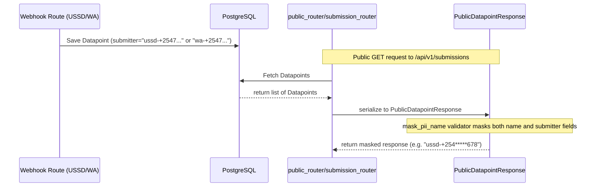

# LLD — Phone Number Persistence & Presentation

> **Stage 3 of 3 — Documentation Hierarchy**
> Owner: Winston (Architect) | Target Location: `docs/lld/phone_number_persistence_lld.md` | References: `docs/prd/phone_number_persistence_prd.md`
> Status: `Approved`

---

## 1. Overview & Scope

This LLD covers the backend changes to save the user phone number inside the `submitter` column of the `datapoint` table for both USSD and WhatsApp workflows, and the schema adjustments to ensure these phone numbers are masked on public endpoints.

---

## 2. Component & Class Design

### Affected Backend Components

1. **`app.routers.ussd_router`**:
   - Update `_handle_ussd_core` to set the `submitter` column in `Datapoint` to `f"ussd-{phoneNumber}"` instead of `"USSD"`.
2. **`app.services.whatsapp_service`**:
   - Update `_save_report` to set the `submitter` column in `Datapoint` to `f"wa-{phone}"` instead of `"WHATSAPP"`.
3. **`app.schemas.submission` (`PublicDatapointResponse`)**:
   - Enhance the post-validator `mask_pii_name` to also check and mask the `submitter` field if it contains a phone number prefix (`wa-` or `ussd-`).

---

## 3. Detailed Data Flow



---

## 4. Specific Code Changes

### USSD Router (`backend/app/routers/ussd_router.py`)

Modify the `Datapoint` instantiation:

```python
    dp = Datapoint(
        uuid=uuid.uuid4(),
        form_id=form.id,
        published_version_id=form.active_version_id,
        submitter=f"ussd-{phoneNumber}",
        status="PENDING",
        name=sessionId,
    )
```

### WhatsApp Service (`backend/app/services/whatsapp_service.py`)

Modify the `Datapoint` instantiation in `_save_report`:

```python
    dp = Datapoint(
        uuid=uuid.uuid4(),
        form_id=form.id,
        published_version_id=form.active_version_id,
        submitter=f"wa-{phone}",
        status="PENDING",
        name=f"wa-{phone}",
    )
```

### Submission Schema (`backend/app/schemas/submission.py`)

Modify `PublicDatapointResponse` validator:

```python
class PublicDatapointResponse(DatapointResponse):
    @model_validator(mode="after")
    def mask_pii_name(self) -> "PublicDatapointResponse":
        # Mask name
        if self.name:
            if self.name.startswith("wa-"):
                parts = self.name.split("-")
                if len(parts) > 1:
                    phone = parts[1]
                    if len(phone) > 6:
                        masked_phone = (
                            phone[:4] + "*" * (len(phone) - 7) + phone[-3:]
                        )
                        self.name = f"wa-{masked_phone}"
                    else:
                        self.name = "wa-***"
            elif self.name.startswith("+") and self.name[1:].isdigit():
                phone = self.name
                if len(phone) > 6:
                    self.name = phone[:4] + "*" * (len(phone) - 7) + phone[-3:]
                else:
                    self.name = "***"

        # Mask submitter
        if self.submitter:
            if self.submitter.startswith("wa-"):
                parts = self.submitter.split("-")
                if len(parts) > 1:
                    phone = parts[1]
                    if len(phone) > 6:
                        masked_phone = (
                            phone[:4] + "*" * (len(phone) - 7) + phone[-3:]
                        )
                        self.submitter = f"wa-{masked_phone}"
                    else:
                        self.submitter = "wa-***"
            elif self.submitter.startswith("ussd-"):
                parts = self.submitter.split("-")
                if len(parts) > 1:
                    phone = parts[1]
                    if len(phone) > 6:
                        masked_phone = (
                            phone[:4] + "*" * (len(phone) - 7) + phone[-3:]
                        )
                        self.submitter = f"ussd-{masked_phone}"
                    else:
                        self.submitter = "ussd-***"

        return self
```

---

## 5. Verification & Test Plan

- **Unit Tests**:
  - Update or write unit tests in `backend/tests/test_ussd.py` and `backend/tests/test_whatsapp.py` to assert that the `submitter` is correctly written as `ussd-{phone}` and `wa-{phone}`.
  - Update `backend/tests/test_public_api.py` to assert that public queries to `/api/v1/submissions` have their `submitter` masked correctly and never leak plaintext phone numbers.
