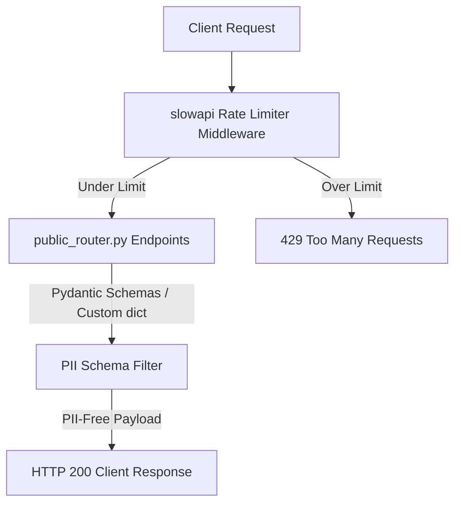

# Low-Level Design — Privacy Pipeline & Infrastructure Security

> **Stage 3 of 3 — Documentation Hierarchy**
> Target Location: `docs/lld/privacy_pipeline_lld.md` | References: `docs/prd/privacy_pipeline_prd.md`, `docs/Final_SDD.md` §7
> Status: `Approved` | Sign-off: Winston (Architect): _Winston, 2026-06-22_ | Amelia (Developer): _Amelia, 2026-06-22_

---

## 1. Component Overview & Architecture

This feature secures public-facing endpoints under `/api/v1/*` against:
1. **PII Leakage (3A)**: Establishing response schema tests to ensure no phone number or other watcher personal data is ever output on unauthenticated routes.
2. **Denial of Service / Abuse (3B)**: Implementing client-IP rate limiting using `slowapi` (an in-memory, zero-dependency rate limiter).



---

## 2. PII Schema Audit

The public endpoints defined in `app/routers/public_router.py` are:
1. `GET /sites` (returns `List[schemas.Site]`)
2. `GET /sites/{site_id}` (returns `schemas.Site`)
3. `GET /sites/{site_id}/scores` (returns `List[schemas.SiteScoreHistory]`)
4. `GET /sites/{site_id}/external/{source}` (returns custom dict)
5. `GET /incidents` (returns custom dict)

None of the above return models join the `citizens` table. The field `phone_number` is only present in:
- `app/schemas/citizen.py` (specifically `CitizenBase` and `CitizenResponse`).

### Regression Safeguards
We will add automated tests in `test_public_api.py` that call all 5 public endpoints and recursively inspect the JSON responses to verify that:
- No key matching `phone_number` is returned.
- No phone numbers (identifiable by E.164 pattern or string search) exist in the data payloads.

---

## 3. In-Memory Rate Limiting

We will use the `slowapi` library which is a FastAPI wrapper around `limits`.

### Configuration in `app/main.py`
We will initialize the limiter and register the rate limit exceeded exception handler:

```python
import os
from slowapi import Limiter, _rate_limit_exceeded_handler
from slowapi.util import get_remote_address
from slowapi.errors import RateLimitExceeded

# Set up limiter. Disable during standard tests (except the specific rate limiting test)
limiter = Limiter(
    key_func=get_remote_address,
    enabled=os.getenv("TESTING") != "True"
)
app.state.limiter = limiter
app.add_exception_handler(RateLimitExceeded, _rate_limit_exceeded_handler)
```

### Handler Injection in `app/routers/public_router.py`
Endpoints must accept the `request: Request` parameter in order for the `slowapi` decorator to extract the client IP:

```python
from fastapi import Request
from app.main import limiter

@router.get("/sites")
@limiter.limit("60/minute")
def list_sites(request: Request, db: Session = Depends(get_db), ...):
    ...
```

---

## 4. Testing & Verification

### Schema Compliance Test
- Query all public endpoints and assert `phone_number` is not in the JSON structure.

### Rate Limiter Behavior Test
- Enable the limiter specifically: `app.state.limiter.enabled = True`.
- Make 60 requests in quick succession using the FastAPI `TestClient`; assert all return `200 OK`.
- Make the 61st request; assert it returns `429 Too Many Requests`.
- Verify the response contains the header `Retry-After`.
- Reset the limiter's state: `app.state.limiter.enabled = False`.
