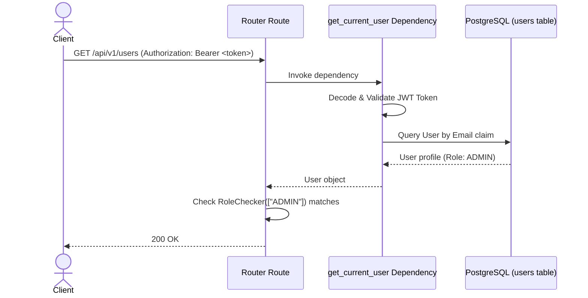

# LLD — RBAC Security Gate (Authentication & Authorization)

> **Stage 3 of 3 — Documentation Hierarchy**
> Owner: Winston (Architect) | Target Location: `docs/lld/rbac_security_lld.md` | References: `docs/prd/rbac_security_prd.md`
> Status: `Draft`

---

## 1. Overview & Scope

**Component / Module**:
`app.dependencies.auth` containing JWT verification dependencies and role-based checkers.

**PRD References**:
FR-001, FR-002, FR-003, FR-004.

---

## 2. Component Design & Sequence Flow

We will implement role authorization using FastAPI's dependency injection system (`Depends`).



---

## 3. Class & Method Specifications

### `get_current_user` Dependency
Parses and validates the incoming token.

```python
from fastapi.security import HTTPBearer, HTTPAuthorizationCredentials
from fastapi import Depends, HTTPException, status
import jwt # PyJWT dependency

security = HTTPBearer()

def get_current_user(
    credentials: HTTPAuthorizationCredentials = Depends(security),
    db: Session = Depends(get_db)
) -> User:
    token = credentials.credentials
    try:
        # Decode token (signature check, expiry check)
        payload = jwt.decode(token, JWT_SECRET, algorithms=["HS256"])
        email = payload.get("email")
        if not email:
            raise HTTPException(status_code=401, detail="Invalid token claims")
    except Exception:
        raise HTTPException(status_code=401, detail="Invalid or expired token")

    user = db.query(User).filter(User.email == email, User.is_active == True).first()
    if not user:
        raise HTTPException(status_code=401, detail="User not registered or inactive")
    return user
```

### `RoleChecker` Class
Reusable route-level authorization checker.

```python
class RoleChecker:
    def __init__(self, allowed_roles: List[str]):
        self.allowed_roles = allowed_roles

    def __call__(self, current_user: User = Depends(get_current_user)):
        if current_user.role not in self.allowed_roles:
            raise HTTPException(
                status_code=status.HTTP_403_FORBIDDEN,
                detail="Not enough permissions to access this resource"
            )
        return current_user
```

---

## 4. Test Environment Mocking
During unit tests, we want to bypass external signature checking. We will implement a mock authentication parser inside the dependency that detects a test secret key or reads credentials from a local configuration:
- In test mode (environment variable `TESTING=true`), we will allow decoding tokens signed with a simple test secret `"test_secret"` or fallback to parsing custom test headers (`X-Test-User-Email` and `X-Test-User-Role`) if present.
