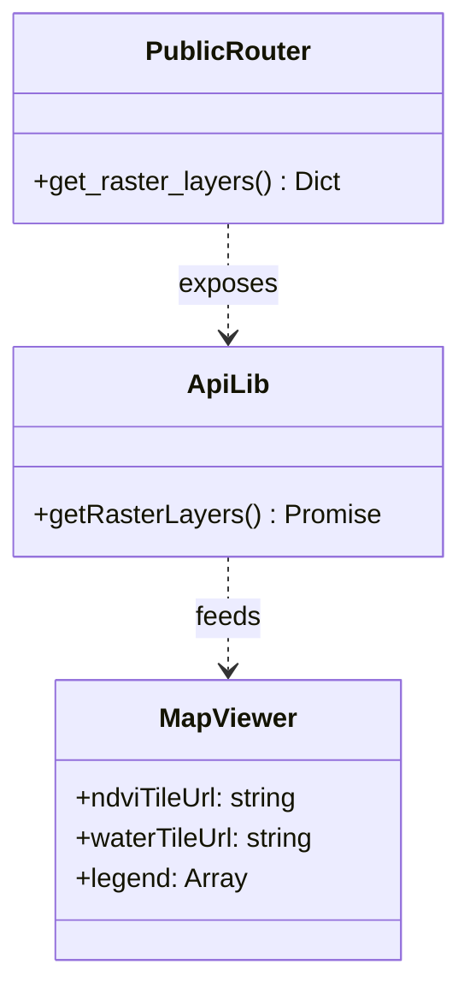
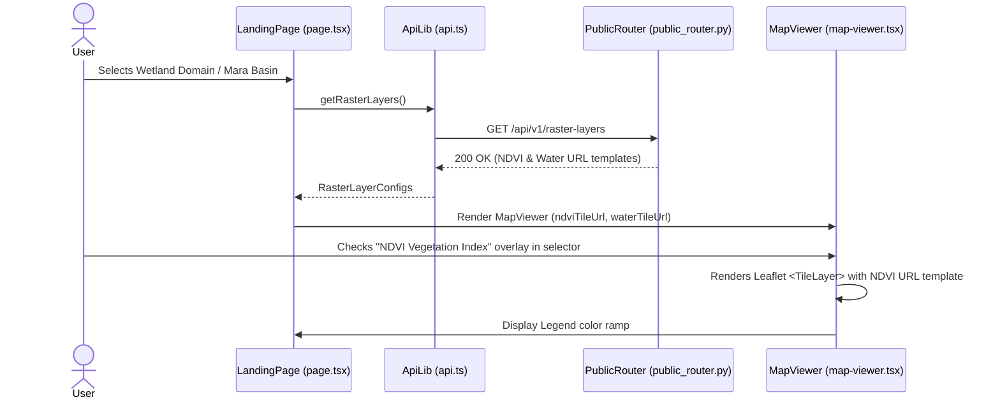

# LLD — Integrate Satellite Rasters to Wetlands Map

> **Stage 3 of 3 — Documentation Hierarchy**
> Owner: Winston (Architect) / Amelia (Developer) | Target Location: `docs/lld/satellite_raster_integration_lld.md` | References: `docs/prd/satellite_raster_integration_prd.md`
> Status: `Draft`
> Design Review: _[Pending]_ | Open Questions Remaining: `0`

---

## 1. Overview & Scope

**Component / Module**:
`public_router` (FastAPI) + `MapViewer` (React-Leaflet) + `page.tsx` (Next.js landing page).

**PRD References**:
FR-001, FR-002, FR-003, FR-004, FR-005.

**Out of Scope for this LLD**:

- Storing dynamic per-date tiles in PostgreSQL.
- Real-time on-demand token generation with Google Earth Engine (MVP will use pre-cached or mock tiles).

**SOLID Compliance Commitment**:
This design adheres to SOLID principles. The API router separation adheres to SRP, and React-Leaflet component composition adheres to OCP.

---

## 2. Component & Class Design



**Component Responsibilities**:

| Component      | Responsibility                                                  | SOLID Principle              |
| :------------- | :-------------------------------------------------------------- | :--------------------------- |
| `PublicRouter` | Serves mock/pre-rendered tile layer templates and legends       | SRP — Endpoint concerns only |
| `ApiLib`       | Axios wrapper querying backend and returning typed responses    | SRP                          |
| `MapViewer`    | Leaflet container rendering TileLayers within `<LayersControl>` | OCP — Open to new overlays   |

---

## 3. Sequence Diagrams

### 3.1 Fetching and Rendering Raster Tiles (Happy Path)



---

## 4. API Contracts

### `GET /api/v1/raster-layers`

**Purpose**: Retrieves the active satellite raster configurations, tile URL templates, and legend scales.

**Request Headers**:
| Header | Required | Value |
| :--- | :--- | :--- |
| `Content-Type` | Yes | `application/json` |

**Success Response** `200 OK`:

```json
{
  "ndvi": {
    "name": "NDVI Vegetation Index",
    "url": "https://mt1.google.com/vt/lyrs=y&x={x}&y={y}&z={z}",
    "attribution": "Google Earth Engine / Sentinel-2",
    "legend": [
      { "value": -0.1, "color": "#fef08a", "label": "Bare Soil" },
      { "value": 0.3, "color": "#a3e635", "label": "Sparse" },
      { "value": 0.9, "color": "#166534", "label": "Dense Papyrus" }
    ]
  },
  "water_extent": {
    "name": "Water Surface Extent",
    "url": "https://mt1.google.com/vt/lyrs=p&x={x}&y={y}&z={z}",
    "attribution": "Google Earth Engine / Sentinel-1",
    "legend": [
      { "value": 0.0, "color": "#f1f5f9", "label": "Dry Land" },
      { "value": 1.0, "color": "#1d4ed8", "label": "Open Water" }
    ]
  }
}
```

---

## 5. Database Schema

No database migrations are needed for the MVP. Configurations and mock tile templates are stored as static registry objects inside the backend routers/services to facilitate fast development and zero DB overhead.

---

## 6. Logic & Algorithms

### Layer Ordering and Rendering Logic

In React-Leaflet, overlays must reside inside `<LayersControl>`.
To prevent the raster overlay from blocking marker clicks or vector outline styling:

1. The raster overlays are rendered as `<LayersControl.Overlay>` components.
2. The `<TileLayer>` inside each overlay must be set to `interactive={false}`.
3. The legend display state is bound to Leaflet overlay change events:
   - Listen to `overlayadd` and `overlayremove` events on the map instance using `useMapEvents` to show/hide the dynamic color scale legends.

---

## 7. Design Patterns

- **DTO (Data Transfer Object)**: Config schemas return a structured configuration object shielding the GEE raw metadata.
- **Composite Pattern**: React-Leaflet's nested component architecture (`MapContainer -> LayersControl -> LayersControl.Overlay -> TileLayer`) naturally implements the composite pattern.

---

## 8. Error Handling & Edge Cases

| Scenario           | Detection                 | Response                               | Fallback                                             |
| :----------------- | :------------------------ | :------------------------------------- | :--------------------------------------------------- |
| API call fails     | HTTP 500 or network error | Log to console, do not crash           | Fallback to empty configs (no overlays option shown) |
| Tile loading fails | Leaflet `tileerror` event | Leaflet displays broken tile indicator | Fail silently, keep map pan operational              |

---

## 9. Non-Functional Design Decisions

- **Caching**: Mock URLs are static and easily cacheable at the gateway/browser layer.
- **Accessibility**: Layers control is Leaflet's standard component, satisfying keyboard navigation out of the box.

---

## 10. GEE Live Integration Roadmap (Future Phase)

When transitioning from mock layers to a live Google Earth Engine (GEE) connection:

1. **Credentials & Secrets**:
   - Store GEE service account email (`EE_SERVICE_ACCOUNT`) and private key JSON string (`EE_PRIVATE_KEY_JSON`) in the `.env` file and GCP Secret Manager.
   - Do not commit any credential files directly to Git.

2. **Backend Library**:
   - Install `earthengine-api` in `backend/` and initialize it during server startup:
     ```python
     import ee
     credentials = ee.ServiceAccountCredentials(settings.EE_SERVICE_ACCOUNT, settings.EE_PRIVATE_KEY_JSON)
     ee.Initialize(credentials)
     ```

3. **API Logic Swap**:
   - Refactor `GET /api/v1/raster-layers` in `public_router.py` to calculate index layers dynamically (NDVI from Sentinel-2 or Water Extent from Sentinel-1 image collections filtered by the current month).
   - Use `getMapId()` to fetch GEE's temporary tile URL templates:
     ```python
     map_info = ndvi_image.getMapId({'min': -0.1, 'max': 0.9, 'palette': ['yellow', 'green']})
     tile_url = map_info['tile_fetcher'].url_format
     ```
   - Return this dynamic `tile_url` template in the JSON response payload. The frontend `<TileLayer>` will dynamically fetch the new tiles without needing code adjustments.

4. **Background Batch Ingestion (Worker)**:
   - Replace the placeholder task `monthly_gee_ingest()` in `backend/app/scheduler.py` with real calculation logic.
   - For numerical indices (like mean NDVI and precipitation per site), the worker must:
     - Query active monitoring sites from the database and retrieve their GeoJSON spatial polygon coordinates.
     - Fetch Sentinel-2 (NDVI) or CHIRPS (precipitation) collections for the past month via the GEE API.
     - Compute spatial region reductions (`ee.Reducer.mean()`) within the site polygons.
     - Insert/update the resulting metrics directly into the PostgreSQL database to support fast public page and trend chart rendering.

---

## Exit Criterion

**Design Review Checklist**:

- [ ] All FR-xxx references from the PRD are addressed
- [ ] Sequence diagrams reviewed for correctness
- [ ] No database migrations required for this phase
- [ ] Error handling covers network timeouts
- [ ] SOLID principles applied
- [ ] Reviewer sign-off recorded
