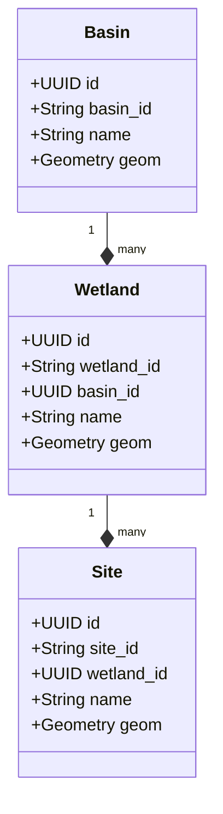

# Low-Level Design (LLD) — Spatial Infrastructure Hierarchy (The Anchors)

> **Stage 3 of 3 — Documentation Hierarchy**
> Owner: Winston (Architect) | Target Location: `docs/lld/spatial_infrastructure_lld.md` | References: `docs/prd/spatial_infrastructure_prd.md`, `docs/database_schema.md`
> Status: `In Review`

---

## 1. Physical Schema and postgis Extension

We need to ensure that the Postgres database runs `CREATE EXTENSION IF NOT EXISTS postgis;` upon initialization. The tables mapped are `basins`, `wetlands`, and `sites` using standard geometry projections (`SRID 4326` WGS84).

### 1.1 Alembic Migration Setup
To manage the schema lifecycle, we will introduce Alembic migrations:
- **`alembic.ini`**: Configures the migrations folder location.
- **`alembic/env.py`**: Configured to dynamically load `DATABASE_URL` from the environment, import the SQLAlchemy models Metadata, and load `GeoAlchemy2` geometry structures safely.
- **Initial Migration Script**: Contains DDL commands for creating `basins`, `wetlands`, and `sites` tables with proper PostGIS spatial columns.


## 2. Component Design & Relationships

We will implement:
- **`app/database.py`**: DB connection engine, session management (`get_db` dependency), and base class.
- **`app/models/spatial.py`**: Database models with GeoAlchemy2 type annotations.
- **`app/schemas/spatial.py`**: Pydantic v2 validation models parsing GeoJSON coordinate inputs.
- **`app/routers/spatial_router.py`**: FastAPI routing.



---

## 3. Pydantic GeoJSON Schemas & Serialization

For API requests, standard GeoJSON inputs are parsed:
- **Point Geometry Schema**:
  ```json
  {
    "type": "Point",
    "coordinates": [34.5212, -1.4589]
  }
  ```
- **Polygon Geometry Schema**:
  ```json
  {
    "type": "Polygon",
    "coordinates": [[[34.5, -1.5], [34.6, -1.5], [34.6, -1.4], [34.5, -1.4], [34.5, -1.5]]]
  }
  ```

Pydantic schemas will validate these formats and convert them to WKT (Well-Known Text) for GeoAlchemy2 insert commands. On response, we convert WKT/WKB geometries back to standard GeoJSON structures.

---

## 4. API Endpoints Contract

### 4.1 Create Basin
* **Endpoint**: `POST /api/v1/basins`
* **Request Payload**:
  ```json
  {
    "basin_id": "MARA",
    "name": "Mara Basin",
    "geom": {
      "type": "MultiPolygon",
      "coordinates": [[[[34.5, -1.5], [34.6, -1.5], [34.6, -1.4], [34.5, -1.4], [34.5, -1.5]]]]
    }
  }
  ```
* **Response Payload (201 Created)**: Returns the created Basin.

### 4.2 Create Wetland
* **Endpoint**: `POST /api/v1/wetlands`
* **Request Payload**:
  ```json
  {
    "wetland_id": "MARA-WETLAND-01",
    "basin_id": "MARA",
    "name": "Mara Floodplain",
    "geom": {
      "type": "Polygon",
      "coordinates": [[[34.5, -1.5], [34.6, -1.5], [34.6, -1.4], [34.5, -1.4], [34.5, -1.5]]]
    }
  }
  ```
* **Response Payload (201 Created)**: Returns the created Wetland.

### 4.3 Create Site
* **Endpoint**: `POST /api/v1/sites`
* **Request Payload**:
  ```json
  {
    "site_id": "NBD-MARA-001",
    "wetland_id": "MARA-WETLAND-01",
    "name": "Lower Mara Bridge",
    "geom": {
      "type": "Point",
      "coordinates": [34.5212, -1.4589]
    }
  }
  ```
* **Response Payload (201 Created)**: Returns the created Site. If `wetland_id` does not exist, returns `400 Bad Request` or `422 Unprocessable Entity` (Foreign Key violation).
