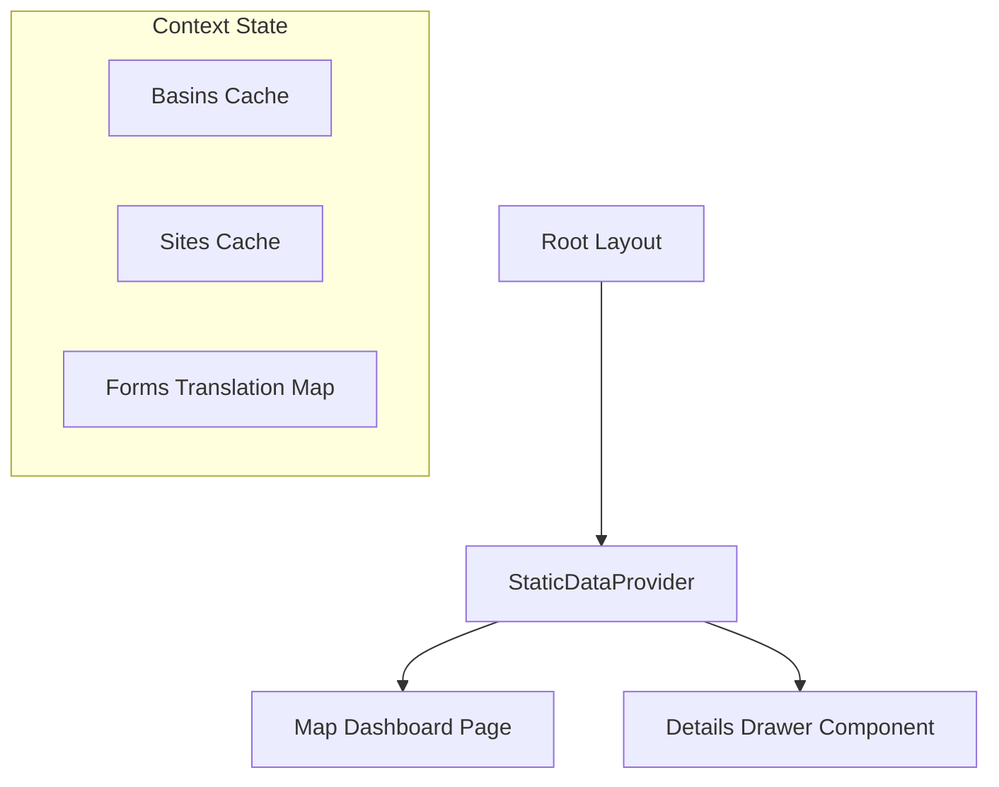

# LLD — Frontend Static Data Caching

## 1. Component Architecture & Data Flow

We will introduce a `StaticDataProvider` wrapping the application root. This provider coordinates all non-changing configuration calls, caching the response payloads in memory.



---

## 2. Context Schema Definition

The React Context will expose the following interface:

```typescript
export interface StaticDataContextType {
  basins: Record<string, any>[];
  sites: Record<string, any>[];

  // Cache format: { [lang: string]: { [formId: number]: Record<string, any> } }
  formDetailsCache: Record<string, Record<number, Record<string, any>>>;
  formsListCache: Record<string, Record<string, any>[]>;

  isLoading: {
    basins: boolean;
    sites: boolean;
    forms: boolean;
  };

  refreshData: () => Promise<void>;
  getFormDetails: (
    formId: number,
    lang: string
  ) => Promise<Record<string, any> | null>;
}
```

---

## 3. Implementation Plan & Strategy

### Step 1: Create `static-data-context.tsx`

- Implement `StaticDataProvider` using standard React state hooks.
- On mount, trigger parallel fetch requests:
  - `getBasins()`
  - `getSites()`
  - `getForms({ lang })` for the active language.
- Expose a helper method `getFormDetails(formId, lang)` that:
  - Checks if the form structure is present in `formDetailsCache[lang][formId]`.
  - If yes, returns it instantly.
  - If no, triggers `getForm(formId, { lang })`, stores it in the cache state, and returns the result.

### Step 2: Integrate into Application Layout

- Import `StaticDataProvider` inside [layout.tsx](file:///Users/galihpratama/Sites/nbd-phase-1/frontend/src/app/layout.tsx).
- Wrap children inside `StaticDataProvider`.

### Step 3: Refactor the Main Landing Page

- In [page.tsx](file:///Users/galihpratama/Sites/nbd-phase-1/frontend/src/app/page.tsx), import `useStaticData`.
- Replace the local `useEffect` blocks and state variables:

```typescript
const { basins, sites, getFormDetails, isLoading } = useStaticData();
```

---

## 4. Test Strategy & Mocking

Any vitest file rendering components wrapping maps or drawers (e.g. `page.test.tsx`, `map-viewer.test.tsx`) must be updated:

- Wrap test instances in `<StaticDataProvider>` with mocked state values to prevent real network calls during component execution.
- Maintain consistent interface shape definitions across the mocks.
