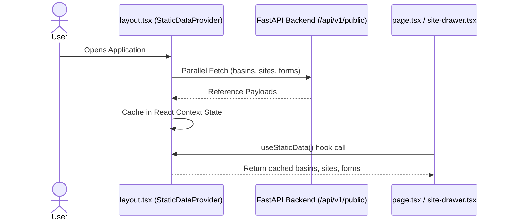

# Low-Level Design (LLD): Frontend Static Data Caching & Context Provider

**Status:** Approved | **Date:** 2026-06-25 | **Author:** Winston (Architect) / Amelia (Developer)

---

## 1. Context & Rationale

Currently, components across the Next.js frontend make redundant API requests to fetch static and semi-static reference data:
- `GET /api/v1/public/basins`
- `GET /api/v1/public/sites`
- `GET /api/v1/forms` (form metadata & blueprints)

This design establishes a centralized `StaticDataProvider` React Context that fetches reference data once at app launch, caches form details per language, and exposes context hooks (`useStaticData`) for components.

---

## 2. Architecture & Data Flow


```mermaid
sequenceDiagram
    actor User
    participant App as layout.tsx (StaticDataProvider)
    participant API as FastAPI Backend (/api/v1/public)
    participant Page as page.tsx / site-drawer.tsx

    User->>App: Opens Application
    App->>API: Parallel Fetch (basins, sites, forms)
    API-->>App: Reference Payloads
    App->>App: Cache in React Context State
    Page->>App: useStaticData() hook call
    App-->>Page: Return cached basins, sites, forms
```

---

## 3. Implementation Plan & Strategy

### Step 1: Create `static-data-context.tsx`

- Implement `StaticDataProvider` using standard React state hooks.
- On mount, trigger parallel fetch requests:
  - `getBasins()`
  - `getSites()`
  - `getForms({ lang })` for the active language.
- Expose helper method `getFormDetails(formId, lang)` that:
  - Checks if the form structure is present in `formDetailsCache[lang][formId]`.
  - If yes, returns it instantly.
  - If no, triggers `getForm(formId, { lang })`, stores it in cache state, and returns the result.

### Step 2: Integrate into Application Layout

- Import `StaticDataProvider` inside `frontend/src/app/layout.tsx`.
- Wrap children inside `StaticDataProvider`.

### Step 3: Refactor the Main Landing Page

- In `frontend/src/app/page.tsx`, import `useStaticData`.
- Replace local `useEffect` blocks and state variables:

```typescript
const { basins, sites, getFormDetails, isLoading } = useStaticData();
```

---

## 4. Test Strategy & Mocking

Any Vitest file rendering components wrapping maps or drawers (e.g. `page.test.tsx`, `map-viewer.test.tsx`) must be updated:
- Wrap test instances in `<StaticDataProvider>` with mocked state values to prevent real network calls during component execution.
