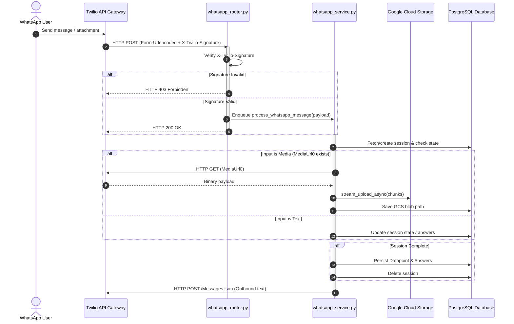

# LLD — Twilio WhatsApp Migration

> **Stage 3 of 3 — Documentation Hierarchy**
> Owner: Winston (Architect) | Target Location: `docs/lld/twilio_whatsapp_migration_lld.md` | References: `docs/prd/twilio_whatsapp_migration_prd.md`, `docs/database_schema.md`
> Status: `Approved` (Pending User Sign-off)

---

## 1. System Architecture

The following diagram outlines the incoming and outgoing communication flow after migrating to Twilio.



---

## 2. Configuration & Dependencies

### 2.1 Dependencies

We will add `twilio` helper package to `backend/requirements.txt` to simplify signature verification, or implement standard verification using `hmac` and `base64`. For robust validation, installing the standard `twilio` library is recommended:

```python
twilio==9.0.0
```

### 2.2 Environment Variables (`.env`)

The following environment variables will replace the Meta-specific variables:

```bash
# REMOVE:
# WHATSAPP_APP_SECRET
# WHATSAPP_VERIFY_TOKEN
# WHATSAPP_ACCESS_TOKEN
# WHATSAPP_PHONE_NUMBER_ID

# ADD:
TWILIO_ACCOUNT_SID=ACXXXXXXXXXXXXXXXXXXXXXXXXXXXXXXXX
TWILIO_AUTH_TOKEN=your_twilio_auth_token_here
TWILIO_NUMBER=whatsapp:+14155238886
```

---

## 3. Detailed Component Refactoring

### 3.1 `whatsapp_config.py`

Update `WhatsAppConfig` to pull Twilio credentials instead of Meta credentials.

```python
class WhatsAppConfig(BaseSettings):
    model_config = SettingsConfigDict(
        env_file=".env",
        env_file_encoding="utf-8",
        case_sensitive=False,
    )

    twilio_account_sid: str = Field(...)
    twilio_auth_token: str = Field(...)
    twilio_number: str = Field(...)

    @property
    def account_sid(self) -> str:
        return self.twilio_account_sid

    @property
    def auth_token(self) -> str:
        return self.twilio_auth_token

    @property
    def from_number(self) -> str:
        return self.twilio_number
```

### 3.2 Webhook Router (`whatsapp_router.py`)

Twilio webhook requests are `application/x-www-form-urlencoded`. We'll update the router signature check using the official `twilio.request_validator.RequestValidator`:

```python
from twilio.request_validator import RequestValidator

def _verify_signature(uri: str, params: dict, signature: str, auth_token: str) -> bool:
    validator = RequestValidator(auth_token)
    # Twilio signature validation requires the exact URL including query params (if any)
    # and the sorted POST parameters.
    return validator.validate(uri, params, signature)
```

**Webhook GET Endpoint**:
Meta requires GET endpoint verification. Twilio does not. We will keep a simplified GET endpoint for compatibility checks or return 200 OK directly without any parameter validations.

**Webhook POST Endpoint**:

```python
@router.post("/webhook")
async def receive_webhook(
    request: Request,
    background_tasks: BackgroundTasks,
    config: WhatsAppConfig = Depends(get_whatsapp_config),
    db: Session = Depends(get_db),
):
    # Parse form parameters
    form_data = await request.form()
    params = dict(form_data)

    # Twilio signature verification
    signature = request.headers.get("X-Twilio-Signature", "")
    url = str(request.url)

    if not _verify_signature(url, params, signature, config.auth_token):
        raise HTTPException(status_code=403, detail="Invalid signature")

    # Enqueue background task
    background_tasks.add_task(process_whatsapp_message, params)
    return Response(content="<Response></Response>", media_type="text/xml", status_code=200)
```

### 3.3 Webhook Service (`whatsapp_service.py`)

#### Outbound Messaging

Send messages using standard Twilio Basic Auth API format:

```python
async def _send_message(phone: str, text: str) -> None:
    config = get_whatsapp_config()
    url = f"https://api.twilio.com/2010-04-01/Accounts/{config.account_sid}/Messages.json"

    payload = {
        "To": f"whatsapp:{phone}" if not phone.startswith("whatsapp:") else phone,
        "From": config.from_number,
        "Body": text
    }

    async with httpx.AsyncClient(timeout=10) as client:
        resp = await client.post(
            url,
            data=payload,
            auth=(config.account_sid, config.auth_token)
        )
        resp.raise_for_status()
```

#### Inbound Parsing

Twilio passes parameters in the form-urlencoded request:

- `From`: The sender's phone number (e.g., `whatsapp:+254700000001`). We must normalize this to extract the raw phone number (e.g. `+254700000001`).
- `Body`: The message text content.
- `NumMedia`: Number of media items (e.g. `1` if a photo is attached).
- `MediaUrl0`: The URL to the attached media.
- `MediaContentType0`: The MIME type of the media.

Update service parsers:

```python
def _extract_message(payload: Dict[str, Any]) -> Optional[Dict[str, Any]]:
    # Translate Twilio payload structure to standard format
    body = payload.get("Body", "")
    num_media = int(payload.get("NumMedia", "0"))

    msg_type = "text"
    media_url = None
    mime_type = None

    if num_media > 0:
        media_url = payload.get("MediaUrl0")
        mime_type = payload.get("MediaContentType0", "image/jpeg")
        msg_type = "image" if mime_type.startswith("image") else "document"

    return {
        "type": msg_type,
        "text": {"body": body},
        "media_url": media_url,
        "mime_type": mime_type
    }

def _sender_phone(payload: Dict[str, Any]) -> Optional[str]:
    raw_from = payload.get("From", "") # e.g. "whatsapp:+254700000001"
    if raw_from.startswith("whatsapp:"):
        return raw_from.replace("whatsapp:", "")
    return raw_from
```

#### Media Download streaming:

Since Twilio URLs point directly to the media files (with Basic Authentication if secure media is enabled, or directly), we download them directly:

```python
async def _iter_media_chunks(
    media_url: str, chunk_size: int = 1024 * 1024
) -> AsyncIterator[bytes]:
    config = get_whatsapp_config()
    async with httpx.AsyncClient(timeout=120) as client:
        # Note: If Twilio secure media is enabled, require basic authentication
        async with client.stream("GET", media_url, auth=(config.account_sid, config.auth_token)) as resp:
            resp.raise_for_status()
            async for chunk in resp.aiter_bytes(chunk_size):
                yield chunk
```

---

## 4. Verification & Testing

### 4.1 Test Mocks (`test_whatsapp.py`)

Update mocks to:

1. Mock `RequestValidator.validate` to return `True`.
2. Emulate the form-urlencoded payload structure in test calls.
3. Test media streaming from the Twilio URL.
