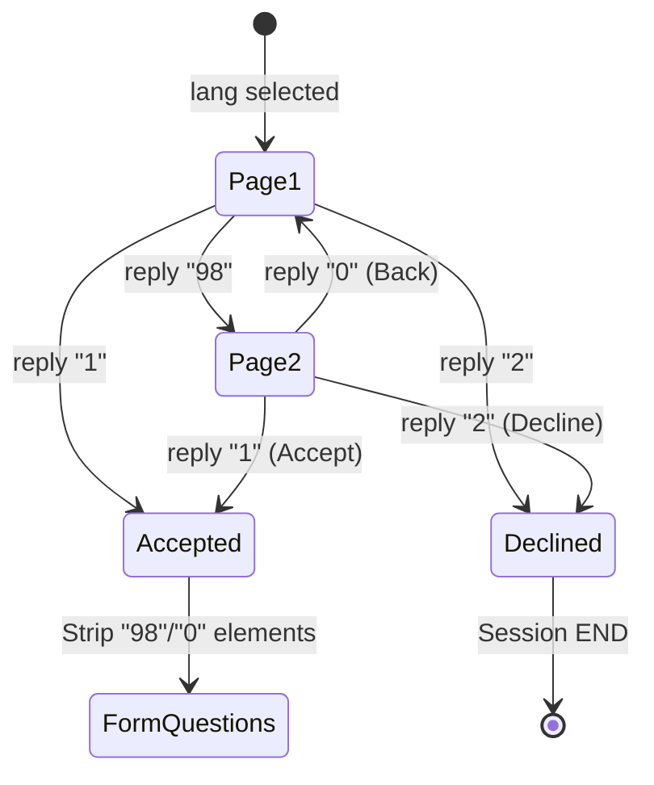

# LLD — USSD Consent Paging

> **Stage 3 of 3 — Documentation Hierarchy**
> Owner: Winston (Architect) + Developer | Target Location: `docs/lld/ussd_consent_paging_lld.md` | Reference PRD: `docs/prd/ussd_consent_paging_prd.md`
> Status: `Approved`

---

## 1. System Component Overview

The USSD session input in FastAPI is parsed within [`ussd_router.py`](file:///Users/galihpratama/Sites/nbd-phase-1/backend/app/routers/ussd_router.py) inside the APIRouter post handler. 

USSD gateways transmit state via a concatenated string parameter `text` (e.g. `1*98*0*1*2`). The segments are split by `*` into an array:
`parts = text.split('*')`

We intercept this stream right after parsing `lang` (Step 0) and before invoking the dynamic questions traversal loop (Step 2).

---

## 2. Logic Flow & State Paging



### Parsing Mechanics
We loop over `parts[1:]` (all inputs after language selection):
1. **Initialize State variables**:
   - `consent_page = 1`
   - `consent_accepted = False`
   - `consent_declined = False`
   - `processed_count = 0`
2. **State Transition Loop**:
   For each input element `part` in `parts[1:]`:
   - Increment `processed_count`.
   - If `consent_page == 1`:
     - If input is `"98"`: set `consent_page = 2`.
     - If input is `"1"`: set `consent_accepted = True` and break.
     - If input is `"2"`: set `consent_declined = True` and break.
   - If `consent_page == 2`:
     - If input is `"0"`: set `consent_page = 1`.
     - If input is `"1"`: set `consent_accepted = True` and break.
     - If input is `"2"`: set `consent_declined = True` and break.

3. **Render Screen**:
   - If not accepted and not declined:
     - Render screen corresponding to `consent_page` (Page 1 or Page 2) with Swahili translations if `lang == "sw"`.
   - If declined:
     - Terminate session and show decline message.
   - If accepted:
     - Reconstruct the inputs array: `parts = parts[:1] + ["1"] + parts[1 + processed_count:]`. This replaces the paging history with a single direct `"1"` consent confirmation, ensuring that the remaining question inputs align with `input_idx = 2`.

---

## 3. Screen Templates

### Consent Page 1
* **English**:
  ```text
  CON Welcome to NBD Wetland Watch. This platform collects environmental incident reports. Your report is saved anonymously.
  98. View More
  2. Decline terms
  ```
* **Swahili**:
  ```text
  CON Karibu kwenye NBD Wetland Watch. Jukwaa hili linakusanya taarifa za matukio ya mazingira. Ripoti yako inahifadhiwa bila jina.
  98. Angalia zaidi
  2. Kataa masharti
  ```

### Consent Page 2
* **English**:
  ```text
  CON Data usage is restricted to monitoring programs. By proceeding, you agree to these terms.
  1. Accept & Start reporting
  0. Back
  ```
* **Swahili**:
  ```text
  CON Matumizi ya data yamezuiliwa kwa mipango ya ufuatiliaji. Kwa kuendelea, unakubali masharti haya.
  1. Kubali na Anza kuripoti
  0. Rudi nyuma
  ```

---

## 4. Test Strategy

We verify these states inside `tests/test_ussd.py`:
- `test_ussd_terms_paging()`: Validates transitions through `1*98` (Page 2), `1*98*0` (Page 1), and `1*98*1` (Incident selection).
- `test_ussd_complete_flow_with_paging()`: Simulates a complete user interaction with multiple paging back-and-forth sequences to submit a report successfully to the database.
