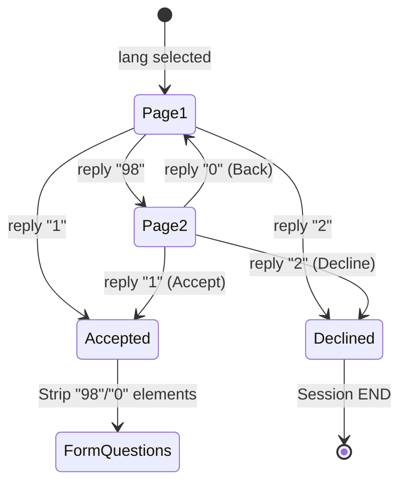

# LLD — USSD Consent Paging

> **Stage 3 of 3 — Documentation Hierarchy**
> Owner: Winston (Architect) + Developer | Target Location: `docs/lld/ussd_consent_paging_lld.md` | Reference PRD: `docs/prd/ussd_consent_paging_prd.md`
> Status: `Approved`

---

## 1. System Component Overview

The USSD session input in FastAPI is parsed within `backend/app/routers/ussd_router.py` inside the APIRouter post handler. 

USSD gateways transmit state via a concatenated string parameter `text` (e.g. `1*98*0*1*2`). The segments are split by `*` into an array:
`parts = text.split('*')`

We intercept this stream right after parsing `lang` (Step 0) and before invoking the dynamic questions traversal loop (Step 2).

---

## 2. Logic Flow & State Paging


```mermaid
stateDiagram-v2
    [*] --> Page1: lang selected
    Page1 --> Page2: reply "98"
    Page2 --> Page1: reply "0" (Back)
    Page1 --> Accepted: reply "1"
    Page2 --> Accepted: reply "1" (Accept)
    Page1 --> Declined: reply "2"
    Page2 --> Declined: reply "2" (Decline)
    Declined --> [*]: Session END
    Accepted --> FormQuestions: Strip "98"/"0" elements
```

### Parsing Mechanics
We loop over `parts[1:]` (all inputs after language selection):
1. **Initialize State variables**:
   - `consent_page = 1`
   - `consent_accepted = False`
   - `consent_declined = False`
2. **Handle navigation tokens**:
   - Token `"98"` -> `consent_page = 2`
   - Token `"0"` -> `consent_page = 1`
   - Token `"1"` -> `consent_accepted = True`
   - Token `"2"` -> `consent_declined = True`

---

## 3. Verification Plan

Run backend USSD tests:
```bash
./dc.sh exec backend python -m pytest tests/test_ussd.py -v
```
