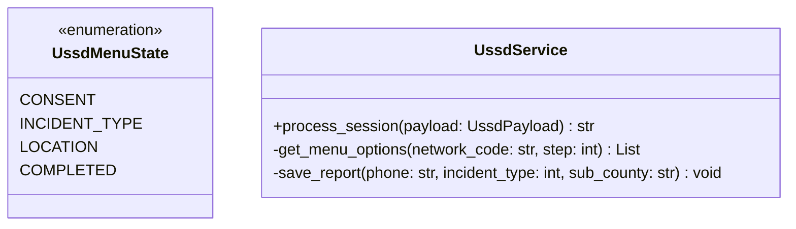
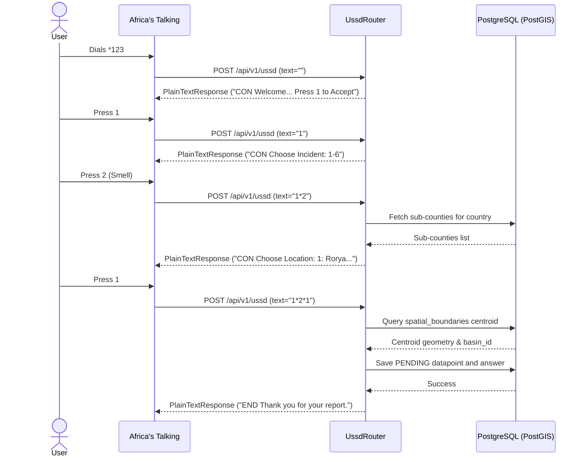

# LLD — USSD Africa's Talking Pipeline

> **Stage 3 of 3 — Documentation Hierarchy**
> Owner: Winston (Architect) | Target Location: `docs/lld/ussd_pipeline_lld.md` | References: `docs/prd/ussd_pipeline_prd.md`
> Status: `Approved`
> Design Review: Winston (Architect), June 2026 | Open Questions Remaining: `0`

---

## 1. Overview & Scope

**Component / Module**:
`app.routers.ussd_router` and associated session handlers.

**PRD References**:
FR-001, FR-002, FR-003, FR-004, FR-005.

**Out of Scope for this LLD**:
- Processing KoboToolbox integrations (handled by background worker).

---

## 2. Component & Class Design

We will implement stateless state parsing logic based on the `text` parameter of the USSD payload.



---

## 3. Sequence Diagrams

### Stateful USSD Ingestion & Resolution



---

## 4. API Contracts

### `POST /api/v1/ussd`
- **Request Format**: `Content-Type: application/x-www-form-urlencoded`
- **Request Fields**:
  - `sessionId`: `string`
  - `phoneNumber`: `string`
  - `networkCode`: `string`
  - `serviceCode`: `string`
  - `text`: `string`
- **Response Format**: `text/plain`
- **Response Prefix**: `CON ` (keep session open) or `END ` (close session)

---

## 5. Database Schema & Query Logic

### PostGIS Centroid Resolution
When the user completes selection at Step 2 (e.g. `text = "1*2*1"`), the selected option index maps to a sub-county name (e.g. `Rorya District`). The centroid and parent basin are resolved using:

```sql
SELECT id, name, basin_id, ST_AsGeoJSON(centroid_geom) as geom
FROM spatial_boundaries
WHERE name = :sub_county_name;
```

---

## 6. Logic & Algorithms

### Input Parsing
```python
def parse_ussd_state(text: str):
    if not text:
        return 0, []
    parts = text.split('*')
    return len(parts), parts
```

### Response Validation & Cleaning
All response text returned from the webhook MUST be filtered through the following regex to prevent rendering failure on feature phones:
```python
import re

def clean_ussd_response(text: str) -> str:
    # Retain only characters matching [A-Za-z0-9\s?.,:;*#]
    cleaned = re.sub(r"[^A-Za-z0-9\s?.,:;*#]", "", text)
    return cleaned
```

---

## 7. Design Patterns

- **State Pattern**: Implemented via simple conditional evaluation of the split input array length to minimize memory state lookup overhead.
- **Idempotency Check**: Uses a unique constraint on `sessionId` or a redis token mapping with 5-minute expiry.

---

## 8. Error Handling & Edge Cases

- **Invalid Option Input**: If a user inputs an option that does not map to any listed choice, repeat the previous menu prefixing with `Invalid input.`.
- **Database Connection Failure**: Return `END System error. Please try again later.`.

---

## 9. Non-Functional Design Decisions

- **FastAPI PlainTextResponse**: Bypasses JSON serialization, outputting pure text as required by telco aggregators.
- **Async DB Execution**: Database lookups are executed asynchronously to ensure that any database locks or latency do not exceed the 10-second timeout.

---

## 10. Dynamic USSD Menu Options Implementation

The USSD incident menu dynamically loads options directly from the seeded database `Form` config:
- **Option Length Adaptation**: Option labels seeded in `form_pipeline_a_citizen_reporter.json` have been shortened to USSD-friendly lengths to strictly respect the USSD 160-character network limit.
- **Dynamic Retrieval**: Inside `ussd_router.py`, the active options for the `"incident_type"` question are queried dynamically.
- **Validation**: Choice indices are validated dynamically based on the count of retrieved database options.


