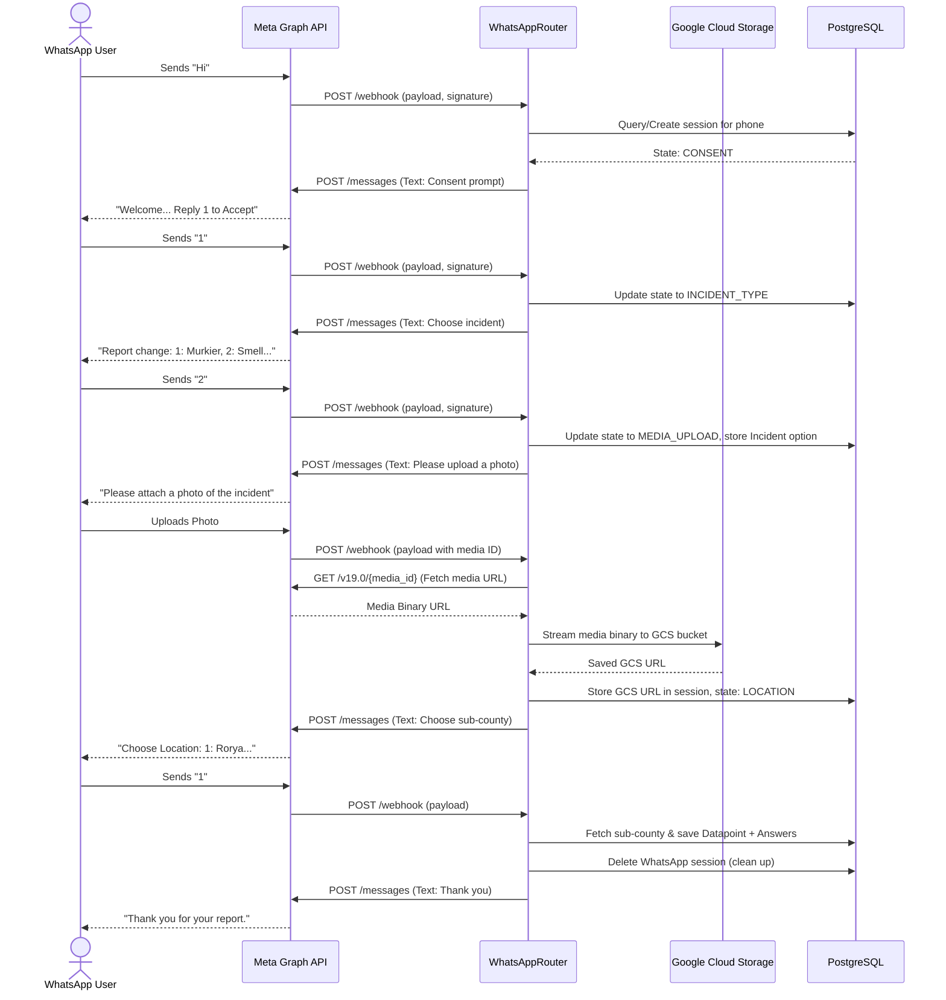

# LLD — WhatsApp Menu Router & Session Logic

> **Stage 3 of 3 — Documentation Hierarchy**
> Owner: Winston (Architect) | Target Location: `docs/lld/whatsapp_pipeline_lld.md` | References: `docs/prd/whatsapp_pipeline_prd.md`
> Status: `Approved`
> Design Review: Winston (Architect), June 2026 | Open Questions Remaining: `0`

---

## 1. Overview & Scope

**Component / Module**:
`app.routers.whatsapp_router`, `app.models.whatsapp_session` and associated helper functions.

**PRD References**:
FR-001, FR-002, FR-003, FR-004, FR-005.

**Out of Scope**:
- Voice-note audio processing or speech-to-text transcoding.
- Direct frontend interaction on the management portal (handled in a separate UI task).

---

## 2. API Contracts

### 2.1 Meta Webhook Verification (`GET /api/v1/whatsapp/webhook`)
Verify the subscription endpoint with Meta's token validation:
- **Request Query Parameters**:
  - `hub.mode`: String (value: `subscribe`)
  - `hub.verify_token`: String (user-configured token)
  - `hub.challenge`: String (integer/string to echo back)
- **Response**:
  - `200 OK` with the plain text body of `hub.challenge` if validation succeeds.
  - `403 Forbidden` if verification token is invalid.

### 2.2 Webhook Ingestion (`POST /api/v1/whatsapp/webhook`)
- **Headers**:
  - `X-Hub-Signature-256`: String (HMAC-SHA256 signature generated using Meta App Secret)
- **Payload Format**: Meta WhatsApp Cloud API JSON structure.
- **Response**: `200 OK` (plain text or empty JSON). Must respond within 3 seconds.

---

## 3. Component & Data Model Design

### Database Table: `whatsapp_sessions`
To maintain the state of the conversation asynchronously across SMS messages:

| Column | Data Type | Constraints | Description |
| :--- | :--- | :--- | :--- |
| `id` | `UUID` | `PRIMARY KEY`, `DEFAULT gen_random_uuid()` | Unique session identifier. |
| `phone_number` | `VARCHAR(50)` | `UNIQUE`, `NOT NULL` | The sender's WhatsApp phone number (PII, restricted access). |
| `state` | `VARCHAR(30)` | `NOT NULL` | Flow state: `CONSENT`, `INCIDENT_TYPE`, `MEDIA_UPLOAD`, `LOCATION` |
| `incident_type_id` | `INTEGER` | `REFERENCES option(id)` | Selected incident type option reference. |
| `media_url` | `TEXT` | `NULL` | Secure GCS path of the uploaded photo. |
| `created_at` | `TIMESTAMP` | `DEFAULT CURRENT_TIMESTAMP` | Time of session creation. |
| `updated_at` | `TIMESTAMP` | `NULL` | Time of last interaction. |

```sql
CREATE TABLE whatsapp_sessions (
    id UUID PRIMARY KEY DEFAULT gen_random_uuid(),
    phone_number VARCHAR(50) UNIQUE NOT NULL,
    state VARCHAR(30) NOT NULL CHECK (state IN ('CONSENT', 'INCIDENT_TYPE', 'MEDIA_UPLOAD', 'LOCATION')),
    incident_type_id INTEGER REFERENCES option(id) ON DELETE SET NULL,
    media_url TEXT,
    created_at TIMESTAMP NOT NULL DEFAULT CURRENT_TIMESTAMP,
    updated_at TIMESTAMP
);
```

---

## 4. Sequence Diagrams

### WhatsApp Flow & Media Handling



---

## 5. Security & Validation

### Signature Verification
Every inbound POST webhook payload MUST be validated using Meta's `X-Hub-Signature-256` header:
```python
import hmac
import hashlib

def verify_signature(payload_bytes: bytes, signature_header: str, app_secret: str) -> bool:
    # signature_header format: sha256=HEX_SIGNATURE
    if not signature_header.startswith("sha256="):
        return False
    received_sig = signature_header.split("sha256=")[1]
    expected_sig = hmac.new(
        app_secret.encode('utf-8'),
        payload_bytes,
        hashlib.sha256
    ).hexdigest()
    return hmac.compare_digest(received_sig, expected_sig)
```

---

## 6. Session Expiry & Autopruning

A background scheduler task (using the existing APScheduler infrastructure in `app/scheduler.py`) will run every hour to delete stale sessions from `whatsapp_sessions`:
```sql
DELETE FROM whatsapp_sessions
WHERE created_at < NOW() - INTERVAL '24 hours';
```

---

## 7. Error Handling & Edge Cases

- **Invalid Option Choice**: If user inputs an option that does not map to any active menu items, reply with `Invalid selection. Please try again.` and repeat the current step text.
- **Non-image Attachment**: If a user uploads a document or audio file during `MEDIA_UPLOAD` state, reply with `Format not supported. Please upload a photo/image.` and maintain the current state.
- **Media Download failure**: If streaming the media binary from Meta or uploading to GCS fails, save `media_url` as `None` or prompt user to try again, avoiding system crashes.
